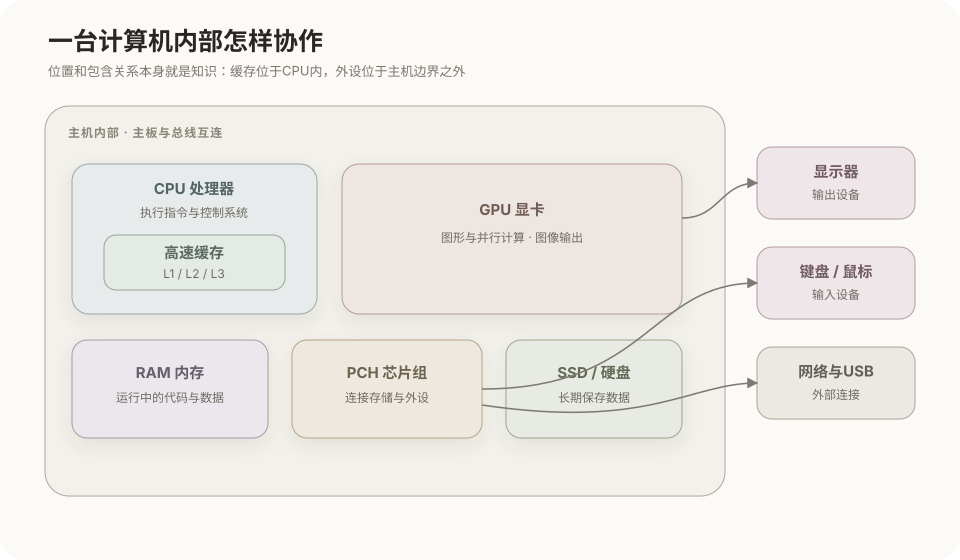
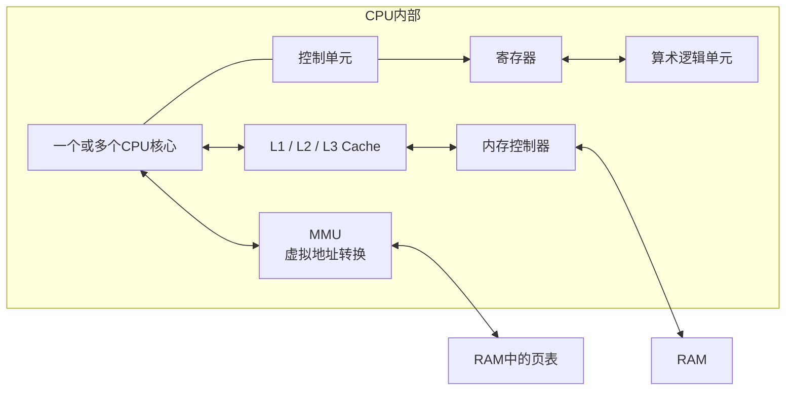
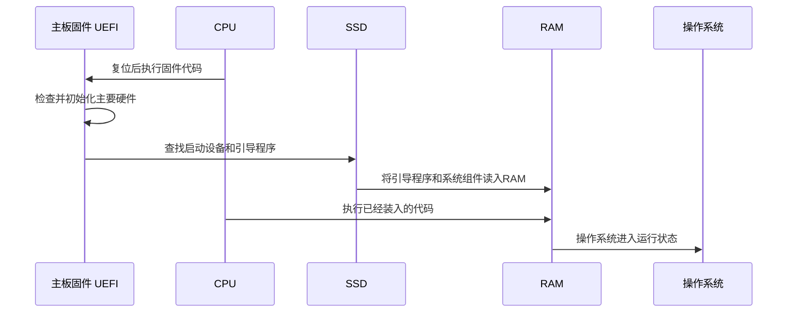
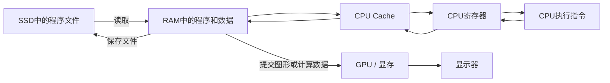

# 计算机整体结构

## 1. 计算机由哪些部分组成

一台现代计算机可以分为计算、主存、长期存储、输入输出、互连和供电散热等部分。各部件不是彼此独立工作的，数据和控制信息通过主板上的总线与控制器在它们之间传递。



这幅图表达的是功能关系。具体计算机可能把多个控制器集成到CPU或主板芯片中，连接方式也会因台式机、笔记本、服务器和手机而不同。

## 2. CPU：通用计算与控制中心

CPU（Central Processing Unit，中央处理器）负责执行机器指令，并协调内存和输入输出设备。



CPU内部的主要组成：

- **核心（Core）**：能够独立取得并执行指令的处理单元。多核CPU可以并行执行多个任务。
- **控制单元**：取出并译码指令，产生控制信号，安排数据流动和操作顺序。
- **算术逻辑单元（ALU）**：执行整数运算、比较和按位逻辑等操作。
- **寄存器**：CPU内部最直接的工作存储位置，保存当前指令、地址和计算中的数据。
- **Cache**：缓存近期使用的指令和数据，减少CPU等待RAM的时间。
- **MMU**：把程序使用的虚拟地址转换成物理地址，并检查页面访问权限。
- **内存控制器**：负责CPU与RAM之间的数据传输。现代计算机通常把它集成在CPU中。

CPU擅长复杂控制流程、操作系统任务以及种类多样的通用计算。

## 3. GPU：图形和并行计算处理器

GPU（Graphics Processing Unit，图形处理器）最初主要用于图形渲染，现在也广泛用于机器学习、视频处理、科学计算等需要大量相似运算并行执行的任务。

CPU和GPU的侧重点不同：

| 部件 | 主要特点 | 典型任务 |
|---|---|---|
| CPU | 核心数量相对少，单核控制能力强，适合复杂分支 | 操作系统、业务逻辑、程序控制、通用计算 |
| GPU | 包含大量并行执行单元，适合批量执行相似运算 | 图形渲染、矩阵运算、视频编解码、机器学习 |

### 独立GPU

独立GPU通常通过PCI Express连接CPU，并配有独立显存VRAM：

```text
CPU / RAM ←→ PCIe ←→ 独立GPU ←→ VRAM
```

需要GPU处理的数据可能先从SSD读入RAM，再经过PCIe传到显存。GPU处理完成后，结果可以送往显示器，也可以传回RAM供CPU继续使用。

### 集成GPU

集成GPU与CPU位于同一芯片或封装中，通常没有独立显存，而是与CPU共享系统RAM：

```text
CPU核心 ─┐
         ├── 共享RAM
集成GPU ─┘
```

共享RAM减少了独立显存和部分数据复制，但CPU与GPU会共同占用内存容量和带宽。

## 4. RAM：正在运行程序的工作区域

RAM（Random Access Memory，随机存取存储器）通常就是日常所说的电脑内存。操作系统、正在运行的程序及其当前数据需要装入RAM，CPU才能按内存地址直接访问。

RAM的主要特点：

- 读取和写入速度远高于SSD、硬盘；
- 容量通常小于长期存储设备；
- 主流系统RAM通常采用DRAM；
- 一般属于易失性存储器，断电后内容消失。

RAM不是长期保存文件的位置。文档保存在SSD后，打开文档时相关内容才会被读取到RAM；保存操作则把修改后的内容写回长期存储。

## 5. SSD和硬盘：长期存储

SSD与硬盘属于辅存或长期存储设备，用于保存：

- 操作系统文件；
- 已安装的程序；
- 用户文档和媒体文件；
- 数据库文件；
- 交换文件、休眠文件等系统数据。

它们一般具有非易失性，断电后内容仍然保留。

### SSD

SSD通常使用NAND Flash保存数据，没有机械磁头和旋转盘片。常见接口包括：

- **NVMe / PCIe**：直接利用PCIe通道，延迟较低、并行能力强；
- **SATA**：兼容传统SATA存储接口，性能上限低于主流NVMe设备。

### 机械硬盘

机械硬盘使用旋转盘片和磁头保存数据，单位容量成本较低，但随机访问延迟明显高于SSD。

## 6. 主板、总线与控制器

主板提供插槽、供电线路、时钟、固件和通信连接。主要互连包括：

- **内存通道**：连接CPU内存控制器与RAM；
- **PCI Express**：连接GPU、NVMe SSD、网卡和其他高速扩展设备；
- **SATA**：连接SATA SSD和机械硬盘；
- **USB**：连接大量外部设备；
- **显示接口**：如HDMI和DisplayPort，由GPU输出图像信号。

现代CPU已经集成内存控制器和部分PCIe控制器。主板芯片组主要承担更多USB、SATA、音频以及较低速扩展连接。具体数据不一定每次都经过一个独立的“南桥”或“北桥”，这些是较早期体系结构中的常见划分。

## 7. 输入输出与网络设备

输入输出设备负责计算机与外界交换信息：

- 输入设备：键盘、鼠标、摄像头、麦克风、传感器；
- 输出设备：显示器、扬声器、打印机；
- 双向设备：触摸屏、USB设备、网卡、存储设备。

设备通常通过控制器工作。操作系统中的驱动程序负责把统一的系统请求转换成设备能够执行的命令，并处理设备返回的数据和中断。

## 8. 电源、时钟和散热

- **电源系统**把外部电能转换成各部件需要的电压，并保持供电稳定。
- **时钟系统**为数字电路提供同步节拍，但不同部件可能工作在不同频率并通过控制器协调。
- **散热系统**把CPU、GPU和电源等部件产生的热量排出。温度过高时，硬件通常会降低频率或进入保护状态。

这些部分不直接执行应用程序，却决定整机能否稳定运行。

## 9. 计算机启动时的数据流



主板固件通常保存在非易失性的Flash芯片中。计算机通电后，CPU先执行固件，再从启动设备读取引导程序和操作系统，把它们装入RAM后继续执行。

## 10. 程序运行时的数据流



典型过程是：程序长期保存在SSD，启动时装入RAM；CPU把近期需要的数据逐级送入Cache和寄存器执行；需要图形或并行计算时，把任务交给GPU；需要永久保存的结果再写回SSD。

## 11. “存储”和“储存”

在计算机专业术语中通常使用“存储”，例如存储器、存储系统、存储设备和存储容量。“储存”在日常中文中也表示保存物品或数据，但计算机教材和技术文档一般采用“存储”。

## 核心关系

```text
CPU：执行通用指令并控制系统
GPU：执行图形和大规模并行计算
RAM：保存当前正在运行的程序和数据，通常断电即失
SSD / 硬盘：长期保存程序和文件，通常断电不失
主板与总线：连接并协调各硬件部件
输入输出设备：完成计算机与外界的信息交换
操作系统与驱动：管理硬件并向应用程序提供统一接口
```
