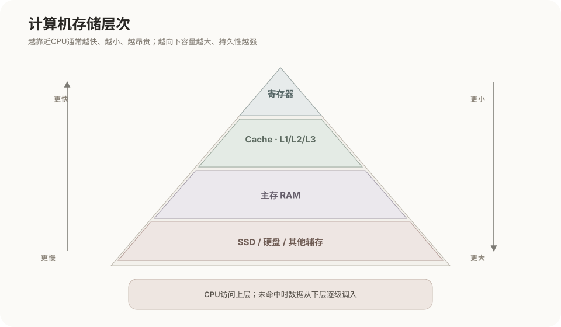
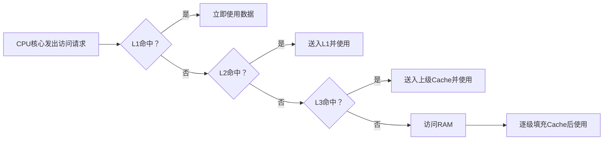
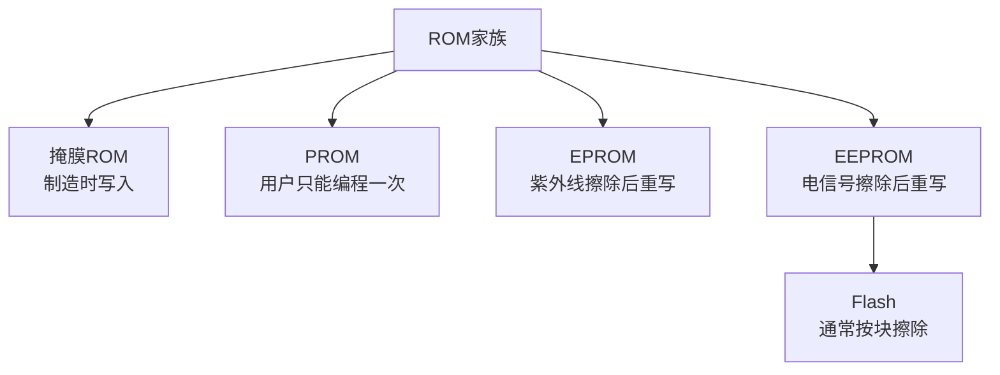
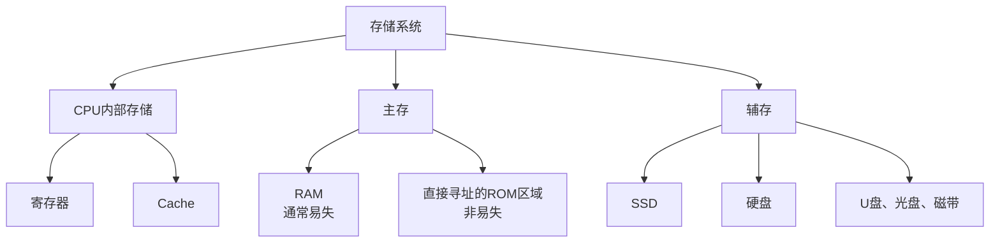
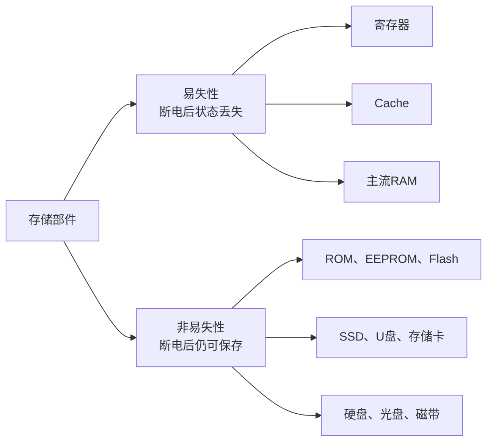
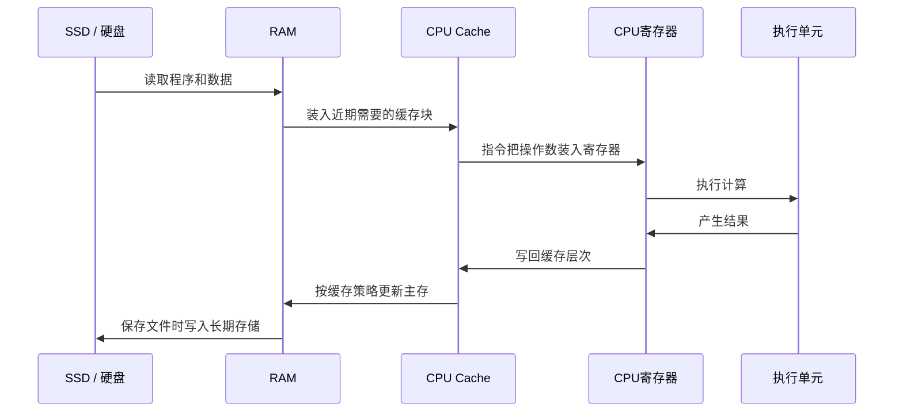

# 计算机存储系统

## 1. 存储系统的范围

存储系统是保存程序、数据和处理状态的全部硬件与管理机制。它不是单指硬盘，也不是单指RAM，而是从CPU内部寄存器一直延伸到SSD、硬盘等辅存。



存储层次越靠近CPU，通常速度越快、容量越小、单位容量成本越高；越远离CPU，通常容量越大、速度越慢、单位容量成本越低。

## 2. 存储层次为什么存在

单一存储技术难以同时满足以下要求：

- 接近CPU执行速度；
- 容量足够大；
- 断电后长期保存；
- 成本足够低。

因此计算机使用多级存储结构，让少量高速存储保存当前最急需的数据，大容量低速存储保存其余数据。

| 层次 | 典型容量 | 相对速度 | 断电保存 | 主要管理者 |
|---|---|---|---|---|
| 寄存器 | 极小 | 最快 | 否 | CPU指令与编译器 |
| L1/L2/L3 Cache | 小 | 很快 | 否 | CPU硬件为主 |
| RAM | 中等 | 快 | 通常否 | 操作系统、硬件和程序 |
| SSD | 大 | 相对较慢 | 是 | 操作系统与文件系统 |
| 机械硬盘 | 很大 | 更慢 | 是 | 操作系统与文件系统 |
| 磁带、归档介质 | 很大 | 访问慢 | 是 | 备份和归档系统 |

表中的容量和速度是相对关系，具体数值会随设备和时代变化。

## 3. 寄存器

寄存器位于CPU内部，保存CPU当前立即需要的数据和状态，例如：

- 当前参与运算的操作数；
- 运算结果；
- 下一条指令地址；
- 栈地址；
- 状态标志；
- 控制和地址转换相关信息。

CPU指令通常直接对寄存器执行运算。寄存器数量和容量非常有限，但访问速度最高。

## 4. Cache高速缓存

Cache位于CPU核心内部或CPU芯片上，用来缓存近期使用的RAM数据和指令。其作用是减少CPU等待主存的时间。



常见层级：

- **L1 Cache**：最靠近核心，容量最小、速度最快，常分为指令Cache和数据Cache；
- **L2 Cache**：容量大于L1，速度稍慢；
- **L3 Cache**：容量更大，常由多个核心共享，速度低于L1和L2但仍明显快于RAM。

Cache通常采用SRAM实现，主存通常采用DRAM实现。SRAM速度快但单位容量成本和面积较高，所以不适合直接替代全部主存。

## 5. 主存

主存是CPU能够通过普通内存地址直接访问的主要工作存储空间。日常语境中的“内存”通常专指RAM。

### 狭义和广义口径

不同教材对主存范围可能采用两种口径：

```text
狭义主存：主要指RAM
广义主存：包括RAM和能够被CPU直接寻址的ROM区域
```

现代通用计算机的大部分主存容量由RAM提供，因此描述“主存容量”时通常讨论RAM。ROM或固件Flash容量相对较小，主要保存启动和固件代码。

## 6. RAM

RAM是可读写的随机存取存储器。“随机存取”表示访问任意存储位置不需要像磁带那样依次经过前面的内容。

### DRAM

DRAM（Dynamic RAM）使用电容状态保存数据，需要周期性刷新。它密度高、单位容量成本相对低，主要用作系统主存和部分显存。

### SRAM

SRAM（Static RAM）只要保持供电就不需要像DRAM那样周期性刷新，速度较快，但电路占用面积大、成本高，主要用于CPU Cache等小容量高速区域。

### RAM是否能断电保存

主流DRAM和SRAM都属于易失性存储器：

```text
供电存在 → 可以保持状态
供电中断 → 原有状态丢失
```

“RAM断电即失”不等于“所有存储器断电即失”。ROM、Flash、SSD和硬盘都属于非易失性存储。

## 7. ROM及其家族

ROM（Read-Only Memory）是一类以读取为主要工作方式的非易失性半导体存储器。不同类型的ROM在写入和擦除能力上不同。



| 类型 | 写入方式 | 能否擦除重写 | 典型特点 |
|---|---|---|---|
| 掩膜ROM | 芯片制造时写入 | 通常不能 | 批量生产后内容固定 |
| PROM | 用户使用编程器写入 | 不能 | 内部连接发生不可逆改变 |
| EPROM | 使用编程器写入 | 可以 | 通常使用紫外线整片擦除 |
| EEPROM | 使用电信号写入 | 可以 | 可以电擦除，不需要紫外线 |
| Flash | 使用电信号写入 | 可以 | EEPROM的一类，通常按块擦除 |

ROM是存储器，但不是辅存的同义词。ROM可以位于CPU直接访问的地址空间，而SSD和硬盘通常需要通过输入输出控制器和文件系统访问。

## 8. 辅存

辅存是辅助存储器的简称，标准术语通常写作“辅存”，不是“副存”。它负责大容量、长期保存程序和数据。

典型辅存包括：

- NVMe SSD；
- SATA SSD；
- 机械硬盘；
- U盘和存储卡；
- 光盘；
- 磁带。

辅存的主要特点：

- 一般具有非易失性；
- 容量通常大于RAM；
- 速度通常低于RAM；
- CPU不能把普通文件位置直接当成RAM地址执行和访问；
- 需要存储控制器、设备驱动和文件系统参与。

## 9. 存储器、主存和辅存的关系



“存储器”有两种常见用法：

1. 广义上泛指整个存储系统中的各种存储部件；
2. 狭义上指半导体存储器，例如RAM和ROM。

因此不能脱离上下文把“存储器”直接等同于辅存。

## 10. 易失性与非易失性

是否断电保存与“主存或辅存”的分类有关，但不是完全相同的分类维度。



准确表述是：

```text
主流RAM断电后数据消失。
ROM断电后仍然保存内容。
辅存通常断电后仍然保存内容。
存储器既包括易失性存储器，也包括非易失性存储器。
```

## 11. 数据如何在层次之间移动

长期保存的程序不能只停留在SSD中直接由CPU执行。典型数据路径如下：



并不是每条指令都从SSD重新读取数据。程序启动后，当前工作数据主要在寄存器、Cache和RAM之间流动，只有装入文件、保存文件、发生缺页等情况才需要访问辅存。

## 12. 虚拟内存在存储系统中的位置

虚拟内存不是一种新的物理存储芯片，而是由CPU地址转换硬件和操作系统共同实现的管理机制。


虚拟内存让进程看到连续、受保护的虚拟地址空间，而物理页框可以分散在RAM中。暂不需要的页面可以保留在原始文件或交换区域中，访问时再装入RAM。详细机制见[分页存储管理与虚拟内存](../01-操作系统/02-分页存储管理基础.md)。

## 13. 常用存储单位

```text
1 Byte = 8 bit
1 KB = 1024 Byte
1 MB = 1024 KB
1 GB = 1024 MB
1 TB = 1024 GB
```

严格的国际单位中，十进制的kB、MB、GB分别以1000为进位，二进制的KiB、MiB、GiB分别以1024为进位。计算机基础教材中的容量计算通常沿用 `1KB = 1024Byte` 的写法，具体计算应先确认采用的单位口径。

## 核心结论

```text
存储系统：寄存器、Cache、主存、辅存及其管理机制的整体
主存：CPU能够直接寻址的主要工作存储空间，通常主要指RAM
RAM：可读写、通常易失，保存当前运行的程序和数据
ROM：以读取为主、非易失，包括PROM、EPROM、EEPROM等类型
辅存：大容量长期存储，如SSD和硬盘
虚拟内存：利用地址映射和按需装入组织RAM与后备存储的管理机制
```
