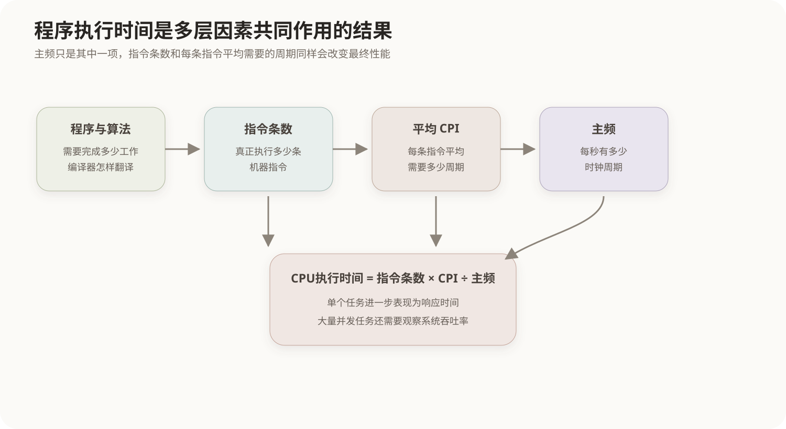
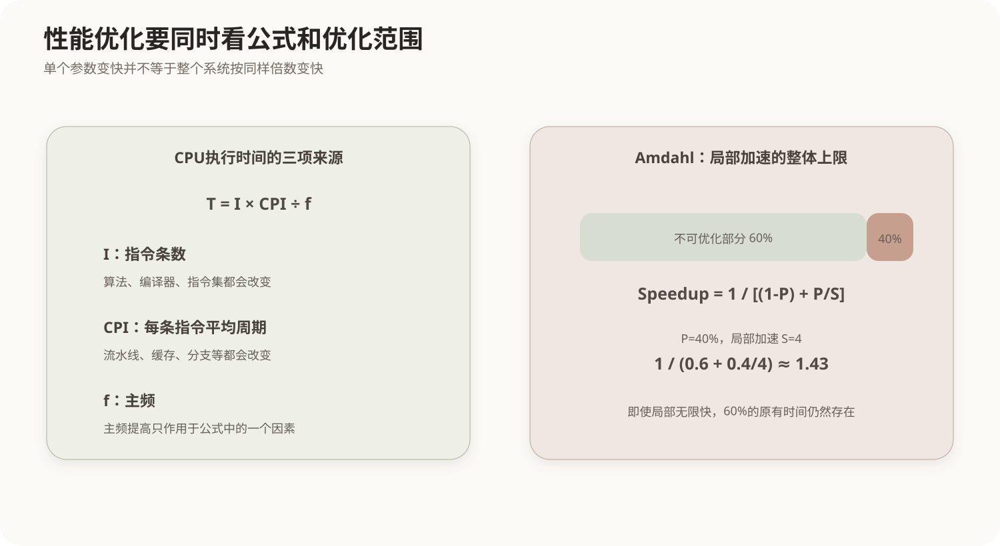

# 计算机性能指标与性能评价

## 1. 性能评价到底在评价什么

“计算机更快”不是一个单一指标。对一个正在运行的程序来说，最直接的问题是**完成这项工作需要多久**；对一个服务器来说，还可能关心**单位时间能处理多少工作**；对处理器设计来说，则需要继续追问执行时间究竟由多少条指令、每条指令需要多少周期以及一个周期有多长共同决定。

因此，性能评价可以从三个层次看：



- **工作负载层**：程序需要完成什么任务，最终执行多少条指令；
- **处理器执行层**：每条指令平均消耗多少个时钟周期；
- **时间层**：时钟周期本身有多长，整个任务最终耗时多久。

只有把这几层连起来，才能理解为什么“主频更高”“MIPS更大”都不能自动推出“运行任何程序都更快”。

## 2. 时钟周期、主频与执行时间

CPU内部的大量操作按照时钟节拍推进。一个时钟周期所经历的时间称为**时钟周期时间**，其倒数就是**主频**：

```text
主频 = 1 / 时钟周期时间
时钟周期时间 = 1 / 主频
```

例如主频为2GHz，表示每秒大约有20亿个时钟周期，因此一个周期约为0.5ns。

但程序不会只执行一个周期。完成一条指令可能需要一个或多个周期，于是程序的CPU执行时间取决于：

```text
CPU执行时间 = CPU时钟周期数 × 时钟周期时间
            = CPU时钟周期数 ÷ 主频
```

如果进一步把总周期数拆成“指令条数 × 平均每条指令需要的周期数”，得到计算机组成中最重要的一条性能关系：

```text
CPU执行时间 = 指令条数 × CPI × 时钟周期时间
            = 指令条数 × CPI ÷ 主频
```

这里三项分别受不同因素影响：

- **指令条数**受算法、程序、编译器和指令系统影响；
- **CPI**受流水线、缓存命中、分支预测、指令类型等影响；
- **主频**受处理器微结构和工艺等影响。

所以性能优化可以来自减少指令、降低CPI或缩短时钟周期，而不是只能提高主频。

## 3. CPI与IPC

CPI（Cycles Per Instruction）表示平均执行一条指令需要多少个时钟周期。IPC（Instructions Per Cycle）表示平均每个周期完成多少条指令。

在同一段稳定工作负载的平均意义下，可以近似理解为：

```text
IPC ≈ 1 / CPI
```

但现代处理器可以乱序执行、超标量发射，一周期可能同时推进多条指令，所以不能把“每条机器指令在物理上严格占几个完整周期”理解成简单串行关系。CPI和IPC更适合作为一段程序在某处理器上的**平均吞吐特征**。

### 3.1 加权平均CPI

程序通常包含多种指令，不同指令的CPI不同。平均CPI必须按实际执行比例加权：

```text
平均CPI = Σ（某类指令数量 × 该类CPI）÷ 总指令数量
        = Σ（某类指令比例 × 该类CPI）
```

例如：

| 指令类型 | 指令比例 | CPI |
|---|---:|---:|
| 算术指令 | 50% | 1 |
| 访存指令 | 30% | 2 |
| 分支指令 | 20% | 4 |

则：

```text
平均CPI = 0.5×1 + 0.3×2 + 0.2×4 = 1.9
```

假设总指令数为10亿、主频为2GHz：

```text
CPU执行时间 = 10^9 × 1.9 ÷ (2×10^9)
            = 0.95 秒
```

这个计算把“程序做多少工作”“每条指令平均多难执行”和“处理器时钟多快”完整串起来了。

## 4. 响应时间与吞吐率

CPU执行时间适合分析单个程序，而系统还常用另外两个指标：

- **响应时间**：从一个任务提交到得到结果经历的时间；
- **吞吐率**：单位时间内能够完成多少个任务。

二者并不总是同步变化。例如一个Web服务器从1个工作线程扩展到8个工作线程，可以同时处理更多请求，吞吐率可能显著提高，但单个请求本身的计算路径并没有缩短，响应时间未必按同样比例下降。

反过来，如果优化一段串行算法，使每个请求的计算时间减半，响应时间通常会下降，同时也可能因为资源释放更快而提高吞吐率。

因此：

```text
响应时间：站在一个任务的角度看“等多久”
吞吐率：站在系统整体角度看“每秒做多少”
```

**利用率**又是第三个维度，它描述CPU、磁盘、网络等资源处于忙碌状态的比例。利用率高不一定意味着用户体验好：一个长期100%占用而排队严重的CPU，恰恰可能带来很差的响应时间。

## 5. MIPS与FLOPS为什么只能在特定范围内使用

MIPS（Million Instructions Per Second）表示每秒执行多少百万条指令：

```text
MIPS = 指令条数 ÷ 执行时间 ÷ 10^6
```

若已经知道主频和平均CPI：

```text
MIPS = 主频 ÷ CPI ÷ 10^6
```

它的问题是：**不同指令集的一条指令工作量并不相同**。一个体系结构可能用一条复杂指令完成的工作，另一个体系结构需要多条简单指令。因此，跨指令系统只比较MIPS可能得到错误结论。

FLOPS表示每秒完成多少次浮点运算，常见单位包括MFLOPS、GFLOPS和TFLOPS。它更适合科学计算、矩阵运算等浮点密集任务，但对数据库查询、文本处理、事务系统等工作也不能代表全部性能。

这两个指标都说明同一件事：**指标只有放在对应工作负载里才有意义。**

## 6. 加速比与Amdahl定律

如果同一个任务在改进前需要20秒、改进后需要10秒，那么：

```text
加速比 = 改进前执行时间 ÷ 改进后执行时间
       = 20 ÷ 10
       = 2
```

表示性能变为原来的2倍。这里要区分“时间下降百分比”和“性能提高百分比”：执行时间从20秒降到10秒是**时间减少50%**，但性能从`1/20`提高到`1/10`，是**提高100%**。

真正复杂的问题是：系统通常只能优化其中一部分。Amdahl定律描述的正是这种局部优化对整体性能的上限：



若可优化部分原来占总时间比例为`P`，这部分自身加速`S`倍，则整体加速比为：

```text
整体加速比 = 1 / [(1-P) + P/S]
```

例如某模块占总执行时间40%，把它加速4倍：

```text
整体加速比 = 1 / (0.6 + 0.4/4)
           = 1 / 0.7
           ≈ 1.43
```

局部模块虽然快了4倍，但另外60%的时间完全没有变化，所以整个系统只快了约1.43倍。

如果把该模块无限加速，`P/S`趋近于0，整体加速极限仍然只有：

```text
1 / (1-P) = 1 / 0.6 ≈ 1.67
```

这就是Amdahl定律的核心：**系统中无法改进的那一部分最终决定整体加速上限。**

## 7. 基准测试为什么比单一硬件参数更可靠

真实程序会同时使用CPU、缓存、主存、磁盘和网络，因此单看某个硬件参数很容易失真。更可靠的做法是给不同机器运行**相同的工作负载或基准程序集**，直接比较执行时间、吞吐率等结果。

一个有效比较至少要控制：

- 运行的是不是同一程序和同一输入数据；
- 编译器及优化级别是否可比；
- 内存、存储和操作系统环境是否影响结果；
- 测的是冷启动还是已有缓存的稳定状态；
- 比较的是单任务响应时间还是并发吞吐量。

因此“某CPU主频更高”“某机器MIPS更大”只能说明某个局部指标；对用户真正关心的任务，最终仍应回到**同一工作负载下实际需要多长时间、能完成多少工作**。

## 8. 核心关系

```text
算法、编译器、指令系统
        ↓
     指令条数
        ↓
指令条数 × CPI = 总时钟周期数
        ↓
总周期数 ÷ 主频 = CPU执行时间

单个任务：主要看响应时间 / 执行时间
大量任务：还要看吞吐率
局部优化：用Amdahl定律判断整体上限
跨机器比较：优先使用相同工作负载下的实际结果
```
