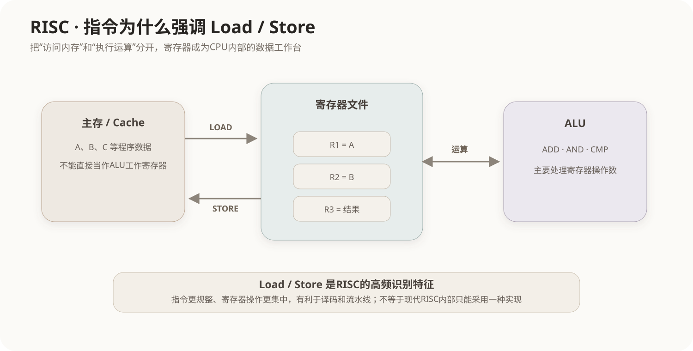

# 指令系统与 RISC、CISC

## 1. CPU为什么需要“指令系统”

CPU不会直接理解 C++、Java 或 Python 语句。程序最终要转换成处理器能够识别的机器指令，例如把数据装入寄存器、执行加法、比较、跳转和访问内存。

一套处理器能够识别的指令、寄存器、数据类型、寻址方式以及指令编码规则，构成它的**指令集体系结构**（Instruction Set Architecture，ISA）。ISA位于软件和硬件之间：编译器按照ISA产生机器指令，CPU按照ISA解释并执行这些指令。



同一个高级语言表达式：

```cpp
c = a + b;
```

在机器层面通常要经历“取得操作数 → 运算 → 保存结果”。不同指令体系在“每条指令允许做多少事情、如何访问内存”上采用不同设计取舍。

## 2. 寄存器为什么位于指令执行中心

寄存器位于CPU核心内部，是指令最直接操作的高速存储位置。典型过程是：

```text
内存中的a、b
   ↓ Load
寄存器R1、R2
   ↓ ADD
寄存器R3
   ↓ Store
内存中的c
```

CPU可以把复杂运算拆成多条简单指令，也可以设计一条功能更复杂的指令。RISC与CISC的传统差异主要就从这种取舍展开。

## 3. RISC：精简指令集思想

RISC（Reduced Instruction Set Computer）强调让常用指令保持简单、规则，使硬件容易快速译码并形成高效流水线。

典型特征包括：

- 指令种类和寻址方式相对精简；
- 指令格式通常较规整，很多体系采用固定或少数几种长度；
- 大量运算在寄存器之间完成；
- 通常采用 **Load/Store** 体系：访问主存主要由加载和存储指令承担；
- 通用寄存器数量通常较多；
- 简单规则的指令更利于流水线和并行执行。

例如：

```text
LOAD  R1, [A]
LOAD  R2, [B]
ADD   R3, R1, R2
STORE [C], R3
```

这里真正的加法只发生在寄存器之间，内存访问被单独拆成LOAD和STORE。

ARM、RISC-V通常被作为RISC体系的典型代表。

## 4. CISC：复杂指令集思想

CISC（Complex Instruction Set Computer）传统上允许更丰富的指令和寻址方式，一条指令可以表达更复杂的操作。

典型特征包括：

- 指令数量和形式较丰富；
- 指令长度可能变化较大；
- 某些指令可以直接对内存操作数完成较复杂的处理；
- 指令译码和执行控制通常比简单RISC指令更复杂。

x86、x86-64通常作为CISC的典型代表。

需要注意：现代处理器已经大量融合不同设计思想。现代x86处理器常把复杂指令译成更简单的内部微操作再送入后端执行。因此“RISC简单、CISC复杂”适合描述ISA传统特征，不能机械推断现代芯片内部一定如何实现。

## 5. Load/Store为什么是RISC高频关键词

Load/Store体系把“访问内存”和“执行算术逻辑运算”分开：

```text
内存 ←→ Load/Store ←→ 寄存器 ←→ ALU
```

这样做的意义是：

1. ALU主要面对规则的寄存器操作数；
2. 指令译码和执行阶段更容易统一；
3. 内存访问延迟与算术执行更容易放入流水线管理；
4. 编译器可以更明确地安排数据何时进入寄存器。

因此题目出现“指令格式规整”“Load/Store”“大量寄存器”“利于流水线”时，通常指向RISC。

## 6. RISC与CISC不是“谁一定更快”

处理器性能还受到主频、流水线、Cache、分支预测、乱序执行、编译器优化、制造工艺和工作负载等多种因素影响。不能仅凭“RISC”或“CISC”标签判断实际性能。

同样，“RISC必须使用硬布线控制”“CISC必须使用微程序控制”都属于过度绝对化。传统教材常把RISC与硬布线、CISC与微程序联系起来，但它们不是不可打破的物理定律。

## 7. 与流水线、Cache和主存的关系

```text
程序机器指令
    ↓
CPU取指 / 译码
    ↓
寄存器 ←→ ALU
    ↑       ↓
  Load/Store
    ↑
L1/L2/L3 Cache
    ↑
主存 DRAM
```

RISC、CISC讨论的是**CPU如何定义和组织机器指令**；Cache讨论的是CPU如何减少访问主存的等待；RAM/辅存讨论的是数据存放层次。它们属于不同维度。

## 8. 常见考查方式

### 8.1 典型对应

```text
RISC：指令简单、格式规整、Load/Store、寄存器多、利于流水线
CISC：指令丰富、复杂操作多、寻址方式多、指令长度可能变化
```

### 8.2 常见干扰

- “RISC大量采用内存到内存运算”通常错误；
- “RISC的单条指令功能一定比CISC强”通常错误；
- “微程序控制是RISC的必要条件”错误；
- “RISC处理器是主机中CPU之外的一块独立硬件”错误，RISC描述的是CPU/ISA设计体系。

## 核心关系

```text
ISA = 软件与CPU之间的机器指令接口
RISC = 让指令更简单、规整，典型采用Load/Store
CISC = 提供更丰富、更复杂的指令和寻址能力

寄存器是指令直接工作的高速位置
Cache和RAM解决存储层次问题
RISC/CISC解决机器指令体系问题
```
