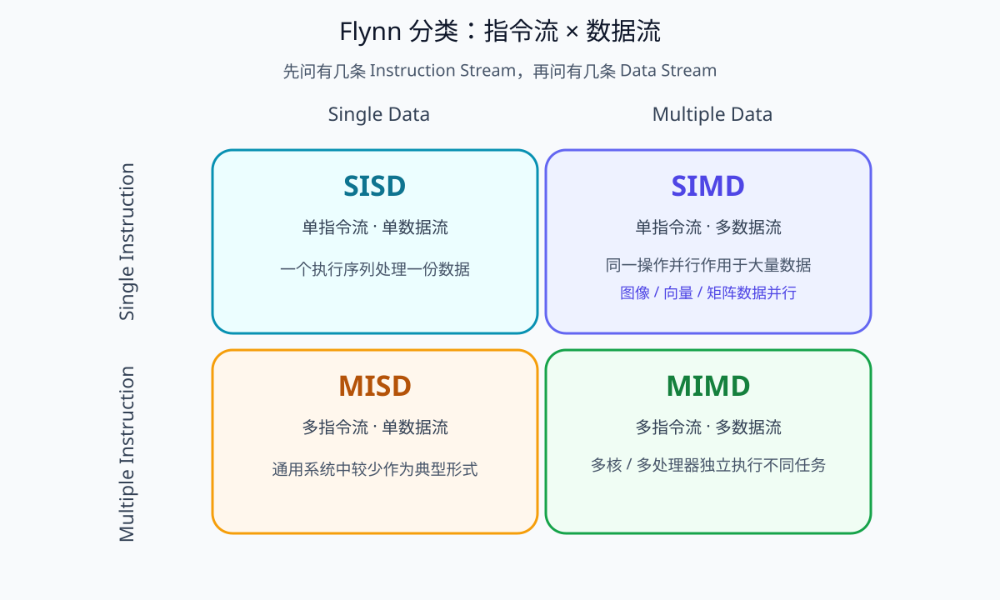

# Flynn 并行体系结构分类

## 1. Flynn分类在分什么

Flynn分类法不是某种处理器，也不是某个并行编程库。它从**指令流**和**数据流**两个维度描述计算机体系结构能够怎样并行执行工作。

- **指令流（Instruction Stream）**：处理器当前执行的操作序列，例如“加法、乘法、比较、跳转”。
- **数据流（Data Stream）**：这些指令所处理的数据序列。

把“指令流是单个还是多个”和“数据流是单个还是多个”组合起来，就得到四类体系结构。



## 2. SISD：单指令流、单数据流

SISD（Single Instruction Stream, Single Data Stream）表示一个执行单元按一条指令序列处理一份数据流。

```text
指令1 → 数据1
指令2 → 数据2
指令3 → 数据3
```

传统单处理器顺序计算可以作为最直观的SISD模型。现代CPU内部即使存在流水线、Cache或乱序执行，也不能仅凭某个微结构细节机械改变题目中的Flynn分类口径。

## 3. SIMD：单指令流、多数据流

SIMD（Single Instruction Stream, Multiple Data Stream）表示**同一种操作同时作用于多份不同数据**。

例如把四个像素亮度同时乘以1.2：

```text
             ×1.2
      ┌──────┼──────┬──────┐
      ↓      ↓      ↓      ↓
    Pixel1 Pixel2 Pixel3 Pixel4
```

图像处理、矩阵运算、向量运算等大量“同操作、多数据”的任务天然适合数据并行。CPU中的SIMD向量指令以及GPU中的大规模并行执行都能体现这种思想。

需要注意：现代GPU的真实执行模型比Flynn四分类更复杂，但基础考试看到“同一指令同时处理大量不同数据”时，核心判断仍是SIMD。

## 4. MISD：多指令流、单数据流

MISD（Multiple Instruction Stream, Single Data Stream）表示同一份数据被多个不同的指令流处理。

这种结构在通用计算机中较少作为典型主流形式。教材有时用冗余容错、流水式多阶段处理等概念帮助理解，但实际系统是否严格属于MISD需要看题目定义。

考试中最重要的是不要因为看到“多个处理单元”就自动选MISD。必须同时确认：**多个指令流是否确实围绕同一数据流。**

## 5. MIMD：多指令流、多数据流

MIMD（Multiple Instruction Stream, Multiple Data Stream）表示多个处理单元可以执行不同指令，并分别处理不同数据。

例如多核CPU：

```text
Core1：执行浏览器线程 → 数据A
Core2：执行编译线程   → 数据B
Core3：执行数据库线程 → 数据C
```

多核、多处理器和许多分布式计算系统都容易表现出MIMD特征。

## 6. 四类怎样快速区分

| 类型 | Instruction | Data | 一句话理解 |
|---|---|---|---|
| SISD | Single | Single | 一个指令流处理一份数据流 |
| SIMD | Single | Multiple | 同一种操作并行处理多份数据 |
| MISD | Multiple | Single | 多种操作围绕同一数据流 |
| MIMD | Multiple | Multiple | 多个执行者各跑各的任务和数据 |

缩写可以直接拆词：

```text
S = Single
M = Multiple
I = Instruction
D = Data
```

因此 `SIMD` 不需要死背：`SI`就是Single Instruction，`MD`就是Multiple Data。

## 7. SIMD与MIMD最容易混在哪里

假设有四个核心：

```text
情况A：四个核心都执行“向量加法”，分别处理不同数组片段
→ 从题目抽象看更接近SIMD式数据并行

情况B：四个核心分别执行浏览器、编译器、数据库、播放器
→ MIMD
```

判断关键不在“有几个核心”，而在**指令流和数据流的关系**。

## 8. 常见考查方式

- “同时对大量不同数据执行相同操作” → SIMD；
- “多个处理器执行不同程序并处理不同数据” → MIMD；
- “单个处理器顺序处理单一指令/数据流” → SISD；
- MISD相对少见，若题干没有明确“多指令、单数据”，不要因为陌生而误选。

## 核心关系

```text
Flynn分类只看两个问题：
1. 有几条指令流？
2. 有几条数据流？

单/单 → SISD
单/多 → SIMD
多/单 → MISD
多/多 → MIMD
```
