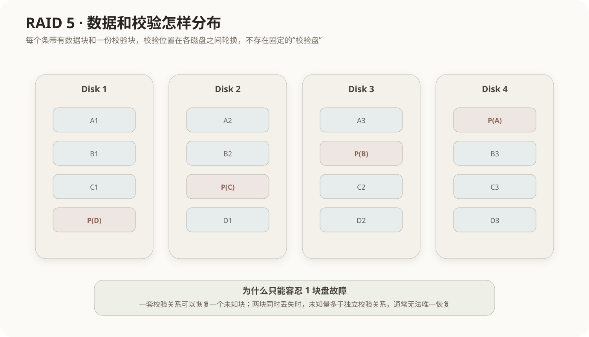

# RAID 磁盘阵列

## 1. RAID解决什么问题

单块SSD或硬盘同时承担容量、性能和可靠性时存在天然限制。RAID（Redundant Array of Independent Disks，独立磁盘冗余阵列）把多块物理磁盘按照特定规则组织成一个逻辑存储系统，以获得更高吞吐、更大容量或故障冗余。

RAID不是一种新的磁盘，也不是CPU旁边固定的一颗芯片。它是一种**多磁盘组织与控制机制**，可以由：

- 独立RAID控制器；
- 主板或存储控制器；
- 操作系统的软件RAID；
- 存储服务器中的专用软件层

实现。

操作系统看到的逻辑关系可以抽象为：

```text
应用 / 文件系统
      ↓
RAID逻辑卷
      ↓
Disk1  Disk2  Disk3  Disk4
```

## 2. 三个基础动作：条带、镜像、校验

### 2.1 条带化 Striping

把连续数据分散写到多块盘：

```text
块A → Disk1
块B → Disk2
块C → Disk3
块D → Disk4
```

多块盘可以并行工作，提高吞吐，但单纯条带化没有冗余。

### 2.2 镜像 Mirroring

同一份数据保存两份：

```text
Disk1：A B C
Disk2：A B C
```

一块损坏时另一块仍有完整副本，但容量利用率降低。

### 2.3 奇偶校验 Parity

利用数据之间的校验关系，在某一块盘损坏时根据剩余数据重建缺失内容。RAID 5和RAID 6的核心差异就在校验份数。

## 3. RAID 5：分布式单校验

RAID 5至少需要3块盘，采用条带化并保存**一套分布式校验信息**。校验块不是永久集中在某一块专用盘，而是在不同条带间轮换分布。



4块2TB磁盘组成RAID 5时，有效容量近似：

```text
(N - 1) × 单盘容量
= (4 - 1) × 2TB
= 6TB
```

相当于整个阵列拿出“一块盘的容量”保存校验，但这些校验数据分散在所有盘中。

## 4. 为什么RAID 5能坏1块，不能保证坏2块

用最简单的XOR关系理解：

```text
P = A XOR B XOR C
```

如果B所在磁盘损坏：

```text
B = P XOR A XOR C
```

剩余A、C和P足以恢复一个未知量。

但若B和C同时丢失：

```text
P = A XOR B XOR C
```

此时存在两个未知量B、C，仅一套独立校验关系不能唯一恢复原数据。因此RAID 5通常只能容忍**任意1块磁盘故障**。

## 5. RAID 6为什么能坏2块

RAID 6在条带化基础上保存两套独立校验信息，通常记为P、Q。它相当于增加了第二组独立恢复约束，因此可容忍任意2块磁盘故障。

有效容量近似：

```text
(N - 2) × 单盘容量
```

因此4块2TB磁盘组成RAID 6时，有效容量约为4TB。

## 6. RAID 0、1、5、6、10对比

| 级别 | 核心机制 | 有效容量（等容量N盘） | 典型容错 |
|---|---|---|---|
| RAID 0 | 条带化，无冗余 | N×单盘 | 0块 |
| RAID 1 | 镜像 | 通常约一半 | 镜像组可坏1块 |
| RAID 5 | 条带 + 单校验 | (N-1)×单盘 | 任意1块 |
| RAID 6 | 条带 + 双校验 | (N-2)×单盘 | 任意2块 |
| RAID 10 | 先镜像再条带 | 通常约一半 | 取决于坏盘分布 |

RAID编号只是不同方案的级别名称，不代表“RAID 5必须5块盘”或“RAID 6必须6块盘”。

## 7. RAID不是备份

RAID可以提高磁盘故障下的可用性，但不能替代独立备份。以下问题可能同时破坏整个阵列中的数据：

- 用户误删除；
- 勒索软件加密；
- 应用写入错误数据；
- 控制器或文件系统损坏；
- 火灾、进水等整机事故。

因此：

```text
RAID解决“部分磁盘坏了还能继续工作”
备份解决“数据已经被破坏后还能恢复历史副本”
```

## 8. 常见考查方式

- RAID 5：`(N-1)×单盘容量`，容忍1块故障；
- RAID 6：`(N-2)×单盘容量`，容忍2块故障；
- RAID 0没有冗余；
- RAID 1强调镜像；
- “RAID 5的校验全部固定放在一块专用盘”错误，RAID 5采用分布式校验；
- “RAID 5中的5表示需要5块盘”错误。

## 核心关系

```text
条带化：提高并行吞吐
镜像：复制完整数据
校验：用冗余关系恢复缺失数据

RAID 5 = 条带化 + 一套分布式校验 → 可坏1块
RAID 6 = 条带化 + 两套分布式校验 → 可坏2块
```
