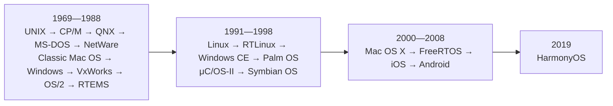
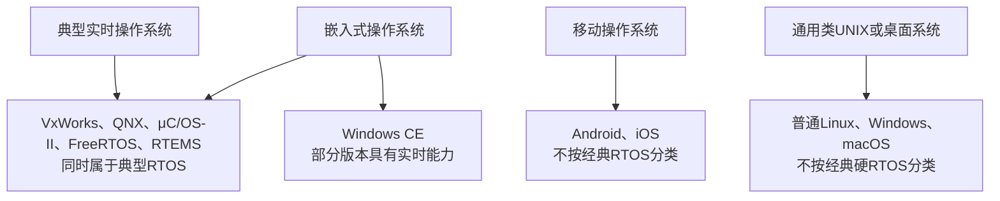

# 常考操作系统：历史、分类、实时性与应用

## 阅读说明

本条目按操作系统家族首次形成或首次公开版本的大致时间排序。不同资料可能按照开始研发、首次发布、首次商用或更名时间计算，因此个别年份存在口径差异；使用年份时应同时关注相对先后关系、系统类型和典型特征。

“是否实时”采用以下口径：

- **是**：该系统通常被正式归类为实时操作系统（RTOS），设计重点包括确定性调度和有界响应时间；
- **部分版本或需配置**：该系统具有实时版本、实时扩展或可以配置实时能力，但不能把整个系统家族无条件归为经典RTOS；
- **否**：通常不按经典RTOS分类。它可能运行很快或支持实时优先级，但不以保证关键任务截止时间为主要分类依据。

## 操作系统种类

### 批处理操作系统

将多个作业成批提交，由系统按计划依次处理。用户通常不与正在执行的作业直接交互。

常考点：作业调度、周转时间、吞吐量。

### 分时操作系统

把处理器时间划分为较短时间片，让多个用户或任务交替运行，强调交互性和资源共享。

常考点：时间片、多用户、多任务、响应时间。UNIX是经典代表。

### 实时操作系统

要求关键任务不仅得到正确结果，还要在规定的截止时间内完成，强调最坏响应时间和确定性。

- 硬实时：错过截止时间可视为系统失败；
- 软实时：偶尔超时会降低服务质量，但不一定导致整个系统失败。

### 网络操作系统

为多台独立计算机提供网络通信、用户管理、文件共享、打印共享等服务。经典代表是NetWare；Windows Server、UNIX和Linux也广泛提供网络服务。

### 分布式操作系统

管理多台计算机的资源，并尽量向用户提供统一的系统环境。软考通常考查它与网络操作系统的区别，而不是具体产品名称。

### 嵌入式操作系统

运行在专用设备中，通常强调资源受限、可裁剪、可靠性和硬件适配。嵌入式不等于实时，但很多RTOS同时属于嵌入式操作系统。

### 桌面、服务器和移动操作系统

- 桌面系统强调交互界面、应用兼容和用户体验；
- 服务器系统强调并发、网络服务、权限、稳定性和资源管理；
- 移动系统强调触控、通信、传感器、应用隔离和功耗管理。

## 按历史顺序整理的常考系统



| 时间 | 操作系统 | 主要种类 | 是否实时 | 主要用途与具体场景 | 软考常见考点 |
|---|---|---|---|---|---|
| 1969 | UNIX | 分时、多用户、多任务、通用系统 | 否 | 大型机、小型机、工作站和服务器；高校与科研计算、网络服务器 | 多用户、多任务、分时；用C语言重写后具有较好的可移植性；文件与权限体系；Linux是类UNIX而不是原始UNIX |
| 1974 | CP/M | 早期微型计算机操作系统 | 否 | 早期8位微型计算机的软件运行环境 | 早期个人计算机系统；历史识别题，考试频率低于DOS |
| 1980—1982 | QNX | 嵌入式、微内核、实时操作系统 | 是，典型硬实时RTOS | 汽车系统、工业控制、医疗仪器、网络设备、空中交通等关键任务系统 | 微内核；消息传递；可靠性、故障隔离、确定性调度；典型RTOS |
| 1981 | MS-DOS | 个人计算机、命令行系统 | 否 | 早期IBM PC及兼容机，运行单个前台程序和命令行工具 | 单用户、单任务；命令行；与现代Windows的多任务体系区分 |
| 1983 | Novell NetWare | 网络操作系统 | 否 | 局域网文件服务器、用户管理和打印共享 | 经典网络操作系统；网络资源共享；旧题中常见 |
| 1984 | Classic Mac OS（早期Macintosh系统软件） | 桌面、图形界面系统 | 否 | Macintosh个人计算机，图形界面和桌面应用 | 图形用户界面；不要与2001年后的Mac OS X/macOS内核体系混为一谈 |
| 1985 | Microsoft Windows | 桌面和服务器通用系统家族 | 否，普通Windows不按经典RTOS分类 | 个人电脑、办公终端、开发工作站；Windows Server用于企业服务 | 图形界面、多任务、通用操作系统；虚拟存储、进程线程、文件系统和权限管理 |
| 1987 | VxWorks | 嵌入式实时操作系统 | 是，典型硬实时RTOS | 航空航天、工业控制、网络设备、机器人和其他关键任务设备 | 典型RTOS；确定性、优先级调度、低中断延迟；常与Android、iOS等移动系统进行识别比较 |
| 1987 | OS/2 | 个人计算机、多任务操作系统 | 否 | IBM与微软早期个人计算机平台，后来主要由IBM发展 | 历史识别题；多任务；考试频率较低 |
| 1988 | RTEMS | 开源嵌入式实时操作系统 | 是 | 航天器、科研设备、网络和嵌入式控制系统 | RTOS、开源、支持POSIX及多处理器；名称为Real-Time Executive for Multiprocessor Systems |
| 1991 | Linux | 开源、类UNIX、通用系统 | 普通Linux不是经典硬RTOS；可通过PREEMPT_RT等增强实时性 | 服务器、云计算、开发环境、超级计算机、网络设备和嵌入式设备 | 开源、类UNIX、多用户、多任务；Linux是内核；发行版概念；与UNIX的关系 |
| 1990年代中期 | RTLinux | Linux实时扩展或实时运行架构 | 是，具体能力取决于实现 | 工业控制、数据采集和需要Linux环境的实时任务 | 不能把RTLinux的实时性直接推广到所有普通Linux系统 |
| 1996 | Windows CE（后称Windows Embedded Compact） | 嵌入式操作系统 | 部分版本具有确定性调度和硬实时能力 | 掌上设备、条码终端、工业控制器、车载和其他专用设备 | 嵌入式、可裁剪；不是桌面Windows的简单缩小；部分版本具有实时能力，因此单选题需注意教材口径和版本限定 |
| 1996 | Palm OS | 移动和掌上设备操作系统 | 否 | 早期PDA、日程和个人信息管理设备 | 早期移动操作系统识别；主要出现在旧题 |
| 1998 | μC/OS-II | 小型嵌入式实时操作系统 | 是 | 单片机、教学实验、仪器和资源受限的控制设备 | 抢占式实时内核、任务优先级、资源占用小；常见RTOS代表 |
| 1998 | Symbian OS | 移动和嵌入式操作系统 | 通常不作为经典RTOS考查 | 早期智能手机和移动通信设备 | 早期智能手机系统；旧题识别 |
| 2000—2001 | Mac OS X（后称OS X、macOS） | 桌面、类UNIX系统 | 否 | Mac个人计算机、开发和专业应用 | 基于Darwin，具有UNIX/BSD技术基础；与Classic Mac OS区分 |
| 2003 | FreeRTOS | 开源、小型嵌入式实时操作系统 | 是 | 微控制器、传感器、物联网终端和小型控制设备 | 任务、队列、信号量、中断接口、优先级调度；现代嵌入式开发常见 |
| 2007 | iPhone OS（后称iOS） | 移动操作系统 | 否，不按经典RTOS分类 | iPhone移动设备，运行移动应用并管理触控、通信、传感器和功耗 | 苹果移动操作系统；与macOS共享部分技术基础；不能因交互流畅就归为硬实时系统 |
| 2008 | Android | 移动、基于Linux内核的操作系统平台 | 否，不按经典RTOS分类 | 智能手机、平板、电视、车载和其他智能设备 | Linux内核；应用运行环境；进程与权限隔离；移动系统，不等于普通Linux发行版 |
| 2019 | HarmonyOS | 面向多种智能设备的分布式操作系统家族 | 不能对整个家族简单作统一RTOS结论 | 手机、穿戴设备、智慧屏、车机和多设备协同 | 分布式能力、跨设备协同、一次开发多端部署；不要仅凭“嵌入式设备”判断为经典RTOS |

## 实时性高频辨析

### 运行快不等于实时

实时系统关注最坏情况下能否在截止时间前完成任务。平均速度很快，但响应时间没有确定上限，仍可能不满足实时要求。

### 嵌入式不等于实时



```text
VxWorks、QNX、μC/OS-II、FreeRTOS、RTEMS：嵌入式且属于典型RTOS
Windows CE：嵌入式，部分版本具有实时能力
Android、iOS：移动系统，不按经典RTOS分类
普通Linux：通用类UNIX系统，不天然等于硬实时系统
```

### 实时系统的典型技术特征

- 基于优先级的抢占式调度；
- 可预测的任务切换和中断响应；
- 对优先级反转的处理；
- 关键操作具有可分析的时间上界；
- 能够让关键任务在规定截止时间前完成。

## 核心分类表

```text
MS-DOS：单用户、单任务
UNIX：多用户、多任务、分时
Linux：开源、类UNIX、普通版本不是经典硬RTOS
Windows：通用桌面和服务器系统
NetWare：经典网络操作系统
Android、iOS：移动操作系统
Windows CE：嵌入式，部分版本具有实时能力
VxWorks、QNX、μC/OS-II、FreeRTOS、RTEMS：典型实时操作系统
```

## 产品名称题之外的操作系统高频考点

软考更常考以下通用原理：

1. 进程与线程的区别；
2. [进程状态及状态转换](05-进程状态与调度转换.md)；
3. 先来先服务、短作业优先、优先级、时间片轮转等调度算法；
4. PV操作、信号量和进程同步互斥；
5. [死锁产生条件、预防、避免和银行家算法](04-进程死锁与资源分配.md)；
6. 分区、[分页](02-分页存储管理基础.md)、[分段和段页式存储管理](06-分段与段页式存储管理.md)；
7. FIFO、LRU、OPT等页面置换算法；
8. 文件目录、索引结构和磁盘调度；
9. 中断、设备管理和缓冲技术；
10. 实时系统、分时系统、网络系统和分布式系统的分类辨析。

## 官方资料

- UNIX历史：https://www.unix.org/unix_history.html
- Microsoft 1981年历史与MS-DOS：https://learn.microsoft.com/en-us/shows/history/history-of-microsoft-1981
- Microsoft 1985年历史与Windows：https://learn.microsoft.com/en-us/shows/history/history-of-microsoft-1985
- Microsoft Windows CE发布资料：https://news.microsoft.com/source/1996/09/16/microsoft-announces-windows-cenewest-member-of-windows-family/
- Microsoft关于实时系统的说明：https://learn.microsoft.com/en-us/windows/iot/iot-enterprise/soft-real-time/soft-real-time
- VxWorks官方介绍：https://www.windriver.com/products/embedded/vxworks
- QNX历史与架构：https://www.qnx.com/developers/docs/7.0.0/com.qnx.doc.neutrino.getting_started/topic/preface_History.html
- RTEMS项目历史：https://www.rtems.org/about/
- FreeRTOS版本历史：https://freertos.org/Documentation/04-Roadmap-and-release-note/02-Release-notes/00-Release-history
- Apple Macintosh 1984年资料：https://support.apple.com/en-us/112190
- Apple iPhone 2007年发布资料：https://www.apple.com/newsroom/2007/01/09Apple-Reinvents-the-Phone-with-iPhone/
- Android 1.0发布资料：https://android-developers.googleblog.com/2008/09/announcing-android-10-sdk-release-1.html
- HarmonyOS官方介绍：https://www.harmonyos.com/
