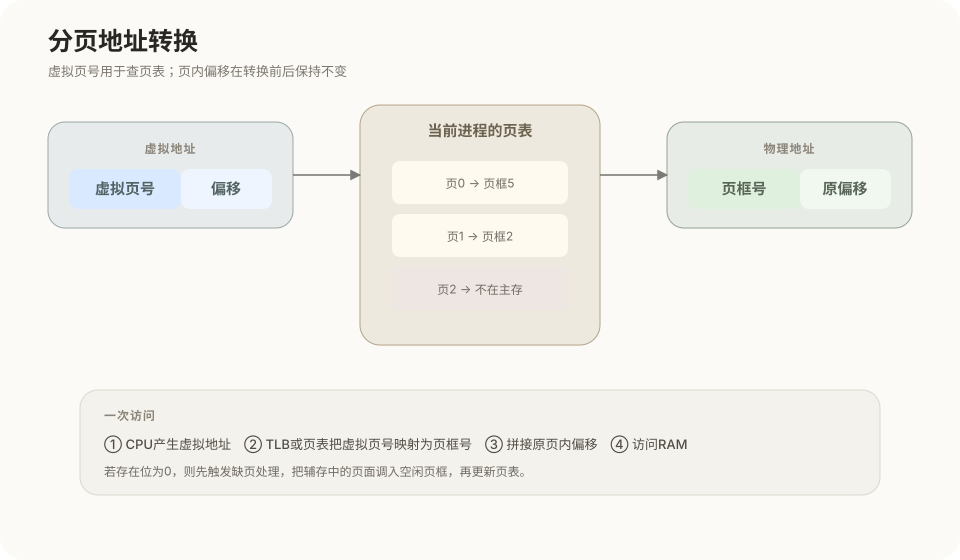
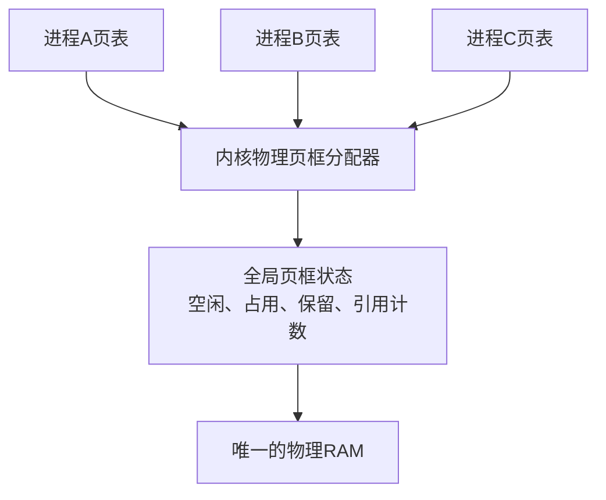
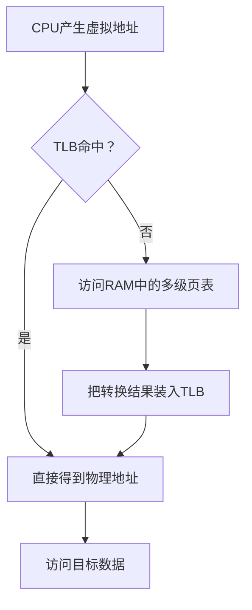
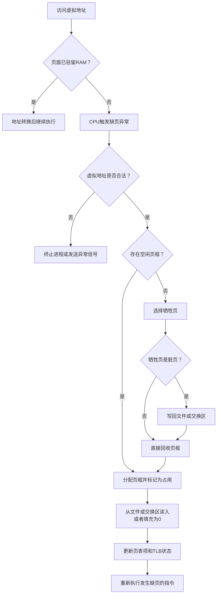
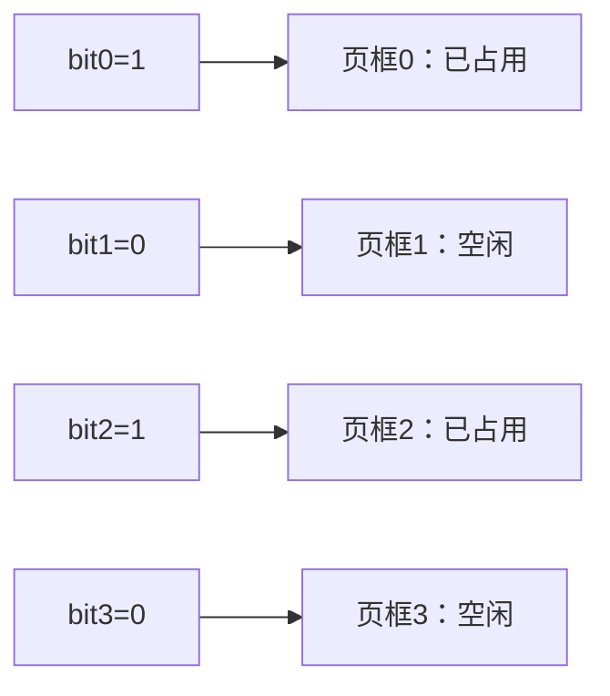
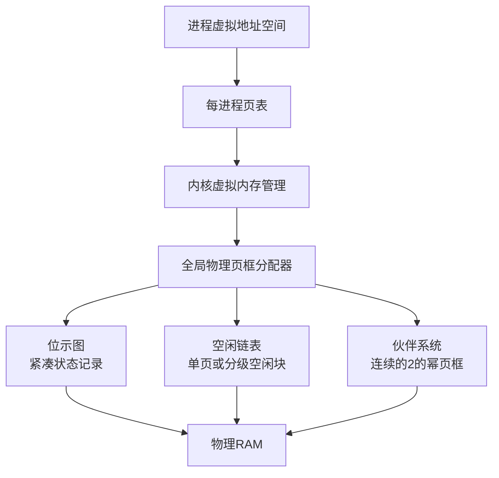

# 分页存储管理与虚拟内存

## 1. 存储体系与内存管理目标

计算机的存储系统按速度、容量和用途形成层次。CPU执行指令时最终访问的是主存中的代码和数据；SSD、硬盘等辅存负责长期保存文件，也可以为暂时离开主存的页面提供后备存储。


- **主存（RAM）**：CPU能够直接寻址的工作存储空间，速度快、容量有限，通常断电后数据消失。
- **辅存**：长期保存程序和数据，容量较大、速度低于RAM，CPU不能把磁盘位置直接当成普通物理内存地址使用。
- **内存管理**：负责分配、回收、地址转换、进程隔离、权限控制、受控共享和虚拟内存。

## 2. 连续分配、碎片与内存紧缩

### 2.1 内部碎片

内部碎片是**已经分配给某个对象、但对象没有实际使用的空间**。固定分区、分页以及按固定规格分配的机制都可能产生内部碎片。

例如页面大小为4KB，进程需要10KB，只能分配3页共12KB，最后2KB位于已分配区域内部，不能再交给其他进程使用。

```text
┌────────┬────────┬────────────────┐
│ 4KB数据 │ 4KB数据 │ 2KB数据 │ 2KB空闲 │
└────────┴────────┴────────────────┘
                              ↑
                           内部碎片
```

### 2.2 外部碎片

外部碎片是**空闲空间总量足够，但空闲区彼此分散，无法形成所需的连续区域**。可变分区和分段管理容易出现外部碎片。

```text
低地址                                                 高地址
┌──────┬────────┬──────┬────────┬──────┐
│ 已用 │ 空闲2KB │ 已用 │ 空闲3KB │ 已用 │
└──────┴────────┴──────┴────────┴──────┘

空闲总量为5KB，但无法满足一次连续4KB的申请。
```

分页允许一个进程使用不连续的物理页框，因此分配单页时基本消除了外部碎片；但内核申请多个连续物理页框时，仍可能受到物理内存分散的影响。

### 2.3 内存紧缩

内存紧缩通过移动可移动的已分配区域，把多个空闲区合并成较大的连续空闲区。


紧缩需要地址重定位支持，还会产生数据复制和暂停开销。它与“压缩内存”不同：紧缩改变存放位置，压缩则通过编码减少数据占用的字节数。

## 3. 页面、页框与虚拟地址空间

- **页面（page）**：进程虚拟地址空间中的固定大小区块。
- **页框（page frame）**：物理主存中大小相同的固定区块，也称物理块或页帧。
- **页面大小等于页框大小**：这样地址转换只需要替换页号，页内位置保持不变。

假设页面大小为4KB：

```text
虚拟页0：地址     0 ～  4095
虚拟页1：地址  4096 ～  8191
虚拟页2：地址  8192 ～ 12287
```

程序看到的虚拟页面可以连续，对应的物理页框不必连续：



地址映射除了隐藏物理内存的不连续，还提供：

1. **进程隔离**：相同虚拟地址在不同进程中可以指向不同页框。
2. **地址重定位**：程序不需要知道自己实际位于RAM的哪个位置。
3. **权限控制**：页表可以限制读、写、执行以及用户态访问。
4. **受控共享**：不同进程可以有意映射同一物理页框。
5. **按需装入**：当前不需要的页面可以暂时不占用RAM。
6. **更大的虚拟地址空间**：进程的虚拟空间可以大于当前可用的物理内存。

## 4. 地址的组成与转换

“虚拟地址＝虚拟页号＋页内偏移”中的加号表示**字段组成**。进行数值计算时应写成：

```text
虚拟地址 = 虚拟页号 × 页面大小 + 页内偏移
物理地址 = 物理页框号 × 页面大小 + 原页内偏移
```

### 4.1 十进制转换实例

页面大小为4KB，即4096Byte，虚拟地址为13000：

```text
虚拟页号 = floor(13000 ÷ 4096) = 3
页内偏移 = 13000 mod 4096 = 712
```

若页表记录“虚拟页3 → 物理页框8”，则：

```text
物理地址 = 8 × 4096 + 712 = 33480
```

转换过程中只把虚拟页号3换成物理页框号8，页内偏移712保持不变。

### 4.2 为什么低位是页内偏移

如果页面大小为 `2^n` Byte，一页内部共有 `2^n` 个字节位置，编号范围是 `0～2^n-1`，正好需要 `n` 个二进制位表示。因此地址的低 `n` 位天然表示页内偏移，其余高位表示页号。

4KB等于 `2^12` Byte，所以32位虚拟地址可拆成：

```text
31                    12 11                 0
┌──────────────────────┬────────────────────┐
│  虚拟页号：高20位      │ 页内偏移：低12位    │
└──────────────────────┴────────────────────┘
```


常用计算关系：

```text
页面数量 = 虚拟地址空间大小 ÷ 页面大小
物理页框数量 = 主存容量 ÷ 页面大小
页内偏移位数 = log₂(页面字节数)
虚拟页号位数 = 虚拟地址总位数 - 页内偏移位数
页表大小 = 虚拟页面数量 × 每个页表项大小
```

## 5. 每进程页表与全局物理页框管理

每个进程通常拥有自己的页表，但全部进程共享同一套物理RAM。两者由内核的全局物理内存分配器连接起来。



分配页框时，内核查询全局状态，选择空闲页框，先将其标记为占用，再把页框编号写入当前进程的页表。分配操作通过锁或其他同步机制保护，避免两个CPU误领同一个页框。

两个进程可以拥有相同的虚拟地址，但映射到不同页框。共享内存、共享库、文件映射和写时复制则会在内核控制下，让不同进程有意映射同一页框，并记录引用计数和各自权限。

进程切换时，CPU切换当前页表的根地址。不同体系结构使用不同寄存器和标识机制，例如x86使用CR3，并可以用PCID区分地址空间。

## 6. 页表、页表项与TLB

### 6.1 页表的位置与作用

页表通常存放在RAM中，由内核分配并保护。页表本身也占用物理页框。现代系统通常使用多级页表，只为实际用到的虚拟地址范围建立下级结构，避免一次性创建巨大的单级页表。

页表项常见字段如下：

| 字段 | 含义 | 主要用途 |
|---|---|---|
| 物理页框号 | 页面当前对应的物理页框 | 组成物理地址 |
| 存在位 Present | 页面当前是否驻留RAM并可直接访问 | 为0时触发异常，由内核判断缺页或非法访问 |
| 访问位 Accessed/Referenced | 页面近期是否被读、写或执行 | 估计页面活跃程度，支持Clock或近似LRU |
| 修改位 Dirty | 页面装入后是否被写过 | 脏页被淘汰前通常必须写回后备存储 |
| 权限位 | 是否允许读、写、执行以及用户态访问 | 隔离和保护地址空间 |

“存在位”通常表示“当前是否驻留主存”，不表示这个虚拟页面在逻辑上是否存在。存在位为0既可能表示页面暂不在RAM，也可能表示地址根本没有合法映射，内核根据其他元数据进行区分。

### 6.2 TLB的位置与必要性

TLB（Translation Lookaside Buffer）位于CPU核心内部的MMU附近，是最近使用的页表项高速缓存，保存虚拟页号到物理页框号及权限的转换结果。

多级页表查询可能需要多次读取RAM。例如四级页表在最不利情况下，要依次读取四级结构，之后才能读取目标数据。TLB命中后可以省去这些页表访问。



页表和TLB不能互相替代：页表保存完整、权威的地址映射，TLB只缓存其中少量近期映射。进程切换时，TLB条目需要清除，或通过ASID、PCID等标识区分所属地址空间。

## 7. 缺页与页面的后备位置

虚拟内存允许一个进程只有部分页面驻留RAM。暂时不在RAM中的内容可能来自：

| 页面类型 | 后备位置或产生方式 |
|---|---|
| 程序代码、只读数据、动态库 | 原始可执行文件或库文件 |
| 文件映射页面 | 对应普通文件及其偏移位置 |
| 被换出的匿名页面 | 交换分区或页面文件 |
| 尚未使用的新匿名页面 | 不必预先保存，首次访问时建立全零页 |

页表不能把磁盘地址作为普通物理地址交给CPU。存在位为0时，CPU只负责触发缺页异常；操作系统再通过页表中的特殊编码或其他内核元数据找到文件位置、交换槽位或全零页规则。

### 7.1 完整缺页处理流程



存在空闲页框时，系统并不会停在“找到页框”这一步，而是继续完成标记占用、装入内容、更新页表、处理TLB并重新执行指令。

## 8. 页面置换算法

当缺页且没有空闲页框时，操作系统必须选择一个驻留页面作为牺牲页。

### 8.1 FIFO：先进先出

淘汰最早装入主存的页面。页面被再次访问时通常不改变装入顺序。

- 实现简单，可使用队列。
- 没有直接利用访问频率和最近访问时间。
- 可能出现Belady异常：分配更多页框后，缺页次数反而增加。

### 8.2 LRU：最近最少使用

淘汰距离当前最久没有被访问的页面。每次访问都会改变页面的新旧顺序。

- 利用程序近期访问行为。
- 不会出现Belady异常。
- 精确记录每次访问的成本较高，实际系统通常用访问位、Clock等机制近似实现。

### 8.3 OPT：最佳置换

淘汰未来最晚才会再次访问，或以后不再访问的页面。

- 理论上能得到给定访问序列的最少缺页次数。
- 实际运行时无法预知完整未来，因此不能直接实现。
- 主要用于评价其他置换算法与理论下界。

假设有3个页框，已经依次访问 `1、2、3、1`，随后访问4，未来访问为 `2、1、3`：

| 算法 | 淘汰页面 | 判断依据 |
|---|---:|---|
| FIFO | 1 | 1最早装入，后来命中不改变装入顺序 |
| LRU | 2 | 2距离当前最久没有访问 |
| OPT | 3 | 3在未来最晚再次访问 |

进行访问序列分析时，应统一遵循：初始页框为空，首次装入算缺页；只在未命中时置换；FIFO命中不更新装入次序；LRU每次访问都更新新旧关系；OPT向后检查未来序列。

## 9. 物理页框分配数据结构

页表回答“某进程的虚拟页映射到哪个物理页框”，物理页框分配器回答“整个RAM中哪些页框空闲、占用或保留”。二者解决的是不同问题。

### 9.1 位示图

位示图为每个物理页框设置一个二进制位。可以约定1表示已占用、0表示空闲，也可以使用相反约定。



运行时位示图通常存放在内核保留的RAM中，因为分配和回收会频繁访问它。保存位示图自身的页框被标记为系统占用，不会产生无限递归。系统启动时可以根据硬件内存布局、内核占用区和保留区重新建立状态，不需要把运行时位示图作为权威数据长期保存在磁盘。

位示图空间计算：

```text
物理页框数量 = 主存容量 ÷ 页框大小
位示图位数 = 物理页框数量
位示图字节数 = 物理页框数量 ÷ 8
位示图大小（KB） = 物理页框数量 ÷ 8 ÷ 1024
```

### 9.2 空闲页框链表

空闲页框链表把空闲页框编号连接起来：

```text
页框1 → 页框3 → 页框8 → 页框12
```

它适合快速取出或归还单个页框，但不便于随机查询任意页框状态，也不擅长直接寻找较大的连续物理区域。

### 9.3 伙伴系统

伙伴系统按 `1、2、4、8……` 个连续页框建立不同阶的空闲链表。较大的块可以逐级拆分，释放后与对应伙伴合并。

```text
order 0：1页块
order 1：2页连续块
order 2：4页连续块
order 3：8页连续块
```

申请3页时通常要分配4页，可能产生1页内部碎片。伙伴系统适合内核分配不同规模、且要求物理连续的内存块。

### 9.4 三种结构的关系

三者可能替代，也可能分层或在不同内存区域共存，只要系统保持状态一致。

| 结构 | 优点 | 局限 | 适用场景 |
|---|---|---|---|
| 位示图 | 每页仅1bit；容易查询任意页框、统计数量和扫描连续位 | 大范围扫描可能较慢 | 紧凑记录固定数量页框的全局状态 |
| 空闲页框链表 | 取出、归还单个页框简单 | 难以随机查询和寻找大块连续页框 | 主要分配单页、结构要求简单 |
| 伙伴系统 | 快速拆分、合并2的幂大小的连续区域 | 向上取整产生内部碎片 | 需要不同大小连续物理块的内核分配 |



现代系统常以伙伴系统管理物理页，在伙伴系统内部维护分级空闲链表和辅助位信息；更小的内核对象可以在其上使用Slab或SLUB等分配器。具体实现不要求三套完全独立的数据结构同时维护整块RAM。

## 10. 核心关系

```text
主存 = RAM
页面 = 虚拟地址空间中的固定大小区块
页框 = 物理主存中的固定大小区块
页面大小 = 页框大小
页表 = 虚拟页到物理页框的映射与访问控制信息
TLB = CPU内部缓存的近期页表转换结果
缺页 = 页面当前不在RAM时触发的异常处理过程
位示图、空闲链表、伙伴系统 = 物理页框分配器可能采用的数据结构
```

这里的位示图管理RAM中的物理页框。文件系统使用相同思想记录磁盘空闲块，但管理对象、持久化要求和容量计算不同，见[磁盘结构与空闲空间管理](07-磁盘结构与空闲空间管理.md)。

分页与分段、段页式的结构和地址转换差异，参见[分段与段页式存储管理](06-分段与段页式存储管理.md)。
