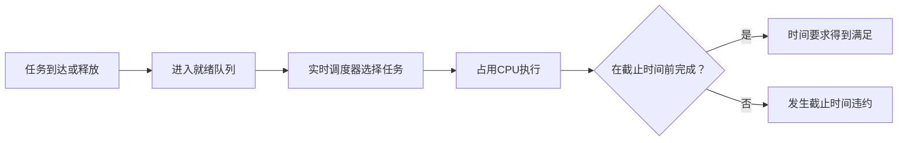
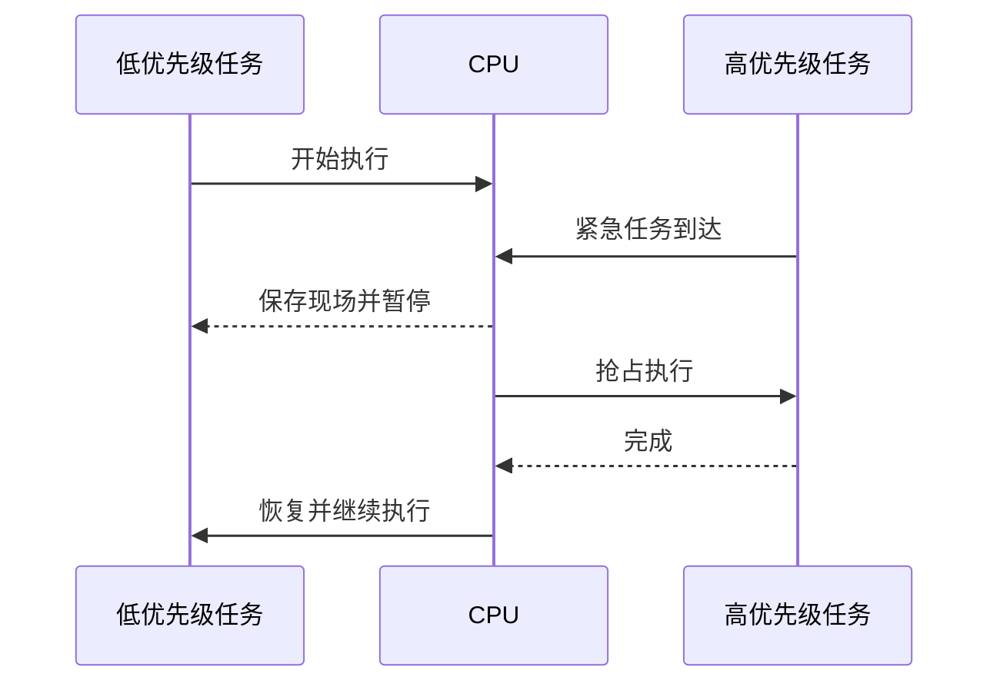
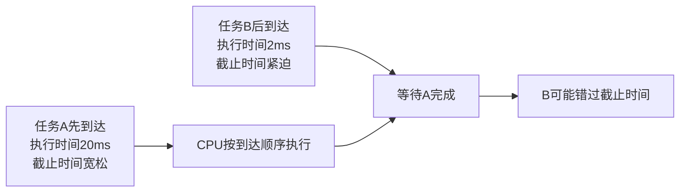
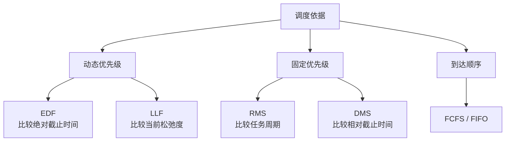
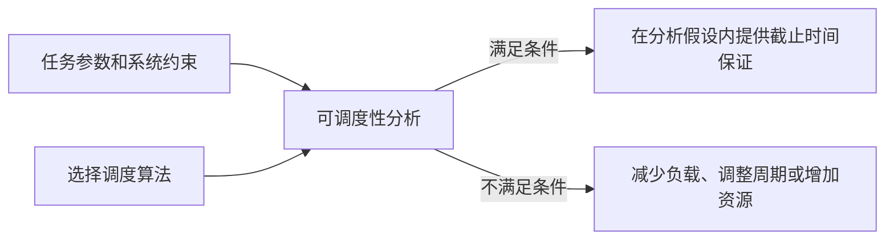

# 实时系统调度算法

## 1. 实时系统关注什么

实时系统不仅要求计算结果正确，还要求结果在规定的截止时间之前产生。调度器需要决定就绪任务取得CPU的先后顺序，并在给定硬件能力和任务条件下判断任务集合是否能够满足时间要求。



## 2. 硬实时与软实时

### 硬实时

硬实时系统要求关键任务必须在截止时间前完成。错过截止时间可能导致控制失效、设备损坏或安全问题。

典型应用包括：

- 飞行控制；
- 汽车安全控制；
- 工业设备保护；
- 医疗设备的关键控制；
- 电力和通信设备的保护控制。

硬实时系统通常要在运行前进行可调度性分析，并为最坏情况执行时间、中断延迟和资源争用等因素保留时间余量。

### 软实时

软实时系统希望任务尽量按时完成，但偶尔错过截止时间只会降低服务质量，不会直接导致系统整体失效。

典型应用包括视频播放、网络音频、普通在线会议和非关键动画处理。

### “强实时”的常见含义

部分中文资料使用“强实时”表示严格的截止时间约束，通常与硬实时接近。具体使用时应确认资料采用的术语体系。

## 3. 实时任务的时间参数

一个实时任务通常包含以下参数：

| 参数 | 含义 |
|---|---|
| 到达时间或释放时间 `r` | 任务进入就绪状态、可以开始执行的时间 |
| 执行时间 `C` | 任务完成一次运行需要占用CPU的时间，分析时通常关注最坏情况执行时间WCET |
| 相对截止时间 `D` | 从任务释放到规定完成时刻之间的时间长度 |
| 绝对截止时间 `d` | 该次任务实例必须完成的具体时刻，通常 `d = r + D` |
| 周期 `T` | 周期任务相邻两次释放之间的时间 |
| 剩余执行时间 `e` | 当前时刻之后仍需要占用CPU的时间 |

```text
释放时间 r                    绝对截止时间 d
    │                               │
    ▼                               ▼
────●────────等待────────执行────────●────→ 时间
    └────────相对截止时间 D──────────┘
```

## 4. 可抢占与不可抢占

- **可抢占调度**：更高优先级任务到达后，可以暂停当前任务并立即获得CPU。
- **不可抢占调度**：当前任务主动结束或阻塞前，其他任务不能夺取CPU。

实时调度经常采用可抢占方式，因为紧急任务不必等待一个执行时间较长的低优先级任务完成。但抢占会产生保存现场、恢复现场和Cache状态变化等开销。



## 5. EDF：最早截止时间优先

EDF全称为 `Earliest Deadline First`，即最早截止时间优先。调度器选择绝对截止时间最早的就绪任务。

```text
任务A：绝对截止时间20ms
任务B：绝对截止时间12ms
任务C：绝对截止时间30ms

当前优先关系：B > A > C
```

EDF采用动态优先级。随着新任务到达，当前优先级关系可能发生变化；如果新任务具有更早的截止时间，可以抢占当前任务。

### 经典可调度条件

对于单处理器、任务相互独立、允许抢占、周期等于相对截止时间，并忽略调度和资源竞争开销等经典条件，周期任务集合的处理器利用率为：

```text
U = C₁/T₁ + C₂/T₂ + … + Cₙ/Tₙ
```

在这些条件下：

```text
U ≤ 1
```

是EDF可调度的重要判定条件。离开这些假设后，还要考虑任意截止时间、阻塞、抖动、多处理器和调度开销，不能只使用这一条公式。

## 6. LLF：最小松弛度优先

LLF全称为 `Least Laxity First`，即最小松弛度优先。它选择当前松弛度最小的任务执行。

```text
松弛度 L = 距离截止时间的剩余时间 - 剩余执行时间
         = d - 当前时刻 - e
```

例如当前时刻为10ms：

| 任务 | 绝对截止时间 | 剩余执行时间 | 松弛度 |
|---|---:|---:|---:|
| A | 20ms | 6ms | `20 - 10 - 6 = 4ms` |
| B | 18ms | 2ms | `18 - 10 - 2 = 6ms` |

任务A的松弛度更小，因此具有更高的紧迫性。

```text
松弛度 > 0：任务还可以等待一段时间。
松弛度 = 0：必须立即持续执行，否则将错过截止时间。
松弛度 < 0：即使立即执行，也已经无法按时完成。
```

LLF也是动态优先级算法。任务等待时松弛度持续减少，运行时其剩余执行时间也减少，优先级可能频繁变化，因此实现中可能产生较多抢占和上下文切换。

## 7. RMS：速率单调调度

RMS全称为 `Rate Monotonic Scheduling`，即速率单调调度。它主要用于周期性实时任务，并采用固定优先级：

```text
周期越短 → 释放频率越高 → 固定优先级越高
```

例如：

| 任务 | 周期 | 固定优先级 |
|---|---:|---|
| A | 10ms | 高 |
| B | 20ms | 中 |
| C | 50ms | 低 |

RMS的优先级在运行前根据周期确定，不会因为某次任务的截止时间临近而动态改变。

### Liu与Layland利用率上界

在单处理器、任务独立、周期等于截止时间、允许抢占并忽略相关开销等经典条件下，`n`个周期任务的充分可调度条件为：

```text
U ≤ n × (2^(1/n) - 1)
```

当任务数量趋于无穷时，该上界趋近：

```text
ln 2 ≈ 0.693
```

这是充分条件，不是必要条件：超过这个利用率上界，不能直接断定任务集合一定不可调度，还可以使用响应时间分析等更精确方法。

## 8. DMS：截止时间单调调度

DMS或DM全称为 `Deadline Monotonic Scheduling`，即截止时间单调调度。它也是固定优先级算法：

```text
相对截止时间越短 → 固定优先级越高
```

当所有周期任务都满足 `D = T` 时，截止时间单调调度与速率单调调度给出的优先级顺序相同。当相对截止时间小于周期时，二者可能产生不同的优先级顺序。

## 9. 按到达顺序调度

FCFS（First-Come, First-Served）或FIFO式调度按照任务到达就绪队列的先后顺序分配CPU：

```text
先到达 → 先执行
后到达 → 排队等待
```

它不直接考虑：

- 截止时间；
- 松弛度；
- 剩余执行时间；
- 周期；
- 最坏情况响应时间。



因此，按到达顺序调度本身不能为任意实时任务集合提供截止时间保证。它可以用于时间要求不严格的普通批处理，或用于已经通过其他机制保证不会违约的受限场景。

`First In First Deadline`并不是实时调度教材中普遍采用的标准算法名称。标准术语通常包括FCFS/FIFO、EDF、LLF、RMS和DMS等，不能仅根据英文单词中出现`Deadline`就认定算法具有实时截止时间保证。

## 10. 算法对照

| 算法 | 优先级依据 | 固定或动态 | 主要任务类型 | 是否直接考虑截止时间或紧迫性 |
|---|---|---|---|---|
| EDF | 绝对截止时间 | 动态 | 周期或非周期任务 | 是 |
| LLF | 当前松弛度 | 动态 | 周期或非周期任务 | 是 |
| RMS | 周期或到达速率 | 固定 | 周期任务 | 间接，通过周期分配优先级 |
| DMS | 相对截止时间 | 固定 | 周期任务 | 是 |
| FCFS/FIFO | 到达顺序 | 通常无实时优先级变化 | 普通任务 | 否 |



## 11. “采用实时算法”不等于无条件保证

EDF、LLF、RMS等算法能否保证截止时间，还取决于任务集合和分析假设。调度器不能让计算量超过CPU能力的任务集合凭空变得可调度。

实际分析还需要考虑：

- 每个任务的最坏情况执行时间；
- 任务周期和截止时间；
- 任务之间的依赖关系；
- 互斥锁造成的阻塞和优先级反转；
- 中断、内核和上下文切换开销；
- 任务释放抖动；
- 单处理器或多处理器；
- 是否允许抢占；
- Cache、总线和输入输出产生的时间波动。



## 核心结论

```text
实时调度的核心：在规定的时间约束内安排任务执行。
EDF：绝对截止时间最早者优先，动态优先级。
LLF：当前松弛度最小者优先，动态优先级。
RMS：周期越短，固定优先级越高。
DMS：相对截止时间越短，固定优先级越高。
FCFS/FIFO：只按到达顺序，不天然提供截止时间保证。
截止时间保证来自调度算法、任务参数和可调度性分析共同成立。
```
