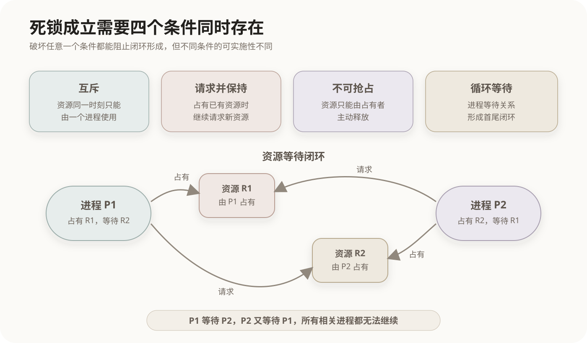

# 进程死锁与资源分配

## 1. 死锁的形成

多个进程竞争有限资源时，如果每个进程都占有一部分资源，并等待其他进程释放资源，就可能形成永久等待。只要没有外部干预，相关进程便无法继续执行，这种状态称为**死锁**。

下面的资源等待关系已经构成闭环：



死锁需要同时具备四个必要条件：

| 必要条件 | 含义 |
|---|---|
| 互斥 | 一个不可共享资源同一时刻只能由一个进程使用 |
| 请求并保持 | 进程保持已经获得的资源，同时继续请求其他资源 |
| 不可抢占 | 已分配的资源不能被系统强制收回，只能由占有者主动释放 |
| 循环等待 | 存在进程等待环，每个进程都在等待环中下一个进程占有的资源 |

四个条件是**同时成立才可能死锁**，不是其中任意一个单独出现就会死锁。循环等待通常是结果最直观的表现，但它的形成还依赖前面三个条件。

## 2. 处理死锁的四类策略

操作系统对死锁有四种主要处理思路：

```text
死锁处理
├── 预防：预先制定资源分配规则，破坏必要条件
├── 避免：每次分配前检查，保证系统仍处于安全状态
├── 检测与解除：允许死锁发生，检测后再终止、抢占或回滚
└── 忽略：不专门处理，由应用或人工恢复
```

这四类方法介入的时间不同。预防改变长期有效的分配制度；避免针对每一次资源请求进行判断；检测与解除在资源分配后处理已经发生的死锁。

## 3. 死锁预防

死锁预防不需要预测未来请求，而是制定限制较强的资源分配规则，使四个必要条件中至少一个不能成立。

### 3.1 降低互斥资源的范围

只读文件等资源可以由多个进程共享，不必使用互斥方式。某些独占设备也可以通过缓冲、排队或假脱机技术减少进程直接占有设备的时间。

但打印机、互斥锁等资源在特定使用阶段具有不可消除的独占要求，因此**取消互斥不是教材中普遍适用的死锁预防策略**。考试中要区分两层含义：从逻辑上破坏任何必要条件都能阻止死锁；从操作系统的通用实现方法看，通常重点讨论后面三种可实施策略。

### 3.2 破坏请求并保持

常见规则有两种：

- 进程开始运行前一次性申请所需的全部资源；
- 进程申请新资源前，先释放已经占有的资源。

这样进程不会在占有资源的同时等待新资源。代价是资源可能长时间闲置，资源利用率降低，而且需要大量资源的进程可能长期无法开始。

### 3.3 破坏不可抢占

进程申请新资源而暂时得不到满足时，系统要求它释放已经占有的资源，之后再重新申请。该策略适合能够保存状态并恢复的资源，不适合强行中断后无法自然恢复的设备操作。

### 3.4 破坏循环等待

系统为全部资源类型规定统一编号，并要求进程只能按照编号递增的顺序申请资源。例如规定 `R1 < R2 < R3` 后，已经获得 `R2` 的进程不能再反向申请 `R1`，资源等待关系便无法形成闭环。

这种方法规则清晰，但固定顺序可能与程序实际使用资源的顺序不一致，导致额外等待或资源利用率下降。

## 4. 死锁避免与安全状态

死锁避免允许四个必要条件存在，但系统在同意一次资源请求之前，会判断分配后的状态是否仍然安全。

**安全状态**是指系统至少存在一种进程完成顺序，使每个进程都能依次获得其尚需资源、运行结束并释放资源。这个完成顺序称为**安全序列**。

安全状态不会发生死锁；不安全状态表示系统已经失去安全序列，未来可能死锁，但**不等于当前已经死锁**。

### 银行家算法

银行家算法适用于每类资源可能有多个实例的情况。它维护四组核心数据：

| 数据 | 含义 |
|---|---|
| `Available` | 当前各类可用资源数量 |
| `Max` | 每个进程声明的各类资源最大需求量 |
| `Allocation` | 已经分配给每个进程的资源数量 |
| `Need` | 每个进程完成前还需要的资源数量 |

其中：

```text
Need = Max - Allocation
```

收到请求后，系统先检查请求是否超过该进程的 `Need` 和当前 `Available`，再假设完成分配并执行安全性检查。只有仍能找到安全序列，才正式批准请求；否则让进程等待。

## 5. 死锁检测与解除

检测策略不限制每次资源申请，因此资源利用较灵活，但系统必须定期检查等待关系。

- 每类资源只有一个实例时，可以使用等待图；图中出现环，表示存在死锁。
- 每类资源有多个实例时，需要结合可用资源、已有分配和未满足请求执行类似安全性检查的检测算法，不能只凭资源分配图中出现环就直接判定。

检测到死锁后，常用解除方法包括：

1. 终止全部死锁进程；
2. 按代价逐个终止进程，直到等待环消失；
3. 抢占部分资源并分配给其他进程；
4. 将进程回滚到较早的安全状态后重新执行。

选择牺牲进程时，可考虑进程优先级、已运行时间、剩余工作量、占有资源数量以及回滚成本。资源抢占还要避免同一进程反复被选中而产生饥饿。

## 6. 预防、避免与检测的区别

| 方法 | 核心依据 | 是否检查未来安全性 | 主要代价 |
|---|---|---:|---|
| 死锁预防 | 固定规则破坏必要条件 | 否 | 限制严格，资源利用率可能较低 |
| 死锁避免 | 保持安全状态 | 是 | 必须预先知道最大需求，并反复计算 |
| 死锁检测与解除 | 检测实际等待关系 | 否 | 死锁发生后存在终止、抢占或回滚损失 |

银行家算法属于死锁避免，不属于死锁预防；资源有序分配属于死锁预防，不需要寻找安全序列。

## 7. 常见概念边界

- **死锁与饥饿**：死锁中的进程形成相互等待；饥饿是某个进程长期得不到资源或调度机会，其他进程仍可继续运行。
- **死锁与活锁**：死锁进程不再推进；活锁进程仍在改变状态，但反复避让而无法完成有效工作。
- **循环等待与等待图成环**：单实例资源下，等待图成环可以判定死锁；多实例资源下，仅观察资源分配图中的环通常只能说明可能死锁。

## 核心关系

```text
四个必要条件同时成立
        ↓
可能形成死锁

预防：让至少一个必要条件不能成立
避免：每次分配后仍保留安全序列
检测：允许分配，事后查找实际死锁
解除：终止、抢占或回滚相关进程
```

