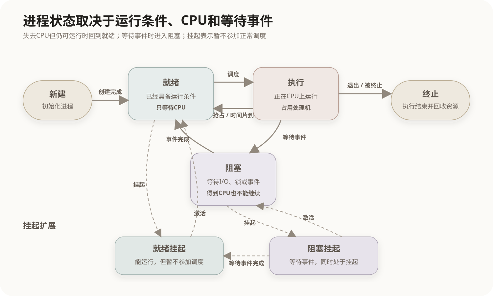

# 进程状态与调度转换

## 1. 进程状态的含义

进程是程序的一次运行活动。程序代码本身是静态文件，进程还包括当前指令位置、寄存器值、内存空间、打开的文件以及操作系统为其维护的管理信息。

进程状态表示进程当前是否具备运行条件、是否正在占用CPU，以及是否需要等待某个事件。操作系统根据状态把进程放入不同队列，并由调度器决定何时分配CPU。

## 2. 五状态模型

三状态模型只包含就绪、执行和阻塞。完整描述进程从创建到结束时，通常再加入新建和终止，形成五状态模型。



| 状态 | 含义 | 能否立即使用CPU继续运行 |
|---|---|---:|
| 新建 | 操作系统正在创建进程和初始化进程控制块 | 否 |
| 就绪 | 运行所需条件已经具备，只等待CPU | 是 |
| 执行 | 当前正在CPU上运行 | 已经占用CPU |
| 阻塞 | 正在等待I/O、锁、信号量或其他事件 | 否 |
| 终止 | 进程执行完毕或被终止，等待系统回收资源 | 否 |

判断就绪和阻塞的关键不在于“当前有没有CPU”，而在于：如果现在分配CPU，进程能不能继续执行。

```text
能够继续运行，只缺CPU    → 就绪
即使得到CPU也必须等待    → 阻塞
```

## 3. 基本状态转换

### 3.1 新建到就绪

操作系统完成进程控制块、地址空间和必要资源的初始化，并允许进程参加调度后，进程进入就绪队列。

### 3.2 就绪到执行

处理机调度器从就绪队列中选出一个进程，将CPU分配给它。操作系统恢复该进程的寄存器、程序计数器等现场，使其继续执行。这个过程称为调度或派遣。

### 3.3 执行到就绪

正在运行的进程因为调度原因失去CPU，但仍然具备运行条件时，返回就绪队列。常见原因包括：

- 时间片用完；
- 更高优先级的进程进入就绪队列并发生抢占；
- 操作系统因调度策略重新分配CPU。

这类转换没有等待I/O或资源，因此不会进入阻塞状态。

### 3.4 执行到阻塞

进程执行过程中需要等待某个尚未发生的事件时，主动或被迫停止执行并进入相应等待队列。例如：

- 发出磁盘或网络I/O请求并等待完成；
- 等待互斥锁、信号量或条件变量；
- 等待定时器到期；
- 等待其他进程提供数据。

CPU空闲不能消除这类等待。操作系统会调度其他就绪进程运行。

### 3.5 阻塞到就绪

等待的事件发生后，操作系统唤醒进程，并把它移入就绪队列。例如I/O完成、锁被释放或定时器到期。

进程被唤醒通常不会直接进入执行态，因为它仍需要与其他就绪进程竞争CPU。标准状态转换是：

```text
阻塞 → 就绪 → 执行
```

### 3.6 执行到终止

进程正常执行完毕、主动退出、发生无法处理的异常或者被操作系统终止后，进入终止状态。系统随后回收其内存、文件描述符和其他资源。

## 4. 抢占式与非抢占式调度

执行态能否被系统强制转换为就绪态，与调度方式有关。

| 调度方式 | CPU释放方式 | 常见触发条件 |
|---|---|---|
| 抢占式调度 | 操作系统可以中断当前进程并收回CPU | 时间片到期、更高优先级任务到达 |
| 非抢占式调度 | 进程通常运行到主动阻塞、退出或主动让出CPU | I/O等待、进程结束、主动让权 |

优先级调度不必然是抢占式。只有题目明确说明高优先级进程到达后能够立即夺取CPU，才表示采用抢占式优先级调度。

## 5. 睡眠、唤醒与阻塞

“睡眠”通常表示进程或线程主动等待一段时间或某个条件。在基础状态模型中，它通常表现为阻塞，而不是与就绪、执行、阻塞并列的独立基本状态。

```text
执行sleep、等待条件或等待事件
            ↓
          阻塞
            ↓ 时间到期或条件满足
          就绪
```

具体操作系统可能使用“可中断睡眠”“不可中断睡眠”等更细的内部状态名称，但软考中的基础状态转换题通常按照就绪、执行和阻塞判断。

## 6. 挂起状态

挂起表示进程暂时不参加正常的处理机调度。传统教材中，挂起还常与进程部分或全部换出主存联系在一起。挂起描述的是“是否保持活动”，阻塞描述的是“是否在等待事件”，两者不是同一维度。

因此，挂起可以与原有状态组合：

| 扩展状态 | 含义 |
|---|---|
| 就绪挂起 | 已具备运行条件，但处于挂起状态，暂不参加正常调度 |
| 阻塞挂起 | 正在等待事件，同时又被挂起 |

阻塞挂起进程等待的事件完成后，通常转为就绪挂起；它仍需被激活或换入，才能回到普通就绪状态。

常见挂起原因包括：

- 内存压力下暂时换出进程；
- 用户或管理员暂停进程；
- 调试器暂停被调试进程；
- 父进程或操作系统进行进程控制。

时间片用完和被高优先级进程抢占只改变CPU分配，不会自动造成挂起。

## 7. 状态与队列

操作系统通常使用队列管理不同状态的进程：

```text
就绪队列：所有已经具备运行条件、正在等待CPU的进程
I/O等待队列：等待某个设备完成操作的进程
同步等待队列：等待锁、信号量或条件变量的进程
```

一个阻塞进程不是笼统地等待“系统”，而是挂在与特定事件或资源对应的等待队列上。事件发生后，操作系统将相关进程移回就绪队列。

上下文切换是CPU从一个进程转向另一个进程时保存和恢复运行现场的过程。发生状态转换时可能伴随上下文切换，但二者不是同义词。例如进程从阻塞态被唤醒到就绪态时，不一定立即获得CPU，也不一定立即引发CPU切换。

## 8. 常见状态转换辨析

| 场景 | 原状态 | 目标状态 | 判断依据 |
|---|---|---|---|
| 时间片用完 | 执行 | 就绪 | 仍可运行，只是CPU被收回 |
| 被更高优先级进程抢占 | 执行 | 就绪 | 调度原因导致失去CPU |
| 请求磁盘读取并等待 | 执行 | 阻塞 | 必须等待I/O完成 |
| 磁盘读取完成 | 阻塞 | 就绪 | 等待条件消失，重新竞争CPU |
| 调度器选中进程 | 就绪 | 执行 | 获得CPU |
| 调用定时睡眠 | 执行 | 阻塞 | 等待定时器到期 |
| 用户暂停进程 | 就绪或阻塞 | 相应挂起状态 | 暂时退出正常活动集合 |
| 程序执行结束 | 执行 | 终止 | 不再继续运行 |

## 核心关系

```text
调度器分配CPU：就绪 → 执行
被抢占或时间片用完：执行 → 就绪
等待I/O、锁或事件：执行 → 阻塞
等待事件完成：阻塞 → 就绪

就绪：只缺CPU
阻塞：缺少事件或资源条件
挂起：暂不参加正常调度
睡眠：通常是阻塞的一种表现
```
