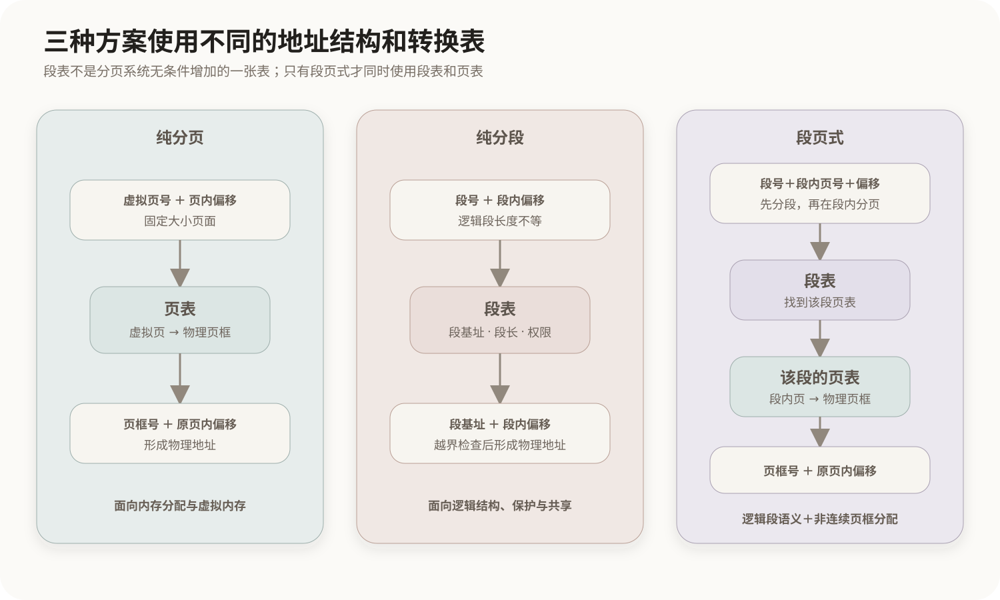

# 分段与段页式存储管理

## 1. 分页、分段与段页式的关系

分页、分段和段页式是三种不同的地址空间组织与转换方案。页表不是所有方案都必须使用的唯一地址转换结构：纯分页查页表，纯分段查段表，段页式先查段表再查该段的页表。



```text
纯分页：虚拟页号 + 页内偏移 → 页表 → 物理页框
纯分段：段号 + 段内偏移 → 段表 → 段基址
段页式：段号 + 段内页号 + 页内偏移 → 段表 → 页表 → 物理页框
```

三种方案不是同一系统中无条件叠加的三张表，而是不同的设计选择。只有采用段页式时，地址转换才同时需要段表和页表。

## 2. 分段的逻辑结构

分段按照程序员或编译、链接系统看到的逻辑单元划分地址空间，例如代码、数据、共享模块、堆和栈。不同逻辑单元包含的内容不同，因此各段长度不要求相等。

```text
进程逻辑地址空间
├── 代码段：18 KB
├── 数据段：7 KB
├── 共享模块段：12 KB
├── 堆段：当前25 KB
└── 栈段：当前3 KB
```

段长可以因内容和运行需要发生变化。例如堆或栈可能增长，动态装入也可能改变相关逻辑区域。并非每个段都会持续变化：代码段在一次运行中通常相对稳定。教材所说“段长可动态变化”，强调的是分段机制不要求所有段具有固定、统一的长度。

纯分段为每个段分配一块连续物理空间。段与段之间可以分散放置，但一个段内部通常连续，因此长期分配和回收不同长度的段会形成外部碎片，必要时可能需要紧缩或重新安置。

## 3. 段表与地址转换

纯分段逻辑地址由段号和段内偏移组成：

```text
逻辑地址 = (段号 s，段内偏移 d)
```

每个进程有自己的段表。典型段表项包含：

| 字段 | 作用 |
|---|---|
| 段基址 | 该段在物理内存中的起始地址 |
| 段长或界限 | 检查段内偏移是否越界 |
| 访问权限 | 控制该段能否读取、写入或执行 |
| 状态信息 | 记录该段是否存在、是否共享等实现相关状态 |

访问 `(s, d)` 时：

1. 用段号`s`找到段表项；
2. 检查段号和访问权限是否合法；
3. 检查`d < 段长`；
4. 合法时计算`物理地址 = 段基址 + d`；
5. 越界或权限不符时产生异常。

例如某段基址为12000、段长为3000：

```text
偏移2500：2500 < 3000，物理地址 = 12000 + 2500 = 14500
偏移3500：3500 ≥ 3000，越过段界限，访问非法
```

段表中的段长既用于地址保护，也允许各段拥有不同范围。段合法扩展后，操作系统需要为其安排空间并更新相应描述信息。

## 4. 页表与段表的职责差异

页表和段表并不是对同一信息的重复记录。

| 结构 | 管理单位 | 主要回答的问题 |
|---|---|---|
| 页表 | 固定大小的虚拟页 | 这一页映射到哪个物理页框，是否在主存，是否被访问或修改 |
| 段表 | 长度不同的逻辑段 | 这一段从哪里开始、有多长、具有什么权限 |

分页的核心目标是方便物理内存分配和虚拟内存管理；分段的核心目标是保留程序的逻辑边界，并按完整逻辑单元进行保护和共享。

## 5. 段页式存储管理

段页式先按照逻辑结构分段，再把每个段切成固定大小的页面。它试图同时保留段的逻辑含义和分页的非连续物理分配能力。

逻辑地址通常分为三部分：

```text
段号 s + 段内页号 p + 页内偏移 d
```

地址转换过程为：

1. 根据段号查段表；
2. 检查段是否存在、权限是否合法，并找到该段页表的位置；
3. 根据段内页号查该段页表；
4. 找到物理页框号；
5. 由`页框号 + 原页内偏移`组成物理地址。

段页式中的段表项不再只需要指向一块连续物理区域，而是通常指向该段对应的页表并保存段级控制信息。每个段可以拥有自己的页表。

段页式减少了纯分段要求整段连续存放造成的外部碎片，但地址转换层次更多，表结构和管理也更复杂。TLB可以缓存近期地址转换，以降低多次查表的开销。

## 6. 三种方案的对比

| 维度 | 分页 | 分段 | 段页式 |
|---|---|---|---|
| 划分依据 | 内存管理需要 | 程序逻辑结构 | 先按逻辑分段，再在段内分页 |
| 区块大小 | 页面固定且等长 | 段长不等，可按需要变化 | 段长不等，段内页面等长 |
| 地址组成 | 页号＋页内偏移 | 段号＋段内偏移 | 段号＋段内页号＋页内偏移 |
| 转换结构 | 页表 | 段表 | 段表＋各段页表 |
| 物理连续性 | 页面可分散到不同页框 | 一个段通常需要连续空间 | 各页可分散到不同页框 |
| 主要碎片 | 内部碎片 | 外部碎片 | 页面内部碎片 |
| 保护和共享 | 以页为单位 | 以完整逻辑段为单位 | 段级语义与页级映射结合 |

## 7. 分段机制的实际使用

纯分段曾用于具有硬件分段支持的体系结构和操作系统。经典x86保护模式使用段选择子查GDT或LDT中的段描述符，取得段基址、界限和权限，并形成线性地址：

```text
段选择子 + 段内偏移
        ↓ 查段描述符
线性地址 = 段基址 + 段内偏移
```

如果同时启用分页，线性地址还要继续经过页表转换成物理地址：

```text
程序地址 → 分段机制 → 线性地址 → 分页机制 → 物理地址
```

现代Windows、Linux等通用操作系统的虚拟内存管理核心主要是分页。在现代64位x86环境中，传统通用分段的作用已明显弱化，系统通常使用近似平坦的线性地址空间，再依靠多级页表完成主要映射和保护；某些段寄存器仍可承担线程局部存储等特殊用途。

因此，现代系统中看到“代码段、数据段、堆、栈”，不代表地址转换一定采用纯分段或必须查询教材意义上的段表。

## 8. “段”的多种含义

同一个“段”字在不同领域中表示不同对象：

| 名称 | 实际含义 | 是否必然查硬件段表 |
|---|---|---:|
| 分段存储中的段 | 地址转换和保护的逻辑单位 | 是 |
| 可执行文件中的段或装载区域 | 文件内容及装载属性的组织 | 否 |
| 进程中的代码、数据、堆、栈区域 | 虚拟地址空间中的逻辑区域 | 否 |
| TCP报文段 | TCP协议数据单元 | 否 |
| 数据库段 | 数据库内部存储组织 | 否 |

现代进程仍有代码、数据、堆、栈和共享库映射区，但这些区域通常由页面组成，最终由页表映射到物理页框。逻辑区域仍然存在，不等于传统硬件分段仍是主要内存管理机制。

## 核心关系

```text
纯分页：查页表
纯分段：查段表
段页式：先查段表，再查该段页表

页：固定大小，面向物理内存和虚拟内存管理
段：长度不等，面向程序逻辑、保护和共享

现代通用操作系统：
代码、数据、堆、栈等逻辑区域仍然存在，
但主要通过分页机制映射到物理内存。
```

相关章节：[分页存储管理与虚拟内存](02-分页存储管理基础.md)。

