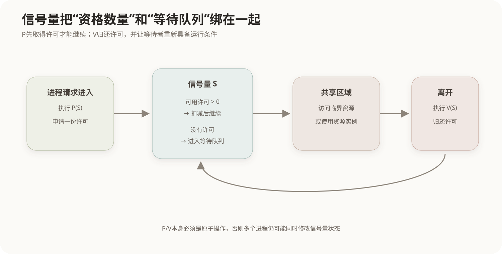
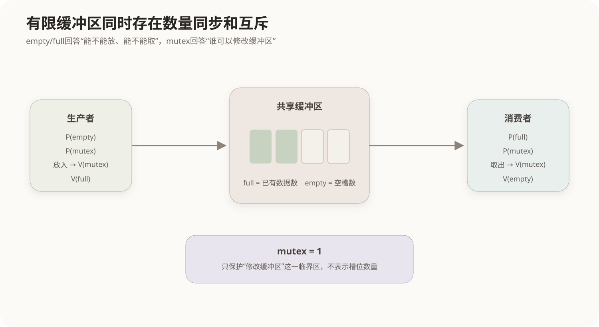

# PV操作与进程同步

## 1. 为什么并发进程需要同步

多个进程或线程并发执行时，CPU可以在它们之间切换，也可以在多核处理器上真正同时执行。只要彼此完全独立，这并不会产生问题；麻烦出现在它们**访问同一份可变状态**或者**一个操作必须等待另一个操作完成**时。

假设两个线程同时执行：

```text
counter = counter + 1
```

这句高级语言代码通常不是一个不可分割动作，而会经历“读取旧值 → 加1 → 写回”。若两个线程都先读到10，再各自写回11，最终结果就是11而不是12。这种结果依赖执行交错顺序的现象称为**竞态条件**。

解决并发问题首先要区分两个目标：

- **互斥**：某段时间只能有一个执行者进入关键区域，防止同时修改共享资源；
- **同步**：不同执行者之间存在先后约束，例如消费者必须等生产者产生数据后才能继续。

PV操作和信号量可以同时表达这两类关系。

## 2. 临界资源与临界区

一次只能由一个进程安全使用的共享资源称为**临界资源**，例如某些共享数据结构、设备或不可重入状态。程序中访问临界资源的代码段称为**临界区**。

经典结构是：

```text
进入区：申请进入临界区的资格
临界区：访问共享资源
退出区：释放资格
剩余区：执行与共享资源无关的代码
```

正确的互斥方案希望满足：

1. 同一时刻不允许多个进程同时进入同一临界区；
2. 临界区空闲时，应允许有需要的进程进入；
3. 等待不应无限持续而导致某个进程永久饥饿；
4. 不依赖某个进程永远以固定速度执行。

信号量就是操作系统用来表达“还剩多少资格、谁需要等待”的一种抽象。

## 3. 信号量的物理含义

信号量（Semaphore）本质上是一个由操作系统以原子方式维护的同步对象。可以把它理解为一组**可用许可**以及等待这些许可的进程队列。



### 3.1 P操作

P操作也常记作`wait`或`down`。它尝试取得一个许可：

```text
P(S)
```

逻辑含义是：

```text
如果存在可用许可
    取得一个许可并继续
否则
    当前进程进入等待状态
```

一些教材用经典Dijkstra定义写成`S = S - 1`，若结果小于0则阻塞；另一些现代接口直接把信号量视为“非负计数 + 等待队列”。两种表述的实现细节不同，但对使用者的核心语义相同：**P要先拿到资源或通行资格，没有就等待。**

### 3.2 V操作

V操作也常记作`signal`或`up`。它归还一个许可：

```text
V(S)
```

如果已经有进程在等待，系统会让其中一个等待者重新具备运行条件；否则可用许可数量增加。

关键点是P和V本身必须由系统保证为**原子操作**。如果“检查信号量”和“修改信号量”还能被其他进程插入，就会再次产生竞态，信号量也失去意义。

## 4. 二值信号量与计数信号量

### 4.1 二值信号量

二值信号量只有“可用/不可用”两种状态，适合表示一份独占资源：

```text
mutex = 1

P(mutex)
    临界区
V(mutex)
```

第一个进程通过P取得资格后，其他进程只能等待；退出时V释放资格。

### 4.2 计数信号量

计数信号量可以表示多个同类资源。例如系统有3个完全等价的连接槽：

```text
slots = 3
```

前三个进程执行`P(slots)`都可以继续，第4个必须等前面的某个进程执行`V(slots)`归还一个槽位。

因此：

```text
二值信号量：表达“一次只允许一个”
计数信号量：表达“总共有N份同类资源”
```

## 5. 同步关系与前趋关系

互斥解决“不能同时”，同步解决“必须先后”。如果任务B必须等任务A完成，可以设置一个初值为0的信号量：

```text
S = 0

进程A：
    执行A
    V(S)

进程B：
    P(S)
    执行B
```

B若先运行，会在`P(S)`处等待；A完成后执行`V(S)`，B才能继续。

这个结构可以直接表达前趋图中的边：

```text
A → B
```

如果一个节点要等待两个前驱都完成，就不能只用一个简单的二值通知混在一起，而应分别记录两个完成条件，或者使用能准确计数的同步机制。设计同步关系时，关键不是机械地数P和V，而是先把**谁必须等谁**画清楚。

## 6. 生产者—消费者为什么需要三个信号量

生产者和消费者共享一个有限缓冲区：生产者向里面放数据，消费者从里面取数据。这里同时存在三种约束：

1. 缓冲区还有没有空位置；
2. 缓冲区有没有可取的数据；
3. 修改缓冲区结构时不能多人同时操作。

因此常用：

```text
empty = N     // 空槽数量
full  = 0     // 已有数据数量
mutex = 1     // 缓冲区互斥锁
```



生产者：

```text
P(empty)      // 先确认有空位
P(mutex)      // 再独占缓冲区
放入数据
V(mutex)
V(full)       // 告诉消费者多了一份数据
```

消费者：

```text
P(full)       // 先确认有数据
P(mutex)      // 再独占缓冲区
取出数据
V(mutex)
V(empty)      // 告诉生产者多了一个空位
```

`empty`与`full`表达资源数量，是同步关系；`mutex`保护共享缓冲区，是互斥关系。三者不能互相替代。

## 7. P操作顺序为什么可能造成死锁

如果先取得互斥锁，再去等待另一个长期不可用的条件，就可能把别人完成该条件所需要的共享资源也锁住。

例如生产者错误地写成：

```text
P(mutex)
P(empty)
```

当缓冲区已经满了，生产者先拿到`mutex`，随后在`empty`上等待；消费者虽然能够消费数据，却也需要`mutex`才能进入缓冲区，于是双方互相等待。

因此有限缓冲区中常见的顺序是：

```text
先等待“资源条件”
再取得“临界区互斥锁”
```

但不能把这句话当成所有并发程序的万能规则。更一般的判断方法是结合[进程死锁与资源分配](04-进程死锁与资源分配.md)：检查多个锁和资源之间是否形成“占有一个、等待另一个”的循环等待关系。

## 8. 信号量与互斥锁的边界

互斥锁通常专门表示某段共享状态的所有权，谁加锁通常由谁解锁。信号量更一般，它表达的是许可数量或事件通知，执行V的一方不一定是执行P的一方。

例如前面的`A → B`同步关系中，A执行V、B执行P，这显然不是“B拿了一把由B自己归还的锁”。

因此：

| 机制 | 更适合表达 |
|---|---|
| 互斥锁 | 对临界区的独占访问 |
| 二值信号量 | 互斥或一次事件通知 |
| 计数信号量 | N份同类资源、生产者消费者计数 |
| 条件变量等机制 | 等待某个受锁保护的状态条件改变 |

## 9. 核心关系

```text
并发访问共享状态
        ↓
可能产生竞态条件
        ↓
临界区需要互斥

进程之间存在先后依赖
        ↓
需要同步

信号量 = 原子维护的许可/事件计数 + 等待机制
P：取得许可，没有就等待
V：归还许可，并可能唤醒等待者

生产者消费者：
empty/full 负责数量同步
mutex      负责共享缓冲区互斥
```
