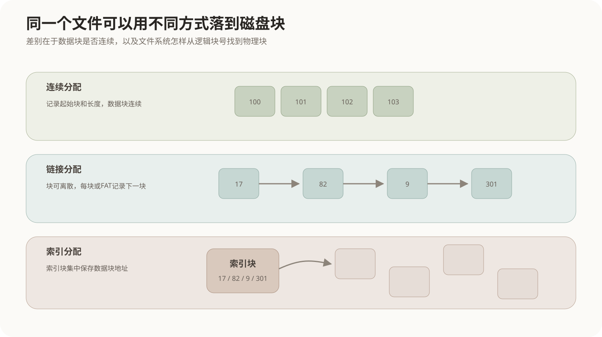
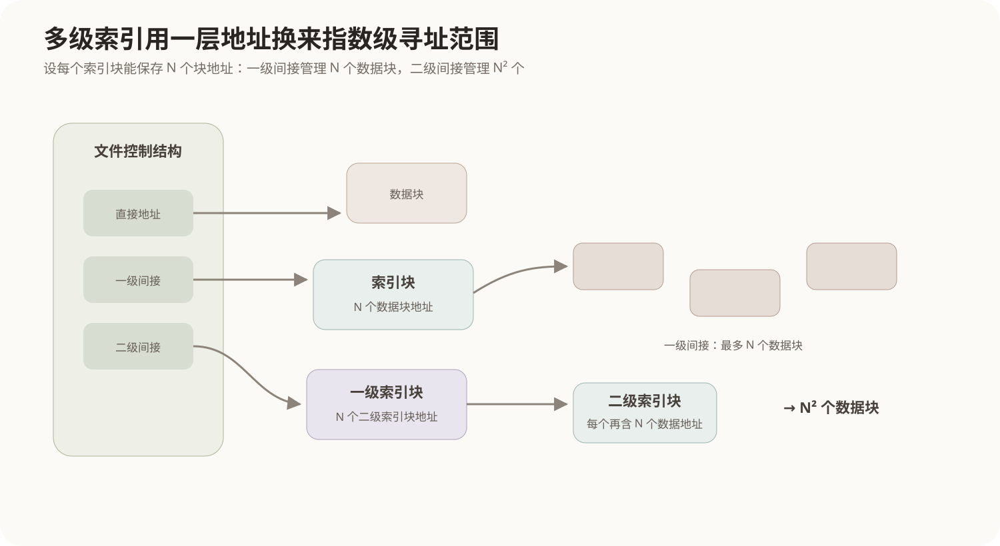

# 文件系统与索引文件

## 1. 文件系统解决的是“名字怎样落到磁盘块”

用户看到的是文件名、目录和文件内容，磁盘真正能够读写的却是一块一块的物理或逻辑块。文件系统位于两者之间，负责回答：

- 文件的名字和属性保存在哪里；
- 一个文件包含哪些数据块；
- 第`k`个逻辑块究竟对应磁盘上的哪一块；
- 文件变大或删除时怎样分配和回收空间；
- 多个目录和用户怎样组织、保护和共享文件。

因此文件系统不是简单的“文件夹管理器”，而是一套把**文件逻辑结构、目录命名、元数据和磁盘空间分配**连接起来的机制。

## 2. 文件的逻辑结构与访问方式

应用程序通常不应该关心文件第一个字节位于磁盘哪个扇区。它看到的是文件内部的逻辑记录或字节序列，再通过文件系统进行访问。

常见访问方式有：

### 2.1 顺序访问

从前到后依次读写，适合日志、文本流、顺序处理的数据：

```text
记录0 → 记录1 → 记录2 → 记录3 → ...
```

### 2.2 直接访问

可以直接定位到某个逻辑块或记录，例如数据库文件按页号访问。实现直接访问的前提是文件系统能够把“逻辑块号”较快地转换成对应的磁盘块。

### 2.3 索引访问

另外维护索引结构，根据键值或逻辑位置找到数据位置。这里要区分两个容易混在一起的“索引”：

- **文件内容层的索引**：例如数据库B+树根据键找到记录；
- **文件系统层的索引分配**：索引块根据文件逻辑块号找到磁盘块号。

本章重点是后者。

## 3. 文件占用磁盘空间的三种典型分配方式

文件必须最终落到若干磁盘块上。最经典的组织方式是连续分配、链接分配和索引分配。



### 3.1 连续分配

文件占用一段连续磁盘块，只需记录：

```text
起始块号 + 文件长度
```

若文件从100号块开始，占4块，则逻辑块0～3直接对应100～103。

优点：

- 顺序访问快；
- 随机访问也容易，地址可直接计算；
- 元数据简单。

问题：

- 文件增长时后面可能已经被其他文件占用；
- 长期分配与删除可能形成外部碎片；
- 可能需要预留过多空间或移动文件。

### 3.2 链接分配

文件块可以分散在磁盘任意位置，每个块记录下一个块的位置：

```text
17 → 82 → 9 → 301 → ...
```

优点是文件容易增长，不要求连续空间；缺点是访问第`k`块通常要沿链走过前面的块，随机访问较差，而且指针本身也占空间。

FAT一类设计把“下一个块号”的链表信息集中放进文件分配表，而不是分散写在每个数据块内部，本质上仍属于链接思想。

### 3.3 索引分配

为文件建立一个索引块，里面集中保存该文件各数据块的地址：

```text
索引项0 → 文件逻辑块0所在磁盘块
索引项1 → 文件逻辑块1所在磁盘块
...
```

这样数据块可以离散放置，同时又能够根据逻辑块号直接查询索引项，兼顾文件增长和随机访问。

代价是索引结构本身也占磁盘块；文件很小时索引块可能利用率低，文件很大时一个索引块又可能装不下全部地址。

## 4. 一个索引块能管理多大的文件

这是索引文件最核心的计算关系。

假设：

```text
磁盘块大小 = B 字节
每个磁盘块地址占 A 字节
```

那么一个索引块能保存的地址数量为：

```text
N = B / A
```

若每个地址直接指向一个数据块，则单级索引最多表示：

```text
N 个数据块
最大数据量 = N × B 字节
```

例如块大小4KB，每个块号占4Byte：

```text
一个索引块可放 = 4096 / 4 = 1024 个块号
可直接索引的数据 = 1024 × 4KB = 4MB
```

关键是不要把“索引块的4KB”直接当成文件数据；索引块里装的是**地址**，每个地址又指向一个完整数据块。

## 5. 多级索引为什么能迅速扩大寻址范围

如果一个索引块不够，可以让某个索引项不直接指向数据块，而是再指向另一个索引块。这就形成多级索引。



仍假设一个索引块可保存`N`个地址：

```text
直接索引：      1个地址 → 1个数据块
一级间接索引：  1个地址 → 1个索引块 → N个数据块
二级间接索引：  1个地址 → N个索引块 → N²个数据块
三级间接索引：  1个地址 → N³个数据块
```

如果一个文件控制块中有若干直接地址、一个一级间接地址和一个二级间接地址，则最大文件块数可以写成：

```text
直接地址个数
+ N
+ N²
```

再乘磁盘块大小即可得到最大文件字节数。

这种“直接 + 多级间接”的思想让小文件只使用简单地址，大文件才逐层增加索引开销。Unix inode是这种思想的典型实现之一，但具体直接地址数量取决于文件系统实现，不应把某个数字当成所有系统的固定规定。

## 6. 目录为什么不等于文件内容

目录的主要任务是把**名字**映射到文件的元数据或文件控制结构。文件控制信息通常包含：

- 文件类型和权限；
- 文件大小；
- 时间信息；
- 文件数据块或索引结构的位置；
- 所有者及其他管理信息。

因此打开路径：

```text
/docs/report.txt
```

大致经历：

```text
根目录找到 docs
→ docs目录找到 report.txt 对应的文件控制信息
→ 根据其中的块地址或索引结构找到文件数据
```

目录结构解决“名字和层次”，索引分配解决“文件逻辑块到磁盘块”，二者是不同层次的问题。

## 7. 空闲空间管理与文件分配的关系

当文件需要新增一个数据块时，文件系统还必须知道磁盘上哪些块空闲。常见方法包括位示图、空闲块链表和成组链接等。

这一部分与[磁盘结构与空闲空间管理](07-磁盘结构与空闲空间管理.md)直接相连：

```text
文件分配方法：一个文件已经占了哪些块
空闲空间管理：整个磁盘还有哪些块没被任何文件使用
```

两者共同维护磁盘块状态，但职责不能混淆。

## 8. 连续、链接、索引怎样选择

| 方式 | 随机访问 | 文件增长 | 空间问题 | 主要额外开销 |
|---|---|---|---|---|
| 连续分配 | 很好 | 较困难 | 外部碎片、预留问题 | 很少 |
| 链接分配 | 较差 | 容易 | 数据块可离散 | 每块指针或FAT表 |
| 索引分配 | 较好 | 容易 | 数据块可离散 | 索引块 |

三种方式没有脱离场景的绝对优劣。连续分配用空间连续性换取简单高效的访问；链接分配用链式结构换取灵活增长；索引分配则用额外索引空间换取离散存放下的直接定位能力。

## 9. 核心关系

```text
路径名
  ↓ 目录查找
文件控制信息 / 元数据
  ↓
文件逻辑块号
  ↓ 分配结构转换
磁盘块号
  ↓
实际数据

连续分配：起始块 + 偏移
链接分配：沿块链找到目标
索引分配：逻辑块号 → 索引项 → 数据块号

一个索引块可放的地址数 N = 块大小 / 地址大小
一级间接可指向 N 个数据块
二级间接可指向 N² 个数据块
```
