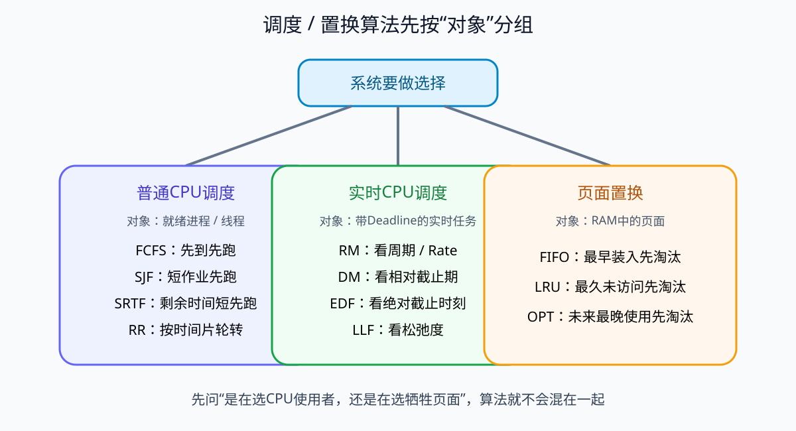
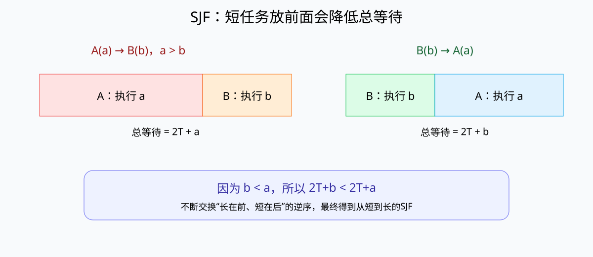

# 处理机调度算法

## 1. 调度器在决定什么

多个进程或线程处于就绪状态时，它们都已经具备继续运行的条件，但CPU核心数量有限。操作系统调度器必须决定：**下一段CPU时间交给谁。**

这与页面置换不同：

```text
处理机调度：多个就绪任务 → 谁先拿CPU
页面置换：缺页且页框已满 → 踢掉哪个页面
```



常见评价指标包括等待时间、周转时间、响应时间、吞吐量和公平性。不同算法优化的目标不同，没有一个算法在所有目标上都绝对最好。

## 2. FCFS：先来先服务

FCFS（First Come First Served）按照到达就绪队列的先后顺序运行。

```text
到达顺序：P1 → P2 → P3
执行顺序：P1 → P2 → P3
```

优点是简单、公平直观；缺点是若一个长作业排在前面，后面大量短作业会一起等待，形成“护航效应”。

FCFS与页面置换中的FIFO思想相似，但对象不同：

```text
FCFS：谁先到就绪队列，谁先获得CPU
FIFO页面置换：谁最早装入页框，谁先被淘汰
```

## 3. SJF：短作业优先

SJF（Shortest Job First）在当前可选作业中优先运行预计CPU执行时间最短的作业。

假设所有任务同时到达：

| 任务 | 运行时间 |
|---|---:|
| P1 | 10 |
| P2 | 2 |
| P3 | 5 |

SJF排序为：

```text
P2 → P3 → P1
```



## 4. 为什么SJF能使平均等待时间最小

这个结论有明确前提：

- 所有待比较任务已经同时到达；
- 每个任务的执行时间已知；
- 讨论非抢占式调度；
- 优化目标是平均等待时间。

用相邻交换可以证明。

假设两个相邻任务A、B开始前已经共同等待T，执行时间分别为：

```text
a > b
```

若长任务A在前：

```text
A等待 T
B等待 T + a
总等待 = 2T + a
```

若交换为短任务B在前：

```text
B等待 T
A等待 T + b
总等待 = 2T + b
```

因为 `b < a`，所以：

```text
2T + b < 2T + a
```

只要队列中存在“长任务排在短任务前”的逆序，把二者交换就会降低总等待时间。不断消除所有逆序，最终得到从短到长排列，也就是SJF。因此在上述前提下，SJF使平均等待时间最小。

## 5. SRTF：SJF的抢占版本

SRTF（Shortest Remaining Time First）比较的是**剩余运行时间**。如果一个新的短任务到达，而且它的执行时间比当前任务的剩余时间更短，可以抢占当前任务。

例如：

```text
t=0：A到达，需要10ms
A先运行

t=1：B到达，需要1ms
A还剩9ms，B只需1ms
→ 抢占A，先运行B
```

因此：

```text
SJF：看预计总运行时间，通常非抢占
SRTF：看剩余运行时间，可以抢占
```

## 6. RR：时间片轮转

RR（Round Robin）给每个就绪任务一个固定时间片：

```text
P1运行q → P2运行q → P3运行q → 再回P1
```

时间片用完而任务尚未结束，就返回就绪队列尾部。RR强调交互响应和公平性，常见于分时系统。

时间片过大时，RR逐渐接近FCFS；时间片过小时，上下文切换开销会明显增加。

## 7. 优先级调度

系统可以给任务设置优先级，优先运行高优先级任务。

### 静态优先级

优先级主要在任务创建或配置时确定，运行过程中基本不变。例如：

```text
P1 priority=10
P2 priority=5
P3 priority=1
```

若10最高，则P1优先。

### 动态优先级

优先级可以随等待时间、资源状态或截止时间等变化。例如长期等待的低优先级任务可以通过Aging逐渐提高优先级，避免饥饿。

## 8. 饥饿与Aging

SJF和高优先级优先都可能导致某些任务长期得不到CPU：

```text
一个长任务一直等待
短任务不断到来
→ 长任务可能持续被推迟
```

这种“系统整体仍在运行，但某个任务长期得不到服务”的现象叫**饥饿（Starvation）**。

Aging（老化）通过随着等待时间增加逐步提高任务优先级，降低永久饥饿风险。

## 9. 普通调度与实时调度的边界

普通调度主要关注平均性能、公平性和响应；实时调度主要关注截止时间。

| 普通/通用调度 | 实时调度 |
|---|---|
| FCFS | RM |
| SJF / SRTF | DM |
| RR | EDF |
| 优先级调度 | LLF |

实时调度详见[实时系统调度算法](03-实时系统调度算法.md)。实时任务仍然可以由进程或线程承载，区别是它们具有必须满足的时间约束。

## 10. 常见考查方式

- “所有进程同时到达，运行时间已知，平均等待时间尽量小” → SJF；
- “新短任务可以抢占当前长任务” → SRTF；
- “每个进程运行固定时间片并轮转” → RR；
- “按照到达顺序” → FCFS；
- “SJF在任何情况下都保证一切指标最优”错误；
- “SJF一定不会饥饿”错误。

## 核心关系

```text
FCFS：看谁先到
SJF：看谁总运行时间短
SRTF：看谁剩余运行时间短
RR：每人一个时间片轮流执行
Priority：看优先级

SJF平均等待时间最小的结论有前提：
同时到达 + 执行时间已知 + 非抢占 + 优化平均等待时间
```
