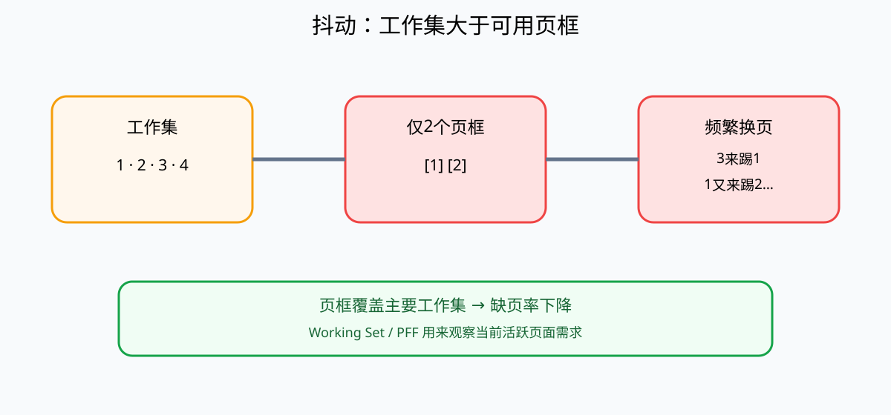

# 抖动、局部性与工作集

## 1. 缺页本身不是异常设计

请求分页允许进程只把当前需要的一部分页面放在RAM中。访问一个尚未驻留RAM但地址合法的页面时，CPU触发缺页异常，操作系统再从文件或交换区把页面装入物理页框。

正常情况下，缺页只是按需装入的一部分：

```text
访问页面
  ↓
页面在RAM？——是→继续执行
  │否
  ↓
缺页处理
  ↓
装入页面
  ↓
继续执行
```

真正的问题不是“发生过缺页”，而是**缺页频率高到系统大部分时间都在换页。**

## 2. 什么是抖动 Thrashing

抖动（Thrashing）是指进程获得的物理页框不足以容纳当前频繁使用的页面集合，导致页面刚被换出很快又要换回，系统不断进行缺页处理和磁盘I/O，真正执行有效指令的时间显著下降。



例如进程当前反复使用页面：

```text
1 → 2 → 3 → 4 → 1 → 2 → 3 → 4 ...
```

如果只分配2个页框：

```text
访问3 → 踢掉1
很快又访问1 → 踢掉2
很快又访问2 → 再踢页面
```

系统看起来很忙，但忙的是“换入、换出”，不是业务计算。

## 3. 抖动为什么会拖垮CPU利用率

缺页需要操作系统介入，还可能等待速度远慢于RAM的辅存I/O。大量进程同时抖动时会出现：

```text
缺页增加
→ 磁盘/SSD I/O增加
→ 进程大量等待I/O
→ CPU有效执行比例下降
→ 系统吞吐降低
```

某些系统若看到CPU利用率下降而继续增加多道程序数量，反而可能把更多进程的工作集挤入有限RAM，使抖动进一步恶化。

## 4. 局部性原理

程序在一段时间内往往集中访问有限区域，而不是均匀访问整个虚拟地址空间。

- **时间局部性**：刚访问过的数据/指令近期很可能再次访问；
- **空间局部性**：访问某个地址后，附近地址近期更可能被访问。

LRU、Cache和工作集思想都利用了局部性。

## 5. 工作集 Working Set

工作集可以理解为：**进程在最近一段时间窗口内实际活跃的一组页面。**

如果工作集大约需要5个页面，而系统只给2个页框，频繁置换很容易发生；如果给到足以覆盖主要工作集的页框，缺页率通常会显著下降。

工作集不是“进程所有虚拟页面”。大量代码和数据在某个运行阶段可能完全不活跃。

## 6. 页框分配与抖动的关系

操作系统需要在多个进程之间分配有限页框。常见思路包括：

- 固定分配：每个进程长期拿固定数量；
- 可变分配：根据行为动态调整；
- 局部置换：只从当前进程自己的页框中选择牺牲页；
- 全局置换：可以从其他进程占有的页框中选择牺牲页。

分配过少容易抖动；分配过多又会减少系统可同时驻留的进程数量，因此需要平衡。

## 7. PFF：按缺页频率调节

PFF（Page Fault Frequency，缺页频率）是一种动态判断思路：

```text
缺页率过高 → 说明页框可能不足 → 尝试增加页框
缺页率很低 → 可能分配过多 → 可以回收部分页框
```

它不要求精确记录整个工作集，而是通过缺页率间接观察内存压力。

## 8. 抖动、死锁、饥饿的区别

| 现象 | 核心问题 |
|---|---|
| 抖动 | 页面频繁换入换出，系统在做大量无效I/O |
| 死锁 | 多个执行者形成资源等待闭环，无法推进 |
| 饥饿 | 某个任务长期得不到CPU或资源，但其他任务仍在推进 |

抖动不是“没有任何资源”，也不是进程之间互相等待，而是**可用页框与当前活跃页面需求严重不匹配**。

## 9. 与页面置换算法的关系

FIFO、LRU、OPT回答的是：

> “缺页且没有空闲页框时，应该踢掉谁？”

抖动回答的是：

> “为什么整个系统会频繁陷入缺页和换页？”

即使使用合理的LRU近似算法，如果进程实际工作集远大于获得的页框数量，仍可能发生抖动。页面置换策略能影响缺页率，但不能凭空增加物理内存。

页面置换算法详见[分页存储管理与虚拟内存](02-分页存储管理基础.md)。

## 10. 常见考查方式

- “页框不足、频繁缺页、页面不断换入换出、CPU有效利用率下降” → Thrashing；
- “最近一段时间活跃页面集合” → Working Set；
- “根据缺页率高低动态增减页框” → PFF；
- “抖动等于死锁”错误；
- “只要采用LRU就绝不会抖动”错误。

## 核心关系

```text
局部性 → 程序阶段性集中访问一组页面
这组近期活跃页面 ≈ 工作集
页框足够覆盖工作集 → 缺页较少
页框严重不足 → 反复换入换出 → 抖动
```
