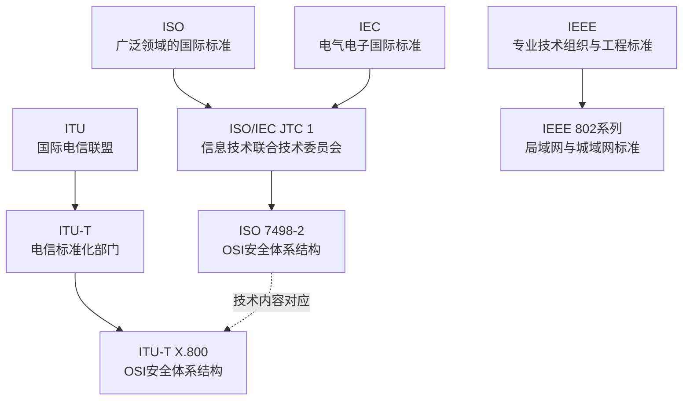

# 标准组织与OSI

## 标准组织与文件关系

## ISO

**英文全称：** International Organization for Standardization  
**中文名称：** 国际标准化组织

ISO负责广泛领域的国际标准化工作。ISO标准通常是自愿采用的；当法律法规、合同、采购要求或组织制度引用某项标准时，该标准可能在相应范围内成为必须满足的要求。

## IEC

**英文全称：** International Electrotechnical Commission  
**中文名称：** 国际电工委员会

IEC主要负责电气、电子及相关技术的国际标准，包括电气安全、电子元器件、工业自动化、电磁兼容、医疗电气设备和新能源设备等领域。

## ISO/IEC JTC 1

**英文全称：** ISO/IEC Joint Technical Committee 1  
**中文名称：** ISO/IEC第一联合技术委员会

ISO与IEC共同成立JTC 1，负责信息技术领域的国际标准化工作。因此，很多计算机和信息安全标准以“ISO/IEC”开头。

## ITU

**英文全称：** International Telecommunication Union  
**中文名称：** 国际电信联盟

ITU负责信息通信技术领域的国际协调和标准化。其标准化部门为ITU-T。

原CCITT后来成为ITU-T。OSI安全体系结构在ITU-T中的对应文件是X.800。

## IEEE

**英文全称：** Institute of Electrical and Electronics Engineers  
**中文名称：** 电气电子工程师学会

IEEE是专业技术组织，也制定大量工程技术标准。计算机网络领域常见的IEEE 802系列包括以太网、无线局域网等标准。

## OSI

**英文全称：** Open Systems Interconnection  
**中文名称：** 开放系统互连

OSI是描述不同系统之间网络通信功能如何分层、各层承担什么职责的参考模型。

需要注意：

- “开放”表示系统依据公开、共同的规则实现互连，不表示任何人都能无条件访问。
- OSI是参考模型，不等于当前互联网中所有设备实际采用的一整套强制协议。
- OSI本身不只讨论安全，也讨论连接、传输、寻址、路由、分段和重组等通信功能。

## ISO 7498-2:1989与X.800

ISO 7498-2:1989是OSI基本参考模型的安全体系结构部分，于1989年发布。

它主要说明：

- OSI环境中的安全服务；
- 与安全服务相关的安全机制；
- 安全服务和机制可以位于参考模型的哪些位置。

它是一套高层安全架构，不是具体系统的实现说明，也不能单独证明某个实际系统安全。

ITU-T X.800与ISO 7498-2在技术上相互对应。X.800于1991年获批。

## 官方资料

- ISO 7498-2:1989：https://www.iso.org/standard/14256.html
- ITU-T X.800：https://www.itu.int/rec/T-REC-X.800/en
- ISO关于国际标准与法律关系的说明：https://www.iso.org/foreword-supplementary-information.html
