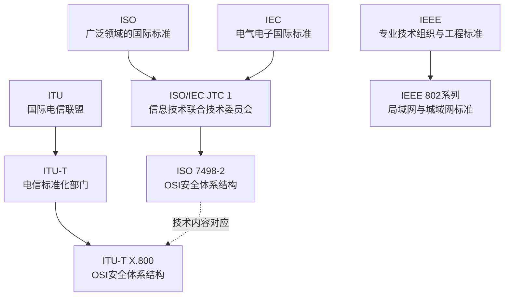

# 标准组织与OSI

## 标准组织与文件关系



## ISO

**英文全称：** International Organization for Standardization  
**中文名称：** 国际标准化组织

ISO负责广泛领域的国际标准化工作。ISO标准通常是自愿采用的；当法律法规、合同、采购要求或组织制度引用某项标准时，该标准可能在相应范围内成为必须满足的要求。

## IEC

**英文全称：** International Electrotechnical Commission  
**中文名称：** 国际电工委员会

IEC主要负责电气、电子及相关技术的国际标准，包括电气安全、电子元器件、工业自动化、电磁兼容、医疗电气设备和新能源设备等领域。

## ISO/IEC JTC 1

**英文全称：** ISO/IEC Joint Technical Committee 1  
**中文名称：** ISO/IEC第一联合技术委员会

ISO与IEC共同成立JTC 1，负责信息技术领域的国际标准化工作。因此，很多计算机和信息安全标准以“ISO/IEC”开头。

## ITU

**英文全称：** International Telecommunication Union  
**中文名称：** 国际电信联盟

ITU负责信息通信技术领域的国际协调和标准化。其标准化部门为ITU-T。

原CCITT后来成为ITU-T。OSI安全体系结构在ITU-T中的对应文件是X.800。

## IEEE

**英文全称：** Institute of Electrical and Electronics Engineers  
**中文名称：** 电气电子工程师学会

IEEE是专业技术组织，也制定大量工程技术标准。计算机网络领域常见的IEEE 802系列包括以太网、无线局域网等标准。

### IEEE 802.11无线局域网常见标准

#### 旧式离散速率：选择题重点

IEEE 802.11、802.11a、802.11b、802.11g可以直接记具体的物理层速率档位，而不能只记最高速率。

| 标准 | 常见工作频段 | 支持的物理层速率（Mb/s） | 共几档 | 最高速率 |
| --- | --- | --- | ---: | ---: |
| IEEE 802.11 | 2.4 GHz | **1、2** | 2档 | 2 Mb/s |
| IEEE 802.11b | 2.4 GHz | **1、2、5.5、11** | 4档 | 11 Mb/s |
| IEEE 802.11a | 5 GHz | **6、9、12、18、24、36、48、54** | 8档 | 54 Mb/s |
| IEEE 802.11g | 2.4 GHz | **1、2、5.5、6、9、11、12、18、24、36、48、54** | 12档 | 54 Mb/s |

速率之间的关系可以这样理解：

```text
原始 802.11：1、2

802.11b：
1、2
+ 5.5、11

802.11a：
6、9、12、18、24、36、48、54

802.11g：
兼容 802.11b 的 1、2、5.5、11
+ OFDM 的 6、9、12、18、24、36、48、54
```

> 记忆：看到 **5.5、11**，优先想到802.11b；看到 **6、9、12、18、24、36、48、54**，这是802.11a/g常考的OFDM速率组。10 Mb/s和100 Mb/s是传统以太网常见速率，不是802.11b的速率档位。

#### 802.11n：速率由MCS组合决定

从802.11n开始，不能再用一张唯一的“固定速率档位表”概括。实际物理层速率由以下因素共同决定：

- MCS（调制与编码方案）；
- 信道宽度：20 MHz或40 MHz；
- 空间流数量；
- 保护间隔GI：长GI或短GI。

软考与常见基础题通常按MCS 0～31的对称配置理解：MCS 0～7对应1条空间流，MCS 8～15对应2条，MCS 16～23对应3条，MCS 24～31对应4条。

下表是802.11n **单空间流、MCS 0～7** 的基础速率。单位为Mb/s。

| MCS | 20 MHz长GI | 20 MHz短GI | 40 MHz长GI | 40 MHz短GI |
| ---: | ---: | ---: | ---: | ---: |
| 0 | 6.5 | 7.2 | 13.5 | 15 |
| 1 | 13 | 14.4 | 27 | 30 |
| 2 | 19.5 | 21.7 | 40.5 | 45 |
| 3 | 26 | 28.9 | 54 | 60 |
| 4 | 39 | 43.3 | 81 | 90 |
| 5 | 52 | 57.8 | 108 | 120 |
| 6 | 58.5 | 65 | 121.5 | 135 |
| 7 | 65 | 72.2 | 135 | 150 |

在相同信道宽度、GI、调制和编码条件下，增加空间流后速率大体按倍数增加。40 MHz、短GI、最高MCS时的常考上限为：

| 空间流数量 | 理论最高速率 |
| ---: | ---: |
| 1条 | 150 Mb/s |
| 2条 | 300 Mb/s |
| 3条 | 450 Mb/s |
| 4条 | 600 Mb/s |

因此，802.11n应记住的是“**MCS × 信道宽度 × 空间流 × GI**”，而不是把600 Mb/s误认为它唯一支持的速率。802.11ac、802.11ax同样采用类似的MCS组合思路，也不适合背成一组唯一的固定速率档位。

## OSI

**英文全称：** Open Systems Interconnection  
**中文名称：** 开放系统互连

OSI是描述不同系统之间网络通信功能如何分层、各层承担什么职责的参考模型。

需要注意：

- “开放”表示系统依据公开、共同的规则实现互连，不表示任何人都能无条件访问。
- OSI是参考模型，不等于当前互联网中所有设备实际采用的一整套强制协议。
- OSI本身不只讨论安全，也讨论连接、传输、寻址、路由、分段和重组等通信功能。

## ISO 7498-2:1989与X.800

ISO 7498-2:1989是OSI基本参考模型的安全体系结构部分，于1989年发布。

它主要说明：

- OSI环境中的安全服务；
- 与安全服务相关的安全机制；
- 安全服务和机制可以位于参考模型的哪些位置。

它是一套高层安全架构，不是具体系统的实现说明，也不能单独证明某个实际系统安全。

ITU-T X.800与ISO 7498-2在技术上相互对应。X.800于1991年获批。

## 官方资料

- IEEE关于Wi-Fi标准演进的说明：https://standards.ieee.org/beyond-standards/the-evolution-of-wi-fi-technology-and-standards/
- Cisco关于802.11b/g速率的说明：https://www.cisco.com/en/US/docs/solutions/Enterprise/Mobility/emob30dg/RFDesign.html
- Cisco关于802.11n MCS与速率组合的说明：https://www.cisco.com/c/en/us/td/docs/routers/access/800/software/configuration/guide/SCG800Guide/SCG800_Guide_BookMap_chapter_01001.html
- ISO 7498-2:1989：https://www.iso.org/standard/14256.html
- ITU-T X.800：https://www.itu.int/rec/T-REC-X.800/en
- ISO关于国际标准与法律关系的说明：https://www.iso.org/foreword-supplementary-information.html
