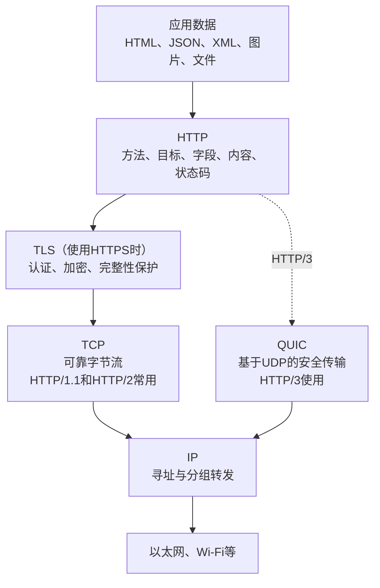
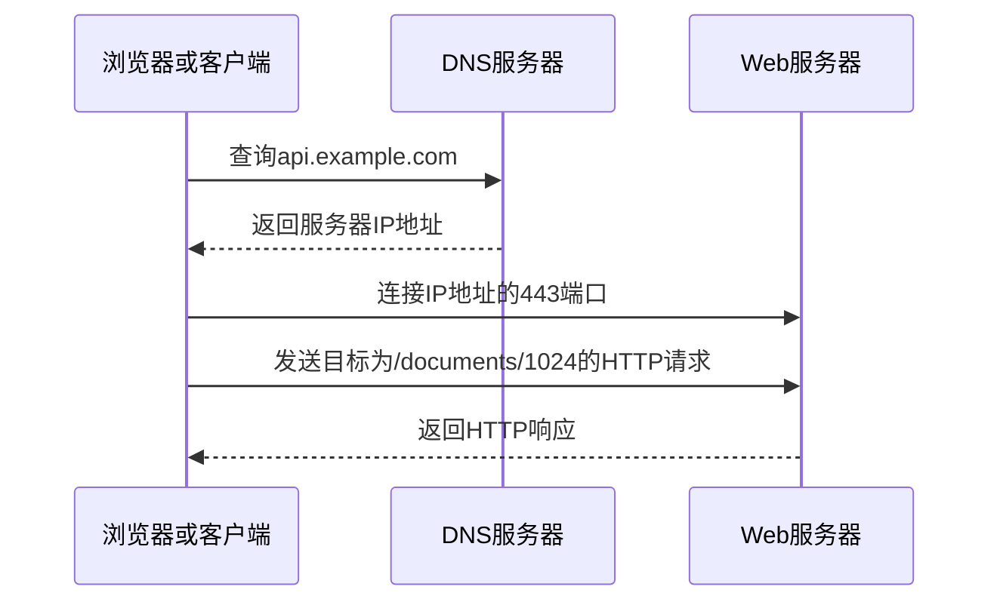
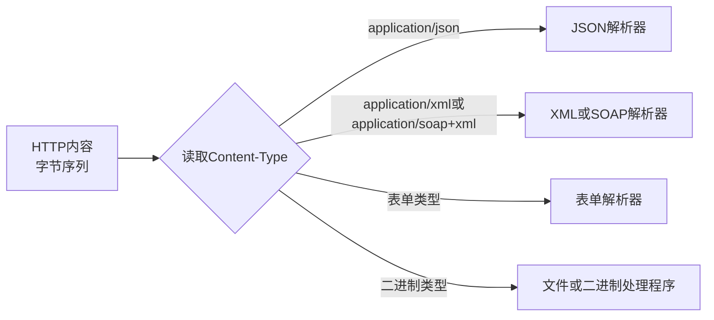
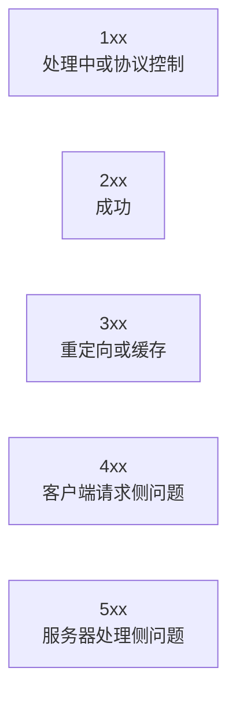
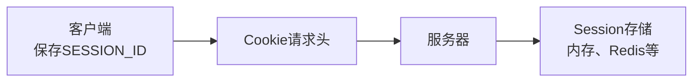
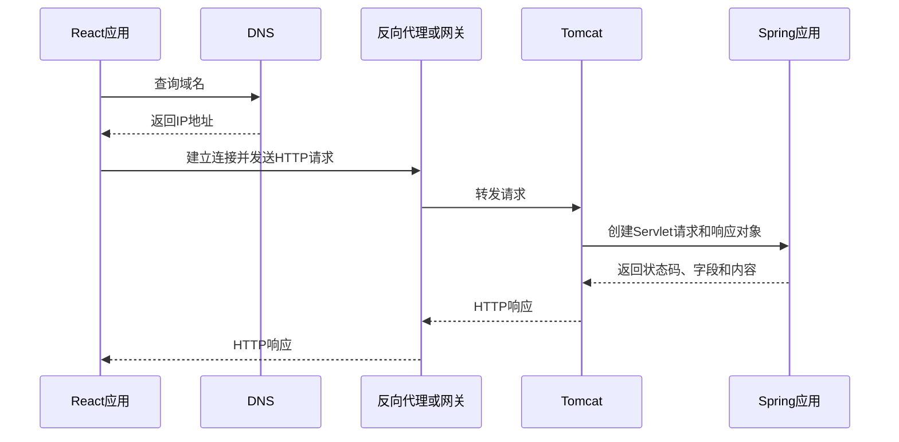

# HTTP消息与Web请求

## 前置与关联知识

- [网络体系结构与OSI、TCP/IP模型](08-网络体系结构与OSI-TCP-IP模型.md)：HTTP在网络分层中的位置以及应用数据的封装过程。
- [TCP与UDP传输层协议](09-TCP与UDP传输层协议.md)：端口、TCP首部字段、可靠字节流和UDP数据报。
- [TCP连接建立与释放](10-TCP连接建立与释放.md)：TCP三次握手、可靠传输基础和四次挥手。

## 1. HTTP所处的位置

HTTP（Hypertext Transfer Protocol，超文本传输协议）是应用层协议。它规定客户端和服务器交换请求、响应时采用的语义和消息结构。

一次常见的Web访问会同时使用多项技术：



需要区分：

- HTTP定义请求方法、字段、内容和状态码。
- HTTPS表示通过受TLS保护的连接使用HTTP。
- JSON和XML是内容格式，不是传输协议。
- REST是接口架构风格，不是HTTP的组成部分。
- SOAP可以借助HTTP传输SOAP XML消息。

## 2. URI、URL、域名、IP与端口

以地址为例：

```text
https://api.example.com:8443/documents/1024?detail=true#history
```

| 部分 | 内容 | 作用 |
|---|---|---|
| Scheme | `https` | 指定访问方案 |
| Host | `api.example.com` | 主机名，通常需要DNS解析 |
| Port | `8443` | 目标端口；HTTPS默认端口为443 |
| Path | `/documents/1024` | 目标资源路径 |
| Query | `detail=true` | 随请求发送的查询参数 |
| Fragment | `history` | 由客户端处理，通常不会发送给服务器 |

域名需要先通过DNS解析为IP地址，客户端再与相应IP和端口建立连接。



## 3. HTTP请求的逻辑结构

HTTP请求在语义上包含控制数据、字段和可选内容。以HTTP/1.1的文本形式观察时，通常表现为：

```text
请求行
请求头字段
空行
请求体（可选）
```

例如：

```http
POST /api/documents?validate=true HTTP/1.1
Host: api.example.com
Authorization: Bearer eyJ...
Content-Type: application/json
Accept: application/json

{
  "title": "设计说明",
  "status": "DRAFT"
}
```

### 3.1 请求行

```text
POST /api/documents?validate=true HTTP/1.1
```

包含：

- `POST`：HTTP请求方法。
- `/api/documents?validate=true`：请求目标。
- `HTTP/1.1`：协议版本。

HTTP/2和HTTP/3不再按上述文本行在网络上传输，但仍保留方法、目标、字段和内容等语义。

### 3.2 请求头

请求头携带消息元数据和控制信息：

| 请求头 | 主要用途 |
|---|---|
| `Host` | 指定目标主机 |
| `Content-Type` | 说明请求体的数据类型 |
| `Content-Length` | 说明请求体长度 |
| `Accept` | 声明希望收到的数据类型 |
| `Authorization` | 携带身份凭据 |
| `Cookie` | 携带由服务器设置的Cookie |
| `User-Agent` | 标识客户端软件 |
| `If-None-Match` | 根据ETag发起条件请求 |
| `Origin` | 表明跨源请求的来源 |

请求头不是业务数据的固定存放区。身份凭据、内容格式、缓存条件等适合放在请求头；业务对象通常放在路径、查询参数或请求体中。

### 3.3 请求体

HTTP请求体本质上是可选的内容数据。它可以承载文本或二进制数据，并不限定为JSON。

| `Content-Type` | 请求体解释方式 |
|---|---|
| `application/json` | JSON |
| `application/xml` | 普通XML |
| `application/soap+xml` | SOAP 1.2 XML |
| `text/xml` | XML；SOAP 1.1中常见 |
| `application/x-www-form-urlencoded` | URL编码表单 |
| `multipart/form-data` | 多部分表单和文件 |
| `application/octet-stream` | 通用二进制数据 |



## 4. HTTP响应的逻辑结构

HTTP/1.1响应通常表现为：

```text
状态行
响应头字段
空行
响应体（可选）
```

```http
HTTP/1.1 201 Created
Content-Type: application/json
Location: /api/documents/1024

{
  "id": "1024",
  "title": "设计说明",
  "status": "DRAFT"
}
```

其中：

- `201`由HTTP定义，表示成功创建资源。
- `Content-Type`说明响应体是JSON。
- `Location`指出新资源的位置。
- JSON是应用选择的数据表示，不是HTTP固定格式。

## 5. HTTP方法

HTTP方法由HTTP标准定义，不属于REST专有内容。

| 方法 | 标准语义 | 安全方法 | 幂等方法 |
|---|---|---:|---:|
| GET | 获取目标资源的表示 | 是 | 是 |
| HEAD | 只获取与GET相同的响应字段，不返回内容 | 是 | 是 |
| POST | 让目标资源处理提交的内容 | 否 | 通常否 |
| PUT | 用给定表示创建或替换目标资源 | 否 | 是 |
| DELETE | 删除目标资源与当前功能的关联 | 否 | 是 |
| OPTIONS | 获取目标支持的通信选项 | 是 | 是 |
| PATCH | 对资源进行部分修改 | 否 | 不保证 |

### 5.1 安全与幂等

- **安全（Safe）**：客户端请求的语义是读取，不要求改变服务器状态。
- **幂等（Idempotent）**：多次执行同样的请求，其预期效果与执行一次相同。

幂等不表示每次响应必须完全一致。例如重复执行DELETE，资源删除效果不再增加，但后续响应可能从成功变为不存在。

## 6. HTTP状态码

状态码由HTTP定义，用于描述服务器对当前请求的处理结果。



| 状态码 | 含义 |
|---|---|
| 200 OK | 请求成功 |
| 201 Created | 成功创建资源 |
| 202 Accepted | 请求已接受，但处理尚未完成 |
| 204 No Content | 成功且没有响应体 |
| 301 Moved Permanently | 永久重定向 |
| 304 Not Modified | 条件请求判断资源未修改 |
| 400 Bad Request | 请求语法或内容无法处理 |
| 401 Unauthorized | 缺少有效身份认证凭据 |
| 403 Forbidden | 服务器理解请求但拒绝执行 |
| 404 Not Found | 找不到目标资源 |
| 405 Method Not Allowed | 资源不允许使用该HTTP方法 |
| 409 Conflict | 请求与资源当前状态冲突 |
| 415 Unsupported Media Type | 不支持请求体的数据类型 |
| 429 Too Many Requests | 请求频率超过限制 |
| 500 Internal Server Error | 服务器内部发生错误 |
| 502 Bad Gateway | 网关收到无效上游响应 |
| 503 Service Unavailable | 服务暂时不可用 |
| 504 Gateway Timeout | 网关等待上游响应超时 |

业务系统应当同时考虑HTTP状态码和结构化错误响应。不要把所有失败都包装成`200 OK`。

## 7. Cookie、Session与Token

### 7.1 Cookie

Cookie是客户端保存并在后续请求中发送的小段数据。服务器通过响应头设置：

```http
Set-Cookie: SESSION_ID=abc123; Secure; HttpOnly; SameSite=Lax
```

客户端后续发送：

```http
Cookie: SESSION_ID=abc123
```

### 7.2 Session

Session通常是服务器保存的会话状态。Cookie中保存Session ID，服务器根据该ID查找会话数据。



### 7.3 Token

Token通常放在`Authorization`请求头中：

```http
Authorization: Bearer eyJ...
```

Token、Cookie和Session不是互相完全排斥的概念：Cookie是一种客户端存储和传输机制；Session是一种服务器会话状态；Token是一种凭据表达形式。

## 8. HTTP版本

| 版本 | 主要传输特征 |
|---|---|
| HTTP/1.1 | 文本形式易于观察；同一连接可复用，但并发受连接和队头阻塞影响 |
| HTTP/2 | 二进制分帧、多路复用、头部压缩，通常运行于TLS之上 |
| HTTP/3 | HTTP语义运行于QUIC之上，QUIC基于UDP并集成TLS 1.3 |

版本变化主要影响传输方式和性能，GET、POST、字段、内容和状态码等HTTP语义仍然存在。

## 9. 完整Web请求链路



反向代理、网关和负载均衡器并非HTTP协议所强制，但在生产系统中常用于TLS终止、路由、限流和分发请求。

## 10. 与其他概念的边界

```text
HTTP：定义请求、响应及其语义
HTTPS：HTTP通过安全连接传输
TLS：建立受认证、加密并防篡改的通信连接
JSON/XML：请求体或响应体可采用的数据格式
REST：组织资源型接口的架构风格
SOAP：可通过HTTP传输的XML消息框架
WSDL：描述SOAP服务合同
Servlet：Java服务器处理请求的接口规范
Spring MVC：基于Servlet体系的Web框架
Tomcat：实现Servlet规范的Web容器
```

## 参考资料

- [RFC 9110：HTTP Semantics](https://www.rfc-editor.org/rfc/rfc9110.html)
- [RFC 9112：HTTP/1.1](https://www.rfc-editor.org/rfc/rfc9112.html)
- [RFC 9113：HTTP/2](https://www.rfc-editor.org/rfc/rfc9113.html)
- [RFC 9114：HTTP/3](https://www.rfc-editor.org/rfc/rfc9114.html)
