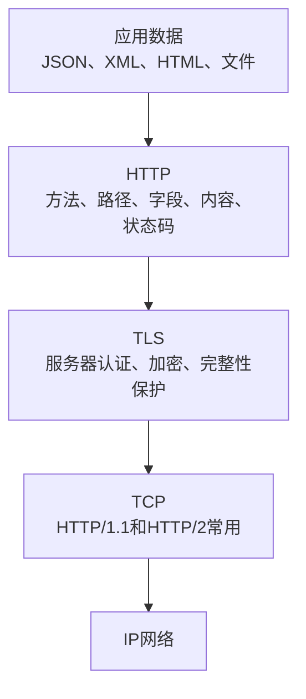
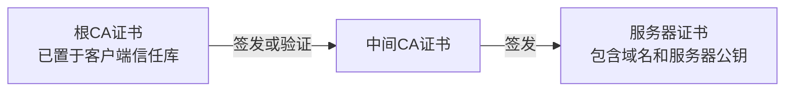
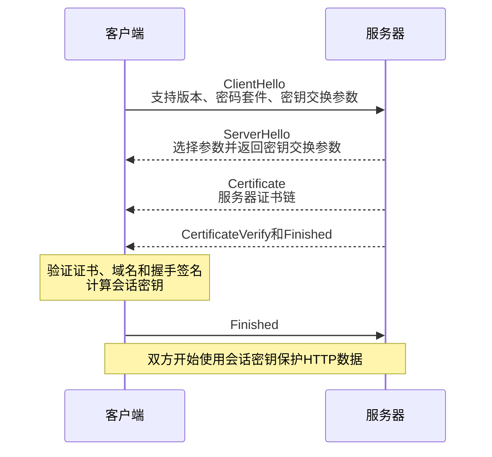
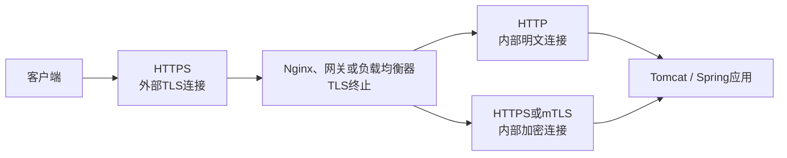
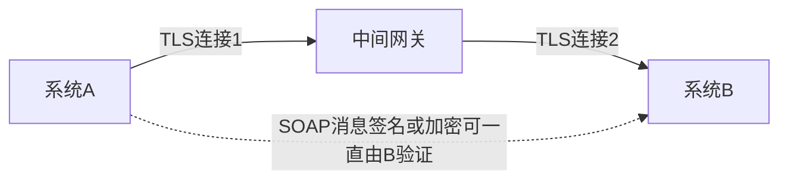

# HTTPS与TLS

## 前置与关联知识

- [网络体系结构与OSI、TCP/IP模型](08-网络体系结构与OSI-TCP-IP模型.md)：TLS、TCP、IP和链路层之间的层次关系。
- [TCP与UDP传输层协议](09-TCP与UDP传输层协议.md)：TCP可靠字节流和UDP数据报的结构与差异。
- [TCP连接建立与释放](10-TCP连接建立与释放.md)：传统HTTPS中TCP握手、TLS握手和HTTP请求的执行顺序。

## 1. HTTPS的定义

HTTPS不是一套替代HTTP业务语义的新接口协议。HTTPS表示客户端通过受TLS保护的连接使用HTTP。

```text
HTTP  = HTTP语义 + 普通传输连接
HTTPS = HTTP语义 + TLS保护的传输连接
```

使用HTTPS之后，HTTP方法、URL路径、请求头、请求体和状态码仍然存在。



HTTP/3运行于QUIC之上，QUIC集成TLS 1.3。其网络结构与传统`HTTP + TLS + TCP`不同，但仍然提供受TLS保护的HTTP语义。

## 2. TLS提供的主要能力

### 2.1 身份认证

客户端通过服务器证书验证当前连接的服务器是否有权代表目标域名。

### 2.2 机密性

握手完成后，应用数据使用协商出的密钥加密。网络中的普通观察者无法直接读取HTTP内容。

### 2.3 完整性

TLS记录具有完整性保护。被篡改的数据无法通过验证，接收方不会把它作为合法应用数据交给HTTP处理。

TLS通常认证服务器。需要客户端也提交证书时，可以采用双向TLS（mTLS）。

## 3. 数字证书

服务器证书用于把域名、公钥和证书主体等信息建立可验证的联系。

证书通常包含：

- 证书适用的域名；
- 服务器公钥；
- 颁发者；
- 有效期；
- 签名算法；
- 证书颁发机构的数字签名。



浏览器或客户端主要检查：

1. 证书链能否连接到受信任的根证书；
2. 证书签名是否有效；
3. 当前域名是否包含在证书允许的名称中；
4. 证书是否在有效期内；
5. 证书是否违反客户端执行的其他安全策略。

证书证明的是连接端对域名的控制关系，不自动证明网站业务内容可靠。

## 4. TLS 1.3握手的主要过程

下面省略了部分扩展和异常分支，只保留建立HTTPS连接时必须理解的主线。



握手阶段利用非对称密码和密钥交换建立身份与共享密钥；大量业务数据随后使用对称加密保护，因为对称加密更适合持续处理数据。

## 5. HTTPS请求在网络中的状态

应用程序构造的原始HTTP内容可能是：

```http
POST /api/documents HTTP/1.1
Host: api.example.com
Content-Type: application/json
Authorization: Bearer eyJ...

{"title":"设计说明"}
```

进入TLS后，HTTP内容会被加密并进行完整性保护。网络设备仍可能看到：

- 通信双方的IP地址；
- 端口；
- 连接持续时间；
- 分组大小和时间特征；
- 某些没有被加密的连接元数据。

网络设备通常不能直接看到被TLS保护的URL路径、Authorization字段和请求体。但如果TLS在反向代理处终止，反向代理会解密并读取HTTP请求，然后决定怎样向后端转发。

## 6. TLS终止

生产系统常将证书和TLS连接放在Nginx、网关或负载均衡器上处理：



是否允许代理到应用之间使用HTTP，应根据网络边界和安全要求决定。使用内部HTTPS或mTLS可以继续保护这一段连接。

## 7. HTTPS保护什么、不保护什么

| 内容 | HTTPS能否直接解决 |
|---|---|
| 防止链路上的普通窃听 | 能 |
| 检测传输数据被篡改 | 能 |
| 验证服务器是否代表目标域名 | 能 |
| 判断当前用户能否访问某个业务功能 | 不能，由应用授权解决 |
| 防止SQL注入 | 不能 |
| 防止服务端把敏感信息错误返回给用户 | 不能 |
| 防止服务器自身被入侵 | 不能 |
| 保证数据库内容永远正确 | 不能 |
| 防止客户端截屏或主动泄露数据 | 不能 |

HTTPS保护通信连接，不替代身份认证、访问控制、输入校验、安全编码和审计。

## 8. HTTPS与登录认证

HTTPS和登录认证解决不同问题：

```text
HTTPS：
确认连接到的服务器域名并保护传输通道

登录认证：
服务器确认当前调用者的身份

访问控制：
服务器判断调用者能执行哪些操作
```

Bearer Token、Session ID等凭据仍然需要通过HTTP字段发送。HTTPS负责保护这些字段在通信链路中不被普通窃听者读取。

## 9. HTTPS与SOAP消息级安全

HTTPS保护一段TLS连接。如果SOAP消息经过多个需要解密再转发的中间节点，每一段连接可能分别使用TLS。

WS-Security可以进一步对SOAP消息中的内容进行签名或加密，使消息本身携带安全保护。



普通REST系统也可以设计消息级签名和加密，但这不是REST自动提供的能力。

## 10. 常见错误认识

- HTTPS不是“把URL中的`http`改成`https`就完成全部安全建设”。
- TLS证书不是用来加密数据库的。
- 服务器证书不等于用户登录证书。
- 公钥不会直接承担全部业务数据的持续加密。
- HTTPS不能阻止合法用户读取自己有权获得的数据。
- HTTPS不决定请求体使用JSON还是XML。
- REST和SOAP都可以通过HTTPS传输。

## 参考资料

- [RFC 8446：The Transport Layer Security Protocol Version 1.3](https://www.rfc-editor.org/rfc/rfc8446.html)
- [RFC 9110：HTTP Semantics](https://www.rfc-editor.org/rfc/rfc9110.html)
- [RFC 9114：HTTP/3](https://www.rfc-editor.org/rfc/rfc9114.html)
