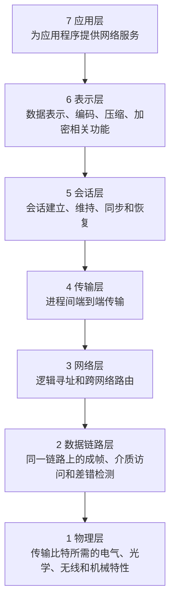
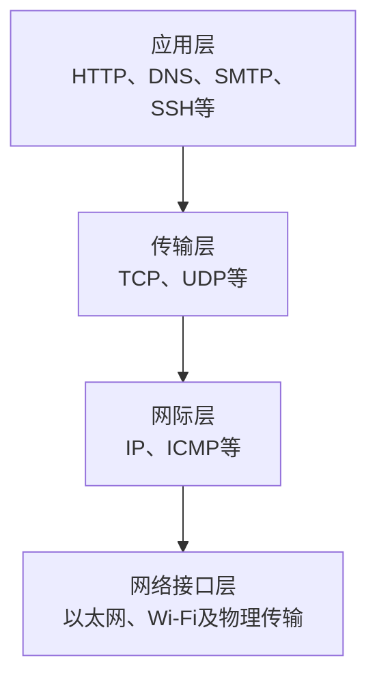
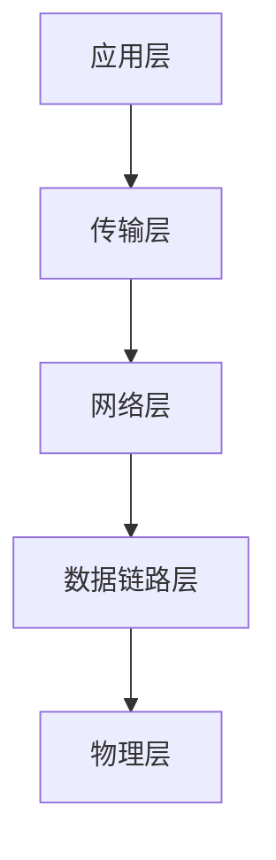
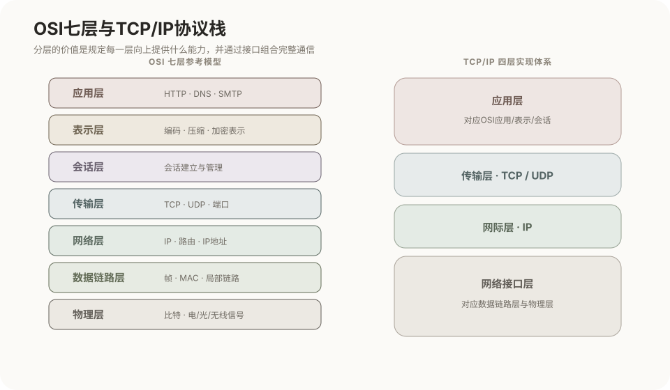
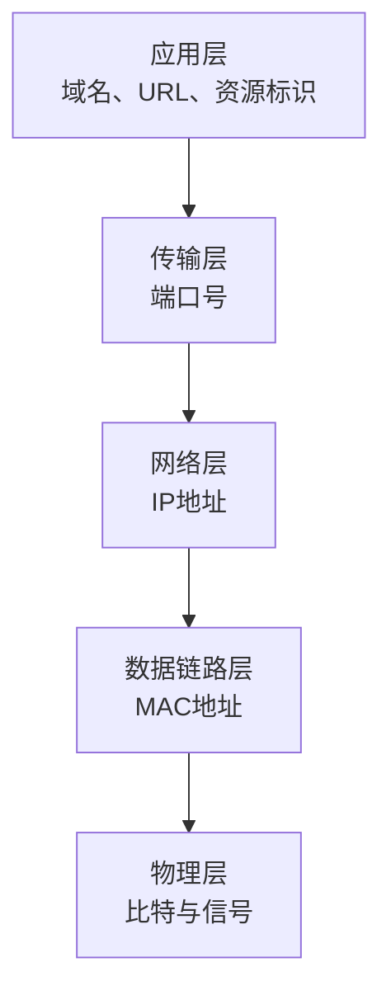
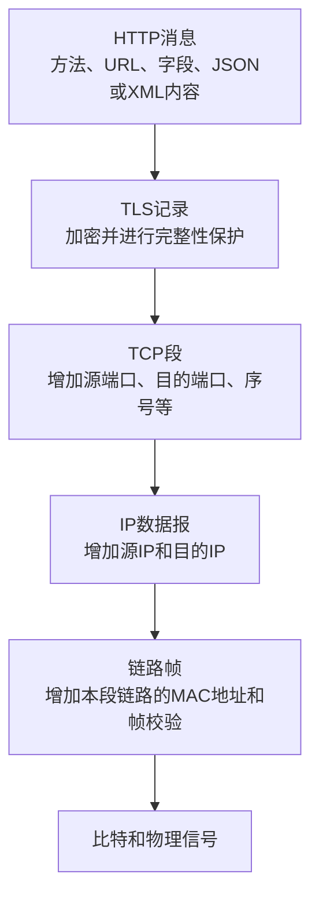
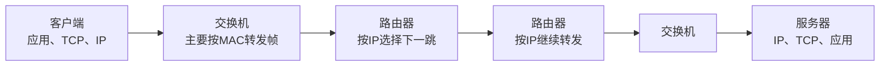
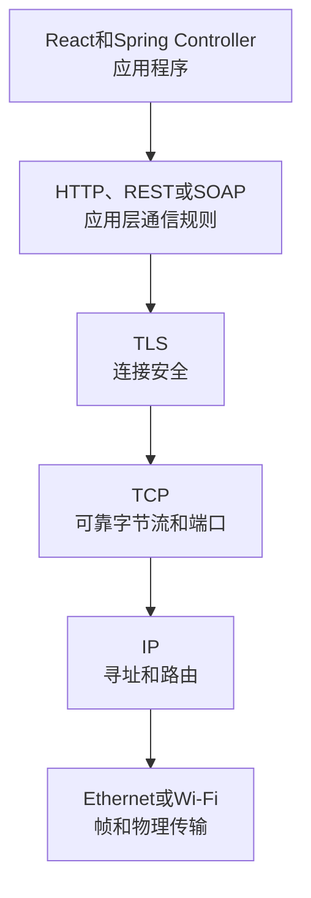

# 网络体系结构与OSI、TCP/IP模型

## 关联知识

- [TCP与UDP传输层协议](09-TCP与UDP传输层协议.md)：传输层的端口、TCP首部、可靠字节流和UDP数据报。
- [TCP连接建立与释放](10-TCP连接建立与释放.md)：TCP连接状态、三次握手和四次挥手。

## 1. 分层模型解决的问题

网络通信需要同时处理应用数据、进程识别、端到端传输、跨网络路由、局部链路传输和物理信号。分层模型为这些功能划分边界，使每一层通过接口使用下层能力，并向上层提供能力。

分层的主要意义：

- 将不同类型的通信职责分开描述；
- 允许某一层的协议和实现独立演进；
- 便于不同厂商按照共同接口实现互操作；
- 便于定位故障发生在哪一类功能；
- 便于描述数据从应用程序到网络介质的封装过程。

OSI七层模型、TCP/IP四层模型和教材五层模型不是三套互相竞争的网络。它们是三种不同的功能划分方式。

## 2. OSI七层模型

OSI（Open Systems Interconnection，开放系统互连）七层模型自上而下为：



### 2.1 应用层

直接向应用程序提供网络功能，例如：

- Web访问；
- 域名查询；
- 电子邮件传输；
- 文件传输；
- 远程管理。

HTTP、DNS、SMTP等通常放在这一层讨论。

应用层不等于应用程序的全部业务代码。React组件、Spring Service业务规则等不全是网络协议。

### 2.2 表示层

负责通信双方如何解释数据，包括：

- 字符编码；
- 数据序列化；
- 数据格式转换；
- 压缩；
- 与加密表示有关的功能。

在实际TCP/IP应用中，这些功能经常由应用协议、格式库或TLS等组件承担，不一定存在一个独立的“表示层进程”。

### 2.3 会话层

负责管理通信会话，包括：

- 建立和结束会话；
- 对话控制；
- 同步点；
- 中断后的会话恢复。

现代互联网应用经常把这些能力放入应用协议、框架或传输安全协议中，因此TCP/IP模型通常不单独划分会话层。

### 2.4 传输层

负责主机进程之间的通信。常见协议：

- TCP：面向连接、可靠、有序的字节流；
- UDP：无连接的数据报传输。

传输层使用端口号区分同一主机上的不同应用进程。

### 2.5 网络层

负责：

- 使用逻辑地址标识主机或网络接口；
- 选择跨网络转发路径；
- 将分组从源主机送往目标主机。

IP和ICMP通常放在这一层讨论，路由器主要根据网络层地址转发分组。

### 2.6 数据链路层

负责一段具体链路上的通信，包括：

- 把数据组织为帧；
- 使用MAC地址进行局部交付；
- 控制共享介质访问；
- 检测帧传输错误。

以太网、Wi-Fi的链路功能通常放在这一层讨论。交换机主要依据MAC地址转发帧。

### 2.7 物理层

负责把比特转换为可以在介质上传输的信号，涉及：

- 电压、光信号或无线电信号；
- 接口和连接器；
- 传输速率；
- 调制、编码和时钟；
- 双绞线、光纤和无线信道。

物理层不理解HTTP请求、端口号或IP地址。

## 3. TCP/IP四层模型

互联网实际采用的协议体系通常用四层模型描述：



| TCP/IP层 | 主要职责 |
|---|---|
| 应用层 | 应用协议、数据表示和应用会话 |
| 传输层 | 进程间端到端传输 |
| 网际层 | IP寻址和跨网络分组转发 |
| 网络接口层 | 在具体网络和物理介质上传输帧与比特 |

TCP/IP模型中的“应用层”合并了OSI的应用层、表示层和会话层；“网络接口层”合并了OSI的数据链路层和物理层。

## 4. 教材五层模型

教材五层模型是在讲解互联网协议时常用的折中划分：



它保留TCP/IP体系的应用、传输和网络功能，又把TCP/IP的网络接口层拆成数据链路层和物理层。

## 5. 三种模型的对应关系



对应关系可整理为：

| OSI七层 | 教材五层 | TCP/IP四层 |
|---|---|---|
| 应用层 | 应用层 | 应用层 |
| 表示层 | 应用层 | 应用层 |
| 会话层 | 应用层 | 应用层 |
| 传输层 | 传输层 | 传输层 |
| 网络层 | 网络层 | 网际层 |
| 数据链路层 | 数据链路层 | 网络接口层 |
| 物理层 | 物理层 | 网络接口层 |

## 6. 常见协议和技术所在层次

| 层次 | 常见协议或技术 | 识别信息 |
|---|---|---|
| 应用层 | HTTP、HTTPS中的HTTP、DNS、SMTP、SSH、DHCP、SOAP | 域名、URL、应用消息 |
| 表示和安全相关功能 | JSON、XML、字符编码、压缩、TLS | 数据表示、加密连接 |
| 传输层 | TCP、UDP | 端口号、序号、确认号 |
| 网络层 | IPv4、IPv6、ICMP | IP地址、路由 |
| 数据链路层 | Ethernet、Wi-Fi链路、VLAN、ARP相关功能 | MAC地址、帧 |
| 物理层 | 双绞线、光纤、无线信号、接口标准 | 比特和信号 |

这张表用于定位主要职责，不表示所有技术只能严格属于一个模型方框。例如：

- TLS位于应用协议与传输能力之间，教材可能按不同角度归入表示层或应用层相关技术；
- ARP完成IPv4地址到链路地址的解析，处于网络层与数据链路层的边界；
- HTTPS不是单独的一层，而是HTTP通过TLS保护后形成的访问方式。

## 7. 各层使用的标识



| 标识 | 主要作用 |
|---|---|
| 域名 | 便于应用定位主机或服务，需要DNS解析 |
| URL | 标识访问方案、主机、端口和资源路径 |
| 端口号 | 区分一台主机上的应用服务或连接端点 |
| IP地址 | 支持跨网络寻址和路由 |
| MAC地址 | 支持当前链路或局域网内的帧交付 |

IP地址用于端到端的网络寻址；帧中的源、目的MAC地址会随每一段链路重新确定，不要求从源主机到目标主机始终不变。

## 8. 数据封装

假设React应用发送一个HTTPS请求，应用数据向下经过各层：



接收方按相反方向处理：

```text
物理信号
→ 链路帧
→ IP数据报
→ TCP字节流
→ TLS解密后的HTTP消息
→ Spring应用中的Java对象
```

各层常用的数据单位：

| 层次 | 常用数据单位 |
|---|---|
| 应用层 | Message或Data |
| 传输层TCP | Segment，段 |
| 传输层UDP | Datagram，数据报 |
| 网络层 | Packet或IP Datagram，分组或IP数据报 |
| 数据链路层 | Frame，帧 |
| 物理层 | Bit，比特 |

不同教材对Packet和Datagram的中文翻译可能略有差别，应优先识别其所处层次和头部字段。

## 9. 一次跨网络通信



主要变化：

- 应用数据在到达最终服务器前通常保持其应用含义；
- TCP连接的两端是客户端进程和服务器进程；
- IP源地址和目的地址用于跨网络转发，但NAT可能改写地址；
- 每经过一段不同链路，链路帧会被移除并为下一段链路重新封装；
- 交换机主要处理局部链路中的帧，路由器主要处理跨网络的IP分组。

## 10. 网络设备与层次

| 设备 | 传统主要层次 | 主要依据 |
|---|---|---|
| 中继器、集线器 | 物理层 | 信号或比特 |
| 网桥、二层交换机 | 数据链路层 | MAC地址 |
| 路由器、三层交换机 | 网络层 | IP地址和路由表 |
| 四层负载均衡器 | 传输层 | IP地址、端口和连接 |
| 七层代理、API网关 | 应用层 | HTTP主机、路径、字段等 |

现代设备可能同时处理多层信息，因此表中描述的是传统主要功能，不是对所有产品能力的绝对限制。

## 11. OSI模型与互联网协议体系的区别

- OSI七层是参考模型，重点是描述通信功能如何分层。
- TCP/IP是互联网实际采用的协议体系。
- 教材五层模型主要用于教学分析。
- 互联网不是先严格实现OSI七层，再把每个数据逐层交给七个独立软件。
- 应用中的一个库或进程可能同时承担OSI表示层、会话层和应用层相关功能。
- 讨论协议时，应同时说明采用的是哪一种分层模型。

## 12. 与Java Web系统的对应



Tomcat、Spring MVC、Spring-WS属于应用侧实现，它们使用操作系统提供的TCP/IP网络能力。MyBatis和MySQL负责数据访问与存储，不属于网络分层模型中的独立网络协议层。

## 13. 核心对应关系

```text
OSI七层：
应用、表示、会话、传输、网络、数据链路、物理

教材五层：
应用、传输、网络、数据链路、物理

TCP/IP四层：
应用、传输、网际、网络接口

合并关系：
OSI应用 + 表示 + 会话 → TCP/IP应用层
OSI数据链路 + 物理 → TCP/IP网络接口层
```

## 参考资料

- [ISO/IEC 7498-1：OSI Basic Reference Model](https://www.iso.org/standard/20269.html)
- [RFC 1122：Requirements for Internet Hosts — Communication Layers](https://www.rfc-editor.org/rfc/rfc1122.html)
- [RFC 8200：Internet Protocol, Version 6](https://www.rfc-editor.org/rfc/rfc8200.html)
- [RFC 9293：Transmission Control Protocol](https://www.rfc-editor.org/rfc/rfc9293.html)
