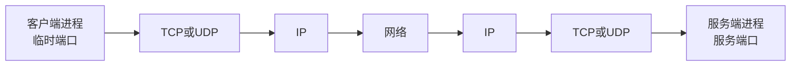
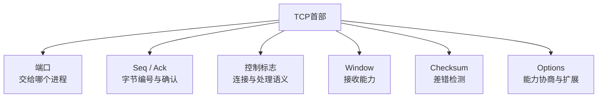
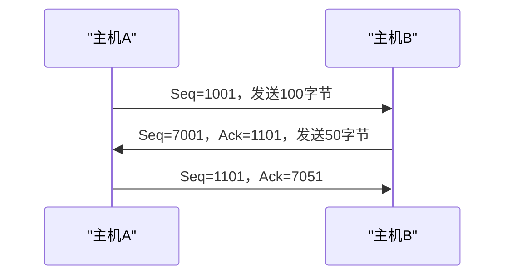
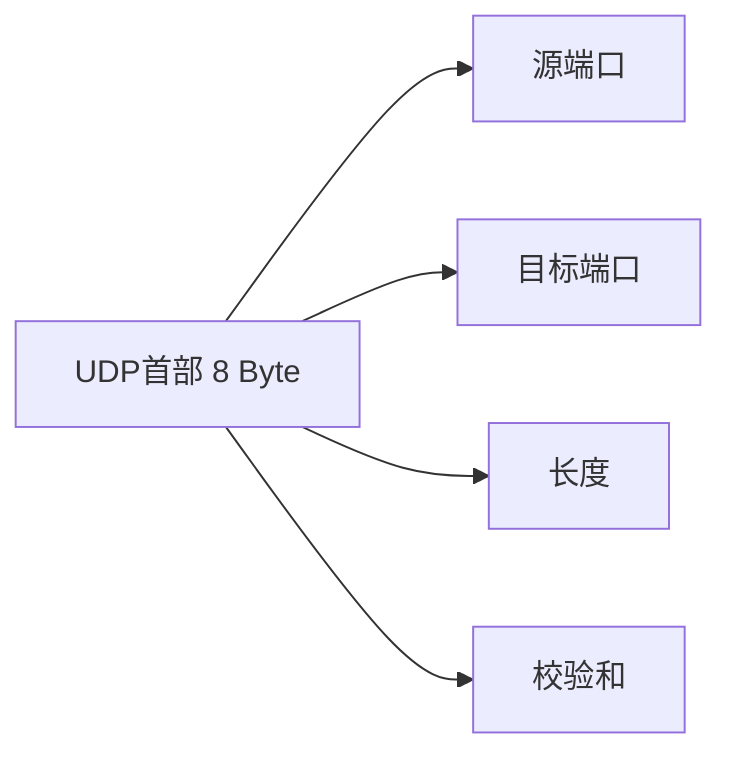
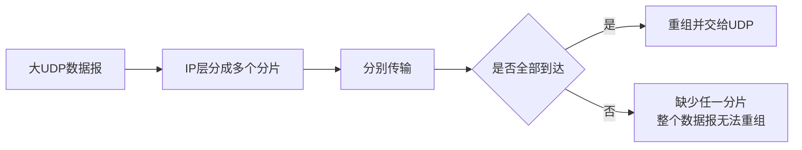
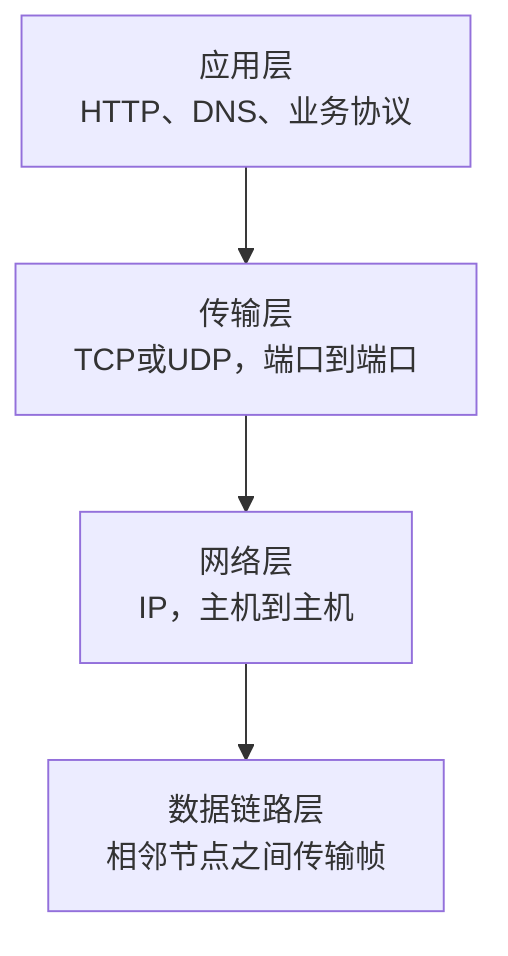

# TCP与UDP传输层协议

## 1. 传输层的职责

IP负责把数据包送到目标主机，传输层继续把数据交给目标主机中的具体应用进程。



传输层主要使用端口号区分进程。一次通信常用以下信息标识：

```text
源IP + 源端口 + 目标IP + 目标端口 + 传输层协议
```

Socket是操作系统提供给程序的网络通信端点。TCP Socket和UDP Socket的使用方式不同，但都建立在IP地址和端口基础上。

## 2. TCP提供的服务

TCP（Transmission Control Protocol）提供：

- 面向连接；
- 可靠传输；
- 按序交付；
- 全双工通信；
- 字节流；
- 差错检测；
- 流量控制；
- 拥塞控制。


“可靠”表示TCP使用序号、确认、重传和校验等机制，尽力保证字节不丢失、不重复并按序交付。它不表示网络本身不会丢包，也不表示应用业务一定成功。

## 3. TCP首部

TCP固定首部通常为20字节，存在选项时更长。

| 字段 | 主要用途 |
|---|---|
| 源端口、目标端口 | 标识两端应用进程 |
| Sequence Number | 本报文段数据第一个字节的序号 |
| Acknowledgment Number | 期望对方下次发送的字节序号 |
| Data Offset | TCP首部长度 |
| 控制标志 | 表示连接和数据处理语义 |
| Window | 通告当前接收能力 |
| Checksum | 检测首部和数据传输错误 |
| Urgent Pointer | 与URG标志配合表示紧急数据位置 |
| Options | MSS、窗口扩大、时间戳、SACK等扩展 |



## 4. ACK标志与Ack确认号

教材和抓包工具常用相似写法表示两个不同字段：

| 写法 | 实际字段 | 含义 |
|---|---|---|
| `ACK` | 控制标志中的ACK位 | 确认号字段是否有效 |
| `Ack=5001` | Acknowledgment Number | 希望对方下次从序号5001开始发送 |

例如：

```text
ACK=1, Ack=5001
```

含义是“确认号有效，并且已经收到5001之前的字节”。

如果ACK标志没有置1，即使首部中的确认号位置包含某个二进制值，接收方也不应把它解释为有效确认。

## 5. Seq与Ack为什么不能共用

TCP是全双工协议，两个方向都可以同时发送数据，各自拥有独立的序号空间。



同一个报文段可能同时携带：

- 本方向发送的数据，因此需要`Seq`；
- 对反方向数据的确认，因此需要`Ack`。

如果共用一个字段，就无法同时表达“我正在发送哪段数据”和“我已经收到你的哪段数据”。

TCP序号按字节计算。例如某段从`Seq=1000`开始并携带500字节，下一段通常从`Seq=1500`开始。确认号表示下一个期望收到的字节序号，因此累计确认`Ack=1500`表示1500以前的数据已经连续收到。

## 6. SYN、ACK、FIN等控制标志

常见控制标志包括：

| 标志 | 主要含义 |
|---|---|
| SYN | 同步初始序号，用于建立连接 |
| ACK | 确认号有效 |
| FIN | 本方向没有更多数据发送 |
| RST | 异常复位连接 |
| PSH | 希望尽快把数据交付应用 |
| URG | 紧急指针有效 |

SYN、ACK和FIN必须独立，因为一个报文段可能同时承担多种职责：

```text
SYN=1, ACK=1：既同步本端序号，又确认对方序号
FIN=1, ACK=1：既关闭本方向，又确认已经收到的数据
PSH=1, ACK=1：携带数据并同时确认对方数据
```

控制标志回答“这个报文段具有什么语义”，Seq和Ack回答“字节编号是多少”。二者也不能共用。

连接建立、三次握手、四次挥手和TIME_WAIT详见[TCP连接建立与释放](10-TCP连接建立与释放.md)。

## 7. Window、Checksum与Options

### Window

接收端通过Window字段告诉发送端，自己当前还能接收多少数据，从而实现流量控制。它保护的是接收端缓冲区，不等于网络拥塞窗口。

```text
接收窗口：接收端通告，避免发送过快压满接收缓存
拥塞窗口：发送端根据网络状态维护，避免给网络造成过大压力
实际发送上限受二者共同限制
```

### Checksum

TCP校验和用于检测传输中发生的比特错误。校验失败的报文段会被丢弃，再由超时或确认机制触发重传。

校验和能够发现错误，但不能：

- 自己修复错误；
- 保证数据一定到达；
- 代替序号和确认；
- 抵抗恶意篡改。

### Options

常见TCP选项：

| 选项 | 作用 |
|---|---|
| MSS | 协商单个TCP段希望接收的最大数据量 |
| Window Scale | 扩大接收窗口表示范围 |
| SACK | 指明已经收到的不连续数据块 |
| Timestamp | 支持更准确的时间测量等功能 |

## 8. TCP字节流

TCP向应用提供连续字节流，不保留应用每次`send()`调用的消息边界。

```text
发送端：send("ABC")，send("DEF")
接收端可能：read("ABCDEF")
也可能：read("AB")，read("CDEF")
```

因此应用协议必须自己划分消息，例如：

- 固定长度；
- 特殊分隔符；
- “长度字段 + 正文”；
- HTTP等协议规定的消息结构。

TCP保证字节顺序，不保证接收端每次读取的块与发送端每次写入的块一一对应。

## 9. UDP提供的服务

UDP（User Datagram Protocol）提供无连接、面向数据报的传输。

主要特点：

- 发送前不建立传输层连接；
- 保留每个数据报的边界；
- 首部固定为8字节；
- 不提供确认、重传、按序恢复、流量控制和拥塞控制；
- 开销较小，应用可以自行实现需要的可靠性或实时策略。


“无连接”表示UDP协议不维护TCP那样的连接状态，不表示它没有目标地址，也不表示双方不能连续交换数据。

## 10. UDP首部与校验

UDP首部只有四个字段：

| 字段 | 长度 | 作用 |
|---|---:|---|
| 源端口 | 16位 | 标识发送进程；某些场景可以为0 |
| 目标端口 | 16位 | 标识接收进程 |
| Length | 16位 | UDP首部与数据的总长度 |
| Checksum | 16位 | 检测首部和数据错误 |



UDP校验和只负责差错检测，不会产生确认或重传。因此“有校验和”和“可靠传输”不是同一个概念。

UDP在IPv4中的校验和可以为0，表示未使用；在IPv6中通常必须计算UDP校验和。

## 11. 数据报大小与IP分片

UDP长度字段为16位，理论总长度最大为65535字节，其中包含8字节首部。但实际网络受IP首部、链路MTU和实现限制影响。

较大的UDP数据报可能触发IP分片：



因此实际应用通常避免发送接近理论上限的单个UDP数据报。

## 12. TCP与UDP对比

| 对比项 | TCP | UDP |
|---|---|---|
| 连接 | 面向连接 | 无连接 |
| 交付形式 | 字节流 | 数据报 |
| 可靠性 | 确认、重传、按序和去重 | 不提供这些保证 |
| 消息边界 | 不保留 | 保留 |
| 首部 | 至少20字节 | 8字节 |
| 流量控制 | 有 | 无 |
| 拥塞控制 | 有 | 无 |
| 广播、多播 | 不支持 | 可以配合IP广播、多播 |
| 典型用途 | HTTP、数据库连接、文件传输 | DNS、实时音视频、部分游戏和监控 |

选择协议取决于应用需要的传输语义，不是简单地认为TCP永远好或UDP永远快。

UDP应用也可以在应用层加入编号、确认、重传、加密或拥塞控制；加入这些机制后，可靠性来自应用协议，而不是UDP本身。

## 13. 与IP和应用层的关系



- 数据链路层解决一段链路上的帧传输；
- IP解决跨网络把包送到目标主机；
- TCP或UDP解决把数据交给目标进程，并提供不同传输语义；
- 应用层解释数据的业务含义。

Java中，TCP常通过`Socket`、`ServerSocket`或上层框架使用；UDP常通过`DatagramSocket`和`DatagramPacket`使用。应用程序看到的是操作系统提供的接口，TCP和UDP的首部处理主要由操作系统协议栈完成。

## 14. 核心结论

```text
IP把包送到主机，端口把数据交给进程
TCP提供可靠、按序、全双工的字节流
UDP提供无连接、保留边界的数据报
ACK是确认号有效标志，Ack是具体确认号
Seq描述本方向数据，Ack确认反方向数据
SYN、ACK、FIN是可以组合的独立控制语义
TCP校验和与UDP校验和都不等于完整可靠性
TCP不保留应用消息边界，UDP保留数据报边界
```

## 相关章节

- [网络体系结构与OSI、TCP/IP模型](08-网络体系结构与OSI-TCP-IP模型.md)
- [TCP连接建立与释放](10-TCP连接建立与释放.md)
- [HTTP消息与Web请求](04-HTTP消息与Web请求.md)

## 参考资料

- [IETF RFC 9293：Transmission Control Protocol](https://www.rfc-editor.org/rfc/rfc9293)
- [IETF RFC 768：User Datagram Protocol](https://www.rfc-editor.org/rfc/rfc768)
- [IETF RFC 8200：Internet Protocol, Version 6](https://www.rfc-editor.org/rfc/rfc8200)

