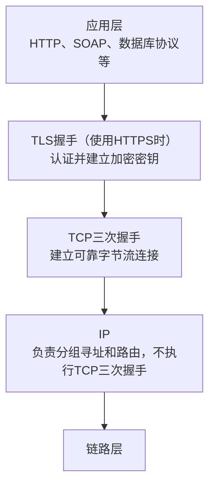
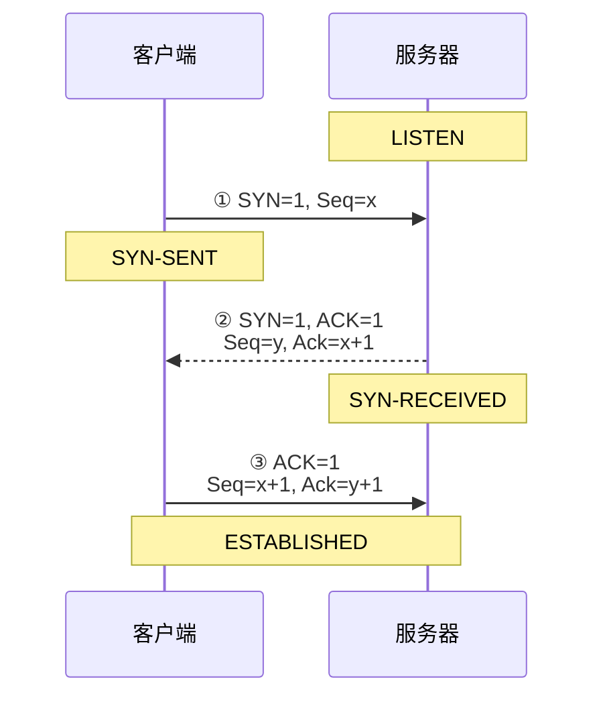
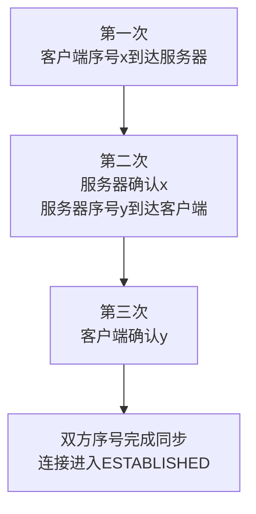
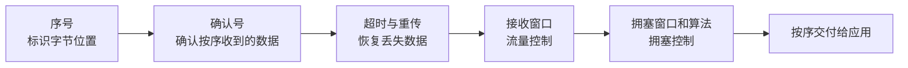
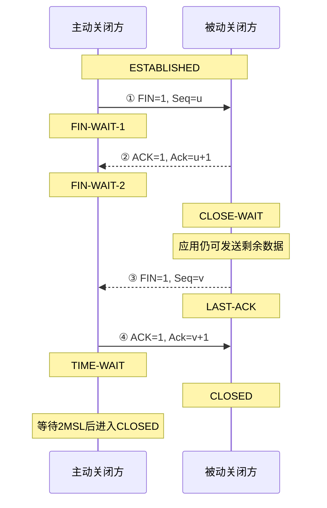
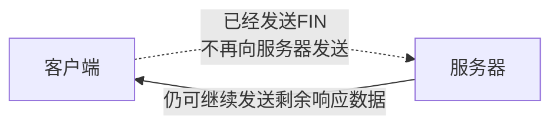
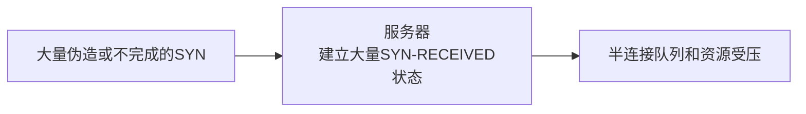
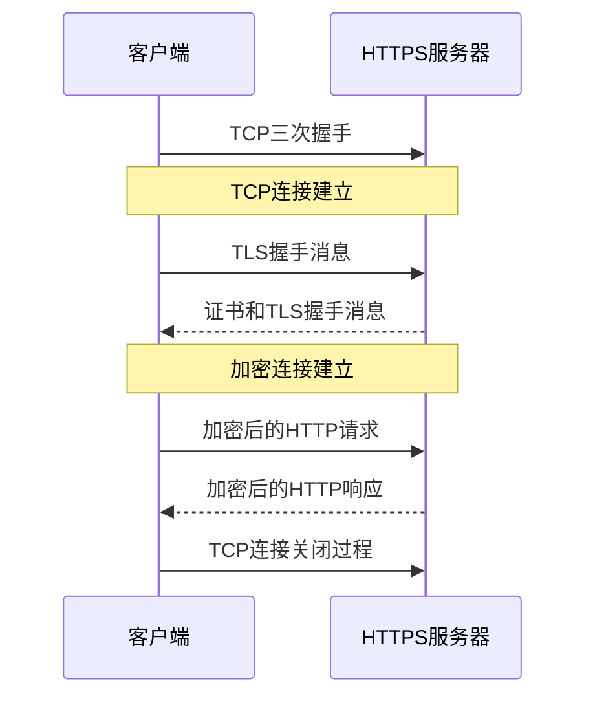
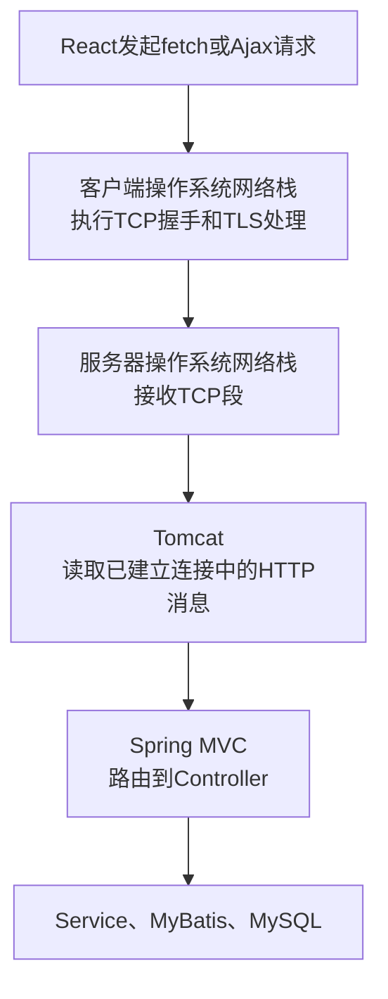

# TCP连接建立与释放

## 前置知识

- [TCP与UDP传输层协议](09-TCP与UDP传输层协议.md)：TCP首部、ACK标志与确认号、Seq与Ack的双向关系，以及TCP与UDP的完整区别。

## 1. 准确名称与协议位置

通常所说的“三次握手”准确名称是**TCP连接建立过程**。它不是整个TCP/IP协议族共同执行的一次握手。



TCP是传输层协议，向应用程序提供：

- 面向连接的通信；
- 双向字节流；
- 按序交付；
- 丢失检测和重传；
- 流量控制；
- 拥塞控制；
- 使用端口号区分应用进程。

TCP连接由两端的IP地址和端口共同标识，通常表示为四元组：

```text
源IP、源端口、目的IP、目的端口
```

例如：

```text
192.0.2.10:52340
→
203.0.113.20:443
```

## 2. TCP首部中的关键字段

| 字段 | 作用 |
|---|---|
| Source Port | 源端口 |
| Destination Port | 目的端口 |
| Sequence Number | 当前段中第一个数据字节的序号；SYN时表示初始序号 |
| Acknowledgment Number | 期望收到的下一个序号 |
| SYN | 同步初始序号，用于建立连接 |
| ACK | 表明确认号字段有效 |
| FIN | 发送方没有更多数据需要发送 |
| RST | 立即复位连接 |
| Window | 告知对方当前还能接收多少数据 |
| Checksum | 检测TCP首部和数据是否出错 |

本章图中采用以下记号：

```text
ACK：
TCP首部中的1位确认标志。ACK=1表示确认号字段有效。

Ack：
对Acknowledgment Number的简写，是32位确认号数值。

Seq：
对Sequence Number的简写，是本方向字节流的序号。
```

`ACK`和`Ack`不是同一个字段，大小写是知识资料为了便于区分采用的写法。完整字段结构和字段独立存在的原因见[《TCP与UDP传输层协议》](09-TCP与UDP传输层协议.md)。

确认号的含义不是“已经收到哪个段的编号”，而是：

```text
Acknowledgment Number
=
接收方下一步希望收到的序号
```

## 3. TCP三次握手

假设客户端选择初始序号`x`，服务器选择初始序号`y`。



### 3.1 第一次

客户端发送：

```text
SYN = 1
Seq = x
```

表达的内容：

- 客户端请求建立TCP连接；
- 客户端选择初始序号`x`；
- 客户端进入`SYN-SENT`状态。

### 3.2 第二次

服务器返回：

```text
SYN = 1
ACK = 1
Seq = y
Ack = x + 1
```

表达的内容：

- 服务器确认收到客户端的SYN；
- `Ack=x+1`表示下一步期待客户端发送序号`x+1`；
- 服务器也选择自己的初始序号`y`；
- 服务器进入`SYN-RECEIVED`状态。

### 3.3 第三次

客户端发送：

```text
ACK = 1
Seq = x + 1
Ack = y + 1
```

表达的内容：

- 客户端确认收到服务器的SYN；
- 双方已经确认彼此的初始序号；
- 连接进入`ESTABLISHED`状态。

第三个ACK可以与应用数据一起发送，并非在所有抓包中都必须是完全不携带数据的独立段。

### 3.4 SYN和FIN占用序号空间

TCP序号主要对字节流中的数据字节编号。SYN和FIN虽然不是普通应用数据字节，但它们会占用序号空间。

因此：

```text
收到SYN，确认号加1
收到FIN，确认号加1
收到N字节数据，确认号加N
```

示例：

```text
客户端发送：
Seq = 1000
携带 200 字节数据

服务器确认：
Ack = 1200
```

表示序号`1000`到`1199`的200个字节已经按序收到，下一步期待序号`1200`。

### 3.5 三次握手建立了什么

三次握手主要完成：

1. 双方确认能够进行双向TCP段交换；
2. 双方同步各自的初始序号；
3. 双方建立TCP连接状态；
4. 双方可以在SYN中协商TCP选项。

常见TCP选项包括：

- MSS：最大报文段数据长度；
- Window Scale：窗口扩大；
- SACK Permitted：允许选择确认；
- Timestamp：时间戳扩展。

三次握手不负责：

- 验证网站证书；
- 加密HTTP数据；
- 检查用户是否登录；
- 判断用户是否具有业务权限；
- 确认Spring应用一定能够正常完成业务操作。

这些分别由TLS或应用层处理。

### 3.6 第三次确认的必要性

第二次传输后，服务器已经确认客户端的SYN，并把自己的SYN发送给客户端。但服务器还不能确定客户端是否已经收到服务器的初始序号。

第三次ACK使服务器确认：

```text
客户端已经收到服务器的SYN
客户端接受服务器初始序号y
客户端能够继续向服务器发送TCP段
```

因此三次握手使两个方向的初始序号都得到对方确认。



## 4. 建立连接后的可靠传输

三次握手只建立连接状态。之后TCP依靠多种机制提供可靠传输：



IP尽力传送分组，但不保证每个分组都到达、按序到达或只到达一次。TCP在IP之上实现可靠、有序的字节流。

## 5. TCP四次挥手

TCP连接是全双工的，两个方向可以分别停止发送。因此正常关闭通常需要双方分别发送FIN并分别确认。

下面假设客户端主动关闭连接：



### 5.1 第一次

主动关闭方发送FIN，表示自己没有更多数据发送，但仍可以接收对方发送的数据。

### 5.2 第二次

被动关闭方确认收到FIN。此时：

- 主动关闭方进入`FIN-WAIT-2`；
- 被动关闭方进入`CLOSE-WAIT`；
- 被动关闭方的应用可以继续发送剩余数据。

### 5.3 第三次

被动关闭方也完成发送后，发送自己的FIN。

### 5.4 第四次

主动关闭方确认对方FIN，随后进入`TIME-WAIT`。

### 5.5 两个发送方向独立关闭

第二次中的ACK只确认第一个方向不再发送。被动关闭方可能仍有数据需要发送，因此它的FIN不能保证立即与ACK一起发出。

```text
客户端FIN
→ 服务器先ACK
→ 服务器继续发送剩余数据
→ 服务器完成后再FIN
→ 客户端ACK
```

如果服务器收到FIN时已经没有数据需要发送，它可以把ACK和自己的FIN组合发送，抓包中可能看到三段完成关闭。但逻辑上两个方向仍然分别完成关闭。

### 5.6 半关闭

TCP允许一个方向停止发送、另一个方向继续发送：



这称为半关闭。FIN的含义是“本端没有更多数据发送”，不是“立即销毁双方全部通信状态”。

## 6. TIME_WAIT

主动关闭方在发送最后一个ACK后通常进入`TIME-WAIT`，等待`2MSL`后再完全关闭。

主要原因：

1. 如果最后一个ACK丢失，对方会重传FIN，主动关闭方仍能再次发送ACK；
2. 等待网络中属于旧连接的延迟TCP段消失，减少它们被后续同四元组连接误认的风险。

`MSL`是Maximum Segment Lifetime，即TCP段在网络中的最大生存时间概念。具体系统采用的等待时长属于实现参数，不应把某一个操作系统的固定秒数当作所有TCP实现的统一标准。

## 7. RST与异常关闭

RST表示复位连接，常见于：

- 目标端口没有应用监听；
- 收到不属于有效连接的TCP段；
- 应用要求立即中止连接；
- 连接状态出现无法继续处理的异常。

RST关闭与正常FIN关闭不同：

| 方式 | 特点 |
|---|---|
| FIN | 有序结束一个发送方向，可以继续接收剩余数据 |
| RST | 立即复位连接，未读取数据可能被丢弃 |

## 8. SYN Flood

服务器收到SYN并发送SYN-ACK后，需要暂时保存半连接状态。如果攻击者大量发送SYN却不完成第三次握手，可能占用服务器连接资源。



常见缓解手段包括SYN Cookies、连接队列调优、速率限制和网络侧防护。

## 9. TCP握手、TLS握手与HTTP请求的顺序

访问传统HTTPS网站时，常见顺序为：



因此：

```text
TCP握手：
建立可靠字节流连接

TLS握手：
认证服务器并协商加密密钥

HTTP请求：
传递GET、POST、URL、字段和内容

应用处理：
Tomcat、Spring Controller和Service执行业务逻辑
```

HTTP/3使用QUIC，不建立传统TCP连接，因此不执行TCP三次握手；QUIC自身集成安全握手和传输连接建立。

## 10. 在Java Web系统中的位置



应用开发者通常不会在Controller里手动编写三次握手。握手由操作系统TCP实现和服务器网络组件完成。Tomcat得到的是已经通过TCP连接传来的HTTP数据。

## 11. 状态主线

主动建立方：

```text
CLOSED
→ SYN-SENT
→ ESTABLISHED
```

监听并接受连接的一方：

```text
LISTEN
→ SYN-RECEIVED
→ ESTABLISHED
```

主动关闭方的常见主线：

```text
ESTABLISHED
→ FIN-WAIT-1
→ FIN-WAIT-2
→ TIME-WAIT
→ CLOSED
```

被动关闭方的常见主线：

```text
ESTABLISHED
→ CLOSE-WAIT
→ LAST-ACK
→ CLOSED
```

## 12. 核心结论

```text
准确名称：TCP三次握手
目的：建立TCP连接并同步双方初始序号

第一次：客户端发送SYN和初始序号x
第二次：服务器确认x，并发送自己的SYN和初始序号y
第三次：客户端确认y

正常关闭通常为四次：
双方分别发送FIN，且对方分别确认

TCP握手不负责：
证书、加密、登录、授权和业务处理
```

## 参考资料

- [RFC 9293：Transmission Control Protocol](https://www.rfc-editor.org/rfc/rfc9293.html)
- [RFC 1122：Requirements for Internet Hosts — Communication Layers](https://www.rfc-editor.org/rfc/rfc1122.html)
- [RFC 8446：TLS 1.3](https://www.rfc-editor.org/rfc/rfc8446.html)
