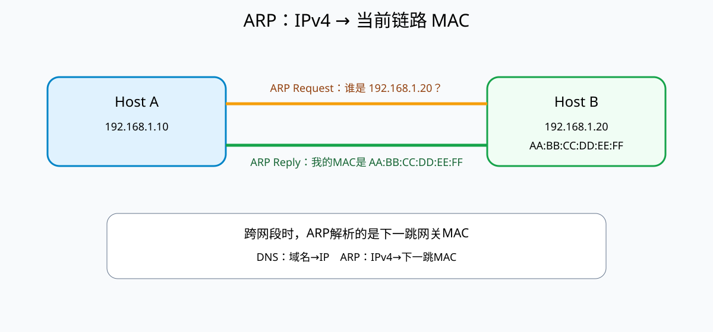

# ARP 地址解析协议

## 1. 为什么有IP地址还需要MAC地址

IP地址和MAC地址解决的是不同层次的问题：

- **IP地址**用于网络层逻辑寻址和跨网络路由；
- **MAC地址**用于当前以太网/Wi-Fi链路上的帧交付。

当主机已经知道目标IPv4地址，却要在当前局域网真正发送一个以太网帧时，还必须知道“这一跳应该写哪个目的MAC地址”。ARP（Address Resolution Protocol，地址解析协议）就是用来完成这种映射。



## 2. ARP最核心的功能

可以先记为：

```text
已知 IPv4 地址
      ↓ ARP
得到本链路目标的 MAC 地址
```

例如：

```text
192.168.1.20
      ↓
AA:BB:CC:DD:EE:FF
```

ARP主要服务于IPv4。IPv6不使用传统ARP，而使用邻居发现协议（NDP）完成相近职责。

## 3. 同一局域网内怎样解析

假设主机A：

```text
IP：192.168.1.10
MAC：00:AA:...
```

要访问同网段主机B：

```text
IP：192.168.1.20
MAC：未知
```

A会在局域网广播ARP Request：

```text
“谁拥有192.168.1.20？请把MAC告诉192.168.1.10。”
```

B收到后单播或按实现规则返回ARP Reply：

```text
“192.168.1.20在AA:BB:CC:DD:EE:FF。”
```

A把映射暂存到ARP缓存，随后构造目的MAC为B的以太网帧。

## 4. 跨网段时解析的不是远端主机MAC

这是最容易误解的地方。

如果A访问互联网服务器：

```text
A：192.168.1.10
目标：8.8.8.8
```

8.8.8.8不在A的本地链路上。A不会通过ARP得到8.8.8.8的MAC，而是先根据路由表选择默认网关，例如：

```text
192.168.1.1
```

然后ARP解析的是：

```text
默认网关192.168.1.1 → 网关网卡MAC
```

数据帧先交给网关，路由器再根据IP地址继续转发。每经过一个不同链路，帧的源/目的MAC都可能重新生成，而IP层负责端到端寻址。

## 5. ARP缓存为什么存在

如果每发送一个数据包都重新广播ARP，请求会非常浪费链路资源。主机通常维护ARP缓存：

```text
IPv4地址        MAC地址                 状态/超时
192.168.1.1   11:22:33:44:55:66       dynamic
192.168.1.20  AA:BB:CC:DD:EE:FF       dynamic
```

动态条目会在一定时间后过期，以适应设备更换、地址变化等情况。

## 6. ARP位于哪一层

ARP把网络层IPv4地址与链路层MAC地址联系起来，因此常被描述为位于**网络层与数据链路层边界**。不同教材可能把它归入网络层相关协议或链路层相关功能。

软考判断时不要只背层号，抓住它的实际职责：

```text
IPv4地址 → 当前链路MAC地址
```

## 7. ARP欺骗为什么可能发生

传统ARP本身缺乏强认证机制。攻击者可以伪造ARP应答，让受害者把某个IP错误映射到攻击者MAC，从而造成中间人、流量劫持或通信中断。

防护可以依赖交换机动态ARP检测、静态绑定、网络隔离以及上层加密认证等机制。HTTPS/TLS可以保护应用数据内容，但不会让ARP本身变成经过认证的协议。

## 8. ARP与DNS不要混

```text
DNS：域名 → IP地址
ARP：IPv4地址 → 本链路MAC地址
```

例如访问：

```text
www.example.com
```

可能先：

```text
DNS解析 → 目标IP
路由判断 → 下一跳IP
ARP解析 → 下一跳MAC
以太网发送 → 下一跳
```

这是不同层次的连续动作。

## 9. 常见考查方式

- “已知IPv4地址，解析MAC地址” → ARP；
- “域名解析为IP” → DNS，不是ARP；
- 跨网段通信时，本机ARP通常解析**下一跳网关**的MAC；
- ARP不是用来寻找TCP端口；
- IPv6使用NDP而不是传统ARP。

## 核心关系

```text
域名 --DNS--> IP
IP + 路由表 → 下一跳IP
下一跳IPv4 --ARP--> 下一跳MAC
MAC用于本链路帧交付
```
