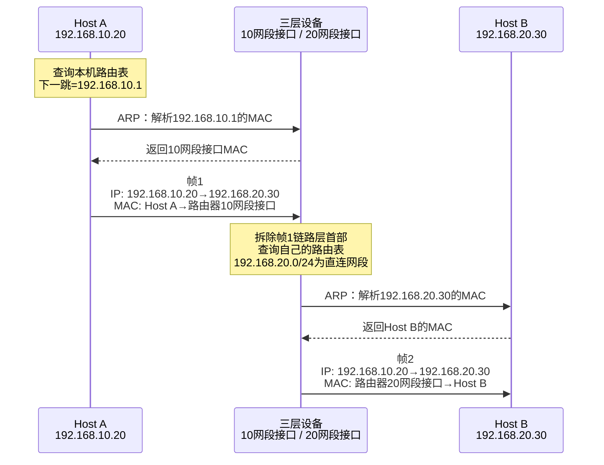
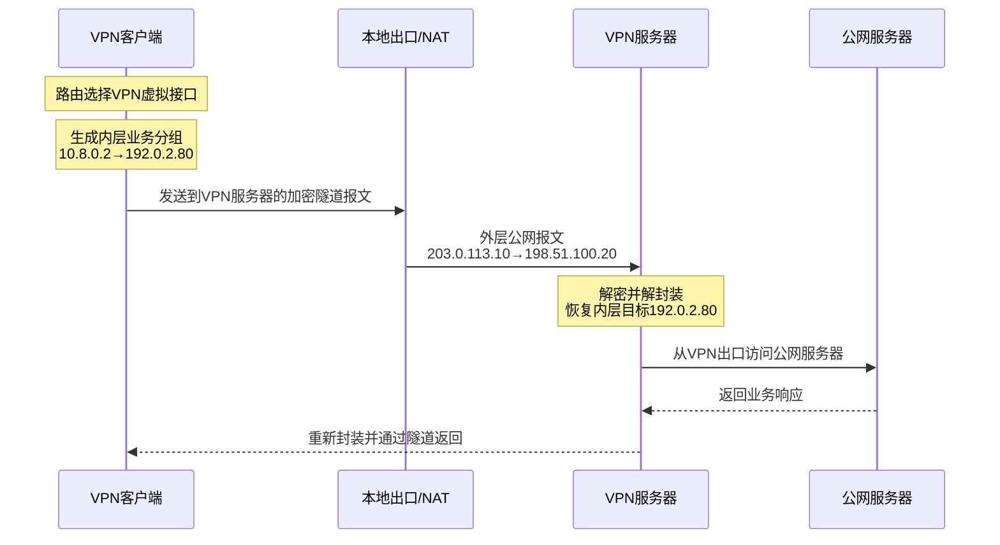

# IP路由与网络互联

## 前置与关联知识

- [网络体系结构与OSI、TCP/IP模型](08-网络体系结构与OSI-TCP-IP模型.md)：网络层、数据链路层以及分层封装的基本关系。
- [ARP地址解析协议](11-ARP地址解析协议.md)：IPv4地址到当前链路MAC地址的解析过程。
- [TCP与UDP传输层协议](09-TCP与UDP传输层协议.md)：IP之上的传输层以及端口的作用。

IP网络需要解决两个不同范围的问题：**最终分组要到哪台主机**，以及**当前这一段链路先把数据交给谁**。前者由IP地址和路由表承担，后者由以太网等链路层完成。路由器正是连接不同IP子网、在这些子网之间转发分组的三层设备。

这两个范围不能混在一起。一个分组的最终目标可以远在多个路由器之后，但当前以太网帧只需要到达本链路上的下一跳设备。

## 1. IP路由的基本模型

主机准备发送IPv4分组时，首先查询**本机自己的路由表**。路由表不是网关专有的数据结构：主机和路由器都需要用它决定某个目标地址应该从哪个接口发出、下一跳是谁。

典型主机路由表会同时包含直连路由和默认路由。例如主机`192.168.10.20/24`可能具有：

```text
192.168.10.0/24    直连，使用本地网卡
0.0.0.0/0          下一跳 192.168.10.1
```

当目标属于`192.168.10.0/24`时，目标主机本身就是当前链路上的交付对象；当目标不属于任何更具体的直连路由时，主机可能匹配默认路由，把分组交给`192.168.10.1`。

路由表得到的是**下一跳IP**。如果下一跳位于以太网链路上，还需要把这个IPv4地址转换成MAC地址，才能形成真正可发送的以太网帧。ARP承担的就是这一步。完整关系是：

```text
最终目标IP
    ↓ 路由查找
出口接口 + 下一跳IP
    ↓ ARP（以太网IPv4场景）
下一跳MAC
    ↓
封装当前链路的以太网帧
```


因此“默认网关”首先是一个**路由意义上的下一跳**。把帧交给网关并不表示IP分组的最终目标被改成了网关。

## 2. 跨子网转发

在一个组织内部，不同IP子网可以通过路由器或三层交换机直接互联。以下使用两个私有子网说明完整过程：

```text
子网A：192.168.10.0/24
Host A：192.168.10.20
网关接口：192.168.10.1

子网B：192.168.20.0/24
Host B：192.168.20.30
网关接口：192.168.20.1
```

最简单的实现中，`192.168.10.1`和`192.168.20.1`可以配置在**同一台三层设备的两个接口**上。两个接口分别属于两个IP子网，也分别具有自己的MAC地址。


Host A向Host B发送数据时，严格的转发顺序如下：



这里存在两个不同的地址变化规律。

**IP层描述端到端通信。** 在没有NAT等地址转换机制时，源IP仍是`192.168.10.20`，目标IP仍是`192.168.20.30`。路由器不会为了“先经过自己”而把目标IP改成自己的接口地址。路由器正常转发时会递减TTL，并相应更新IPv4首部校验和，但源、目标IP保持不变。

**链路层描述当前一跳。** 第一跳的目标MAC是路由器在`192.168.10.0/24`一侧的接口MAC；第二跳则重新封装为路由器在`192.168.20.0/24`一侧的接口MAC到Host B的MAC。

同一台路由器的两个接口之间不存在额外的以太网一跳。第一张以太网帧在入口接口处已经结束，路由器在设备内部完成三层查表和转发，再从出口接口生成一张新的帧。因此不会出现一个独立的“入口接口MAC → 出口接口MAC”帧。

如果中间不是一台而是多台路由器，原理不变：每台路由器都根据目标IP重新查询自己的路由表，每跨越一段新的以太网链路就重新生成该链路的源、目标MAC。

## 3. 企业网络中的多子网组织

企业网络通常不会把所有终端放在一个二层广播域中。常见做法是利用VLAN在二层划分不同逻辑网络，再为不同VLAN配置对应的IP子网，由三层设备负责跨VLAN路由。

例如：

```text
VLAN 10    192.168.10.0/24    网关 192.168.10.1
VLAN 20    192.168.20.0/24    网关 192.168.20.1
VLAN 30    192.168.30.0/24    网关 192.168.30.1
```

“一条VLAN对应一个IP子网”是企业网络中非常常见的设计方式。VLAN解决二层广播域和交换范围，IP子网与三层网关解决跨网络寻址和路由，两者属于不同层次，但通常配合使用。


典型网络中的设备职责可以分为：

- **终端与服务器**：产生和接收业务流量；
- **接入交换机**：在VLAN内部进行二层转发，并把终端接入相应VLAN；
- **三层交换机或路由器**：为各VLAN提供三层网关，在不同IP子网之间转发；
- **出口防火墙或边界路由设备**：实施出入口访问控制，并把内部网络连接到运营商和互联网。

在小型网络里，这些职责可能由一两台设备同时承担；大型网络则常把接入、汇聚、核心、边界和安全设备分开部署。设备数量和层级属于工程实现，基本转发原理仍然是“当前设备查路由表选择下一跳，再由具体链路完成这一跳交付”。

## 4. 私有网络访问互联网

企业网或家庭网中的主机经常使用RFC 1918规定的私有IPv4地址，例如`10.0.0.0/8`、`172.16.0.0/12`和`192.168.0.0/16`。这些地址可以在不同组织内部重复使用，不具有互联网范围内的全局唯一性，因此不会作为普通公网目的前缀在全球互联网中传播。

假设内网主机`192.168.10.20`已经知道一个公网服务器的IP为`192.0.2.80`。以下公网地址均作为示意地址使用。

主机仍然先执行普通路由：它发现`192.0.2.80`不属于本地直连网段，于是把下一跳选为`192.168.10.1`，并通过ARP得到本地网关MAC。此时IP分组仍是：

```text
源IP：192.168.10.20
目标IP：192.0.2.80
```

当分组到达互联网出口时，IPv4私网通常还需要进行源地址转换。假设出口公网地址为`203.0.113.10`，经过SNAT/PAT后，公网看到的分组可能变为：

```text
源IP：203.0.113.10
目标IP：192.0.2.80
```


这里需要把“路由”和“NAT”严格分开：**路由根据目标地址选择下一跳，NAT则主动修改报文中的地址或端口字段。** 默认网关本身不会因为成为下一跳就自动替换目标IP；上例中目标从开始到结束都是公网服务器`192.0.2.80`。

多台内网主机往往共用同一个公网IPv4地址，因此出口设备通常还会利用端口建立连接映射。例如：

| 内部连接 | 公网映射 |
|---|---|
| `192.168.10.20:50000` | `203.0.113.10:62001` |
| `192.168.10.21:50000` | `203.0.113.10:62002` |

公网服务器只需要把响应发回`203.0.113.10`的对应端口。NAT设备根据自己的状态表识别这属于哪条内部连接，再把目标地址和端口还原后交给相应主机。

这也解释了另一个边界：如果目标本身是远端某个独立网络里的`192.168.20.30`，普通互联网无法仅凭这个地址找到它。原因不是“公网转发时必须把目的地址改成远端网关”，而是这个私有地址在全球范围内不唯一，公网路由体系没有一条能够把它唯一定位到某个组织内部网络的普通路由。

## 5. VPN隧道与公网转发

普通互联网能够路由全局可达的公网地址，但两个逻辑上需要互联的网络或终端不一定希望直接按照公网拓扑暴露业务通信。VPN（Virtual Private Network，虚拟专用网络）通过**隧道封装**在已有IP网络之上建立一条逻辑连接，并通常结合加密、认证和完整性保护。

以客户端通过VPN访问公网服务器为例：

```text
本机局域网IP：192.168.10.20
本地公网出口：203.0.113.10
VPN虚拟IP：10.8.0.2
VPN服务器公网IP：198.51.100.20
目标网站公网IP：192.0.2.80
```

VPN客户端建立虚拟接口并安装相应路由后，被选中的业务流量先进入VPN虚拟接口。此时内层业务分组可以表示为：

```text
内层：10.8.0.2 → 192.0.2.80
```

VPN协议随后把这个分组作为载荷进行加密和封装，形成一个以VPN服务器为公网目标的外层报文。经过本地出口NAT后，可以抽象为：

```text
外层：203.0.113.10 → 198.51.100.20
载荷：加密后的内层业务分组
```


公网中间路由器只需要按照外层目标`198.51.100.20`转发。到达VPN服务器后，服务器完成解密和解封装，恢复出内层目标`192.0.2.80`，再按照自己的路由把业务送往最终网站。客户端型商业VPN在向互联网转发时通常还会做出口NAT，因此最终网站看到的源地址通常是VPN服务器或VPN服务商的出口公网地址。

严格的执行关系可以写成：



因此VPN并没有把原始目标“改成VPN服务器”。它创建的是**两个同时存在的寻址层次**：内层描述业务真正要访问谁，外层描述隧道报文在现有公网中要送到哪个VPN端点。

从可见性上看，处于客户端与VPN服务器之间的普通网络观察点主要能够看到外层隧道连接的端点、时间、数据量和流量特征；若VPN隧道正常加密，不能直接把内层业务内容当作普通明文解析。VPN服务器作为隧道终点则需要解密和解封装，因此能够处理真正的业务目标。HTTPS如果同时存在，还会在VPN隧道内部继续保护应用层通信，两种加密处于不同层次。

站点到站点VPN的内层地址形式可以不同于上面的客户端VPN：它可以保留两侧原有的私网源、目标地址。两种形式的共同点都是利用外层可路由地址承载内层逻辑网络流量。

## 6. VRF与重叠地址空间

VPN解决的是“怎样跨越现有网络建立逻辑连接”，但当多个彼此独立的网络使用相同私网前缀时，还会出现另一个问题：单独一个目标IP已经不足以唯一确定应该查询哪套路由。

VRF（Virtual Routing and Forwarding，虚拟路由与转发）允许同一台三层设备维护多套彼此独立的路由和转发表。相同的`192.168.20.0/24`可以同时出现在VRF-A和VRF-B中，而不会被当成同一个地址空间。


VRF的关键顺序是：**先确定路由上下文，再在该上下文中查询目标IP。** 对转发流量，这个上下文可以由入接口、VLAN、隧道、VNI或其他配置关系确定；对本机产生的流量，则可以由绑定接口、源地址、网络命名空间或显式VRF配置确定。

因此如果两套网络都存在`192.168.20.30`，目标IP本身没有能力告诉设备“请选择VRF-A”。必须先有额外的网络上下文，之后`VRF + 目标IP`才能得到唯一的路由解释。

VRF与NAT处理地址重叠的方式不同：VRF保留原地址，通过隔离路由上下文区分；NAT则通过地址转换把冲突的一侧映射成另一个地址空间。VPN又属于另一维度，它负责把逻辑通信跨越底层网络传送。这三种机制可以组合使用，并不互相替代。

## 7. 核心关系

```text
普通IP转发
最终目标IP
→ 查询本机/当前路由器的路由表
→ 得到出口接口和下一跳IP
→ 在当前链路解析下一跳MAC
→ 重新封装链路层帧
→ 进入下一跳

普通路由
→ 源/目标IP通常保持端到端不变
→ TTL逐跳递减
→ MAC随链路逐跳变化

企业网络
→ VLAN划分二层范围
→ IP子网定义三层地址范围
→ 三层设备完成跨子网/跨VLAN路由
→ 边界设备连接互联网

NAT
→ 修改IP地址或端口
→ IPv4私网出互联网时常用于共享公网地址

VPN
→ 在原始业务分组外再建立隧道封装
→ 外层地址负责穿越底层公网
→ 内层地址描述逻辑业务通信

VRF
→ 在同一设备中隔离多套路由上下文
→ 允许相同私网前缀在不同上下文中同时存在
```

## 参考资料

- RFC 1812：Requirements for IP Version 4 Routers
- RFC 1918：Address Allocation for Private Internets
- RFC 3022：Traditional IP Network Address Translator
- RFC 4301：Security Architecture for the Internet Protocol
