# IP路由与企业网络通信

这章把 ARP、路由表、网关、企业内网、NAT、VPN、VRF 串成一条完整链路。先记住最核心的一句话：

> **路由表决定“下一跳 IP”，ARP 解决“下一跳 MAC”；普通路由过程中，最终源/目标 IP 通常不因经过网关而改变，MAC 则按每一跳重新封装。**

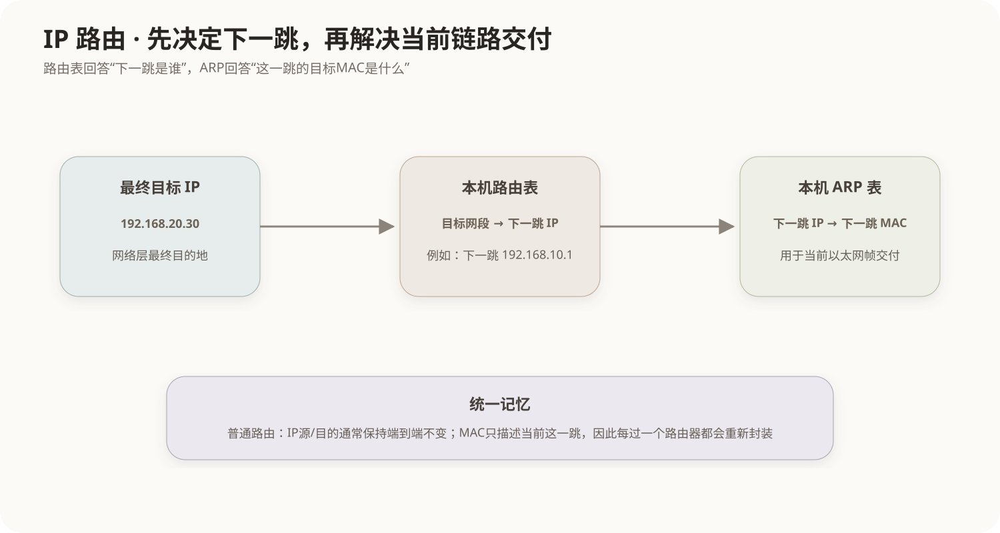

## 1. 同网段与跨网段：先查本机路由表

主机发送 IPv4 分组时，首先依据**本机自己的路由表**判断目标怎么走。

- 目标属于本机直连网段：下一跳就是目标主机本身，ARP 解析目标主机 MAC。
- 目标不属于直连网段：根据路由表选择下一跳，最常见的是默认网关，再 ARP 解析网关 MAC。

因此跨网段时不是去 ARP 远端目标，而是：

```text
目标 IP
  ↓ 本机路由表
下一跳 IP
  ↓ 本机 ARP 表
下一跳 MAC
```

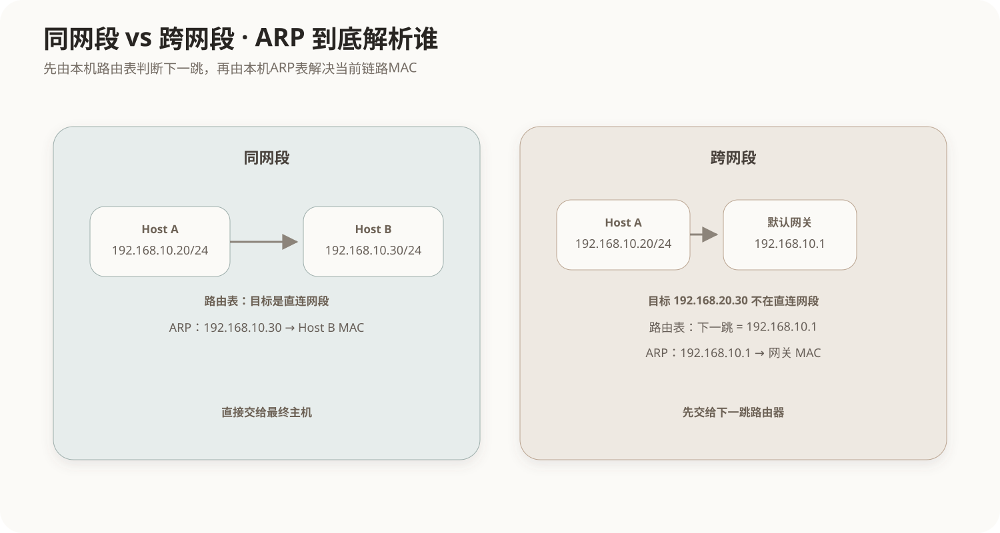

这也是典型软考题的判断方法。例如主机 `192.168.10.20/24` 访问 `192.168.20.30`，默认网关为 `192.168.10.1`，ARP 缓存为空：本机首先解析的是 **`192.168.10.1` 的 MAC**。

## 2. 企业内部两个私有子网怎么直接通信

私网不等于“只能存在一个网段”。企业内部完全可以同时存在：

```text
192.168.10.0/24
192.168.20.0/24
192.168.30.0/24
```

这些私有子网之间只要存在企业内部路由，就可以直接通信，不需要经过公网。

最简单的情况是一台三层设备同时连接两个子网：

- 接口 A：`192.168.10.1/24`，MAC 为 `MAC_R10`
- 接口 B：`192.168.20.1/24`，MAC 为 `MAC_R20`

其中 `192.168.10.1` 和 `192.168.20.1` 不是两台神秘的“网关设备”，而是**同一台路由器/三层交换机上的两个三层接口**。

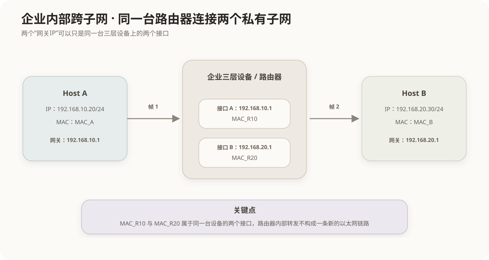

### 2.1 完整发送过程

假设：

```text
Host A：192.168.10.20/24，MAC_A
Host B：192.168.20.30/24，MAC_B
```

**第一步：Host A 查自己的路由表。** 目标 `192.168.20.30` 不在直连网段 `192.168.10.0/24`，于是下一跳为 `192.168.10.1`。

**第二步：Host A 查自己的 ARP 表。** 没有 `192.168.10.1 → MAC` 时发送 ARP，请求得到 `MAC_R10`。

**第三步：Host A 发第一跳以太网帧。** IP 层仍然是 `192.168.10.20 → 192.168.20.30`；二层是 `MAC_A → MAC_R10`。

**第四步：路由器查自己的路由表。** 路由器拆掉第一跳以太网头，发现 `192.168.20.0/24` 是接口 B 的直连网段，因此从接口 B 转发。

**第五步：路由器查自己的 ARP 表。** 因为最终主机 `192.168.20.30` 就在接口 B 的直连网段，所以解析 `192.168.20.30 → MAC_B`。

**第六步：路由器重新封装第二跳帧。** IP 层仍然是 `192.168.10.20 → 192.168.20.30`；二层变成 `MAC_R20 → MAC_B`。

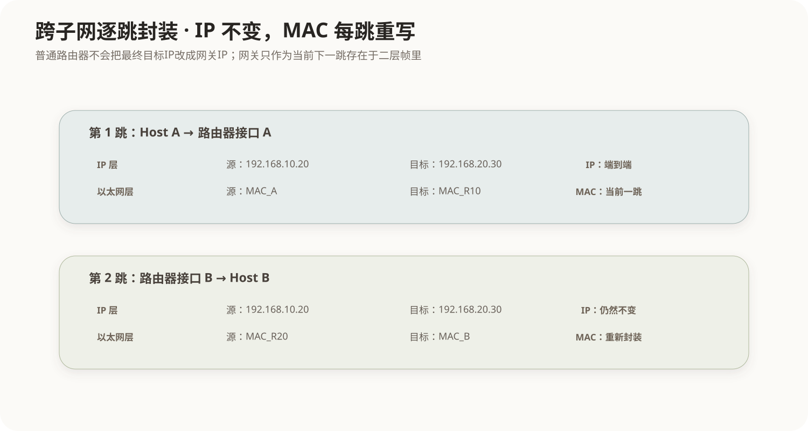

### 2.2 为什么没有 `MAC_R10 → MAC_R20`

因为 `MAC_R10` 与 `MAC_R20` 是**同一台路由器的两个接口 MAC**。第一跳帧到达 `MAC_R10` 后已经结束；路由器内部完成三层查表和内部转发，然后从接口 B 重新生成新的以太网帧。

所以链路上看到的是：

```text
第一跳：MAC_A   → MAC_R10
第二跳：MAC_R20 → MAC_B
```

而不是：

```text
MAC_R10 → MAC_R20
```

“路由器内部转发”不是一条额外的以太网链路。

## 3. 公司内部网络通常怎么搭

典型企业网络可以先按四层理解：

1. **终端**：电脑、服务器、打印机、AP 等。
2. **接入交换机**：主要进行二层转发，并通过 VLAN 把不同部门/业务划成不同广播域。
3. **三层交换机/核心路由器**：给各 VLAN 提供网关，负责不同子网/VLAN 之间的路由。
4. **出口防火墙/网关**：负责访问控制、NAT、互联网出口，再连接 ISP/公网。

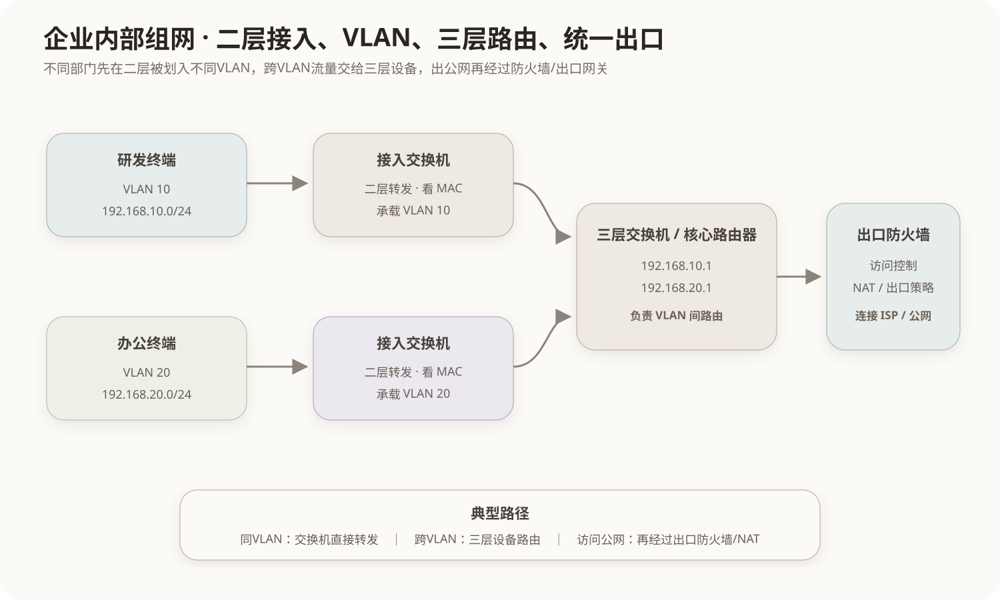

例如：

```text
VLAN 10 → 192.168.10.0/24 → 网关 192.168.10.1
VLAN 20 → 192.168.20.0/24 → 网关 192.168.20.1
```

如果两个网关接口都配置在同一台三层交换机上，那么跨 VLAN 数据只需在这台设备内部完成三层转发。

## 4. 私网主机访问公网 IP

这里先忽略 DNS，假设主机已经知道最终公网服务器 IP 为 `8.8.8.8`。

主机：

```text
192.168.10.20/24
默认网关：192.168.10.1
```

出口设备公网 IP：

```text
1.1.1.1
```

最终服务器：

```text
8.8.8.8
```

流程仍然先遵循普通路由规则：本机查路由表，发现 `8.8.8.8` 不在本地网段，选择 `192.168.10.1`；再查本机 ARP 表得到网关 MAC，并把第一跳帧交给网关。

进入公网前，出口 NAT 设备会把私网源地址转换成公网地址，例如：

```text
主机发出：192.168.10.20 → 8.8.8.8
进入公网：1.1.1.1      → 8.8.8.8
```

**目标 `8.8.8.8` 从一开始就是最终服务器，不会因为经过默认网关而改成 `192.168.10.1`。**

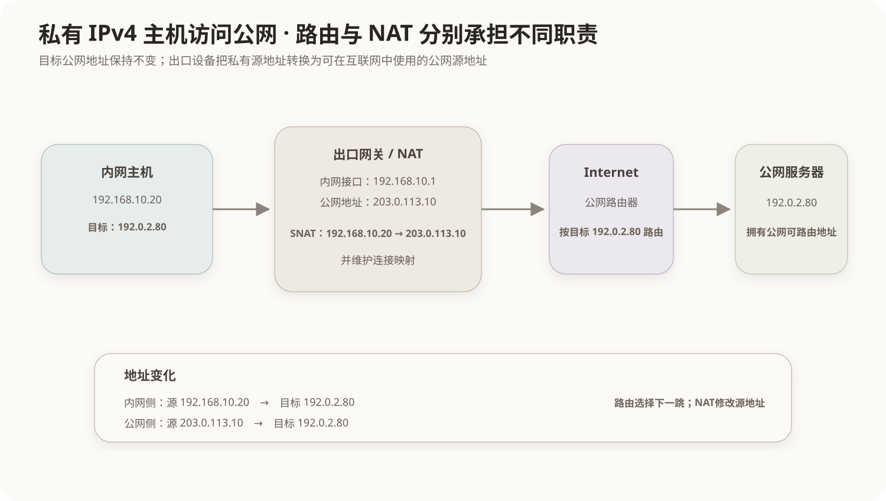

如果服务器本身就拥有公网 IP，那么公网路由可以直接把分组路由到这台服务器，并不需要再把它 DNAT 成某个私网地址。DNAT/端口映射属于“服务器实际藏在另一个私网后面”的另一种部署方式。

## 5. NAT 为什么必须维护映射

如果多台内网设备共用一个公网地址，仅把：

```text
192.168.10.20 → 1.1.1.1
```

改掉还不够。网关还要记住回包应该还给哪台内网主机、哪个连接。

常见 PAT/NAPT 会连端口一起映射，例如：

```text
192.168.10.20:50000
        ↕
1.1.1.1:62001
```

公网服务器只需回复 `1.1.1.1:62001`。回包到达 NAT 网关后，网关查询自己的连接/NAT 状态表，再还原为 `192.168.10.20:50000`。

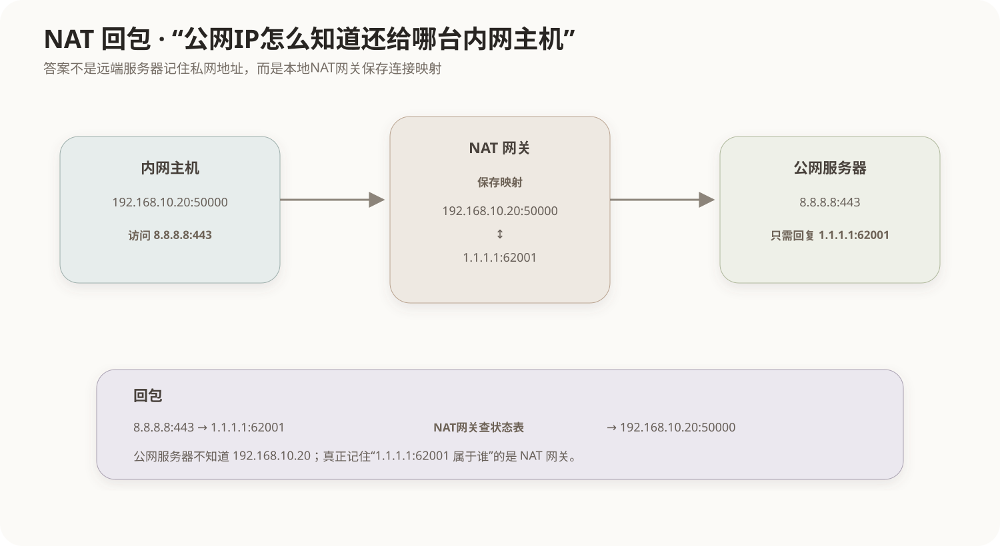

所以：**远端服务器不需要知道 NAT 前的私网地址，真正保留映射关系的是 NAT 网关。**

## 6. 为什么两个私网不能直接跨互联网普通路由

例如：

```text
192.168.10.20 → 192.168.20.30
```

在企业内部可以成立，只要企业内部路由表知道 `192.168.20.0/24` 应该往哪里走。

但放到全球互联网就不成立，因为 `192.168.20.30` 属于私网地址，可以在无数个家庭、公司、实验室中重复出现。公网不能仅凭这个目标地址判断“你到底指全世界哪一个 `192.168.20.30`”。

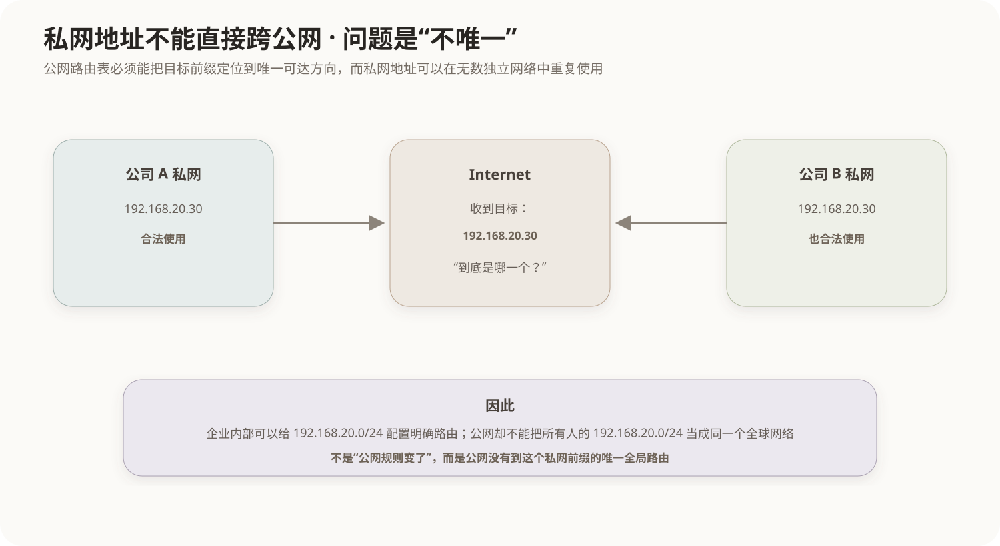

因此问题不是“公网经过网关时会修改目标 IP”，而是：

> **公网没有一条能够把这个重复使用的私网前缀唯一定位到某个远端网络的全局路由。**

## 7. VPN 访问公网的原理

假设：

```text
本机局域网IP：192.168.10.20
本地公网出口：1.1.1.1
VPN虚拟IP：10.8.0.2
VPN服务器公网IP：3.3.3.3
目标网站公网IP：8.8.8.8
```

开启全隧道 VPN 后，系统会存在 VPN 虚拟网卡及相应路由。访问 `8.8.8.8` 的业务流量先交给 VPN 虚拟接口。

原始业务包可以理解为：

```text
内层：10.8.0.2 → 8.8.8.8
```

VPN 客户端不会把这个包的目标“改成 3.3.3.3”，而是把整个原始包加密并再套一层新的公网 IP 头：

```text
外层：1.1.1.1 → 3.3.3.3
里面：10.8.0.2 → 8.8.8.8
```

公网路由器只负责把**外层包**送到 VPN 服务器 `3.3.3.3`。VPN 服务器解密、解封装后重新看到真正目标 `8.8.8.8`，再从自己的公网出口访问目标网站。

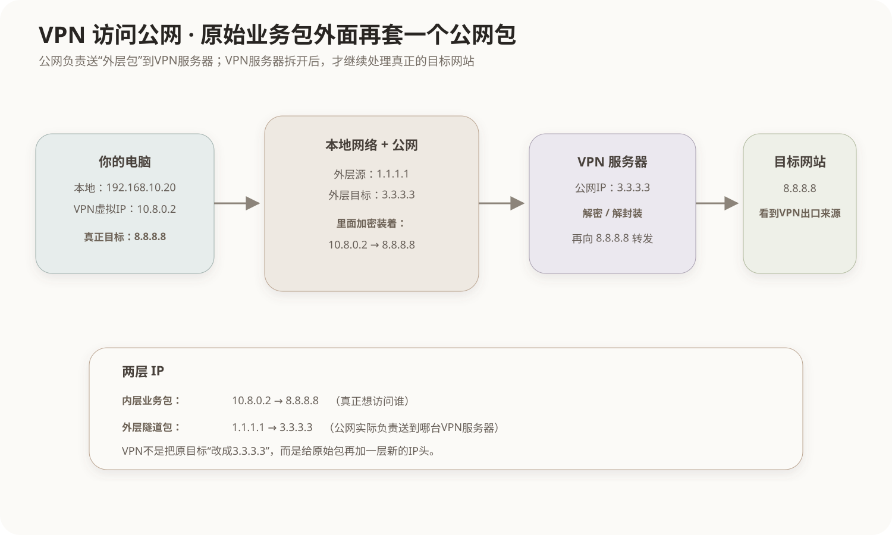

这就是“隧道”的本质：

> **一个完整的原始网络包，被装进另一个网络包里传输。**

## 8. VPN 场景下谁能看到什么

在“终端本机没有额外采集软件、VPN 隧道正常加密”的前提下：

- 本地出口和中间公网：能明显看到设备正在和 VPN 服务器通信，能看到时间、流量、协议特征等；通常不能直接读取隧道内部目标和业务明文。
- VPN 服务器：负责解密/解封装，因此知道隧道用户和真正的外部目标。
- 最终网站：通常看到的是 VPN 服务器的公网出口，而不是用户原本的公网出口。

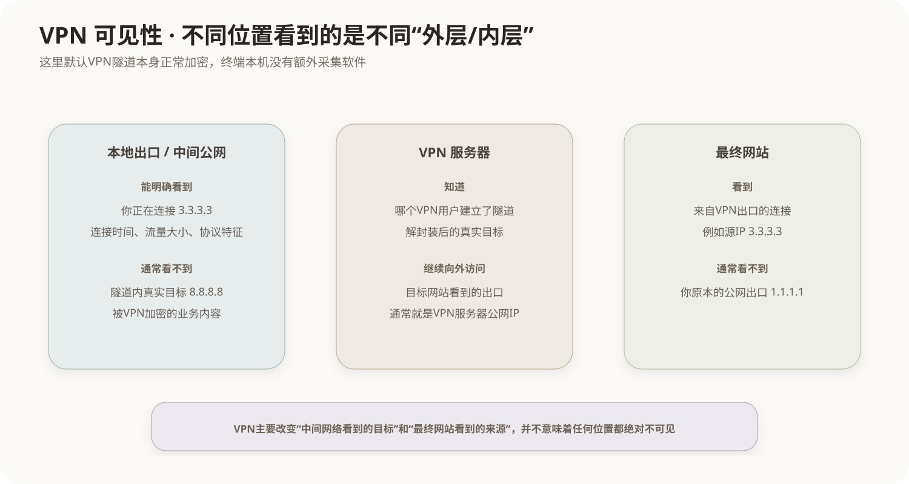

因此 VPN 主要改变了两个观察面：

```text
本地网络看到：你 → VPN服务器
最终网站看到：VPN服务器 → 网站
```

VPN 并不意味着“任何地方都绝对不可见”，只是把不同信息暴露给了不同节点。

## 9. VRF：相同 IP 如何属于不同网络

VRF（Virtual Routing and Forwarding）允许同一台三层设备维护多套互相独立的路由表。

例如两个独立客户都使用：

```text
192.168.20.0/24
```

仅凭目标 `192.168.20.30` 无法判断应该访问哪一个客户。VRF 的关键不是“先看到目标 IP 再猜 VRF”，而是先通过**入口接口、VLAN、网络命名空间、隧道/标签等上下文**确定属于哪套 VRF，再在那套路由表中解释 `192.168.20.30`。

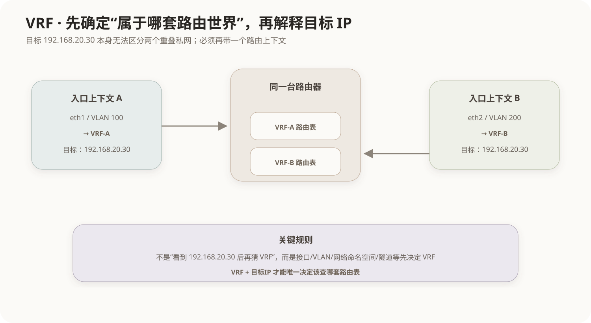

因此可以记为：

```text
上下文 → VRF → 对应路由表 → 目标IP
```

而不是：

```text
目标IP → 自动猜出VRF
```

## 10. 路由、NAT、VPN、VRF不要混

- **普通路由**：根据目标 IP 选择下一跳；经过网关本身不会把最终目标 IP 改成网关 IP。
- **ARP**：把当前链路的下一跳 IPv4 地址解析为 MAC 地址。
- **NAT**：真正修改 IP 地址/端口，并通常维护连接映射。
- **VPN**：在原始包外面再封装一层隧道包，通常同时进行加密。
- **VRF**：地址本身不改，通过不同路由上下文维护多套独立路由表。

最短记忆：

```text
路由表：目标IP → 下一跳IP
ARP：下一跳IP → 下一跳MAC
NAT：改地址
VPN：包外再套包
VRF：换一套路由表看同一个地址
```

## 11. 软考常见判断

- 不同网段通信，本机通常先 ARP **下一跳网关**，不是远端目标主机。
- 路由器每转发一跳，新的以太网帧 MAC 会变化；普通路由中的最终源/目标 IP 通常保持不变。
- 默认网关 IP 是“下一跳”，不是 IP 包的最终目标地址。
- 私网地址可以在企业内部通过内部路由跨子网通信，但不能依赖全球公网普通路由唯一定位到另一个独立私网中的同名地址。
- NAT 解决地址转换；VPN 解决隧道传输；VRF 解决路由上下文隔离，三者不是一回事。
