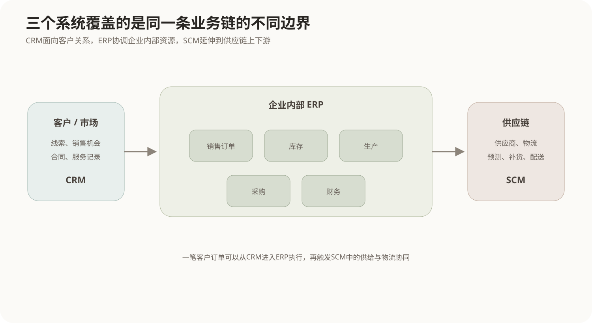
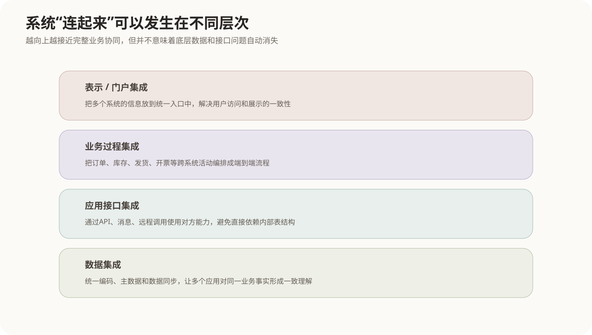

# 企业信息化与应用集成

## 1. 企业信息化为什么不是“多买几个系统”

企业的信息活动天然分散在不同部门：销售关心客户和订单，采购关心供应商，仓库关心库存，生产关心物料和计划，财务关心资金和成本。早期每个部门都可以单独建立自己的信息系统，但系统越来越多以后会出现新的问题：

- 同一个客户在销售系统和财务系统中有不同编号；
- 销售已经签单，但生产和仓库还不知道需求变化；
- 库存数据在一个系统中已经减少，另一个系统仍显示旧数量；
- 同一笔业务需要人工在多个系统重复录入；
- 管理层得到的是各部门分别统计、口径不一致的报表。

所以企业信息化的核心不是单纯把纸面流程改成电子表单，而是让**业务流程、数据和信息系统能力与企业经营目标形成一致结构**。

## 2. 企业中的三类基本流动

可以把企业经营过程先压缩成三类相互关联的流：

```text
物流：原材料、在制品、成品怎样流动
资金流：采购付款、销售收款、成本和预算怎样变化
信息流：订单、库存、计划、客户、供应商等信息怎样传递
```

信息系统的价值在于把前两种现实活动及时映射成第三种信息流，再通过信息反过来协调现实业务。

例如客户下单后：

```text
订单信息
→ 检查库存
→ 不足时触发生产或采购计划
→ 发货后形成应收
→ 收款后更新财务状态
```

如果这些动作分别存在于孤立系统中，就需要大量人工转抄；如果系统能够集成，同一业务事件就可以沿业务链自动传播。

## 3. ERP、CRM与SCM分别覆盖什么范围

企业常见的三个业务系统并不是三个互相替代的产品，而是从不同边界组织企业信息。



### 3.1 ERP：把企业内部资源放到同一经营视角

ERP（Enterprise Resource Planning，企业资源计划）强调企业内部跨部门资源协同。典型范围包括：

- 财务与成本；
- 采购；
- 库存；
- 生产计划与物料；
- 销售订单；
- 人力等企业资源。

ERP的关键不是“有很多模块”，而是这些模块围绕统一业务数据和流程协同。例如销售订单不再只是销售部门的一条记录，它会影响库存、生产、采购、发货和财务。

### 3.2 CRM：围绕客户关系组织业务

CRM（Customer Relationship Management，客户关系管理）主要从市场和客户生命周期出发管理：

- 潜在客户和营销活动；
- 销售机会；
- 客户资料；
- 合同和沟通记录；
- 售后服务与客户关系维护。

ERP更偏企业内部资源和交易执行，CRM更强调“客户是谁、怎样接触、怎样转化和维护”。一个客户在CRM中形成销售机会，成交后相关订单可以进入ERP执行。

### 3.3 SCM：把供应链上下游连起来

SCM（Supply Chain Management，供应链管理）关注从供应商、企业到渠道和客户之间的协同，典型内容包括：

- 需求预测；
- 采购和供应商协同；
- 生产与供给计划；
- 库存配置；
- 物流配送；
- 上下游信息共享。

SCM的边界往往超出单个企业。它处理的是整条供应链怎样减少缺货、过量库存和信息滞后。

## 4. 三类系统为什么最终必须集成

假设一个客户在CRM中签下大订单：

```text
CRM：销售机会 → 成交
           ↓
ERP：生成销售订单 → 检查库存 → 财务记账
           ↓
SCM：若供给不足 → 采购/生产/物流协同
```

如果系统之间没有连接，这些箭头只能由人来完成；一旦系统连接，业务事件就可以沿系统边界继续推进。

因此企业信息化发展到一定阶段后，问题会从“有没有系统”变成“系统之间能不能形成一个业务整体”。这就是企业应用集成（EAI）出现的原因。

## 5. EAI到底在集成什么

EAI（Enterprise Application Integration，企业应用集成）是把原来独立建设的应用系统连接起来，使数据、功能和业务过程能够协同。

集成并不只有“两个接口互相调用”这一层。根据要消除的隔离位置，可以分成多个层次：



### 5.1 数据集成

多个应用共享或同步数据，例如统一客户主数据、产品编码和组织信息。

问题是：直接共享数据库虽然简单，却会让系统彼此依赖对方表结构。一方改表，其他系统可能全部受影响。因此大型系统更常通过数据服务、消息或专门同步机制降低这种结构耦合。

### 5.2 应用接口集成

系统不直接操作对方数据库，而通过API、远程调用、消息等方式使用对方提供的业务能力，例如：

```text
订单系统 → 调用库存查询服务
订单系统 → 发送“订单已创建”消息
```

这种方式把内部数据结构隐藏在应用边界内部，系统之间以稳定接口协作。

### 5.3 业务过程集成

真正跨部门的业务通常不是一次接口调用，而是一串活动：

```text
接收订单 → 校验信用 → 锁定库存 → 安排发货 → 开票 → 收款
```

业务过程集成关注怎样把多个系统的能力编排成一条端到端流程，并处理状态、失败、补偿和人工环节。

### 5.4 表示或门户集成

有时后台系统仍保持独立，但用户希望在一个统一入口看到来自多个系统的信息。这种方式在界面层聚合能力，解决的是统一访问体验，不等于后台数据和流程已经真正统一。

## 6. 点对点集成为什么会逐渐失控

少量系统时，可以让A直接连B、B直接连C：

```text
A ↔ B ↔ C
```

但系统数量增加以后，如果每两个系统都建立私有接口，连接数量会快速膨胀。每个系统还要理解多个对方协议和数据格式，修改成本很高。

因此企业集成常引入中间层，例如消息总线、集成平台或服务层：

```text
       ┌→ ERP
CRM → 集成层 → SCM
       └→ 数据平台
```

集成层可以承担协议转换、消息路由、数据格式转换、服务治理等职责，使业务系统不必彼此形成大量直接耦合。

相关的中间件机制见[构件、中间件与ADL](../09-系统架构设计基础/06-构件中间件与ADL.md)。

## 7. 企业战略怎样转化为信息系统建设

企业信息化不应该从“市场上有什么软件”开始，而应该从企业目标和业务过程开始。

一个简化的规划链是：

```text
企业战略目标
    ↓
识别关键业务过程
    ↓
识别过程需要和产生的数据
    ↓
划分信息系统能力
    ↓
确定建设与集成顺序
```

BSP（Business System Planning，企业系统规划）等方法的核心思想也是从企业业务过程和数据出发，形成相对稳定的信息系统规划，而不是让组织结构的短期变化决定系统边界。

例如“缩短订单交付周期”不是一句IT需求。它需要继续分析：订单经过哪些部门、哪些数据重复录入、哪些等待由系统边界造成，然后再决定应该改ERP流程、连接仓储系统还是重构供应链协同。

## 8. 电子商务和电子政务属于怎样的信息化形态

**电子商务**利用网络信息系统支持交易活动，包括企业与企业、企业与消费者等不同参与关系。它不仅是展示商品的网页，还可能连接订单、支付、库存、物流、客户服务等后台系统。

**电子政务**是政府组织利用信息技术提供公共管理和服务，其参与主体和业务目标不同于企业，但同样会面对跨部门数据共享、业务协同、身份认证和统一门户等集成问题。

因此无论企业还是政府，信息化发展到跨组织、跨部门阶段后，都会从“单个应用建设”进入“数据、服务和流程协同”的问题域。

## 9. 核心关系

```text
企业经营活动
    ↓
物流 + 资金流 + 信息流
    ↓
部门应用系统
    ↓
ERP：内部资源协同
CRM：客户关系与销售过程
SCM：供应链上下游协同
    ↓
系统越来越多产生信息孤岛
    ↓
EAI从数据、接口、流程和门户等层次连接系统
    ↓
最终目标不是“系统连上了”
而是业务过程和数据能够形成统一经营闭环
```
