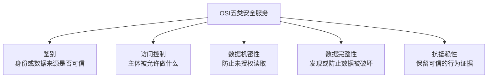

# OSI安全体系结构的五类安全服务

## 标准结论

OSI安全体系结构的五类安全服务是：

1. 鉴别服务（Authentication）
2. 访问控制（Access Control）
3. 数据机密性（Data Confidentiality）
4. 数据完整性（Data Integrity）
5. 抗抵赖性（Non-repudiation）

“鉴别”在现代中文技术语境中也常称“认证”。这里指authentication，不是日常语言中的鉴别物品。

“安全防御”不是ISO 7498-2/X.800规定的五类安全服务之一。

## 五类服务的主要保护目标

### 鉴别服务

确认通信实体的身份，或者确认数据的来源。

继续落地时需要明确：鉴别谁、在什么操作前鉴别、使用什么凭据、凭据如何签发和撤销、如何处理失败及防止冒充。

### 访问控制

防止主体未经授权使用资源，确定某个主体可以对哪些资源执行哪些操作。

身份已经得到确认，不等于该身份有权执行所有操作。

### 数据机密性

防止数据被未授权主体获取或读取。

具体工程中需要明确保护哪些数据、保护数据的哪个状态，以及使用什么加密和密钥管理措施。

### 数据完整性

防止或发现数据遭到未经授权的修改、删除、插入、重放等破坏。

数据没有泄露不代表数据没有被篡改，机密性与完整性是不同的保护目标。

### 抗抵赖性

为相关行为提供证据，防止参与者虚假否认自己曾经实施某项行为。

普通日志并不天然构成充分的抗抵赖证据；还要考虑身份可信度、证据完整性、时间可信度和证据保管等问题。

## 分类的性质与局限

这五类安全服务是标准采用的需求分类，不是五个具体实现方案，也不是系统安全的证明。

它们具有以下特点：

- 都是抽象的服务类别；
- 可以跨越多个OSI层次；
- 可能共享同一种安全机制；
- 会相互依赖；
- 并非完全互斥。

例如，数字签名可能同时支持数据来源鉴别、数据完整性和抗抵赖；访问控制通常依赖身份鉴别。

声称“系统具有五类安全服务”仍然不足以证明系统安全。工程要求还需要继续明确：

- 保护对象；
- 需要防范的威胁；
- 使用的安全机制；
- 性能和强度要求；
- 验收方法；
- 证据和审计要求。

## 关于“安全防御”

“安全防御”在一般中文语境中可以正常使用，也可以泛指安全服务、安全机制和安全管理活动。

它没有出现在X.800规定的五类安全服务列表中，因此不能把它作为该标准正式定义的第六类安全服务。

不应反向声称它必然比五类安全服务更宽泛、更抽象或更不合理。五类安全服务本身也很抽象，并且存在交叉。准确结论只是标准采用了哪些术语，并不表示该分类是唯一合理的理论。

## 官方资料

- ISO 7498-2:1989：https://www.iso.org/standard/14256.html
- ITU-T X.800：https://www.itu.int/rec/T-REC-X.800/en
