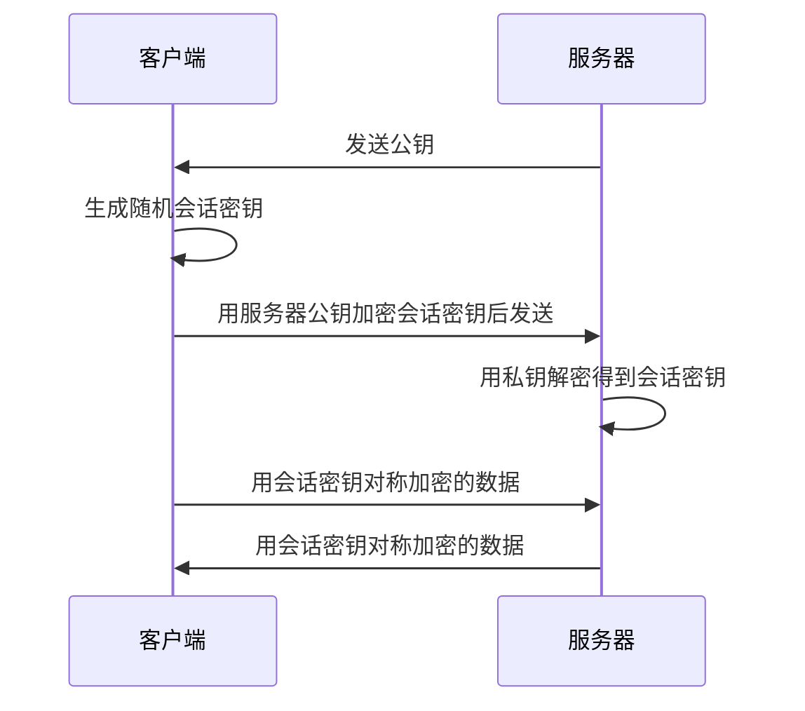

# 对称与非对称加密

加密把明文变换成密文，使信息即使在传输或存储中被截获也无法被读取，是实现机密性的核心手段。按密钥的使用方式，加密体制分为对称加密和非对称加密两类；实际系统几乎都把两者组合起来使用。

## 1. 基本概念

- **明文**是原始信息，**密文**是加密后的结果，**加密**与**解密**是两个互逆的变换。
- **密钥**是控制变换的参数，**算法**是变换规则。
- 遵循柯克霍夫原则：算法是公开的，系统的安全性只依赖密钥的保密，而不是依赖算法本身保密。

密钥的使用方式决定了两种体制的全部差异：加解密用同一把密钥，还是用一对不同的密钥。

## 2. 对称加密

加密和解密使用**同一把密钥**，通信双方必须事先共享这把密钥。

按处理单位分为两类：

- **分组密码**：把明文切成固定长度的块逐块加密，如 DES、AES；
- **流密码**：按位或按字节与密钥流逐位异或，如 RC4。

常见算法：

| 算法 | 密钥长度 | 说明 |
|---|---|---|
| DES | 56 位 | 密钥过短，已被暴力破解淘汰 |
| 3DES | 112/168 位 | DES 的三重加固，兼容旧系统 |
| AES | 128/192/256 位 | 当前主流分组密码，分组长 128 位 |
| SM4 | 128 位 | 国密分组密码 |

分组密码还需指定**工作模式**：ECB 因相同明文块产生相同密文块而不安全；CBC 引入链接与初始向量；GCM 在加密的同时提供完整性校验。

对称加密**速度快**，适合加密大量数据；但**密钥分发困难**，且 n 方两两保密通信需要 n(n−1)/2 把密钥，密钥数量随规模急剧膨胀。

## 3. 非对称加密

使用一对数学上相关的密钥：**公钥公开，私钥保密**。用其中一把加密，只能用另一把解密。

它的安全性建立在难解的数学问题上：

- **RSA**：大整数因子分解；
- **ECC**：椭圆曲线上的离散对数，在同等安全强度下密钥更短、计算更省；
- **DH**：用于在不安全信道上协商出共享密钥；
- **SM2**：基于椭圆曲线的国密算法。

非对称密钥有两个使用方向，方向不能混淆：

- **加密方向**：用**接收方的公钥**加密，只有持有对应私钥的接收方能解密，保证机密性；
- **签名方向**：用**发送方的私钥**签名，任何人用其公钥验证，保证完整性与抗抵赖。

非对称加密**解决了密钥分发问题**并支持数字签名，但运算比对称加密慢几个数量级，**不适合直接加密大量数据**。

## 4. 两种体制对照

| 维度 | 对称加密 | 非对称加密 |
|---|---|---|
| 密钥 | 加解密同一把密钥 | 公钥、私钥一对 |
| 速度 | 快 | 慢 |
| 密钥分发 | 困难，需安全信道预共享 | 公钥可公开，分发容易 |
| 密钥数量 | n 方需 n(n−1)/2 把 | 每方一对，共 2n 把 |
| 典型用途 | 加密大量数据 | 交换密钥、数字签名 |
| 代表算法 | DES、3DES、AES、SM4 | RSA、ECC、DH、SM2 |

## 5. 混合加密

单用对称加密受制于密钥分发，单用非对称加密又太慢。实际方案是**混合加密**：用非对称加密安全地传递一把一次性的对称密钥（会话密钥），随后用这把对称密钥加密真正的数据。

这样既借助非对称加密解决了密钥分发，又用对称加密保证了大数据量的效率。HTTPS 正是这一模式的典型应用，其握手与密钥协商详见[HTTPS与TLS](../02-计算机网络/05-HTTPS与TLS.md)；现代 TLS 多用 ECDHE 协商会话密钥，而不是直接用公钥传输密钥，但"非对称定密钥、对称传数据"的分工不变。

## 6. 常见辨析

- **加密用谁的密钥**：给对方发机密信息，用**对方的公钥**加密；数字签名才用**自己的私钥**。方向记反是最常见的失分点。
- **快慢**：对称快、非对称慢，因此大文件、批量数据一律用对称加密。
- **AES 是对称、RSA 是非对称**，不要记反。
- 非对称加密本身不保证发送者身份，身份与密钥的绑定要靠数字证书与 PKI 体系解决。

## 核心结论

对称加密快但密钥分发难，非对称加密解决分发并支持签名但慢；两者通过混合加密取长补短——非对称加密负责协商或传递会话密钥，对称加密负责加密实际数据。判断题目时，先确认用的是公钥还是私钥、加密还是签名，方向对了绝大多数问题就迎刃而解。

## 相关章节

- [OSI安全体系结构的五类安全服务](01-OSI安全体系结构的五类安全服务.md)
- [HTTPS与TLS](../02-计算机网络/05-HTTPS与TLS.md)
