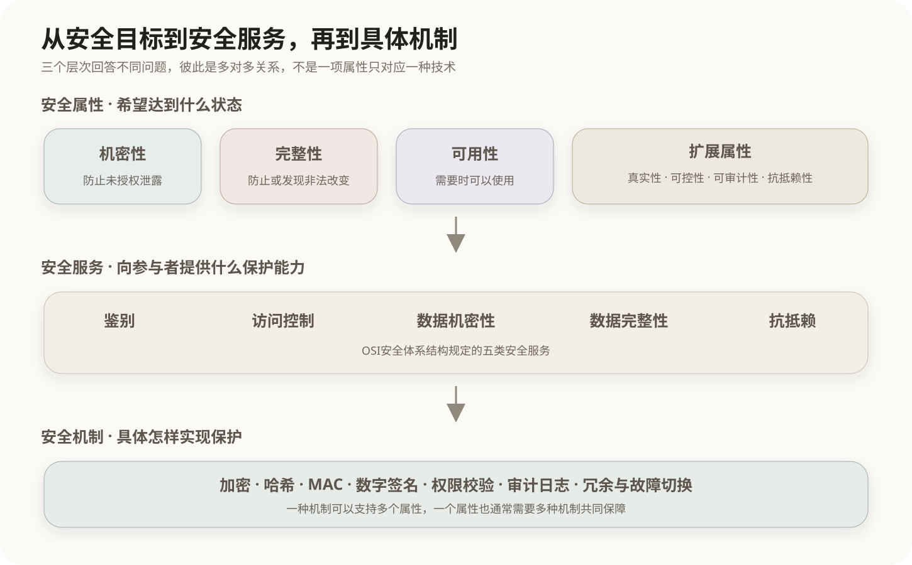

# 信息安全基本属性

## 1. 安全属性的作用

信息安全属性描述系统希望达到的安全状态。它们回答的是“要保护什么”，而不是直接规定“使用哪一种技术”。最基础、最通用的三个属性是机密性、完整性和可用性，合称CIA三要素。

```text
Confidentiality  机密性
Integrity        完整性
Availability     可用性
```

不同教材和标准还会根据讨论范围加入真实性、可控性、可审计性、抗抵赖性等属性。因此，CIA是稳定的基础框架，扩展属性并不存在脱离标准语境的唯一固定清单。



## 2. 机密性

机密性要求信息不被未授权的用户、实体或过程获得或泄露。它关注的是信息是否被不该知道的人看到，而不要求信息一定遭到修改。

典型威胁包括：

- 窃听通信内容；
- 越权读取数据库记录；
- 泄露账号、密钥、合同或个人信息；
- 一个进程非法读取另一个进程的内存。

常见保障手段包括访问控制、数据加密、权限隔离、数据脱敏和安全传输。

```text
泄露、窃取、偷看、未授权读取 → 机密性
```

## 3. 完整性

完整性要求信息保持正确、完整和一致，防止未经授权的修改、插入、删除、伪造或重放。传输或存储故障造成的意外改变，同样属于完整性需要发现或防止的问题。

典型威胁包括：

- 修改文件内容或数据库记录；
- 删除真实数据或插入虚假数据；
- 篡改消息顺序或交易金额；
- 传输错误发生后未被检测出来。

常见保障手段包括哈希、消息认证码、数字签名、数据库约束、事务控制、访问权限和审计日志。

哈希值不同可以表明数据发生变化，但普通哈希本身不能证明修改者身份。需要防止攻击者同时替换数据和哈希值时，应使用带密钥的消息认证码、数字签名或受保护的可信校验值。

```text
篡改、删除、插入、伪造、内容不准确 → 完整性
```

## 4. 可用性

可用性要求获得授权的用户在需要时能够访问信息和使用服务。系统没有泄露或篡改数据，并不代表它具有可用性；如果服务宕机，授权用户仍然无法完成任务。

典型威胁包括：

- 拒绝服务攻击；
- 服务器、存储或网络故障；
- CPU、内存、连接数等资源耗尽；
- 勒索软件导致合法用户无法访问数据。

常见保障手段包括冗余、容错、负载均衡、备份恢复、故障切换、容量控制和拒绝服务防护。

```text
宕机、中断、无法访问、资源耗尽 → 可用性
```

信息安全中的可用性与软件质量模型中的Availability关注点一致，都是“需要使用时能否正常提供服务”；在信息安全语境中，重点还包括攻击和未授权行为对服务连续性的破坏。

## 5. 常见扩展属性

### 5.1 真实性

真实性要求主体、数据来源或信息内容与其声称的身份和来源相符。身份认证、消息来源鉴别和数字证书可以用于建立真实性。

真实性与完整性相关但不相同：一份伪造文件从生成后可能始终没有被修改，因而其比特内容保持完整，却仍然不是真实来源产生的文件。

### 5.2 可控性

可控性要求能够按照授权策略控制信息及系统的访问、处理和传播，包括限制主体能够执行的操作、控制信息流向以及在发现异常时进行阻断。

可控性强调“行为能否被约束和管理”，常通过身份认证、授权、访问控制、网络隔离和策略执行实现。

### 5.3 可审计性

可审计性要求系统能够记录、关联和检查重要行为，使安全事件可以被发现、追踪和分析。审计日志通常需要记录主体、时间、对象、操作和结果，并防止日志被未授权修改。

可审计性提供调查依据，但“记录了操作”并不自动等于证据足以支持抗抵赖，还需要身份可信、时间可信、记录完整等条件。

### 5.4 抗抵赖性

抗抵赖性要求参与者不能否认已经实施的特定行为，例如不能否认发送过某条消息或接收过某份数据。它关注行为证据，通常依赖数字签名、可信时间戳、身份认证和受保护的审计记录。

抗抵赖性既可作为扩展安全属性讨论，也是OSI安全体系结构明确规定的一类安全服务。

## 6. 安全属性、安全服务与安全机制

这三个概念处于不同层次：

| 层次 | 回答的问题 | 例子 |
|---|---|---|
| 安全属性或安全目标 | 希望系统达到什么安全状态 | 机密性、完整性、可用性 |
| 安全服务 | 系统向通信参与者提供什么保护能力 | 鉴别、访问控制、数据机密性、数据完整性、抗抵赖 |
| 安全机制 | 具体通过什么方法实现保护 | 加密、MAC、数字签名、权限校验、审计、冗余 |

三层之间不是严格的一一对应关系：

- 机密性可以由数据机密性服务、访问控制服务以及加密机制共同保障；
- 完整性可以由数据完整性服务以及MAC、数字签名、数据库约束等机制保障；
- 可用性是核心安全属性，但不是OSI 7498-2/X.800列出的五类安全服务之一；
- 数字签名可以同时支持来源真实性、完整性和抗抵赖，但其具体效果取决于密钥、证书和验证过程是否可信。

## 7. 相邻概念辨析

| 场景 | 主要属性 | 判断理由 |
|---|---|---|
| 未授权者读取文件 | 机密性 | 不该知道的人获得了信息 |
| 文件内容被非法修改 | 完整性 | 数据内容发生未经授权的改变 |
| 服务遭攻击后无法访问 | 可用性 | 合法用户无法获得服务 |
| 冒充合法用户登录 | 真实性 | 主体身份与声称身份不符 |
| 用户越权执行管理操作 | 可控性 | 系统没有正确约束操作权限 |
| 无法追查谁删除了数据 | 可审计性 | 缺少可追踪的行为记录 |
| 发送者否认发送过消息 | 抗抵赖性 | 缺少能够约束否认行为的证据 |

机密性和完整性判断的是两个独立问题：

```text
谁能看到信息       → 机密性
信息有没有被改变   → 完整性
需要时能否使用     → 可用性
身份或来源是否真实 → 真实性
行为能否受到控制   → 可控性
行为能否被追查     → 可审计性
行为能否被否认     → 抗抵赖性
```

## 核心关系

```text
CIA三要素
├── 机密性：防止未授权泄露
├── 完整性：防止或发现未授权改变
└── 可用性：保证授权用户需要时可以使用

扩展属性根据教材或标准语境加入：
真实性、可控性、可审计性、抗抵赖性等
```

相关章节：[OSI安全体系结构的五类安全服务](01-OSI安全体系结构的五类安全服务.md)、[对称与非对称加密](02-对称与非对称加密.md)、[软件产品质量模型](../05-软件工程基础/06-软件产品质量模型.md)。

