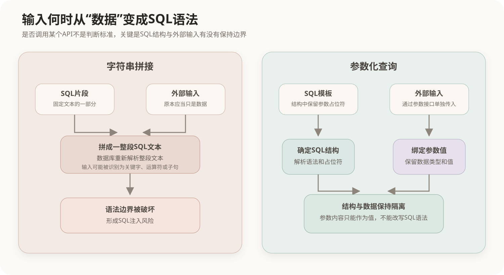
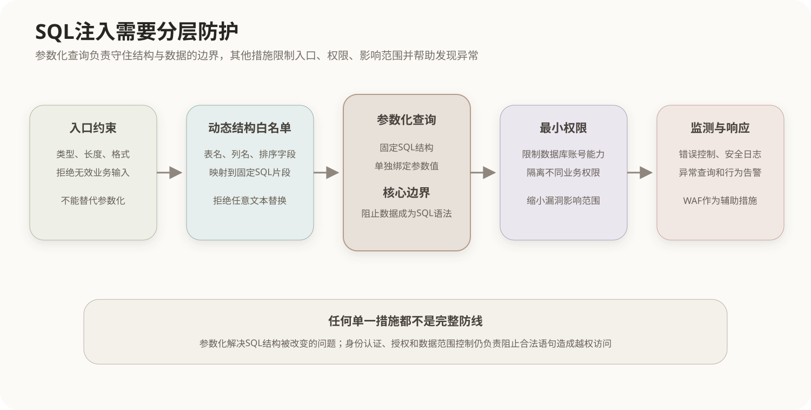

# SQL注入攻击与防护

SQL注入是应用程序未能正确隔离外部输入与SQL语法结构，导致输入内容被数据库解释为查询语句一部分的攻击。漏洞虽然最终在数据库中产生影响，但根源通常位于应用程序构造SQL的过程，因此属于典型的应用安全问题。

## 1. SQL注入的基本原理

一条SQL同时包含固定的语法结构和运行时数据：

```sql
SELECT id, name FROM users WHERE name = ?;
```

其中表名、列名、关键字和运算符构成SQL结构，`?`所代表的用户名属于数据。安全实现应当让两者沿不同通道进入数据库；如果应用程序直接把外部输入拼进SQL文本，数据与语法的边界就会消失。



SQL注入通常需要同时具备以下条件：

1. URL参数、请求体、Cookie、请求头、文件内容或消息数据等外部输入能够到达SQL构造过程；
2. 应用程序使用字符串拼接、模板替换等方式把输入写入SQL结构；
3. 数据库执行了被改变的SQL；
4. 查询结果、错误差异、响应时间或数据状态向外暴露了可利用的效果。

输入校验不严格会增加风险，但根本问题不是输入中出现了某个特殊字符，而是输入获得了改变SQL结构的能力。

## 2. SQL注入的攻击过程

SQL注入通常沿着以下路径发展：

```text
发现可控输入
    ↓
判断输入是否进入SQL结构
    ↓
改变查询条件或查询组成
    ↓
识别数据库结构和当前权限
    ↓
读取、修改数据或扩大影响
```

实际影响由SQL类型、数据库账号权限、数据库配置和应用程序回显能力共同决定，可能包括绕过查询条件、读取越权数据、修改或删除记录以及破坏数据完整性。数据库账号采用最小权限时，即使应用层出现漏洞，也能限制攻击范围。

## 3. SQL注入的主要类型

| 类型 | 工作方式 | 主要观察结果 |
|---|---|---|
| 联合查询注入 | 利用`UNION`把另一条查询的结果并入原结果集 | 页面或接口返回额外数据 |
| 报错注入 | 构造会携带数据库信息的错误 | 数据库错误消息 |
| 布尔盲注 | 构造真假条件并比较两种响应 | 内容、状态或长度差异 |
| 时间盲注 | 让真假条件产生不同的执行时间 | 响应时间差异 |
| 堆叠查询注入 | 在数据库和驱动允许时附加另一条语句 | 数据状态或后续行为变化 |

“盲注”表示应用程序没有直接显示查询结果，攻击者仍可从真假响应或时间差异逐步推断信息。`UNION`只是常见利用方式之一，并不是SQL注入形成的原因。

## 4. SQL注入的防护体系

参数化查询是处理数据值时最重要的防护措施。数据库先接收固定的SQL结构，再接收具有明确类型的参数值；参数中的引号、关键字或运算符只属于该值，不会重新参与SQL语法解析。

```text
SQL模板： SELECT ... WHERE name = ?
参数值：  用户提交的字符串
结果：    字符串只能作为name的比较值
```

参数绑定是防注入的核心。预编译则描述SQL被解析、编译或复用执行计划的过程，主要与执行机制和性能有关。两者经常通过同一个API同时出现，但不能视为同一概念：

- 参数绑定使SQL结构与数据分离，直接承担防注入作用；
- 预编译可能减少重复解析并复用执行计划，但把已经拼接完成的SQL交给预编译接口并不能消除注入；
- 某些驱动会模拟预处理，只要仍能正确隔离SQL结构和参数，也可以实现安全的参数化查询。

表名、列名、排序字段和`ASC`、`DESC`等SQL结构通常不能作为普通值参数绑定。此类动态结构应由程序把有限的业务选项映射为预先定义的SQL片段，而不能直接使用用户提交的文本。

```java
String orderBy = switch (sortField) {
    case "name" -> "name";
    case "createdTime" -> "created_time";
    default -> "id";
};
```

完整防护还应包括数据库账号最小权限、输入长度和格式约束、生产环境错误信息控制、安全日志与异常查询监测。WAF和检测规则可以拦截部分已知模式，但不能代替应用代码中的参数化查询。



## 5. 应用程序中的安全实现

### 5.1 JDBC与PreparedStatement

安全写法使用占位符并单独绑定参数：

```java
String sql = "SELECT id, name FROM users WHERE name = ?";
PreparedStatement ps = connection.prepareStatement(sql);
ps.setString(1, name);
```

下面的代码虽然调用了`PreparedStatement`，但输入已经提前进入SQL文本，因此并未形成参数化查询：

```java
String sql = "SELECT id, name FROM users WHERE name = '" + name + "'";
PreparedStatement ps = connection.prepareStatement(sql);
```

判断代码是否安全，不能只看是否出现`PreparedStatement`类名，而要看外部数据是否通过占位符和参数绑定传入。

### 5.2 ORM框架中的参数绑定

JPA、Hibernate、MyBatis等框架通常提供参数绑定机制，规范使用可以显著降低SQL注入风险。ORM并不会使注入自动消失：拼接原生SQL、把输入直接替换进查询模板、动态生成标识符，仍可能破坏结构与数据的边界。

在MyBatis中，`#{value}`通常生成参数占位符并绑定值；`${value}`进行文本替换，输入可能直接成为SQL文本。需要动态生成表名、列名或排序字段时，应在应用程序中使用固定映射或白名单。

### 5.3 动态SQL的安全处理

动态条件应优先使用框架提供的条件构造器和参数绑定。无法绑定的结构元素按以下方式处理：

1. 将用户可选项限制为有限的业务枚举；
2. 在程序内部把枚举映射为固定列名或SQL片段；
3. 拒绝任何未定义选项；
4. 数据值仍然使用参数绑定，不因为存在动态结构而整体改用字符串拼接。

## 6. 防护边界与残余风险

参数化查询主要解决“外部数据改变SQL语法结构”的问题，但不能自动解决越权访问、业务逻辑缺陷、弱口令、数据库配置错误和过大的账号权限。合法参数同样可能触发越权查询，因此应用程序仍需进行身份认证、权限校验和数据范围控制。

输入校验与参数化查询也不能互相替代：参数化查询保证数据不会成为SQL语法；输入校验保证数据符合业务格式。两者解决的问题不同，应当同时存在。

## 核心关系

```text
SQL注入的根因
= 外部输入能够改变SQL结构

核心防护
= 固定SQL结构 + 参数绑定

参数绑定
→ 隔离语法与数据
→ 直接防止数据值变成SQL指令

预编译
→ 解析、编译或复用执行计划
→ 可能提高重复执行效率
→ 不能挽救已经完成的危险字符串拼接

ORM
→ 通常提供参数绑定能力
→ 能降低风险，但不等于自动安全

完整防护
= 参数化查询 + 动态结构白名单 + 最小权限
  + 权限校验 + 错误控制 + 日志监测
```

相关章节：[HTTP消息与Web请求](../02-计算机网络/04-HTTP消息与Web请求.md)、[HTTPS与TLS](../02-计算机网络/05-HTTPS与TLS.md)、[数据库三级模式](../08-数据库设计/01-数据库三级模式.md)。
