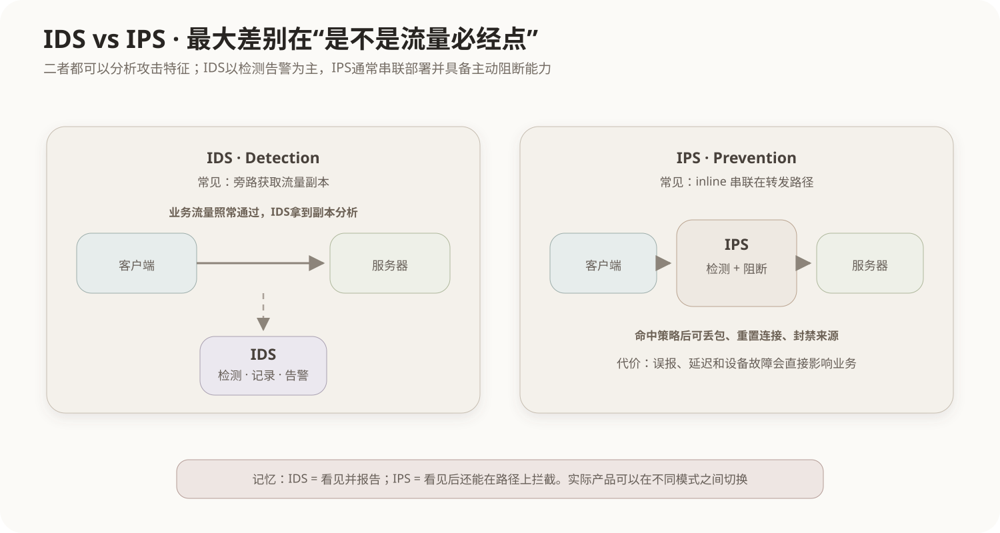

# IDS 与 IPS 入侵检测、防御

## 1. 为什么防火墙之外还需要检测攻击行为

传统防火墙擅长按照地址、端口、连接状态和策略决定流量能不能通过，但“允许通过的流量”仍可能包含攻击行为，例如：

- 针对公开Web服务的漏洞利用；
- 恶意扫描和异常协议行为；
- 内网主机被攻陷后的横向移动；
- 已允许端口上的攻击载荷。

IDS和IPS关注的是：**流量或主机行为是否表现出入侵特征，以及发现后要不要主动阻断。**

## 2. IDS：入侵检测系统

IDS（Intrusion Detection System）主要负责监视、分析和告警。

典型网络IDS（NIDS）通过镜像端口、网络TAP等方式获得流量副本：



因为IDS通常不必成为业务流量的必经转发节点，所以即使IDS自身故障，通常不会直接把业务链路切断；但它也往往只能发现并告警，不能天然阻止已经经过原路径的报文。

## 3. IPS：入侵防御系统

IPS（Intrusion Prevention System）不仅检测攻击，还通常部署在数据流量的**串联路径（inline）**上：

```text
客户端 → IPS → 服务器
```

发现恶意流量后可以采取：

- 丢弃报文；
- 重置连接；
- 临时封禁来源；
- 触发其他联动策略。

因此“检测后能够主动阻断”是IPS最典型的识别特征。

## 4. IDS和IPS不是“一个只能看日志、一个只能拦截”

两者都可能具备日志、告警、协议解析和攻击识别能力。真正的核心区别在于：

```text
IDS：Detection为主，常旁路部署
IPS：Prevention为主，常串联部署并可直接阻断
```

实际产品可能同时提供IDS/IPS模式，因此判断题要看部署方式和处置能力，而不是只看厂商名称。

## 5. 检测方法：特征与异常

### 特征检测 Signature-based

把流量或行为与已知攻击特征匹配：

```text
已知恶意模式 → 规则库 → 命中 → 告警/阻断
```

优点是对已知攻击识别明确；缺点是对未知变种依赖规则更新。

### 异常检测 Anomaly-based

先建立正常行为基线，再识别明显偏离：

```text
正常基线
  ↓
当前行为显著异常
  ↓
可疑事件
```

可能发现未知攻击，但更容易产生误报，需要调优。

## 6. NIDS与HIDS

按照观察位置还可以区分：

- **NIDS（Network IDS）**：观察网络流量；
- **HIDS（Host IDS）**：部署在主机上，观察日志、进程、文件变化、系统调用等。

同理，防御能力也可以存在网络或主机侧实现。题目出现“监视某台服务器文件完整性”时更接近主机侧检测，而不是网络链路中的NIDS。

## 7. IDS/IPS与防火墙、WAF的关系

| 机制 | 主要关注 |
|---|---|
| 防火墙 | 网络访问控制、地址端口、连接和策略 |
| IDS | 发现可疑入侵并告警 |
| IPS | 发现并主动阻断可疑攻击流量 |
| WAF | Web/HTTP应用层请求攻击，如SQL注入、XSS等 |

现代安全设备可能把多种能力集成在一起，但考试中应按照题目描述的主要职责判断。

## 8. 串联部署的代价

IPS放在必经路径上意味着：

- 可以及时阻断；
- 但处理延迟和吞吐能力会直接影响业务；
- 错误规则可能误杀正常流量；
- 设备故障需要考虑旁路、HA和Fail-open/Fail-close策略。

所以“IPS一定比IDS更好”并不成立。二者的选择取决于可接受风险、性能和误报成本。

## 9. 常见考查方式

- IDS主要检测、记录、告警；
- IPS通常可在检测后主动阻断；
- IDS常旁路，IPS常inline；
- “IDS一定处于所有数据包的转发路径上”错误；
- “IPS只能记录日志，不能阻断”错误；
- IDS/IPS与防火墙职责相关但不完全相同。

## 核心关系

```text
IDS：看见攻击 → 告警
IPS：看见攻击 → 告警 + 可直接阻断

Detection ≠ Prevention
是否处于转发路径，是理解二者的重要物理差异
```
