# 软件生命周期与过程模型

## 1. 生命周期与过程模型的作用

软件开发模型描述需求、分析、设计、编码、测试、交付和维护等活动怎样组织，包括活动的先后顺序、是否可以反复、怎样交付以及如何处理变化和风险。

不同模型强调的维度不同：

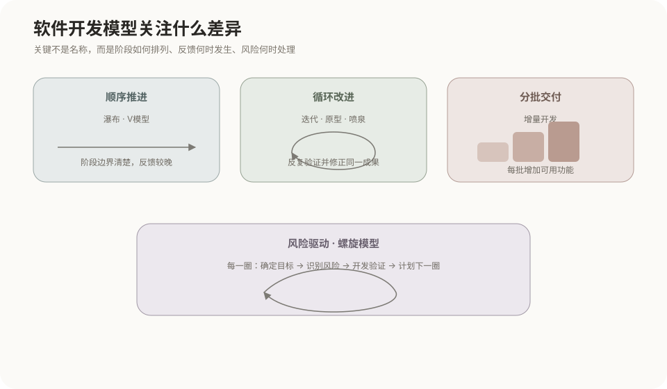

因此，迭代、增量、风险驱动和活动交叠不是同一个分类角度，一个项目可以同时具备多个特征。

## 2. 常见开发模型总览

| 模型或方式 | 核心组织方法 | 主要关注点 |
|---|---|---|
| 瀑布模型 | 需求、设计、编码、测试依次推进 | 阶段划分和文档 |
| V模型 | 开发阶段与测试阶段建立对应关系 | 验证与确认 |
| 原型模型 | 先建立可运行原型，再确认或演化需求 | 降低需求不确定性 |
| 增量模型 | 把完整功能拆分成多个部分交付 | 尽早提供部分可用能力 |
| 迭代模型 | 对已有系统进行多轮修订和完善 | 持续改善已有成果 |
| 螺旋模型 | 每轮显式识别、评估和处理风险 | 风险驱动的迭代 |
| 喷泉模型 | 面向对象活动反复进行并相互交叠 | 阶段间的连续性和并行性 |
| RAD | 借助原型、工具、复用和并行开发快速构建 | 缩短开发周期 |
| 构件组装模型 | 选择、适配并集成已有构件 | 软件复用 |
| 统一过程UP/RUP | 用例驱动、架构为中心、迭代增量 | 中大型面向对象开发 |

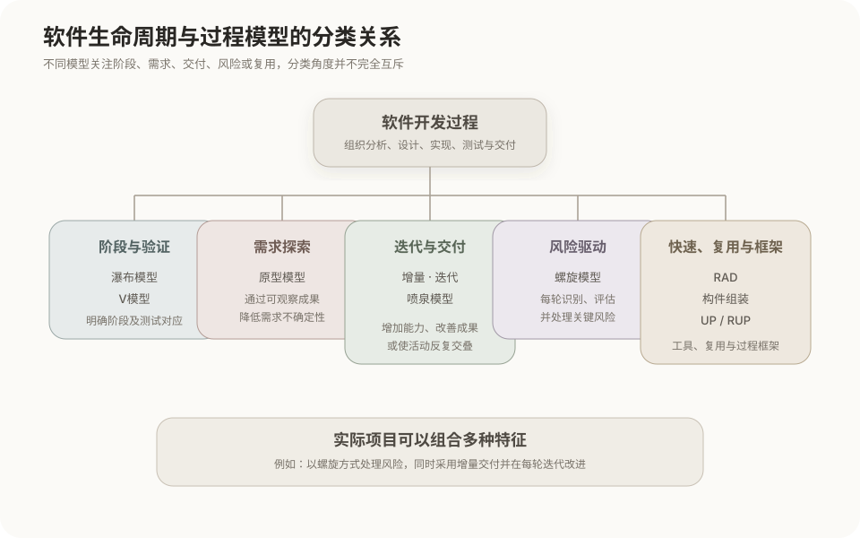

## 3. 瀑布模型

瀑布模型把开发工作划分为相对明确的阶段，通常在前一阶段达到规定成果后进入下一阶段。

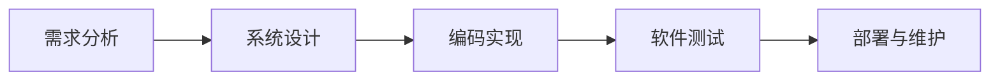

主要特点：

- 阶段边界和文档要求明确；
- 便于按阶段计划、审查和管理；
- 较晚发现需求或设计问题时，返回修改的成本较高；
- 适合需求较明确、变化较少、过程要求严格的项目。

瀑布模型可以进行项目风险管理，但没有把风险分析规定为每轮开发的核心结构。

## 4. V模型

V模型在阶段式开发基础上强调开发活动与测试活动的对应关系。

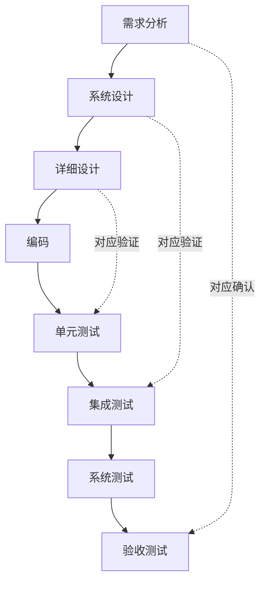

V模型要求在相应开发阶段考虑后续验证方法，使测试不再只是编码结束后的单独活动。其突出重点是验证和确认，而不是分批交付或风险驱动。

## 5. 原型模型

原型模型先快速建立能够展示界面、流程或关键能力的原型，通过实际反馈明确需求。

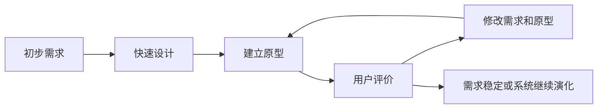

- **抛弃型原型**：用于发现和确认需求，完成目标后舍弃，再按正式架构开发。
- **演化型原型**：不断改善原型，使其逐步发展为正式系统。

原型模型适合需求难以一次描述清楚、交互复杂或需要验证业务流程的系统。界面能够运行不代表性能、安全、异常处理和架构已经完成。

## 6. 增量模型

增量模型把完整系统按照功能范围拆成多个可运行部分，分批开发和交付。

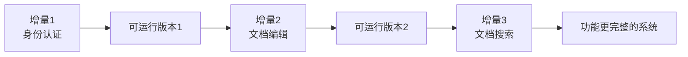

增量模型关注的是**每次增加并交付哪部分新功能**。它可以让用户较早获得核心能力，并把开发和交付压力分散到多个批次。

基本判断方式：

```text
此前没有该功能
→ 当前版本加入该功能
→ 属于功能增量
```

## 7. 迭代模型

迭代模型让同一个系统经历多轮开发，每一轮都在已有成果上修正、完善或提高质量。

```text
第1轮：实现基本搜索
第2轮：提高搜索准确度
第3轮：优化搜索速度
第4轮：增加错别字匹配能力
```

迭代关注的是**已有系统怎样经过多轮完善**。

基本判断方式：

```text
已有某项能力
→ 当前版本继续修正或改善这项能力
→ 属于迭代
```

### 迭代与增量

```text
迭代：改进已经存在的内容。
增量：增加原来不存在的新内容。
```

两者可以同时发生：

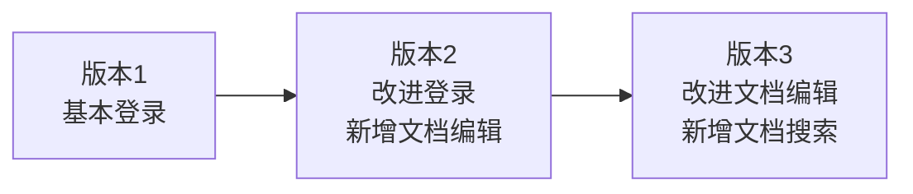

- 改进登录和文档编辑属于迭代；
- 新增文档编辑和文档搜索属于增量。

实际项目经常采用迭代增量式开发，在每轮中既完善旧功能，也增加新功能。

## 8. 螺旋模型

螺旋模型是一种风险驱动的迭代模型。每一轮都要明确目标和候选方案，识别关键风险，通过原型、试验或其他措施降低风险，然后再开发和规划下一轮。

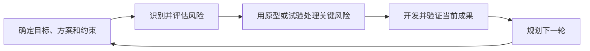

风险可能来自：

- 技术方案是否可实现；
- 性能是否达到要求；
- 需求是否稳定；
- 成本和工期是否可能失控；
- 关键外部依赖是否可靠；
- 数据、安全或合规要求是否能够满足。

### 螺旋与普通迭代

| 对比项 | 普通迭代 | 螺旋模型 |
|---|---|---|
| 是否多轮进行 | 是 | 是 |
| 是否逐步完善系统 | 是 | 是 |
| 每轮是否明确设置风险分析 | 不一定 | 是 |
| 每轮主要驱动力 | 功能、反馈或改进目标 | 当前最关键的风险 |
| 常见范围 | 各类需要逐步完善的项目 | 大型、复杂、高风险项目 |

```text
螺旋模型属于迭代式开发。
迭代式开发不一定是螺旋模型。
螺旋模型 = 多轮迭代 + 显式风险分析与风险处理。
```

### 螺旋与增量

增量描述每次交付多少新功能，螺旋描述每轮如何处理风险，两者可以同时使用：

```text
第一轮：处理身份认证的安全风险，交付身份认证。
第二轮：处理文件存储的可靠性风险，交付文件管理。
第三轮：处理搜索性能风险，交付文档搜索。
```

这个过程既是风险驱动的螺旋过程，也采用了功能增量交付。

## 9. 喷泉模型

喷泉模型主要用于描述面向对象开发中分析、设计、编码和测试等活动的反复与交叠。

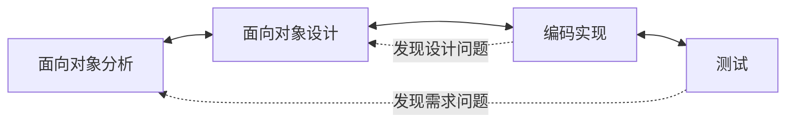

“喷泉”是模型图形的命名来源，不是理论依据。模型先规定各开发活动能够反复和交叠，这种连续循环的图形形态随后被命名为喷泉模型。

### 反复与交叠

- **反复**：同一种活动可以执行多次。例如编码时发现对象关系不合理，可以返回修改设计。
- **交叠**：不同活动可以在同一时间范围内并行存在。例如用户模块已经编码，文件模块正在设计，权限模块仍在分析。

```text
时间 →

用户模块：分析 ─ 设计 ─ 编码 ─ 测试
文件模块：      分析 ─ 设计 ─ 编码 ─ 测试
权限模块：             分析 ─ 设计 ─ 编码 ─ 测试
```

面向对象开发在各阶段持续使用对象、类、关系和交互等概念，使分析模型、设计模型和实现之间可以逐步演化，不需要形成完全隔离的阶段。

### 喷泉与迭代

喷泉模型包含迭代，但还强调开发活动之间可以交叠。普通迭代只说明系统经过多轮完善，并不必然说明分析、设计、编码和测试同时交叠。

## 10. RAD快速应用开发

RAD（Rapid Application Development）通过原型、可视化工具、代码生成、构件复用和并行开发缩短开发周期。

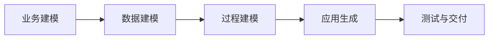

RAD适合范围相对明确、能够合理模块化并有成熟工具与构件支持的系统。技术风险极高、性能要求极端或无法合理拆分的系统不适合单纯追求快速构建。

## 11. 构件组装模型

构件组装模型通过寻找、评估、适配和集成已有软件构件建立系统。

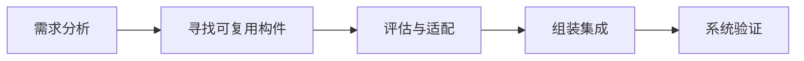

可复用构件包括类库、软件包、服务组件、第三方平台、开源框架和已有业务模块。主要问题是功能匹配、接口兼容、版本管理、安全性以及长期维护能力。

## 12. 统一过程UP与RUP

统一过程的三个核心特征是：

```text
用例驱动
架构为中心
迭代和增量
```

生命周期通常分为：

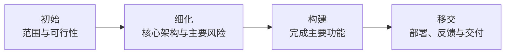

每个阶段内部可以包含多次迭代。RUP（Rational Unified Process）是统一过程的一种具体化和工程化形式。

敏捷开发不是上述模型中的某一个固定阶段图，而是一组价值观、原则、方法和框架；DevOps则进一步连接开发、交付和运行反馈。二者详见[敏捷开发方法](02-敏捷开发方法.md)。

## 13. 四个容易混淆概念的最终对照

| 概念 | 直接回答的问题 | 不必然包含的内容 |
|---|---|---|
| 迭代 | 已有系统如何经过多轮完善 | 不一定增加新功能，也不一定显式分析风险 |
| 增量 | 完整系统如何拆成功能片段逐步交付 | 不一定反复改进旧功能 |
| 螺旋 | 每一轮如何识别、评估和降低关键风险 | 不限定每轮必须交付哪种功能增量 |
| 喷泉 | 分析、设计、编码和测试如何反复并交叠 | 不以风险分析或分批交付作为核心定义 |

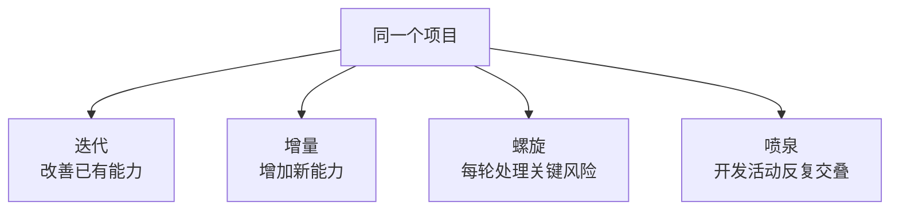

四者可以在实际项目中组合使用，不构成必须互斥的四选一关系。

## 核心结论

```text
瀑布：按阶段推进
V模型：开发活动对应测试活动
原型：先做可观察成果以明确需求
迭代：反复完善已有系统
增量：逐步增加并交付新功能
螺旋：以风险分析为核心进行多轮迭代
喷泉：面向对象开发活动反复并相互交叠
RAD：借助工具、复用和并行组织快速开发
构件组装：选择、适配和集成已有软件构件
统一过程：用例驱动、架构为中心、迭代增量
```
