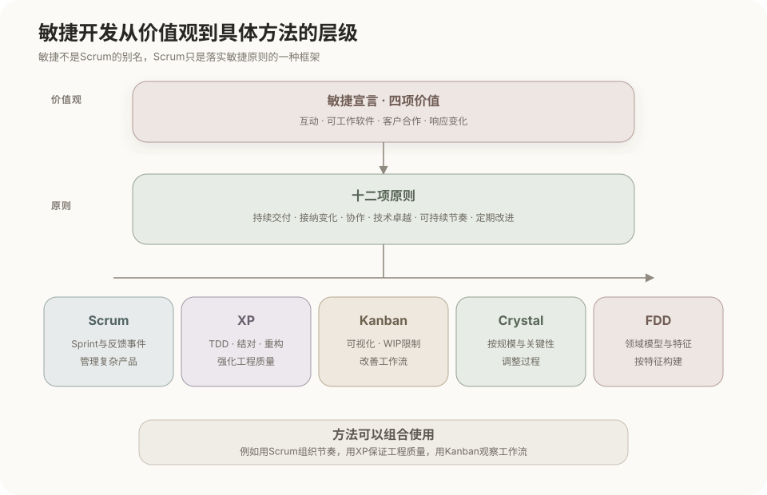
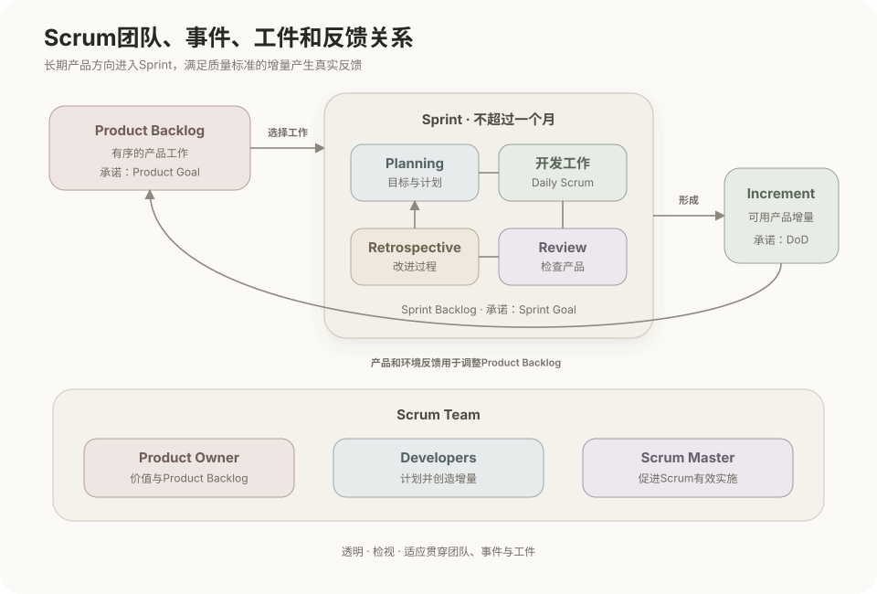
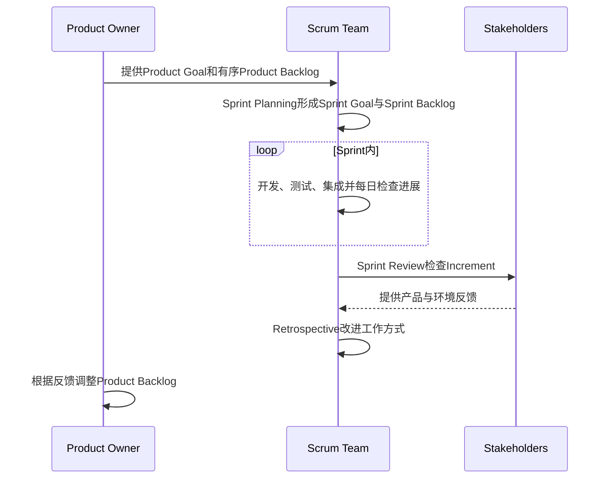
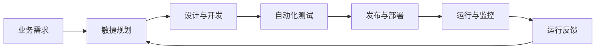

# 敏捷开发方法

敏捷开发不是一种固定的生命周期阶段图，而是一组指导软件开发的价值观和原则。Scrum、XP、Kanban、Crystal和FDD等方法或框架以不同方式落实这些原则，其中Scrum是软考和工程实践中最常见的敏捷框架之一。



## 1. 敏捷开发的定位

敏捷开发通过较短周期交付可运行成果，持续获得业务和技术反馈，并根据已经验证的信息调整后续计划。它主要应对需求不确定、反馈频繁和需要持续交付价值的开发环境。

```text
选择少量高价值工作
        ↓
分析、设计、实现与测试
        ↓
形成可运行的软件增量
        ↓
获得用户、业务和运行反馈
        ↓
调整需求、设计与后续计划
```

敏捷不等于取消规划、设计、文档或质量要求。它改变的是决策节奏：避免在信息不足时一次性确定全部细节，把规划、设计和验证分布到连续的短周期中。

## 2. 敏捷宣言的四项价值

2001年的《敏捷软件开发宣言》提出四项价值取向：

| 更重视 | 相对侧重较低但仍有价值 |
|---|---|
| 个体和互动 | 流程和工具 |
| 可工作的软件 | 面面俱到的文档 |
| 客户合作 | 合同谈判 |
| 响应变化 | 遵循计划 |

右侧内容并非不需要。流程、工具、文档、合同和计划仍然有价值，但不能取代团队协作、真实可运行成果、持续合作和根据事实调整方向。

## 3. 敏捷开发的十二项原则

十二项原则可以按关注点整理为四组：

### 3.1 价值交付与变化响应

1. 通过尽早并持续交付有价值的软件满足客户需要；
2. 即使在开发后期也能够接纳合理的需求变化；
3. 经常交付可工作的软件，并倾向采用较短周期。

### 3.2 协作与团队

4. 业务人员和开发人员在项目过程中持续协作；
5. 围绕有积极性的成员组建团队，提供环境和支持并给予信任；
6. 优先采用直接、高效的沟通方式；
7. 自管理团队能够形成有效的架构、需求和设计。

### 3.3 质量与可持续性

8. 可工作的软件是衡量进展的主要依据；
9. 团队和相关方应能长期维持稳定、可持续的开发节奏；
10. 持续关注技术卓越和良好设计，以保持适应变化的能力；
11. 保持简单，减少没有必要完成的工作。

### 3.4 持续改进

12. 团队定期反思工作方式，并据此调整行为和协作机制。

## 4. 常见敏捷方法与框架

| 方法或框架 | 主要关注点 | 典型机制 |
|---|---|---|
| Scrum | 用固定周期、明确职责和反馈事件管理复杂产品 | Sprint、Scrum Team、Backlog、Increment |
| XP | 用严格工程实践提高代码质量和变化能力 | TDD、结对编程、持续集成、重构、小版本发布 |
| Kanban | 使工作流可视化并控制并行工作数量 | 看板、在制品限制、拉动、流动度量 |
| Crystal | 根据团队规模和系统关键程度调整过程 | 人员沟通、频繁交付、反思改进 |
| FDD | 围绕可交付的特征组织建模、设计和构建 | 特征列表、按特征设计、按特征构建 |

这些方法并不要求互斥。例如，团队可以使用Scrum组织Sprint，同时采用XP的测试驱动开发和持续集成，也可以借助Kanban观察Sprint内部的工作流。

## 5. Scrum框架

Scrum是用于复杂产品开发的轻量级框架。它建立在经验主义和精益思想之上，通过透明、检视和适应形成反馈闭环。



Scrum的三项经验支柱是：

```text
透明：工作、进度、成果和问题对相关人员可见
检视：定期检查产品成果以及实现目标的进展
适应：发现偏差后及时调整产品或工作方式
```

Scrum的五项价值是承诺、专注、开放、尊重和勇气。

### 5.1 Scrum团队

Scrum Team由一名Product Owner、一名Scrum Master和Developers组成。团队内部没有彼此割裂的子团队或等级，整体对每个Sprint创造有价值、可用的增量负责。

| 职责 | 主要责任 |
|---|---|
| Product Owner | 明确Product Goal，管理并排序Product Backlog，使产品价值最大化 |
| Developers | 制定Sprint计划、维护Sprint Backlog、保证质量并创造增量 |
| Scrum Master | 帮助团队和组织理解Scrum，促进Scrum有效实施并协助消除障碍 |

Product Owner可以委托他人整理Backlog，但最终责任仍由Product Owner承担。Scrum Master不是传统项目经理，也不负责向Developers逐项分派任务。

### 5.2 Scrum事件

Sprint是容纳其他事件的固定周期，长度不超过一个月。

| 事件 | 主要目的 |
|---|---|
| Sprint | 在固定周期内朝Sprint Goal创造可用增量 |
| Sprint Planning | 确定本次Sprint为什么有价值、做什么以及怎样完成 |
| Daily Scrum | Developers检查Sprint Goal进展并调整近期计划 |
| Sprint Review | 与相关方检查产品增量和环境变化，调整Product Backlog |
| Sprint Retrospective | 检查团队协作和工作方式，制定改进措施 |

Sprint Review关注产品成果和下一步方向，Sprint Retrospective关注团队的工作方式，二者不能互相替代。

### 5.3 Scrum工件及其承诺

| 工件 | 内容 | 对应承诺 |
|---|---|---|
| Product Backlog | 产品所需工作的有序列表 | Product Goal |
| Sprint Backlog | Sprint Goal、选入的条目和执行计划 | Sprint Goal |
| Increment | 当前Sprint及以前所有已完成工作的总和 | Definition of Done |

- **Product Goal**描述产品未来希望达到的状态，为Product Backlog提供长期方向。
- **Sprint Goal**说明当前Sprint为什么有价值；具体工作可以调整，但不能破坏该目标。
- **Definition of Done**是判断工作是否达到增量质量要求的正式标准。未满足DoD的工作不能作为已完成增量。

### 5.4 Product Backlog排序

Product Backlog是动态、持续细化的有序列表。Scrum Guide没有规定唯一的排序公式，Product Owner通常综合考虑：

- 产品价值和Product Goal；
- 风险与学习价值；
- 依赖关系和紧迫性；
- 实现成本与工作量；
- 技术可行性、合规要求和现实约束。

需要区分两个概念：

```text
技术可行性：是否存在能够接受的实现路径
实现难度：在已经可行的前提下，需要多少成本和工作量
```

不可行或可行性尚未确认的条目，不能只因商业价值高就直接进入正常实现，可以先安排调研、原型、Spike或技术验证。对于已经具备可行路径的条目，排序目标是在多种约束下最大化产品价值，而不是只按最容易实现的顺序排列。

### 5.5 Sprint中的信息流



Sprint期间不能进行危及Sprint Goal的变更，质量不能下降；Product Backlog可以继续细化，Developers也可随认识增加与Product Owner协商调整工作范围。只有Product Owner有权取消Sprint，通常是因为Sprint Goal已经失去意义。

## 6. 用户故事与待办列表

用户故事是表达需求的一种常见方式，并不是Scrum强制规定的工件格式。常用句式是：

```text
作为〈某类用户〉
我希望〈获得某项能力〉
以便〈实现某种价值〉
```

一条用户故事通常还需要配套验收条件，说明什么情况下可以认为需求已经满足。INVEST可用于检查故事质量：

| 字母 | 含义 |
|---|---|
| I | Independent，相对独立 |
| N | Negotiable，可协商 |
| V | Valuable，具有价值 |
| E | Estimable，可以估算 |
| S | Small，规模适当 |
| T | Testable，可以验证 |

Product Backlog Item不一定都是用户故事，也可以是缺陷、技术改进、调研任务和其他产品工作。用户故事是描述方式，Product Backlog是Scrum工件，不能把两者视为同一个概念。

## 7. 估算、速率和燃尽图

### 7.1 相对估算与故事点

故事点通过规模、复杂性、不确定性和风险进行相对估算，不直接等于工时。常见取值使用斐波那契式序列，例如`1、2、3、5、8、13`，以避免对高不确定工作作出虚假的精确判断。

### 7.2 速率

速率（Velocity）通常表示团队在一个Sprint内实际完成的故事点数量，可用于同一团队对未来容量进行经验预测。

速率不是团队绩效排名指标。不同团队的故事点基准不同，直接比较会诱发扩大估算值等失真行为。

### 7.3 燃尽图与燃起图

- **燃尽图**显示剩余工作量随时间的变化；
- **燃起图**显示已经完成的工作量，并可同时呈现总范围变化。

故事点、Planning Poker、Velocity和燃尽图都属于常见敏捷实践，但不是Scrum Guide强制规定的组成部分。

## 8. 敏捷与迭代、增量的关系

迭代和增量描述开发成果怎样变化，敏捷描述团队如何通过价值、反馈、协作和适应组织开发。

```text
迭代：反复改善已经存在的内容
增量：增加原来不存在的新能力
敏捷：用短周期、可运行成果和反馈持续调整开发
```

敏捷开发通常同时使用迭代和增量，但采用迭代或增量并不自动意味着符合敏捷原则。例如，一个项目可以分批增加功能，却仍然缺少客户协作、反馈调整和自管理团队。

Scrum的每个Sprint通常既产生增量，也可能迭代改进原有功能；它不是把需求、设计、编码和测试机械压缩成一个“小瀑布”。

## 9. 敏捷与DevOps的关系

敏捷主要缩短业务、产品和开发团队之间的反馈周期，DevOps进一步连接开发、测试、发布、运行和监控。



持续集成、持续交付或部署、基础设施即代码、日志、指标和告警等属于常见DevOps实践。敏捷不自动带来DevOps能力，采用DevOps工具也不表示团队已经按照敏捷价值观工作。相关工程机制应在“云原生架构设计”中进一步展开。

## 10. 常见概念边界

- **敏捷不等于Scrum**：Scrum是敏捷体系中的一个具体框架。
- **Scrum不规定全部工程实践**：TDD、结对编程、代码重构等主要来自XP等工程方法，可以与Scrum组合使用。
- **Kanban不等于任务列表**：核心还包括在制品限制、拉动机制和工作流改进。
- **用户故事不等于Product Backlog**：前者是需求表达方式，后者是Scrum工件。
- **Sprint不等于小瀑布**：分析、设计、实现和测试应围绕目标协同发生，而不是在Sprint内部形成彼此隔绝的大阶段。
- **敏捷不排斥文档和架构**：只是不把大量前期产物置于可运行软件和真实反馈之上。
- **DevOps不等于敏捷开发**：两者关注范围不同，但可以共同缩短从需求到运行反馈的周期。

## 核心关系

```text
敏捷宣言：提供价值取向
十二项原则：把价值取向落实为开发原则
Scrum、XP、Kanban、Crystal、FDD：提供不同的实施方式
Scrum：通过团队、事件、工件和承诺管理复杂产品
DevOps：把反馈范围扩展到发布、运行和监控
```

## 参考资料

- [Manifesto for Agile Software Development](https://agilemanifesto.org/)
- [Principles behind the Agile Manifesto](https://agilemanifesto.org/principles)
- [The Scrum Guide：官方当前版本与下载](https://scrumguides.org/download.html)
- [The Scrum Guide 2020](https://scrumguides.org/scrum-guide.html)
