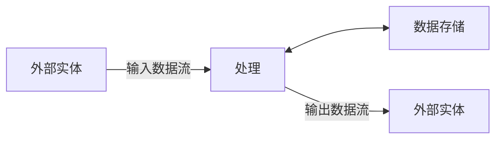
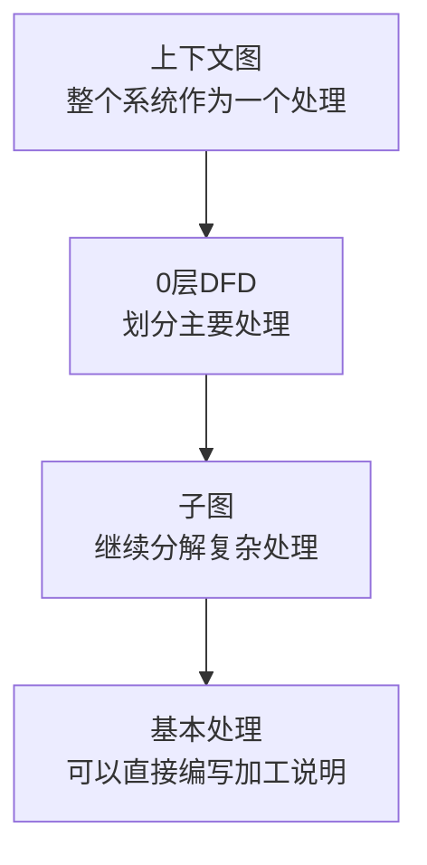
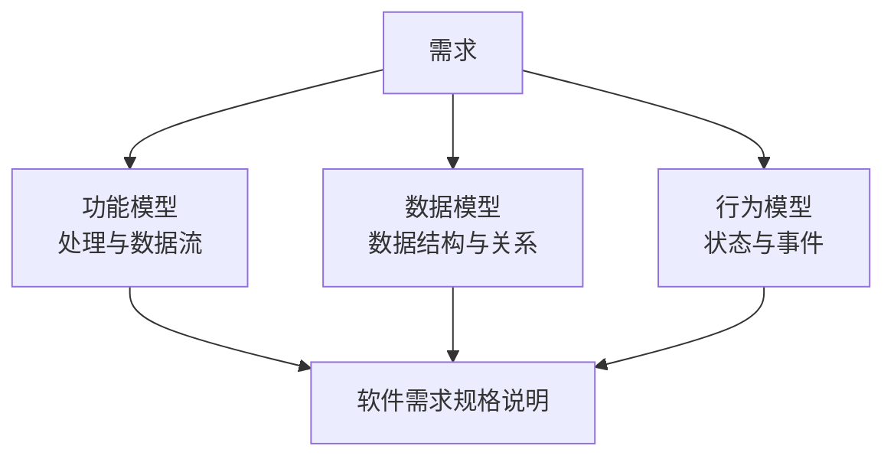
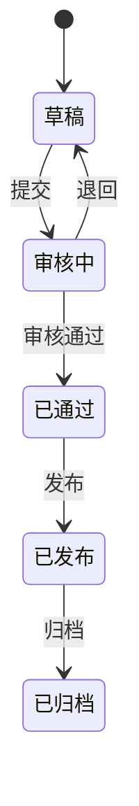
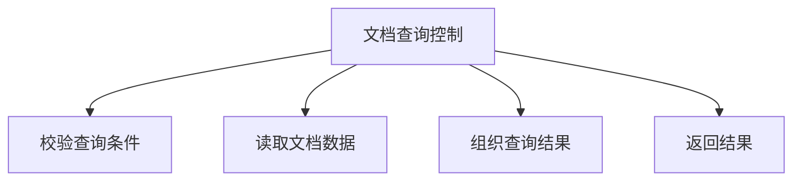
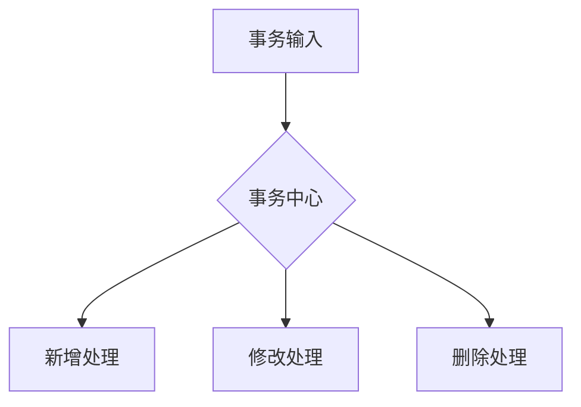
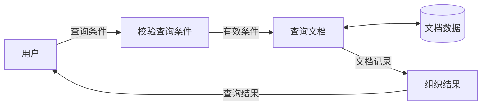

# 结构化分析与结构化设计

## 1. 结构化方法的整体位置

结构化方法以功能分解和数据流为主要视角，通常包括：


| 阶段 | 主要产物 |
|---|---|
| 结构化分析 | DFD、数据字典、加工说明、数据模型、状态模型 |
| 结构化设计 | 模块结构图、接口设计、数据设计 |
| 结构化程序设计 | 顺序、选择、循环结构的程序 |

结构化分析首先建立不依赖具体框架和数据库的逻辑模型；结构化设计再把逻辑模型转换为模块结构。

## 2. 结构化分析

结构化分析（Structured Analysis，SA）是一种面向数据流的需求分析方法。它重点说明：

- 系统边界在哪里；
- 外部实体提供和接收什么数据；
- 系统进行哪些处理；
- 处理之间传递什么数据；
- 数据存放在哪里；
- 业务数据和状态受到什么约束。



### 自顶向下与逐层分解

复杂系统从整体边界开始，逐步拆成可以明确描述的基本处理：



- **自顶向下**：先看系统整体，再进入局部；
- **逐层分解**：复杂处理可以继续展开为子图；
- **逐步求精**：每次增加必要细节，直到处理逻辑能够明确描述。

## 3. 三类分析模型

结构化分析不只有DFD，完整分析通常包含功能、数据和行为三个方面。

| 模型 | 回答的问题 | 常用工具 |
|---|---|---|
| 功能模型 | 系统进行什么处理，数据怎样流动 | DFD、加工说明 |
| 数据模型 | 系统管理哪些数据，数据之间有什么关系 | 数据字典、ER图 |
| 行为模型 | 系统在事件发生后怎样改变状态 | 状态转换图 |



三种模型观察的是同一个系统的不同侧面，不能互相替代。

## 4. DFD、数据字典与加工说明

### DFD

DFD（Data Flow Diagram，数据流图）使用四种基本元素描述数据流动和处理：

| 元素 | 表示内容 |
|---|---|
| 外部实体 | 系统之外的数据来源或接收者 |
| 数据流 | 正在传递的数据 |
| 处理 | 对输入数据进行加工并产生输出 |
| 数据存储 | 保存并供处理读取的数据 |

DFD只说明逻辑上的数据处理，不规定Java类、SQL、服务器或网络协议。连接规则、黑洞、奇迹、输入不足、分层和平衡详见[数据流图DFD](04-数据流图DFD.md)。

### 数据字典

数据字典定义DFD中出现的数据名称和结构，避免同一数据在不同位置被理解成不同含义。

典型条目包括：

- 数据流；
- 数据项；
- 数据结构；
- 数据存储；
- 外部实体；
- 处理需要引用的数据定义。

常见简化符号：

| 写法 | 含义 |
|---|---|
| `A + B` | A和B按结构组成 |
| `[A 或 B]` | 从A、B中选择 |
| `{A}` | A可以重复 |
| `(A)` | A为可选内容 |

### 加工说明

当DFD中的处理已经无法继续用子图有效分解时，使用加工说明描述其内部规则。常见表达工具包括：

| 工具 | 适用情况 |
|---|---|
| 结构化语言 | 处理逻辑接近顺序、选择和循环 |
| 判定表 | 多个条件组合决定不同动作 |
| 判定树 | 适合按判断顺序逐层展开 |

三者关系是：

```text
DFD说明某个处理存在
数据字典说明它使用的数据
加工说明说明它内部怎样处理
```

## 5. 数据模型与行为模型

### ER图

ER图描述实体、属性和实体之间的联系。例如文档管理中可以存在用户、文档和审核记录，以及它们之间的一对多关系。

ER模型关注业务数据关系，不等同于最终数据库表。表结构还需要考虑主键、外键、索引、范式和数据库实现。

### 状态模型

状态模型适合描述生命周期明显的对象：



DFD关注数据如何流动，状态图关注对象在事件发生后如何变化。

## 6. 结构化设计与模块结构图

结构化设计（Structured Design，SD）把分析阶段得到的数据流和处理转换为模块及调用关系。

模块结构图常表示：

- 模块的层次；
- 调用关系；
- 数据参数；
- 控制参数；
- 模块的扇入和扇出。



需要区分：

- DFD中的箭头表示数据流；
- 模块结构图中的箭头主要表示模块调用；
- 程序流程图的箭头表示控制执行顺序。

### 扇入与扇出

- **扇入**：有多少上级模块调用当前模块。合理的较高扇入通常表示模块被复用。
- **扇出**：一个模块直接调用多少下级模块。扇出过大可能表示职责过多。

扇入和扇出不能脱离模块职责机械判断，核心仍是结构是否清晰。

## 7. 变换分析与事务分析

它们是把DFD转换为模块结构的两种典型方法。

### 变换分析

当数据经历“输入—中心变换—输出”时，可按三个区域划分模块：


例如读取查询条件、执行查询、格式化并输出结果。

### 事务分析

当一个输入到达事务中心后，根据类型选择不同处理分支时，适合事务分析：



这里的“事务”表示根据输入选择动作路径，不专指数据库事务。

## 8. 模块化设计：内聚与耦合

结构化设计通常追求高内聚、低耦合。内聚观察一个模块内部的操作是否共同服务于明确职责；耦合观察不同模块之间的依赖程度和接口边界。

结构化设计把分析模型转换为模块结构之后，需要同时检查模块职责是否集中、模块之间是否只传递必要信息。七种内聚、七种耦合、相邻类型辨析及综合判断详见[模块内聚与耦合](05-模块内聚与耦合.md)。

## 9. 与相邻方法的边界

| 方法或图 | 主要关注点 |
|---|---|
| DFD | 系统中的数据流动和逻辑处理 |
| 程序流程图 | 一个程序或算法的控制执行顺序 |
| 模块结构图 | 模块分解和调用关系 |
| UML | 面向对象及通用软件建模的一组图形语言 |
| 结构化程序设计 | 使用顺序、选择和循环实现模块内部逻辑 |
| 面向对象分析设计 | 以对象、职责、关系和交互组织系统 |

结构化方法和面向对象方法可以描述同一系统，但视角不同：

```text
结构化方法：系统做哪些处理，数据怎样流动
面向对象方法：哪些对象承担职责，对象怎样协作
```

## 10. 简化案例

以文档查询功能为例：

```text
分析阶段：
用户提交查询条件
→ 校验条件
→ 查询文档存储
→ 生成查询结果

设计阶段：
QueryController
→ QueryValidator
→ DocumentRepository
→ ResultAssembler
```



DFD只说明逻辑处理。`Controller`、`Repository`等模块名称属于后续设计，不应提前写入逻辑DFD。

## 11. 核心关系


```text
结构化分析说明系统做什么
结构化设计说明系统由哪些模块实现
结构化程序设计说明模块内部怎样编写
DFD、数据字典和加工说明共同描述功能模型
ER图补充数据关系，状态图补充行为变化
设计阶段追求职责清楚、高内聚和低耦合
```

## 相关章节

- [数据流图DFD](04-数据流图DFD.md)
- [模块内聚与耦合](05-模块内聚与耦合.md)
- [领域驱动设计DDD](../09-系统架构设计基础/03-领域驱动设计DDD.md)
- [数据库三级模式](../08-数据库设计/01-数据库三级模式.md)
- [表与视图的区别](../08-数据库设计/02-表与视图的区别.md)

