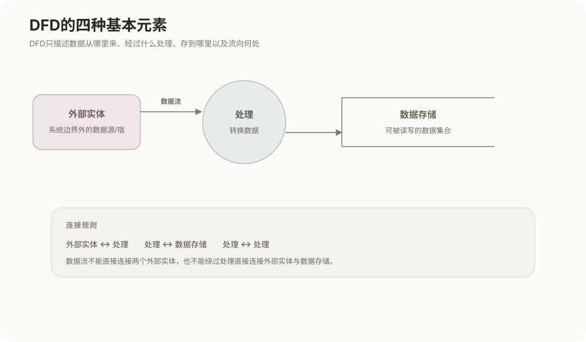
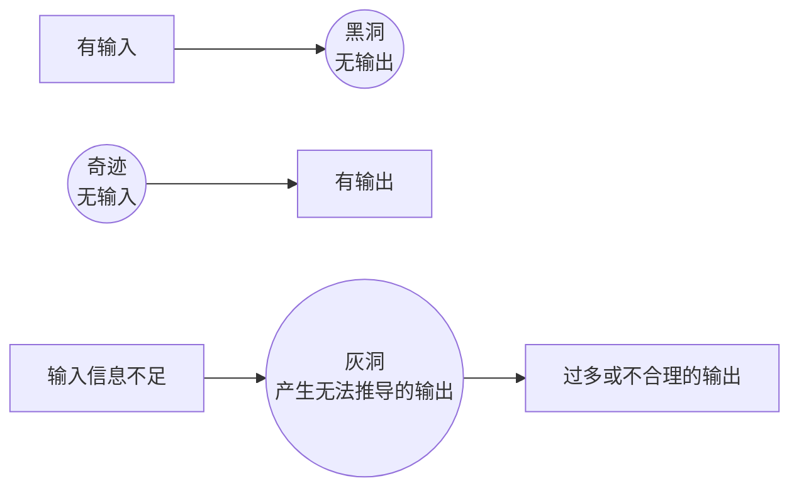
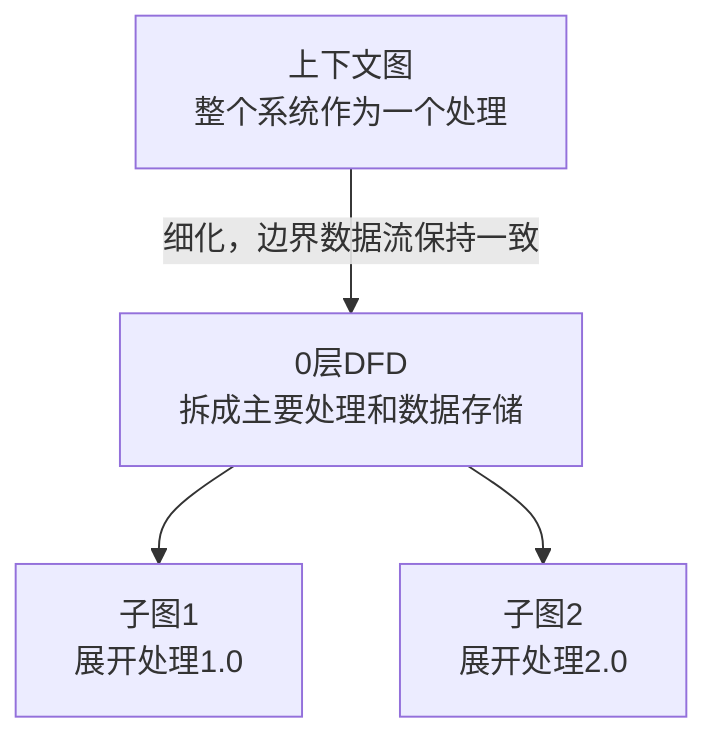

# 数据流图DFD

## 关联知识

- [结构化分析与结构化设计](03-结构化分析与结构化设计.md)：DFD在结构化分析中的位置，以及数据字典、加工说明、变换分析和模块结构图。

## 定位

DFD（Data Flow Diagram，数据流图）是结构化分析方法中的需求分析工具，用来记录具体系统中的数据来源、数据去向、处理过程、存储位置和系统边界。

DFD不是UML图，也不是软件必须遵循的运行结构。只画成“用户→系统处理→数据库”的DFD通常信息量不足；只有标明具体数据、具体处理、外部边界和存储位置时才可能有实际价值。

## 四种基本元素

### 外部实体（External Entity）

位于当前系统边界之外，向系统提供数据或接收系统输出的人、组织或其他系统。示例：文档提交者、管理员、外部文件扫描系统。名称通常使用名词。

### 数据流（Data Flow）

表示数据从一个元素流向另一个元素，通常画成带箭头并带有名称的线。示例：原始文件、查询条件、校验结果、文档列表。

数据流表示正在传递的数据，不表示程序执行顺序或控制关系。名称通常使用名词或名词短语。

### 处理（Process）

表示对输入数据进行加工或转换，使其产生有意义的输出。处理可以执行校验、计算、筛选、合并、分类、格式转换、更新或生成数据等操作。

名称通常使用动词加宾语，例如“校验文件格式”“生成文档编号”。

### 数据存储（Data Store）

表示系统需要保存并在以后读取的数据。示例：文档库、用户信息、操作日志、搜索索引。

数据存储可以表示数据库表、文件或其他持久化数据集合。它不负责主动处理数据。

不同DFD符号体系的图形外观可能不同，例如Yourdon/DeMarco与Gane-Sarson记法不同，但四类元素的基本语义一致。



## 数据流连接规则

数据流的起点或终点中，至少有一端必须是处理。

以下连接通常有效：

```text
外部实体 → 处理
处理 → 外部实体
处理 → 处理
处理 → 数据存储
数据存储 → 处理
```

以下元素之间不能绕过处理直接连接：

```text
外部实体 → 外部实体
外部实体 → 数据存储
数据存储 → 外部实体
数据存储 → 数据存储
```

如果确实存在这些数据交换，应当在中间补充当前系统实际执行的接收、校验、查询、写入、转换或传递处理。

DFD不适合直接表示按钮点击、条件判断、循环、执行顺序和控制信号。这些内容通常使用流程图、活动图、状态图或顺序图表达。

## 处理必须有输入和输出

一个有效处理至少应当具有：

- 一个输入数据流；
- 一个输出数据流；
- 能够说明输入如何产生输出的处理逻辑。

如果数据完全原样输入和输出，中间没有校验、转换、记录或状态变化，那么该处理没有表达实际功能，应当删除或补充真实处理内容。

## 常见错误



### 黑洞（Black Hole）

处理只有输入，没有输出：

```text
文档信息 → 保存文档
```

数据进入处理后没有产生任何结果，说明输出被遗漏。

### 奇迹（Miracle）

处理没有输入，却产生输出：

```text
生成审核结果 → 审核结果
```

没有任何输入依据却直接产生数据，说明输入被遗漏。

### 灰洞（Gray Hole）或输入不足

处理虽然有输入和输出，但现有输入不足以产生声明的输出：

```text
文档标题 → 生成完整用户权限报告
```

文档标题不足以确定完整用户权限，说明处理缺少必要的数据来源。

## DFD分层

复杂系统可以从整体到局部逐层展开。



### 上下文图

把整个待分析系统表示为一个处理，主要显示系统边界、外部实体，以及系统与外部实体之间的主要输入和输出数据流。通常不展开系统内部的处理和数据存储。

### 0层DFD

把整个系统拆分为若干主要处理，并显示主要数据存储及处理之间的数据流。

### 子图

继续将某个复杂处理拆分为更细的处理。处理可以采用层次编号：

```text
2.0 管理文档
2.1 校验文档
2.2 保存文档
2.3 建立搜索索引
```

不同教材可能对上下文图和0层图的命名存在差异，使用时应先确认当前资料采用的层次命名体系。

## 父图与子图的数据流平衡

子图是对父图中某个处理的内部展开。

平衡原则是：父图中进入该处理和离开该处理的数据，在子图边界上也必须出现，并且数据内容保持一致。

例如，父图中的处理为：

```text
输入：原始文档
处理：管理文档
输出：发布结果
```

将“管理文档”展开成子图后，子图边界仍然必须具有“原始文档”输入和“发布结果”输出。

子图内部可以增加校验结果、扫描结果、待处理文件库等内部数据流和数据存储，这些内部元素不必出现在父图中。

平衡不要求父图与子图的箭头数量完全相同。父图中的一个复合数据流可以在子图中拆分，多个数据流也可以合理合并；判断重点是边界上传递的数据内容是否一致，不能凭空增加或丢失对外输入、输出。

## 核心约束

```text
外部实体：系统之外的数据来源或接收者
数据流：正在传递的数据
处理：对数据进行加工和转换
数据存储：保存并供以后读取的数据
```

重点检查：

1. 数据流两端是否至少有一端是处理；
2. 每个处理是否同时具有输入和输出；
3. 输出是否能够由输入和处理逻辑产生；
4. 子图边界是否与父图中被展开处理的输入、输出保持平衡。
