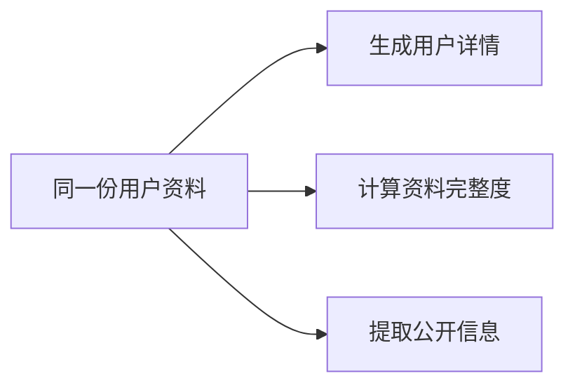
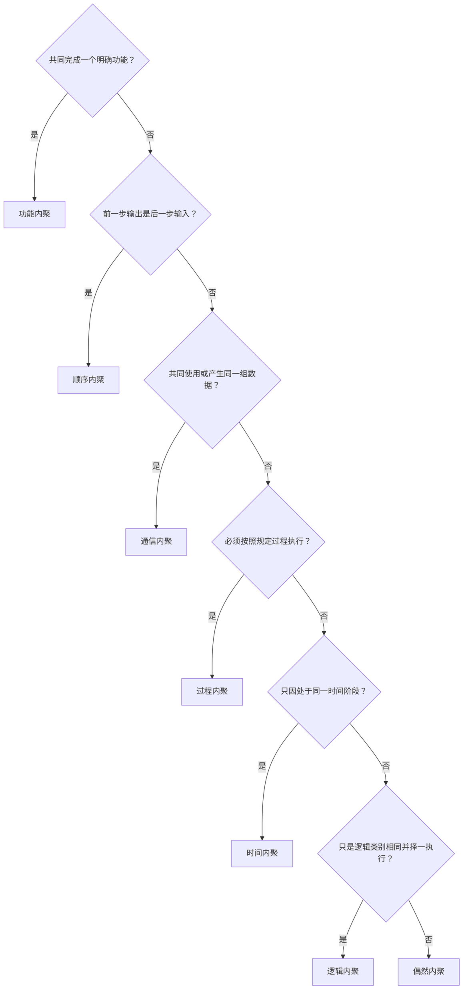

# 模块内聚与耦合

## 关联知识

- [结构化分析与结构化设计](03-结构化分析与结构化设计.md)：结构化设计、模块结构图、内聚与耦合、变换分析和事务分析。

## 1. 模块化设计中的内聚与耦合

内聚（Cohesion）描述一个模块内部各组成部分之间的相关程度，也就是模块中的数据、语句和操作是否共同服务于一个集中、明确的职责。

耦合（Coupling）描述不同模块之间的依赖程度，包括模块是否直接访问对方内部、共享全局数据、传递控制信息或只交换必要数据。模块化设计通常追求**高内聚、低耦合**：模块内部职责集中，模块之间通过有限、明确的接口协作。

内聚越强，通常意味着：

- 模块职责更明确；
- 内部代码联系更紧密；
- 引起模块修改的原因更单一；
- 模块更容易独立测试、维护和复用。

内聚越弱，通常意味着模块中混入了更多彼此无关的处理，一个模块需要承担多种不同的职责。

## 2. 七种内聚的强弱顺序

七种经典内聚类型由强到弱排列如下：


```text
强                                                     弱
功能 → 顺序 → 通信 → 过程 → 时间 → 逻辑 → 偶然
```

越靠前，模块内部成分被组织在一起的理由越具体、越紧密；越靠后，联系越宽松。

## 3. 七种内聚的具体类型

### 功能内聚

模块中的所有组成部分共同完成一个明确、完整的功能。

```text
模块：验证用户密码

读取密码摘要
→ 计算输入密码的摘要
→ 比较摘要
→ 返回验证结果
```

这个模块可以用一个明确动作描述，所有步骤都直接服务于密码验证。功能内聚是七种内聚中最强的一种，也是模块设计通常希望达到的状态。

### 顺序内聚

模块内部形成连续的数据处理链，前一个处理步骤的输出成为后一个步骤的输入。


顺序内聚不仅要求操作属于同一个处理范围，还要求它们之间存在明确的数据传递关系。

### 通信内聚

模块中的多个操作共同使用同一组输入数据，或者共同产生同一组输出数据，但操作之间不一定存在前后数据依赖。



这里的“通信”不是指网络通信，而是指多个处理通过共享数据发生联系。

### 过程内聚

模块中的多个操作因为必须按照规定的控制顺序执行而组合在一起，但前一步产生的数据不一定交给后一步处理。

```text
检查系统状态
→ 记录操作时间
→ 显示确认页面
```

过程内聚强调控制流程，顺序内聚强调数据流程：

| 类型 | 主要联系 |
|---|---|
| 顺序内聚 | 前一步输出成为后一步输入 |
| 过程内聚 | 各步骤需要按照规定顺序执行，数据不一定连续传递 |

### 时间内聚

模块中的操作因为需要在同一个时间阶段执行而组合在一起。这些操作的具体功能可能不同。

```text
系统启动模块：

加载配置
初始化日志
创建线程池
检查临时目录
```

常见时间阶段包括系统启动、系统关闭、请求初始化和资源清理。

### 逻辑内聚

模块中的操作在逻辑上属于同一类别，但实际完成不同功能，调用方通过参数或控制标志决定执行其中哪一种。

```java
void processUser(Action action) {
    if (action == QUERY) {
        // 查询用户
    } else if (action == DELETE) {
        // 删除用户
    } else if (action == EXPORT) {
        // 导出用户
    }
}
```

这些处理都与用户有关，但查询、删除和导出是不同职责。逻辑内聚模块通常包含根据类型码或操作码选择功能的大量条件分支。

### 偶然内聚

模块中的组成部分没有明确的功能、数据、过程或时间联系，只是被集中放在同一位置。

```text
通用工具模块：

计算文件大小
验证邮箱格式
清理字符串
生成随机编号
读取系统时间
```

这些操作没有统一职责。偶然内聚是七种内聚中最弱的一种。

## 4. 相邻类型的辨析

### 功能内聚与顺序内聚

- 功能内聚强调所有代码共同完成一个不可再自然分割的明确功能。
- 顺序内聚强调模块内部存在连续的数据加工链。

### 顺序内聚与通信内聚

- 顺序内聚中，前一步输出必须进入后一步。
- 通信内聚只要求多个操作使用或产生同一组数据，不要求前后依赖。

### 通信内聚与过程内聚

- 通信内聚依靠共同数据形成联系。
- 过程内聚依靠执行顺序形成联系。

### 过程内聚与时间内聚

- 过程内聚要求具体的先后控制关系。
- 时间内聚只要求操作发生在同一时间阶段，不一定规定严格顺序。

### 时间内聚与逻辑内聚

- 时间内聚把同一阶段需要完成的多个操作放在一起。
- 逻辑内聚把同一逻辑类别下的不同功能放在一起，并从中选择一个执行。

### 逻辑内聚与偶然内聚

- 逻辑内聚至少存在一个共同的逻辑类别。
- 偶然内聚连稳定的逻辑类别也没有。

## 5. 识别方法

判断一个模块属于哪种内聚，可以依次检查内部操作被放在一起的直接原因：



## 6. 耦合的含义与强弱顺序

教材常见的耦合类型由弱到强排列如下：

```text
弱                                                             强
非直接 → 数据 → 标记 → 控制 → 外部 → 公共 → 内容
```

依赖越弱，一个模块的修改越不容易传播到其他模块；依赖越强，模块越难独立理解、测试、复用和替换。

## 7. 七种耦合的具体类型

### 非直接耦合

两个模块之间没有直接调用或数据交换，只通过上层控制模块分别使用。非直接耦合是最弱的耦合关系。

### 数据耦合

模块之间只通过参数传递完成协作所必需的简单数据。

```java
calculateTotal(price, quantity);
```

被调用模块只接收实际需要的值，不依赖调用方的内部数据结构。

### 标记耦合

模块之间传递整个记录、对象或数据结构，但被调用模块只使用其中一部分字段。

```java
printUserName(User user); // 实际只使用user.name
```

数据结构发生变化时，多个模块可能同时受到影响，因此标记耦合通常强于只传递必要字段的数据耦合。

### 控制耦合

一个模块向另一个模块传递控制标志，由该参数决定对方执行哪段内部逻辑。

```java
processFile(file, DELETE_MODE);
```

调用方需要了解被调用模块的控制分支，两个模块在行为选择上形成依赖。

### 外部耦合

多个模块共同依赖外部规定的协议、文件格式、设备接口或通信规范。外部规则一旦变化，相关模块可能同时修改。

### 公共耦合

多个模块读取或修改同一份全局数据、共享内存或公共数据区。任何模块都可能改变共享状态，使影响范围难以控制。

### 内容耦合

一个模块直接访问或修改另一个模块的内部数据、跳转到对方内部代码，或者依赖对方的具体实现细节。内容耦合破坏模块边界，是最强的耦合类型。

## 8. 相邻耦合类型的辨析

| 容易混淆的类型 | 区分依据 |
|---|---|
| 数据耦合与标记耦合 | 前者只传递必要的简单数据，后者传递整个复合结构 |
| 标记耦合与控制耦合 | 前者传递业务数据结构，后者传递决定对方执行逻辑的控制信息 |
| 外部耦合与公共耦合 | 前者共同依赖外部协议或格式，后者共同访问一份共享数据 |
| 公共耦合与内容耦合 | 前者通过公共区共享状态，后者直接进入或修改另一个模块内部 |

“数据流”和“数据耦合”分析的对象不同：数据流描述数据在系统中的逻辑移动；数据耦合描述模块之间只通过必要参数协作的依赖关系。

## 9. 内聚与耦合的综合判断

内聚和耦合分别观察模块边界内外：

```text
模块内部：相关操作是否围绕一个明确职责组织 → 内聚
模块之间：一个模块需要知道另一个模块多少内部信息 → 耦合
```

高内聚不自动保证低耦合，低耦合也不自动保证高内聚。设计时需要同时检查模块职责是否集中，以及模块之间的接口是否最小、明确、稳定。

## 核心结论

```text
内聚强弱：功能 > 顺序 > 通信 > 过程 > 时间 > 逻辑 > 偶然

耦合强弱：非直接 < 数据 < 标记 < 控制 < 外部 < 公共 < 内容

功能：共同完成一个明确功能
顺序：前一步输出成为后一步输入
通信：共同使用或产生同一组数据
过程：按照规定控制顺序执行
时间：在同一时间阶段执行
逻辑：逻辑类别相同，由参数选择功能
偶然：内部各部分没有明确关系

模块化设计目标：内部高内聚，模块之间低耦合
```
