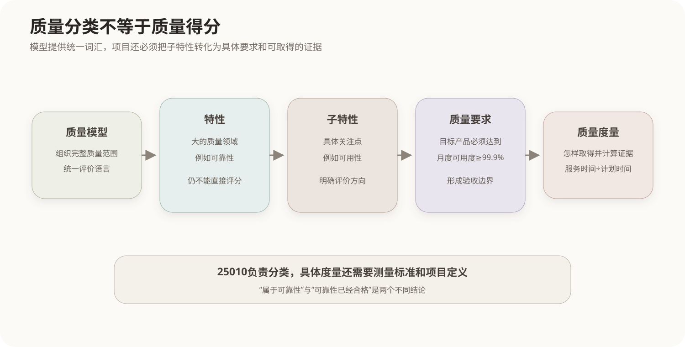
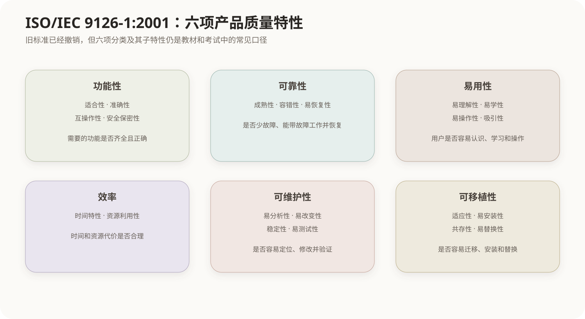
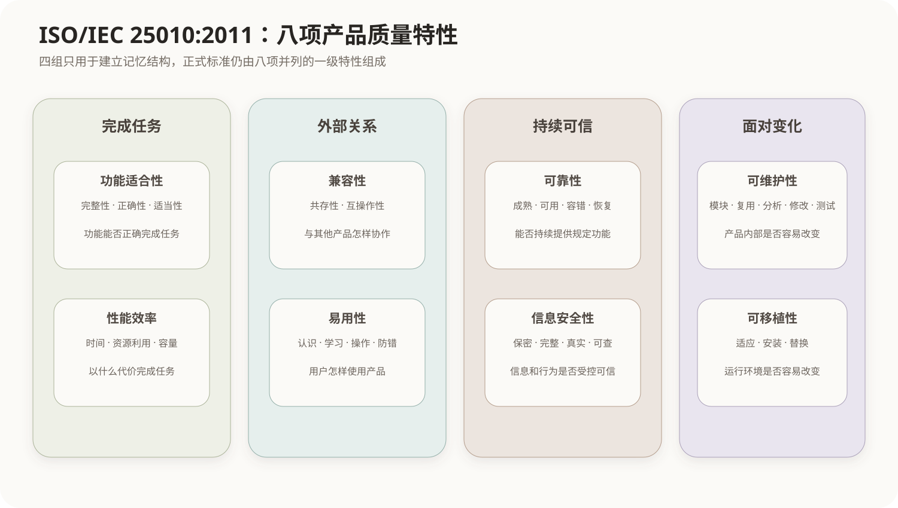
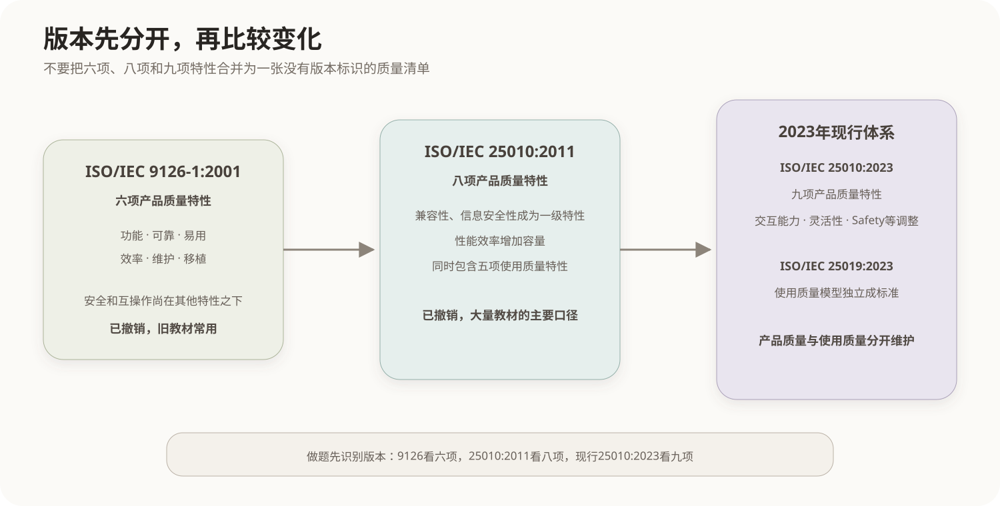

# 软件产品质量模型

## 1. 产品质量模型的作用

“软件质量好”可能表示功能完整、计算正确、响应及时、服务稳定、容易使用、便于修改或者能够迁移。产品质量模型把这些不同含义组织为特性和子特性，为质量需求、设计目标、测试范围和验收标准提供统一词汇。

质量模型首先是一套分类框架，不是某个软件的评分结果。把一项要求归入“可靠性”，只说明它关注哪类质量；还需要进一步写出目标条件和度量方法，才能判断产品是否达到要求。



## 2. 阅读质量模型的方法

质量模型中的概念按以下层次使用：

| 层次 | 作用 | 示例 |
|---|---|---|
| 特性 | 划分大的质量领域 | 可靠性 |
| 子特性 | 进一步区分该领域的关注点 | 可用性、容错性、可恢复性 |
| 质量要求 | 规定目标产品需要达到的结果 | 月度可用度不低于99.9% |
| 质量度量 | 定义怎样获得和计算证据 | 正常服务时间÷计划服务时间 |

ISO/IEC 25010定义产品质量模型；与特性对应的具体度量还会涉及ISO/IEC 25023等标准。因而“可用性”是质量分类，“可用度99.9%”才是针对某个产品的具体要求。

不同版本的特性数量和术语会变化。阅读题目或资料时应先识别版本，再在该版本内部判断归属，不能把多个版本的列表直接合并。

## 3. ISO/IEC 9126-1:2001

ISO/IEC 9126-1:2001把软件产品质量分为六项一级特性。该标准已经撤销，但旧教材和考试题仍经常使用它的术语。



| 一级特性 | 主要子特性 | 判断重点 |
|---|---|---|
| 功能性 | 适合性、准确性、互操作性、安全保密性 | 是否提供需要的功能并给出正确结果 |
| 可靠性 | 成熟性、容错性、易恢复性 | 是否少发生故障、故障时继续工作并能够恢复 |
| 易用性 | 易理解性、易学性、易操作性、吸引性 | 用户是否容易认识、学习和操作产品 |
| 效率 | 时间特性、资源利用性 | 响应和吞吐是否及时，资源消耗是否合理 |
| 可维护性 | 易分析性、易改变性、稳定性、易测试性 | 是否容易定位、修改、控制修改影响并验证修改结果 |
| 可移植性 | 适应性、易安装性、共存性、易替换性 | 是否容易迁移、安装、共存或替换其他产品 |

多个特性还包含“依从性”子特性，用于表示产品遵循相应标准、约定或法规的程度。教材中的简化表可能省略它。

### 3.1 稳定性的特定含义

9126中的稳定性属于可维护性，表示软件修改后避免产生非预期结果的能力。它不是日常语言中“运行时不崩溃”的同义词。

```text
修改一个模块后，无关模块出现异常
→ 9126可维护性中的稳定性不足

系统正常运行时频繁发生故障
→ 主要涉及可靠性中的成熟性
```

## 4. ISO/IEC 25010:2011

ISO/IEC 25010:2011用SQuaRE体系取代9126模型，把产品质量扩展为八项一级特性。该版本已经由2023版替代，但目前大量教材仍以2011版为主要知识口径。



| 一级特性 | 子特性 | 判断重点 |
|---|---|---|
| 功能适合性 | 功能完整性、功能正确性、功能适当性 | 功能是否齐全、结果是否正确、是否真正帮助完成任务 |
| 性能效率 | 时间特性、资源利用性、容量 | 延迟、吞吐、资源消耗和可承载规模是否合格 |
| 兼容性 | 共存性、互操作性 | 能否共享环境并与其他产品正确交换和使用信息 |
| 易用性 | 适宜性识别、易学性、易操作性、用户差错防御性、用户界面美观性、易访问性 | 用户是否容易判断适用性、学习、操作并避免错误 |
| 可靠性 | 成熟性、可用性、容错性、可恢复性 | 是否稳定提供服务、承受故障并恢复状态和数据 |
| 信息安全性 | 保密性、完整性、抗抵赖性、可核查性、真实性 | 是否阻止未授权读取和修改，并保证行为与身份可信可查 |
| 可维护性 | 模块化、可重用性、易分析性、易修改性、易测试性 | 是否容易理解结构、复用、定位、修改和验证 |
| 可移植性 | 适应性、易安装性、易替换性 | 是否容易适应新环境、安装部署和替换其他产品 |

八项特性可以按关注对象分成四组帮助建立整体结构，但这只是记忆编排，不是ISO增加的中间分类：

```text
完成任务：功能适合性、性能效率
外部关系：兼容性、易用性
持续可信：可靠性、信息安全性
面对变化：可维护性、可移植性
```

## 5. 高频特性族

### 5.1 功能适合性与性能效率

功能适合性判断“能否完成正确的任务”，性能效率判断“以怎样的时间和资源代价完成”。

```text
缺少导出功能
→ 功能完整性

金额计算错误
→ 功能正确性

查询结果正确但需要20秒
→ 性能效率中的时间特性

能够承载的并发量不足
→ 性能效率中的容量
```

功能正确不代表性能合格，响应很快也不能弥补功能结果错误。

### 5.2 兼容性与易用性

兼容性关注产品与其他产品或环境之间的关系；易用性关注用户与产品之间的交互。

| 概念 | 评价对象 | 典型问题 |
|---|---|---|
| 共存性 | 共享同一环境的多个产品 | 是否过度抢占资源并影响其他产品 |
| 互操作性 | 相互交换信息的产品或系统 | 数据能否正确交换并被对方使用 |
| 易学性 | 用户学习产品的过程 | 达到独立操作需要多少学习时间 |
| 易操作性 | 用户控制和操作产品的过程 | 操作步骤、反馈和纠错是否合理 |
| 用户差错防御性 | 用户误操作与产品防护 | 是否预防错误并限制错误后果 |
| 易访问性 | 不同能力和条件的用户 | 是否支持键盘操作、屏幕阅读和适当对比度 |

学习曲线描述用户随着学习时间或使用次数增加，任务正确率、熟练度、完成时间或错误数量怎样变化。曲线上升或下降本身没有固定含义，必须先看纵轴表示的是熟练度还是错误数。

### 5.3 可靠性与信息安全性

可靠性关注产品是否持续提供规定功能，信息安全性关注信息和行为是否受到授权与可信控制。

| 可靠性子特性 | 判断重点 |
|---|---|
| 成熟性 | 正常运行时是否少发生由缺陷引起的故障 |
| 可用性 | 需要使用时是否处于可操作状态 |
| 容错性 | 发生故障时是否仍能维持规定功能 |
| 可恢复性 | 故障造成影响后能否恢复数据和运行状态 |

```text
容错性：故障发生时继续服务
可恢复性：服务受影响后恢复回来
可用性：综合观察需要使用时是否有服务
```

可用度常用以下方式表示：

```text
可用度 = 可提供服务时间 ÷ 计划提供服务总时间

稳定条件下的近似关系：
Availability = MTBF ÷ (MTBF + MTTR)
```

信息安全性的保密性、完整性和真实性分别关注未授权读取、未授权修改以及身份或来源是否可信；抗抵赖性和可核查性关注行为证据与追踪能力。

### 5.4 可维护性与可移植性

可维护性关注产品内部面对分析、修改和验证时的难度；可移植性关注产品整体面对运行环境变化时的适应和迁移难度。

```text
定位一个故障需要多长时间
→ 易分析性

修改功能影响了多少模块
→ 模块化、易修改性

修改后是否容易验证
→ 易测试性

迁移到另一种操作系统
→ 适应性

能否顺利部署到目标环境
→ 易安装性
```

## 6. 容易混淆的名称

| 名称 | 英文 | 核心对象 |
|---|---|---|
| 易用性 | Usability | 用户能否理解、学习和操作产品 |
| 可用性 | Availability | 需要服务时系统能否正常提供服务 |
| 可维护性 | Maintainability | 开发和维护人员能否分析、修改和验证产品 |
| 容错性 | Fault tolerance | 故障发生时能否继续维持规定功能 |
| 可恢复性 | Recoverability | 故障造成影响后能否恢复状态和数据 |
| 互操作性 | Interoperability | 两个产品能否交换并使用彼此的信息 |
| 共存性 | Co-existence | 多个产品共享环境时能否避免相互妨碍 |

同一事件可以影响多个质量维度。例如攻击导致CPU耗尽：攻击入口涉及信息安全性，资源耗尽涉及性能效率，服务无法访问涉及可靠性中的可用性。分类时应根据当前正在评价的质量目标判断，而不是强行给整个事件指定唯一标签。

## 7. 产品质量与使用质量

产品质量观察产品本身的静态属性和运行行为；使用质量观察特定用户在规定使用情境中完成目标的结果。

```text
产品质量
→ 功能、性能、可靠性、易用性等产品属性

使用质量
→ 用户在实际情境中的有效性、效率、满意程度和风险结果
```

以界面为例，易学性和易操作性属于产品质量；用户在具体工作环境中的任务完成率、完成时间和满意度属于使用质量结果。产品具有良好的交互设计，会促进使用质量，但两者不是同一层级。

ISO/IEC 25010:2011同时包含产品质量模型和五项使用质量特性；2023年修订后，产品质量模型保留在ISO/IEC 25010:2023，使用质量模型独立为ISO/IEC 25019:2023。

## 8. 标准版本演进



| 版本 | 状态与结构 | 阅读重点 |
|---|---|---|
| ISO/IEC 9126-1:2001 | 已撤销；六项产品质量特性 | 旧教材常用，安全和互操作性尚未成为独立一级特性 |
| ISO/IEC 25010:2011 | 已撤销；八项产品质量特性，并包含使用质量模型 | 当前大量教材和试题的主要口径 |
| ISO/IEC 25010:2023 | 现行产品质量模型；九项一级特性 | 产品范围扩展到ICT产品，新增和调整部分分类 |
| ISO/IEC 25019:2023 | 现行使用质量模型 | 使用质量从25010中独立出来 |

2011版相对9126的重要变化包括：

- 功能性调整为功能适合性；
- 效率调整为性能效率并增加容量；
- 兼容性成为一级特性，集中共存性和互操作性；
- 信息安全性成为一级特性；
- 可维护性和易用性的子特性重新组织。

2023版产品质量模型包含九项一级特性：功能适合性、性能效率、兼容性、交互能力、可靠性、信息安全性、可维护性、灵活性和Safety。中文资料可能把Security和Safety都译成“安全”，阅读时应保留英文：Security关注未授权访问、修改和攻击，Safety关注产品避免对人员、财产和环境造成不可接受风险的能力。

## 核心关系

```text
质量模型
→ 对产品质量进行分类

特性
→ 大的质量领域

子特性
→ 该领域中的具体关注点

质量要求
→ 为目标产品规定可验证的结果

质量度量
→ 定义取得和计算证据的方法

9126-1:2001：六项产品质量特性
25010:2011：八项产品质量特性，是大量教材的主要口径
25010:2023：九项现行产品质量特性
25019:2023：现行使用质量模型
```

## 参考资料

- [ISO/IEC 9126-1:2001](https://www.iso.org/standard/22749.html)
- [ISO/IEC 25010:2011](https://www.iso.org/standard/35733.html)
- [ISO/IEC 25010:2023](https://www.iso.org/standard/78176.html)
- [ISO/IEC 25019:2023](https://www.iso.org/standard/78177.html)
- [ISO/IEC 25023:2016](https://www.iso.org/standard/35747.html)
