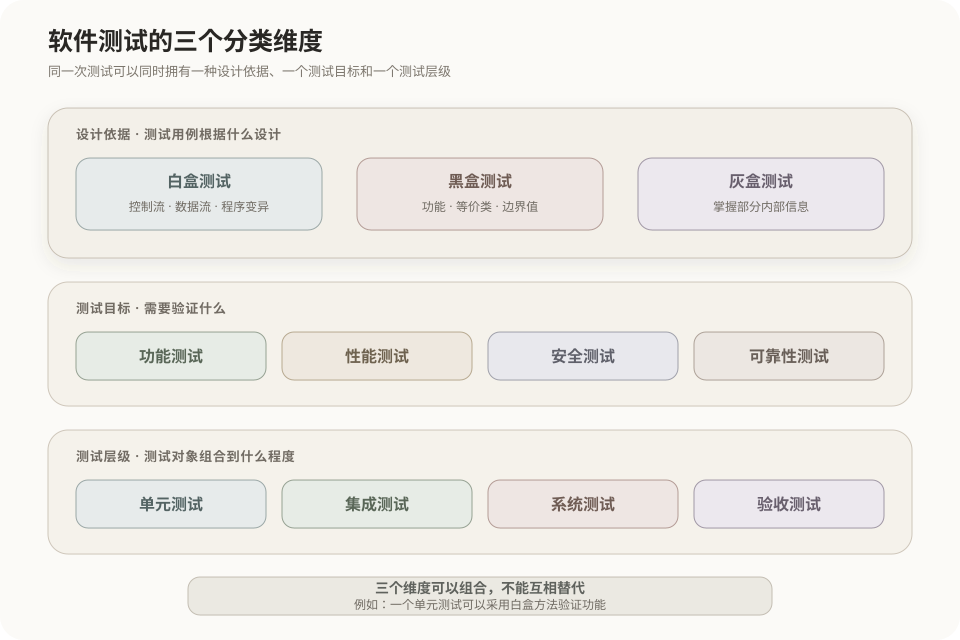
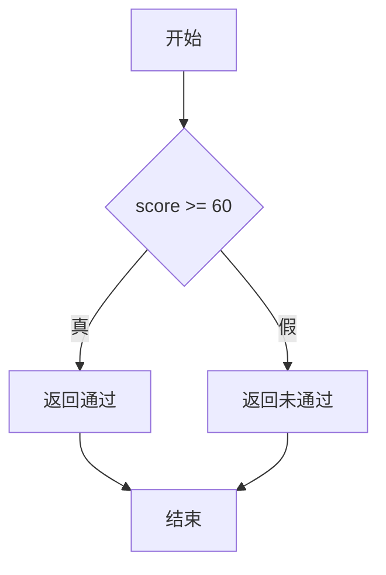
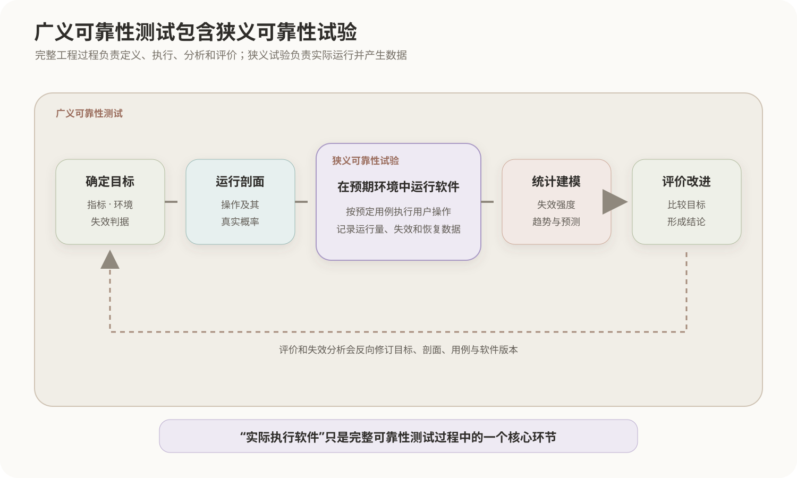
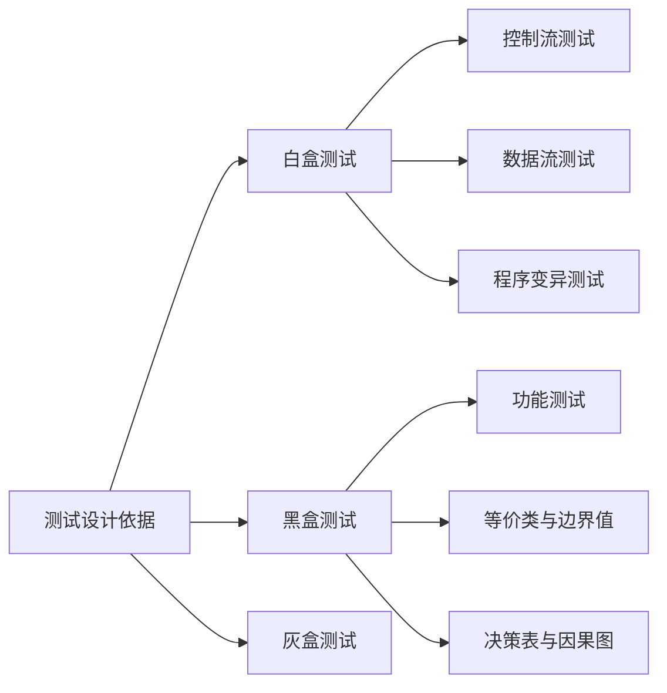

# 软件测试方法与分类

软件测试可以按照不同维度分类。白盒、黑盒和灰盒描述测试设计时对程序内部结构的利用程度；功能与非功能描述测试目标；单元、集成、系统和验收描述测试所处的层级。只有先确定分类维度，才能正确理解各种测试方法之间的关系。



## 1. 测试分类的三个维度

| 分类维度 | 主要问题 | 常见分类 |
|---|---|---|
| 测试设计依据 | 测试用例依据内部结构还是外部规格设计 | 白盒、黑盒、灰盒 |
| 测试目标 | 需要验证系统的哪类质量特性 | 功能测试、性能测试、安全测试、可靠性测试等 |
| 测试层级 | 测试对象处于软件组合的哪个层级 | 单元测试、集成测试、系统测试、验收测试 |

这些维度可以组合。例如，一个单元测试既可能按照代码分支设计，也可能只根据函数接口规格设计；系统测试既可以验证业务功能，也可以验证性能和安全性。因此，不能把“单元测试”等同于白盒测试，也不能把“系统测试”等同于黑盒测试。

可靠性测试属于按测试目标划分的一类，第5节进一步说明其专用概念和流程。

## 2. 白盒、黑盒与灰盒测试

### 2.1 白盒测试

白盒测试也称结构测试或透明盒测试，根据程序内部结构设计测试。测试人员需要了解代码、控制流程、变量使用或内部实现，并据此选择测试数据。

白盒测试主要检查：

- 语句和分支是否被执行；
- 条件的真假取值是否得到覆盖；
- 主要执行路径是否经过测试；
- 变量从定义到使用的关系是否正确；
- 测试用例能否识别内部代码发生的错误变化。

### 2.2 黑盒测试

黑盒测试也称规格说明测试，根据需求、接口契约和可观察行为设计测试，不以内部代码结构作为主要依据。

```text
输入数据 → 被测系统 → 实际输出
                         │
                         └── 与需求规定的预期结果比较
```

黑盒测试关注系统做了什么，典型方法包括等价类划分、边界值分析、决策表、因果图、状态迁移和场景测试。

### 2.3 灰盒测试

灰盒测试介于白盒和黑盒之间。测试人员掌握部分内部信息，例如数据库结构、接口调用链、缓存机制或部署结构，但仍主要通过外部接口执行和观察测试。

灰盒测试常用于接口测试、集成测试、安全测试以及分布式系统故障定位。

## 3. 白盒测试的主要方法

### 3.1 控制流测试

控制流测试根据语句、判断、分支、循环和执行路径设计测试。程序通常先转换为控制流图，再选择需要覆盖的结构。



语句覆盖、判定覆盖、条件覆盖、条件组合覆盖、MC/DC和路径覆盖都属于控制流测试中的逻辑覆盖技术，具体规则见[白盒测试的逻辑覆盖](08-白盒测试逻辑覆盖.md)。

### 3.2 数据流测试

数据流测试关注变量的定义、赋值和使用，核心对象是变量的“定义—使用”关系，即 `def-use` 关系。

```text
变量定义 ──> 沿某条执行路径传播 ──> 变量使用
   │                                  │
   ├── 使用前是否已经定义             ├── 计算使用
   └── 是否未经使用就被重新定义       └── 判定使用
```

数据流测试可以发现：

- 使用未初始化的变量；
- 变量定义后从未使用；
- 变量在使用前被错误地重新赋值；
- 某些定义—使用路径从未执行。

### 3.3 程序变异测试

程序变异测试对源程序作微小修改，生成多个变异体，再运行现有测试用例。如果测试能够使原程序与变异体产生不同结果，就称该变异体被“杀死”。

```java
// 原程序
if (score >= 60) { ... }

// 变异体
if (score > 60) { ... }
```

常见变异包括：

- 替换关系运算符，如把 `>=` 改为 `>`；
- 替换算术或逻辑运算符；
- 修改常量；
- 删除语句；
- 反转布尔值。

在软考常见分类中，程序变异测试通常归入白盒测试，因为它直接操作程序内部代码。更细的测试理论也会把它描述为基于故障或故障注入的测试技术，这与其需要使用内部代码并不矛盾。

## 4. 黑盒测试的主要方法

### 4.1 功能测试

功能测试根据需求规格验证系统提供的功能是否符合预期，主要检查给定输入能否产生规定的输出和行为。

例如，需求规定“成绩达到60分时显示通过”，测试可以直接构造输入60并检查输出，而不需要知道程序内部使用条件语句、规则表还是其他实现方式。

严格来说，“功能测试”描述测试目标，“白盒或黑盒”描述测试设计依据，两者属于不同分类维度；但在软考常见的简化分类中，功能测试通常按照外部规格设计，因此归入黑盒测试方法。

### 4.2 等价类划分

将输入域划分为若干具有相同行为特征的有效等价类和无效等价类，从每类选择少量代表值进行测试。

### 4.3 边界值分析

重点测试输入范围的边界、边界两侧和特殊极值。大量缺陷发生在 `>`、`>=`、数组长度和循环次数等边界处理上。

### 4.4 决策表与因果图

决策表用条件组合和对应动作表达复杂业务规则；因果图描述输入条件与输出结果之间的逻辑关系，并可进一步转换为决策表和测试用例。

### 4.5 状态迁移与场景测试

状态迁移测试检查不同事件触发的状态变化；场景测试按照完整业务流程及其异常分支组织测试。

## 5. 按测试目标划分的可靠性测试

软件可靠性是软件在规定条件、规定时间内，无失效完成规定功能的能力。可靠性测试因此不只检查某一次操作是否正确，还要让软件在具有代表性的环境和使用方式下持续运行，记录失效及运行时间，并评价其可靠性水平。



### 5.1 广义与狭义可靠性测试

| 范围 | 定位 | 包含的工作 |
|---|---|---|
| 广义可靠性测试 | 为最终评价软件可靠性建立完整过程 | 确定目标、建立运行剖面、设计与执行试验、统计建模、分析和评价 |
| 狭义可靠性测试 | 广义过程中的实际试验环节 | 按预定用例在预期使用环境中运行软件，收集失效数据 |

狭义可靠性测试也称软件可靠性试验。教材所说的“按照用户将要使用的方式测试，每次测试代表用户完成的一组操作”，描述的是实际运行软件并产生数据的狭义环节，而不是包含建模和评价的完整广义过程。

### 5.2 运行剖面

运行剖面描述各种操作在真实使用中出现的相对频率或概率分布。例如查询占55%、新增占20%、修改占15%，可靠性试验就应大体按照该比例生成操作序列，使得到的失效数据能够代表实际使用情况。

运行剖面不是功能清单。功能测试可以让每项功能各执行一次，确认其行为是否正确；可靠性测试还要求长期样本中的操作比例接近真实用户。罕见但后果严重的场景可能不容易被概率抽中，因此仍需另外安排风险定向测试。

### 5.3 基本过程与作用

```text
确定可靠性目标
→ 建立运行剖面
→ 设计测试用例
→ 在预期环境中实施狭义可靠性试验
→ 记录失效时间、操作和系统状态
→ 分析数据并评价可靠性
```

可靠性测试可以辅助识别高频路径、长时间运行、特定负载或状态组合中的薄弱环节，并为可靠性评价提供数据。但有限次数的测试不能证明软件绝对不存在缺陷；运行剖面失真、环境不一致和样本量不足都会影响结论。

## 6. 测试方法的关系



控制流测试、数据流测试和程序变异测试都需要分析或修改程序内部结构。功能测试通常根据需求规定的输入、输出和外部行为设计。区分它们时，关键不是测试是否自动化，也不是测试发生在哪个阶段，而是测试用例的主要设计依据。

## 7. 常见分类混淆

- **白盒测试不等于单元测试**：单元测试是测试层级，既可以采用白盒方法，也可以只按接口规格设计。
- **黑盒测试不等于人工测试**：黑盒描述设计依据，同样可以完全自动化。
- **功能测试不等于系统测试**：功能是测试目标，单元、集成和系统是测试层级。
- **覆盖率高不等于功能正确**：覆盖率说明代码结构被执行，不证明输出、边界和业务规则都正确。
- **变异测试不只是制造错误**：它通过可控代码变化评价现有测试用例识别错误的能力。

## 核心结论

```text
白盒测试：依据程序内部结构设计测试。
黑盒测试：依据需求规格和外部行为设计测试。
灰盒测试：利用部分内部信息，通过外部接口实施测试。

控制流测试：检查语句、分支、条件和执行路径。
数据流测试：检查变量的定义—使用关系。
程序变异测试：通过修改内部代码评价测试用例的缺陷发现能力。
功能测试：根据功能需求检查输入、输出和外部行为。
可靠性测试：按照代表性使用方式收集失效数据并评价规定时间内的无失效运行能力。

广义可靠性测试包含目标、运行剖面、试验、分析和评价；
狭义可靠性测试负责实际运行软件并产生可靠性数据。
```
