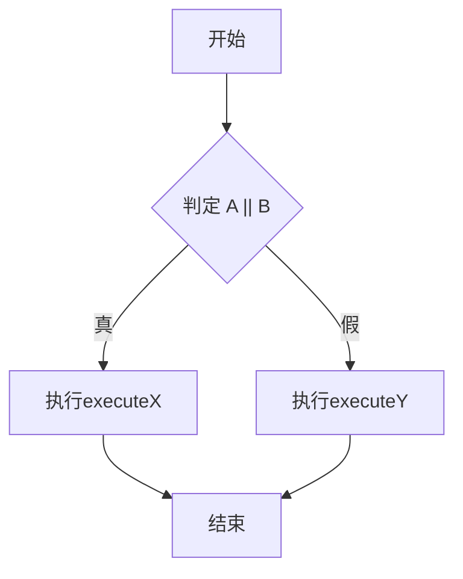
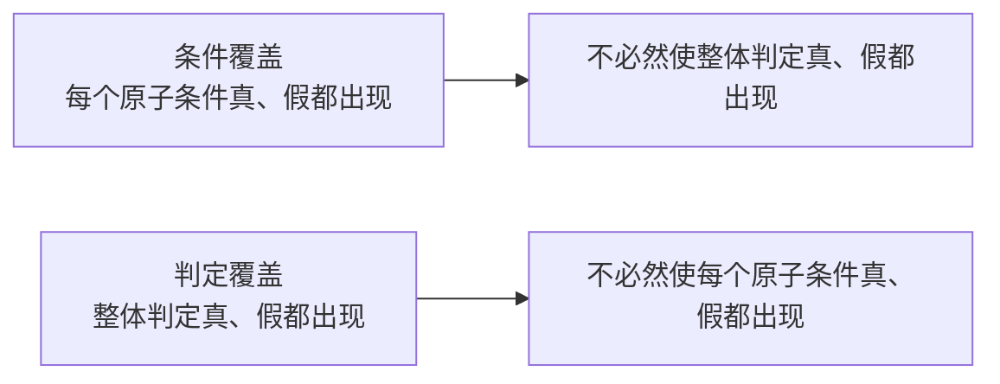
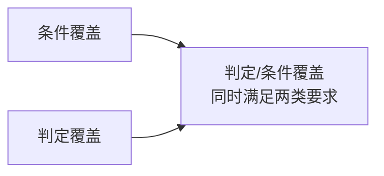
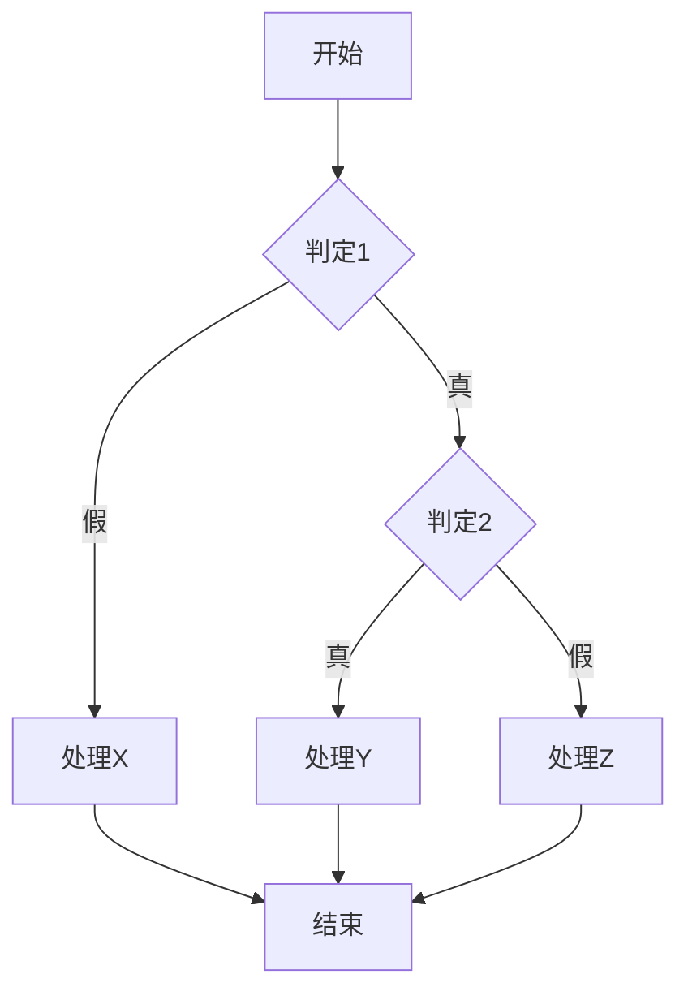
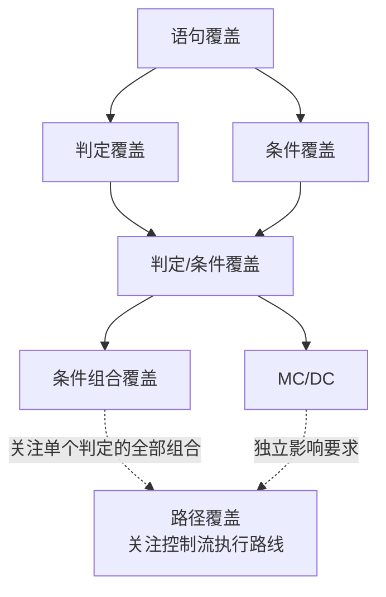

# 白盒测试的逻辑覆盖

本页是[软件测试方法与分类](07-软件测试方法与分类.md)中的控制流测试专题，集中说明白盒测试的各种逻辑覆盖标准。控制流、数据流、程序变异与功能测试的分类关系见上层概览。

## 1. 逻辑覆盖的对象

白盒测试根据程序内部结构设计测试数据。逻辑覆盖主要检查语句、分支、原子条件及执行路径被测试到什么程度。

假设程序中存在：

```java
if (A || B) {
    executeX();
} else {
    executeY();
}
```

其中：

```text
判定：A || B的整体布尔结果
条件：判定内部的原子条件A和B
分支：整体判定为真或为假时进入的不同控制方向
```



必须严格区分整个判定的真假与每个原子条件的真假。两者不是同一个覆盖对象。

## 2. 语句覆盖

语句覆盖要求每条可执行语句至少执行一次。

例如：

```java
if (A) {
    executeX();
}
executeY();
```

只使用`A = true`，就可以使`executeX()`和`executeY()`都执行，因此达到语句覆盖。但`A = false`对应的控制情况没有得到检查。

语句覆盖能够发现从未执行的代码区域，但不能保证每个分支方向、每个条件取值或每条路径都被测试。

## 3. 判定覆盖

判定覆盖也称分支覆盖，要求每个判定的整体结果至少出现一次真和一次假，也就是每个控制分支至少执行一次。

对于`A || B`，可以使用：

| 测试数据 | A | B | <code>A &#124;&#124; B</code> |
|---|---|---|---|
| 1 | 真 | 假 | 真 |
| 2 | 假 | 假 | 假 |

整体判定出现过真和假，因此满足判定覆盖。但是B始终为假，没有单独取得真值，所以这组数据不满足条件覆盖。

```text
判定覆盖关注：整个表达式的结果是否正反都出现。
```

## 4. 条件覆盖

条件覆盖要求每个原子条件至少取得一次真值和一次假值。

对于`A || B`，可以使用：

| 测试数据 | A | B | <code>A &#124;&#124; B</code> |
|---|---|---|---|
| 1 | 真 | 假 | 真 |
| 2 | 假 | 真 | 真 |

此时：

```text
A出现过真和假
B出现过真和假
```

所以满足条件覆盖。但整个判定始终为真，假分支没有执行，因此不满足判定覆盖。

```text
条件覆盖关注：每个原子条件是否正反都出现。
```

## 5. 条件覆盖与判定覆盖的关系

条件覆盖与判定覆盖严格来说不能简单排列为绝对强弱：



因此：

```text
满足条件覆盖，不一定满足判定覆盖。
满足判定覆盖，也不一定满足条件覆盖。
```

“覆盖A强于覆盖B”通常表示：任何满足A的测试集合都必然同时满足B。如果两个标准都不能必然包含对方，就不存在这种严格包含关系。

部分简化资料会给所有逻辑覆盖形式强行排列一条线性顺序，但严格分析时应使用具体定义和包含关系。

## 6. 判定/条件覆盖

判定/条件覆盖同时要求：

1. 每个判定的整体结果至少出现一次真和一次假；
2. 每个原子条件至少出现一次真和一次假。

对于`A || B`，可以使用：

| 测试数据 | A | B | 判定结果 |
|---|---|---|---|
| 1 | 真 | 假 | 真 |
| 2 | 假 | 真 | 真 |
| 3 | 假 | 假 | 假 |

这组数据同时满足判定覆盖和条件覆盖。



判定/条件覆盖强于单独的判定覆盖，也强于单独的条件覆盖。但它仍然不要求一个判定内所有条件组合全部出现。

## 7. 条件组合覆盖

条件组合覆盖也称多条件覆盖，要求每个判定中各个原子条件的所有可行真假组合至少出现一次。

如果一个判定包含两个独立布尔条件A和B，理论上有：

```text
2² = 4种组合
```

| 组合 | A | B |
|---|---|---|
| 1 | 真 | 真 |
| 2 | 真 | 假 |
| 3 | 假 | 真 |
| 4 | 假 | 假 |

三个独立布尔条件最多产生：

```text
2³ = 8种组合
```

一般情况下，`n`个独立布尔条件最多产生：

```text
2ⁿ种真假组合
```

条件组合覆盖的准确对象是：

> 每个判定内部所有原子条件的可行取值组合。

它不是只要求整个判定结果出现真和假。对于普通的非恒真、非恒假判定，完整条件组合通常也会同时满足条件覆盖和判定覆盖。

### 不可行组合

实际业务约束可能使某些条件组合无法出现。例如：

```text
A：用户年龄小于18岁
B：用户已经通过仅限成年人完成的认证
```

如果系统规则保证A和B不可能同时为真，就不能为了形式上的组合数量强行构造非法状态。覆盖分析应记录不可行组合及其约束依据。

## 8. 短路求值的影响

在Java、C、JavaScript等语言中，`&&`和`||`通常采用短路求值：

```java
A || B   // A为真时，B可能不再执行
A && B   // A为假时，B可能不再执行
```

因此，输入数据在逻辑上能够为B赋值，不代表运行时B一定被实际求值。若条件表达式包含函数调用或副作用，应区分：

- 条件在数学真值表中的取值；
- 条件在具体执行过程中是否真正被求值。

覆盖工具通常根据编译器插桩和实际执行情况统计，具体报告口径可能受语言、编译器和工具影响。

## 9. MC/DC修正条件/判定覆盖

MC/DC全称为Modified Condition/Decision Coverage，通常译为修正条件/判定覆盖。

它要求：

1. 每个判定结果都出现真和假；
2. 每个原子条件都出现真和假；
3. 每个原子条件都能够被证明独立影响整个判定结果。

对于`A && B`，可以选择：

| 测试数据 | A | B | `A && B` | 说明 |
|---|---|---|---|---|
| 1 | 真 | 真 | 真 | 基准情况 |
| 2 | 假 | 真 | 假 | 只改变A，判定结果改变 |
| 3 | 真 | 假 | 假 | 只改变B，判定结果改变 |

在测试1和测试2之间，只改变A，整体结果从真变假，证明A能够独立影响判定。测试1和测试3则证明B能够独立影响判定。

MC/DC通常比完整条件组合覆盖需要更少的测试数据，但比普通判定/条件覆盖增加了独立影响要求。它常用于高完整性和安全关键软件。

## 10. 路径覆盖

路径覆盖要求程序控制流图中的执行路径被覆盖。



对于没有循环的小程序，可以枚举有限路径。存在循环时，完整路径数量可能极大甚至无限，因此工程实践通常采用基本路径测试、循环边界测试或限定循环次数等方法。

路径覆盖关注跨越多个判定的执行路线，而条件组合覆盖主要关注单个判定内部的条件组合，两者关注层次不同。

## 11. 覆盖关系

在通常的可达代码、可行组合和非退化判定等前提下，可以使用以下关系理解主要标准：



这幅图需要结合以下边界理解：

- 条件覆盖和判定覆盖互不必然包含；
- MC/DC与完整条件组合覆盖的要求不同，不能只按测试数据数量简单判断强弱；
- 条件组合覆盖不自动等于完整路径覆盖；
- 不可达代码、不可行组合和循环会影响理论覆盖关系。

## 12. 同一表达式的覆盖数据对照

以`A || B`为例：

| 覆盖标准 | 可采用的数据 | 达到的效果 |
|---|---|---|
| 语句覆盖 | 根据目标语句选择至少一组数据 | 让目标语句执行，但可能只进入一个分支 |
| 判定覆盖 | `(真,假)`、`(假,假)` | 整体判定出现真和假，B没有出现真 |
| 条件覆盖 | `(真,假)`、`(假,真)` | A、B都出现真和假，整体判定始终为真 |
| 判定/条件覆盖 | `(真,假)`、`(假,真)`、`(假,假)` | 同时覆盖原子条件和整体判定的真假 |
| 条件组合覆盖 | `(真,真)`、`(真,假)`、`(假,真)`、`(假,假)` | 覆盖A、B的全部真假组合 |

实际执行时还需检查语言的短路求值是否导致后续条件没有被求值。

## 13. 覆盖率不等于缺陷发现能力

覆盖率说明哪些代码结构被执行，并不直接证明：

- 输出结果正确；
- 边界值已经充分检查；
- 异常路径符合业务要求；
- 并发和时序问题不存在；
- 性能、安全和可靠性满足要求；
- 测试断言能够识别错误结果。

一个测试可以执行某条语句却不检查其输出，因此达到覆盖率不代表测试一定有效。逻辑覆盖需要与需求测试、边界值分析、等价类、异常测试和有效断言结合使用。

## 核心结论

```text
语句覆盖：每条可执行语句至少执行一次。
判定覆盖：每个判定的整体结果真、假至少各出现一次。
条件覆盖：每个原子条件真、假至少各出现一次。
判定/条件覆盖：同时满足判定覆盖和条件覆盖。
条件组合覆盖：覆盖每个判定内部原子条件的所有可行真假组合。
MC/DC：证明每个原子条件能够独立影响判定结果。
路径覆盖：覆盖程序控制流中的执行路线。

条件覆盖与判定覆盖互不必然包含，不能简单认定其中一个绝对强于另一个。
```
