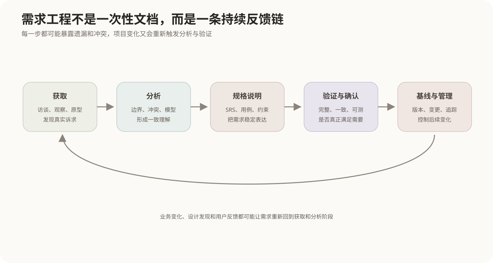
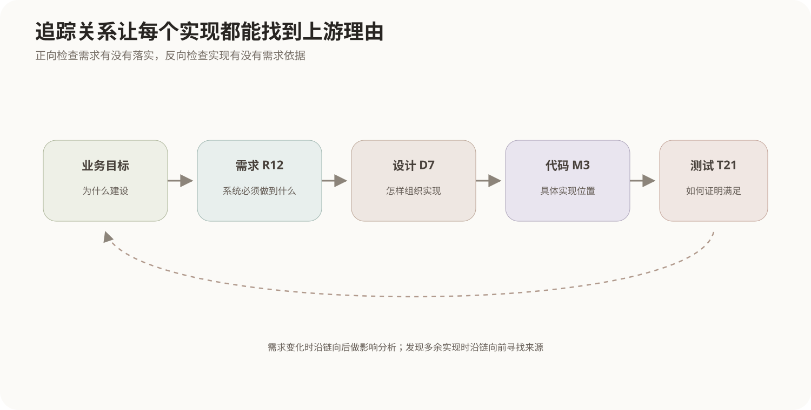

# 需求工程

## 1. 需求不是用户说的一句话

软件开发真正困难的地方往往不是“代码能不能写”，而是团队是否理解了**要解决什么问题、系统边界在哪里、完成到什么程度才算正确**。

用户可能说：

> 查询要快一点。

这只是一个愿望。开发人员无法据此设计容量，测试人员也不知道什么时候算通过。需求工程要把这种模糊目标逐步转化为可理解、可协商、可记录、可验证和可追踪的需求，例如：

```text
在业务高峰期，95%的普通查询应在2秒内返回。
```

因此需求工程不是“写需求文档”这一个动作，而是一套从发现问题到控制变化的连续过程。



## 2. 需求的三个基本层次

为了避免把所有内容都混成“功能列表”，可以先区分：

### 2.1 功能需求

说明系统应该提供什么行为或能力：

```text
用户可以提交订单。
系统能够根据订单生成发货任务。
管理员可以冻结账户。
```

功能需求回答的是“系统做什么”。

### 2.2 质量需求

说明功能要达到怎样的运行或演化水平，例如性能、可靠性、可用性、安全性、可修改性等：

```text
高峰期95%的查询不超过2秒。
单个节点失效后30秒内恢复核心服务。
```

这些需求中的一部分会影响系统整体结构，因此会成为架构重要需求。如何把抽象质量词转成可判断场景，见[质量属性场景与效用树](../10-系统质量属性与架构评估/01-质量属性场景与效用树.md)。

### 2.3 约束

约束限制系统可以怎样实现，例如：

- 必须运行在指定平台；
- 必须兼容既有协议；
- 必须遵守特定法规；
- 必须复用现有身份平台。

约束不一定增加用户可见功能，但会显著缩小设计空间。

## 3. 需求获取：先把真实世界里的信息找出来

需求获取（Elicitation）面对的不是一份已经写好的答案，而是多个利益相关者、现有流程、业务资料和隐性规则。

常用方法包括：

| 方法 | 更适合发现什么 |
|---|---|
| 访谈 | 角色目标、业务规则、痛点和例外 |
| 观察 | 用户没有主动描述的实际操作和隐性流程 |
| 问卷 | 大量参与者的共性意见 |
| 研讨会 | 多角色之间快速澄清冲突和边界 |
| 原型 | 用户难以用文字描述的界面和交互需求 |
| 文档分析 | 现有制度、表单、接口和旧系统规则 |
| 场景/用例 | 用户为了达成目标与系统发生的交互 |

需求获取最大的风险是把某个参与者的观点直接当成“系统需求”。例如销售希望允许任意折扣，财务要求超过阈值必须审批。两边都是真实诉求，但最终需求必须经过分析和协商才能形成一致规则。

## 4. 需求分析：把原始诉求变成一致模型

获取阶段得到的是原始材料，需求分析要继续解决四类问题：

1. **边界**：哪些事情由系统负责，哪些属于外部人员或外部系统；
2. **冲突**：不同角色提出的要求能否同时成立；
3. **遗漏**：正常流程之外还有哪些异常、回退和边界条件；
4. **可实现与优先级**：哪些需求在成本、工期和技术条件下应该先实现。

分析过程通常会建立模型，例如数据流图、领域模型、状态模型和用例模型。模型的作用不是“为了画图”，而是把复杂需求放进一种能够检查一致性和遗漏的结构里。

例如订单状态：

```text
待支付 → 已支付 → 待发货 → 已发货 → 已完成
               ↘ 退款中 → 已退款
```

一旦状态被画出来，就可以继续追问：“已发货还能不能直接取消？”“退款过程中是否允许再次发货？”这些都是单纯读需求文字不容易发现的边界。

## 5. 用例怎样表达功能需求

用例从外部参与者的目标出发，描述系统与参与者之间的一组交互。一个完整用例通常包含：

- 参与者；
- 目标；
- 前置条件；
- 基本事件流；
- 备选或异常事件流；
- 后置条件。

例如“用户提交订单”的基本流可以是：

```text
用户选择商品
→ 系统显示结算信息
→ 用户确认
→ 系统校验库存
→ 系统创建订单
→ 返回订单编号
```

若库存不足，则进入备选流。用例擅长描述“用户为了一个目标与系统怎样交互”，但它不能替代性能、可靠性等质量需求，也不能完整表示所有内部数据结构。

## 6. SRS为什么要强调质量而不是篇幅

SRS（Software Requirements Specification，软件需求规格说明）是经过分析后形成的系统化需求说明。它的价值是让客户、开发、测试和项目管理人员对系统范围形成共同依据。

好的需求不是“写得很正式”就够了，还应尽量满足：

- **正确**：反映真实需要；
- **完整**：必要功能、边界和约束没有关键遗漏；
- **一致**：不同需求之间不互相冲突；
- **无歧义**：重要表述只有一种合理解释；
- **可验证**：能够设计检查方法判断是否满足；
- **可追踪**：能找到来源，也能追到后续设计和测试；
- **可修改**：结构清楚，变化时能定位影响。

“界面友好”“系统稳定”“速度很快”都缺乏可验证标准。需求工程真正要做的是继续追问，直到要求能够支持设计和验证。

## 7. 验证与确认分别在问什么

相关教材常用两个相近概念：

- **Verification（验证）**：需求规格本身是否写得正确、一致、完整、可实现；
- **Validation（确认）**：这些需求是否真的是利益相关者需要的系统。

可以用两个问题区分：

```text
验证：我们把需求写对了吗？
确认：我们写的是正确的需求吗？
```

具体术语在不同资料中可能存在翻译差异，因此理解其检查对象比死记中文词更重要。

常见需求检查手段包括评审、原型、模型检查、根据需求推导测试场景以及追踪关系审查。

## 8. 需求为什么需要基线

项目一旦开始设计和实现，大量工作都会依赖某个需求版本。如果任何人都可以直接修改需求，团队就无法知道当前实现到底对应哪一版目标。

**需求基线**是经过正式评审和批准、作为后续工作的稳定参考版本。基线不代表永远禁止修改，而是表示修改要经过受控过程：

```text
提出变更
→ 分析影响
→ 审批或拒绝
→ 更新基线
→ 修改设计、代码与测试
→ 重新验证
```

影响分析不能只看“代码改几行”，还要检查范围、架构、接口、数据、测试、成本和进度。

## 9. 追踪关系把需求和后续工程连接起来



追踪通常包含两个方向：

- **正向追踪**：某条需求后来由哪些设计、代码和测试实现；
- **反向追踪**：某个设计或功能到底来自哪条需求，避免出现没有需求依据的实现。

例如：

```text
业务目标 G1
  ↓
需求 R12：订单取消后5分钟内释放库存
  ↓
设计 D7：库存预留服务
  ↓
代码模块 M3
  ↓
测试 T21 / T22
```

如果R12变化，团队可以沿这条链定位受影响的设计和测试；如果某个代码模块找不到任何上游需求，也可以追问它是否属于范围蔓延。

## 10. 需求变更为什么不可避免

需求变化可能来自市场、法规、业务流程、技术限制、用户认知加深或早期理解错误。优秀的需求工程并不是幻想“冻结需求后永远不变”，而是让变化**可见、可评估、可追踪**。

这也解释了需求工程和软件生命周期模型之间的关系：瀑布式过程倾向在前期形成较稳定规格；迭代和敏捷过程允许需求随着反馈逐步细化。但无论采用什么开发模型，系统边界、优先级和变更影响都仍然需要管理。

## 11. 核心关系

```text
现实业务与利益相关者
        ↓ 获取
原始诉求、规则、问题
        ↓ 分析与协商
一致的功能、质量和约束模型
        ↓ 规格说明
SRS / 用例 / 需求模型
        ↓ 验证与确认
判断是否写对、是否真正需要
        ↓ 建立基线
进入设计、实现和测试
        ↕
变更管理 + 追踪关系贯穿始终
```
