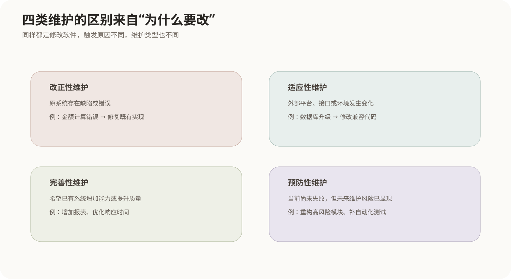
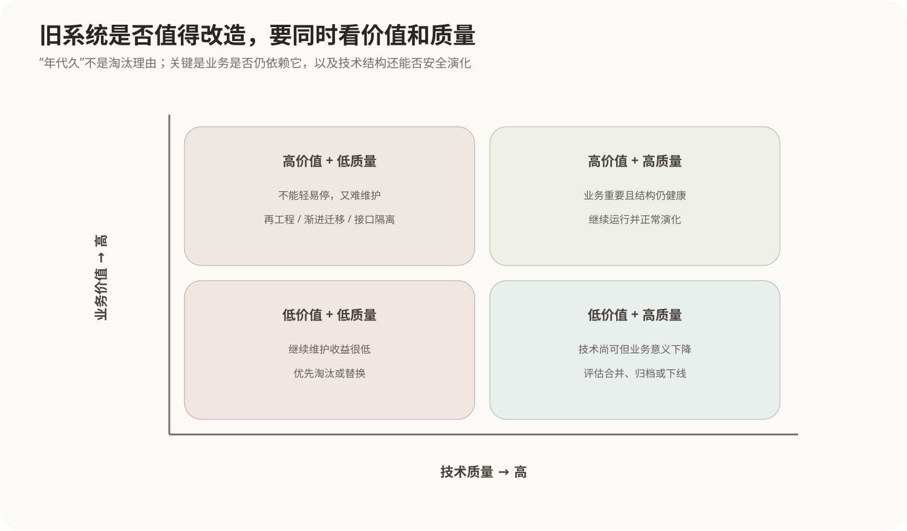

# 软件维护与遗留系统

## 1. 软件交付并不是生命周期终点

软件投入运行后，环境仍在变化：用户会发现缺陷，操作系统和数据库会升级，业务规则会改变，新的功能需求会出现，原有代码也可能因为长期修改越来越难理解。

因此“维护”不是简单修Bug，而是软件进入生产环境后，为了**纠正错误、适应环境、改善能力和降低未来风险**而持续进行的修改活动。

一个系统运行十年以后，真正困难的地方通常已经不是某个算法，而是：

- 哪些代码仍然承担关键业务；
- 修改一个模块会不会破坏别处；
- 原始设计文档是否还可信；
- 旧平台还能维护多久；
- 是继续修、局部改造还是整体替换。

这就是软件维护和遗留系统治理要解决的问题。

## 2. 四类维护来自四种不同变化来源



### 2.1 改正性维护

运行后发现软件本身存在错误，对缺陷进行修复：

```text
结算金额在特定条件下计算错误
→ 修正代码和测试
```

它的触发原因是“原有实现不符合既定要求”。

### 2.2 适应性维护

外部环境变化，原系统必须跟着适配：

```text
操作系统升级
数据库版本变化
外部接口协议变化
法规或业务环境变化
```

软件原来可能完全正确，但外部条件已经不同。

### 2.3 完善性维护

为了提升已有系统的功能、性能、易用性或可维护性而改进，例如增加报表、缩短响应时间、优化交互流程。

它不是纠正原有错误，而是让系统“做得更多或更好”。

### 2.4 预防性维护

在故障尚未发生前，为降低未来维护成本和失败风险而改善内部结构，例如清理高风险代码、补测试、重构难以修改的模块。

这类维护的特点是当前功能可能没有明显问题，但团队已经看到了未来风险。

## 3. 一次维护为什么不能直接“找到代码就改”

一个受控的维护过程通常包括：

```text
提出维护请求
→ 理解问题和现有系统
→ 影响分析
→ 修改设计与实现
→ 回归测试
→ 更新配置项和文档
→ 发布
```

其中最容易被低估的是**影响分析**。一个表字段变化可能影响接口、报表、缓存、迁移脚本和测试数据；一个共享函数的修复可能改变多个业务路径。

因此维护的本质不是“修改局部代码”，而是确保变更在整个既有系统中保持一致。

## 4. 维护成本为什么会越来越高

系统长期演化后，维护成本常被以下因素放大：

- 原始开发人员离开，知识流失；
- 文档与代码不同步；
- 模块耦合过高，局部变化扩散；
- 自动化测试不足，修改后无法快速确认影响；
- 技术平台老旧，工具和依赖逐渐停止支持；
- 多次临时补丁破坏原有结构。

这也是为什么[模块内聚与耦合](05-模块内聚与耦合.md)、[软件产品质量模型](06-软件产品质量模型.md)中的可维护性不是“代码风格好看”这样的小问题，而会直接决定软件整个后半生命周期的成本。

## 5. 逆向工程是在“从实现往回理解”

当代码还在运行、但设计和文档已经缺失时，需要从现有实现中恢复更高层信息，这称为**逆向工程（Reverse Engineering）**。

方向是：

```text
代码 / 数据库 / 配置
        ↓
识别模块和接口
        ↓
恢复设计结构
        ↓
理解业务和需求意图
```

逆向工程的主要目的首先是**理解**，不必然改变系统功能。

例如团队接手一套没有架构文档的旧系统，可以通过代码调用关系、数据库表、接口日志和运行行为恢复模块边界，这就是逆向工程。

## 6. 重构、重构造和再工程不要混在一起

### 6.1 重构 Refactoring

重构在**不改变外部可观察行为**的前提下改善代码内部结构，例如提取函数、拆分类、消除重复。

它通常发生在代码层，是日常演化手段。

### 6.2 重构造 Restructuring

教材中的重构造通常指在同一抽象层次上整理程序或数据结构，例如代码结构化、数据结构重组，使系统更容易理解和维护。

### 6.3 再工程 Reengineering

再工程面对的是整个已有系统，通过分析和改造让它获得更好的可维护结构。常包含：

```text
系统盘点
→ 逆向工程理解现状
→ 重构代码/数据/架构
→ 必要时重新实现部分能力
→ 建立新的文档与工程结构
```

所以三者关系可以理解为：

```text
逆向工程：向上理解“现在是什么”
重构/重构造：改善某个层次的内部结构
再工程：组织一套较完整的旧系统改造过程
```

## 7. 什么是遗留系统

遗留系统不是简单等于“年代久”。一个系统之所以成为遗留系统，关键在于它仍承载重要业务，却因为技术、结构、文档或人员等原因变得难以演化。

典型特征包括：

- 业务价值仍然很高；
- 技术平台老旧；
- 改动风险大；
- 文档缺失；
- 专家依赖严重；
- 与大量其他系统存在复杂接口。

因此“旧系统应该立刻重写”并不成立。是否替换必须同时看**业务价值**和**系统技术质量**。



## 8. 遗留系统的四种基本治理思路

### 高业务价值 + 高技术质量

继续运行并正常演化。系统虽然已有历史，但结构仍能支撑业务，没有必要为了“新技术”重写。

### 高业务价值 + 低技术质量

最需要谨慎治理。因为不能轻易停掉，又越来越难维护，通常考虑再工程、逐步替换、接口隔离和数据迁移。

### 低业务价值 + 高技术质量

技术上可能不差，但业务已经不重要。继续投入改造不一定划算，可以评估合并或下线。

### 低业务价值 + 低技术质量

如果没有强制依赖，通常优先淘汰，避免继续投入维护成本。

这个二维判断比“旧=重写、新=保留”更合理，因为软件系统首先是业务资产。

## 9. 大规模重写为什么风险很高

旧系统中往往存在大量没有写进文档的业务规则。有些看起来奇怪的判断可能正是在处理十年前出现过的特殊情况。

如果新系统只根据当前文档重写，很容易丢失这些隐性行为。因此大型遗留系统常采用逐步替换：

```text
先建立清晰接口边界
→ 选择一个业务能力迁移
→ 新旧系统并存
→ 验证数据和行为一致
→ 逐步扩大新系统范围
→ 最后下线旧能力
```

这种方式速度可能不如“一次性重写”看起来痛快，但能够把业务风险拆成多个可验证阶段。

## 10. 核心关系

```text
软件运行后的变化
    ↓
错误 → 改正性维护
环境变化 → 适应性维护
能力改善 → 完善性维护
降低未来风险 → 预防性维护

旧系统难以理解
    ↓
逆向工程恢复结构和知识
    ↓
重构 / 重构造改善局部结构
    ↓
再工程组织系统级改造

遗留系统是否替换
不能只看年龄
要同时看业务价值和技术质量
```
