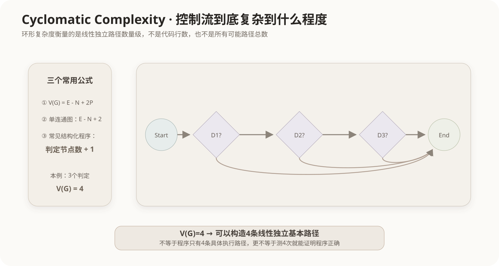

# 环形复杂度与基本路径测试

## 1. 为什么需要衡量控制流复杂度

白盒测试不仅关心某条语句或某个条件有没有执行，还要面对一个更大的问题：程序中分支越多，可能形成的执行路径就越复杂。

环形复杂度（Cyclomatic Complexity，也称圈复杂度）用控制流图的结构衡量程序中**线性独立路径的数量级**，常用于基本路径测试和代码复杂度分析。

它不是代码行数，也不是“所有可能路径的总数”。含循环时，所有具体执行路径甚至可能无限多，而环形复杂度仍然是一个有限结构量。



## 2. 控制流图是什么

把程序的顺序语句块作为节点，把可能的控制转移作为边，就得到控制流图（Control Flow Graph，CFG）。

例如：

```cpp
if (A) {
    f1();
}
if (B) {
    f2();
}
f3();
```

两个判定会形成多条不同的控制路线。环形复杂度就是从图结构中刻画这种分支复杂度。

## 3. 三种常见计算方式

### 3.1 边和节点公式

对于一个连通控制流图：

```text
V(G) = E - N + 2
```

其中：

- `E`：边数；
- `N`：节点数。

更一般地，若图有P个连通分量：

```text
V(G) = E - N + 2P
```

软考基础题通常是单个程序控制流图，P=1。

### 3.2 判定节点公式

对于常见的结构化、单入口单出口程序，可以快速使用：

```text
V(G) = 判定节点数 + 1
```

例如有3个独立判定节点：

```text
V(G) = 3 + 1 = 4
```

### 3.3 区域数

在平面控制流图的常见画法中，图被边围出的区域数（包括外部区域）也可对应V(G)。题目若要求数区域，要把图外面的区域也计算在内。

## 4. 为什么“判定数 + 1”成立

一个没有判定的直线程序只有一条独立路径：

```text
V(G)=1
```

每增加一个典型二分判定，就给控制流增加一个新的独立选择方向，因此结构化程序中常表现为：

```text
0个判定 → 1
1个判定 → 2
2个判定 → 3
3个判定 → 4
```

但遇到复杂图、异常边或多入口结构时，优先使用 `E-N+2P`，不要机械套“判定数+1”。

## 5. 基本路径测试

基本路径测试（Basis Path Testing）利用环形复杂度选择一组**线性独立路径**作为测试基础。

若：

```text
V(G)=4
```

说明可以构造4条独立路径，使每条新路径至少引入一条此前路径集合没有独立包含的新边组合。测试人员再为这些路径设计输入数据。

需要注意：

```text
V(G)=4
≠ 程序只有4条具体执行路径
≠ 只要测4次就能证明程序完全正确
```

它只是给基本路径集合和结构复杂度提供依据。

## 6. 与逻辑覆盖的关系

逻辑覆盖关注：

- 语句有没有执行；
- 判定真假是否出现；
- 原子条件真假是否出现；
- 条件组合是否覆盖。

环形复杂度和基本路径测试更关注**整个控制流图的独立路径结构**。两者属于同一白盒测试体系，但不是同一个指标。

详细逻辑覆盖见[白盒测试的逻辑覆盖](08-白盒测试逻辑覆盖.md)。

## 7. 复杂度高意味着什么

V(G)较高通常意味着：

- 分支和循环较多；
- 理解和维护成本可能上升；
- 需要考虑的独立测试路径更多；
- 缺陷隐藏在复杂控制交互中的概率可能提高。

但不能只凭一个阈值机械判定代码“好或坏”。业务本身复杂时，合理分解、清晰命名和模块化同样重要。

## 8. 常见考查方式

- 3个独立判定节点 → 常见结构下 `V(G)=4`；
- 给控制流图数边、节点 → `V(G)=E-N+2`；
- 环形复杂度与基本路径测试相关；
- “环形复杂度等于全部可能路径数量”错误；
- “存在循环时环形复杂度一定无限大”错误。

## 核心关系

```text
控制流图 CFG
   ↓
V(G)=E-N+2P
   ↓
常见结构化程序：判定节点数+1
   ↓
得到线性独立路径数量级
   ↓
支持基本路径测试
```
