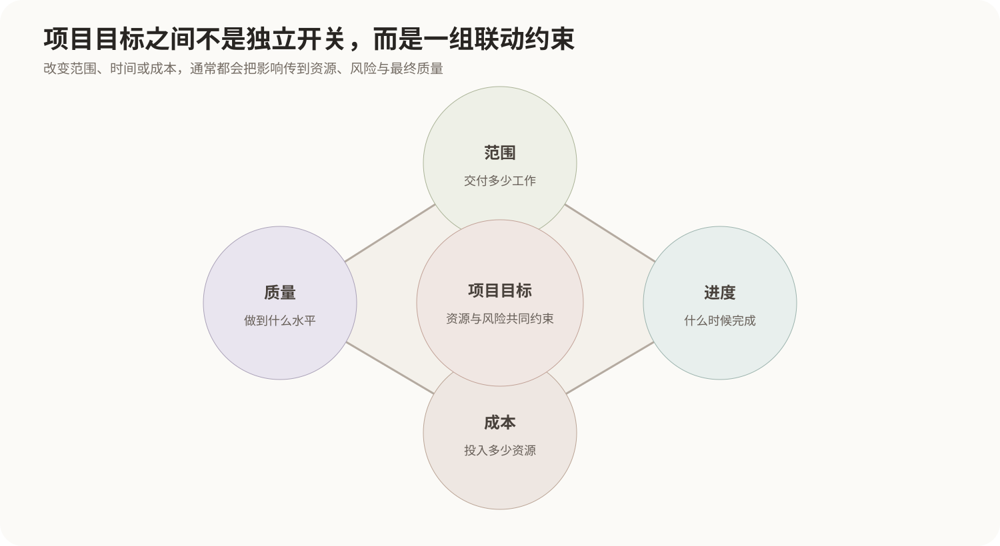
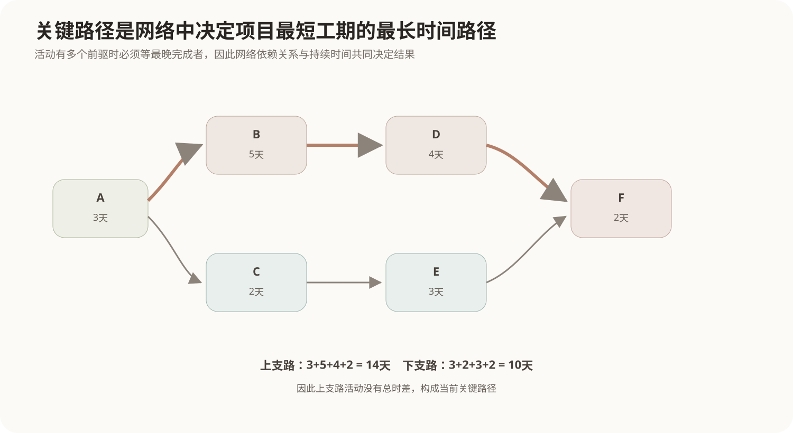
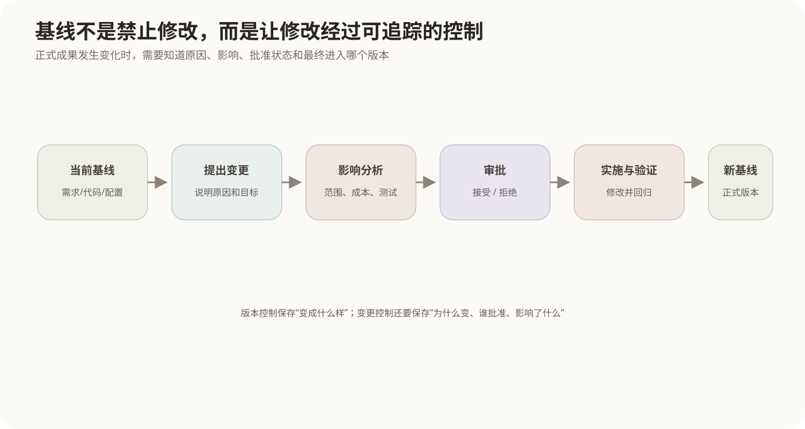

# 项目管理基础

## 1. 项目管理管理的不是“人忙不忙”

软件项目同时受到范围、时间、成本、质量、资源和风险等多种约束。某个目标单独看都可能很合理，但它们放在一起就会互相影响：

- 增加功能范围，通常会增加工作量；
- 压缩工期，可能需要增加资源，也可能提高返工和质量风险；
- 降低成本，可能减少可投入人员、设备或测试；
- 提高质量要求，往往需要更多验证、自动化和审查活动。

因此项目管理的核心不是把每个人排满，而是让**目标、工作、资源、时间和变更之间保持受控关系**。



项目与日常运营也不同。项目为了形成一个相对独特的产品、服务或成果而开展，具有明确目标和阶段；运营则是持续、重复地维持已有业务。

## 2. 范围管理先回答“到底要交付什么”

如果项目边界不清楚，进度和成本计划就没有稳定基础。范围管理需要把高层目标逐步拆成能够估算、分配和验收的工作。

### 2.1 产品范围与项目范围

- **产品范围**：最终软件要具备哪些功能和质量特性；
- **项目范围**：为了交付这些能力，项目团队需要完成哪些工作。

例如“系统支持电子签名”属于产品范围；为了交付它而进行需求分析、接口开发、测试、部署和培训属于项目范围。

### 2.2 WBS工作分解结构

WBS（Work Breakdown Structure）把大型交付目标逐层分解为更小的工作包：

```text
在线订单系统
├── 需求与设计
├── 用户与权限
│   ├── 登录
│   └── 权限配置
├── 订单处理
│   ├── 创建订单
│   └── 取消订单
└── 测试与发布
```

WBS的作用不是把组织结构画出来，而是建立一个**完整且可管理的工作范围层次**。底层工作包应该足够清晰，以便估算工期、成本、责任人和完成标准。

常用的“100%规则”是：父节点的全部工作应由其子节点完整覆盖，不能遗漏，也不应重复计算。

## 3. 从工作分解到进度网络

工作包被识别后，还要确定先后依赖关系。例如：

```text
数据库设计完成
→ 才能稳定开发数据访问层
→ 才能进行完整集成测试
```

进度计划的关键不是把任务写进日历，而是识别哪些活动之间存在依赖，以及哪些活动一旦延期就会拖延整个项目。



### 3.1 最早开始与最早完成

从网络起点向终点正向计算：

```text
最早开始 ES = 所有直接前驱最早完成时间的最大值
最早完成 EF = ES + 活动持续时间
```

之所以取“最大值”，是因为一个活动如果需要多个前驱全部完成，就必须等待最晚完成的那个。

### 3.2 最迟完成与最迟开始

从项目终点反向计算：

```text
最迟完成 LF = 所有直接后继最迟开始时间的最小值
最迟开始 LS = LF - 活动持续时间
```

之所以取“最小值”，是为了不拖延任何一个后继活动。

### 3.3 总时差与关键路径

活动可以推迟而不影响项目总工期的时间称为总时差：

```text
总时差 = LS - ES = LF - EF
```

总时差为0的活动构成关键路径。关键路径上的活动一旦延误，如果没有采取压缩或调整措施，就会直接延长项目完成时间。

“关键”指的是**对总工期没有机动时间**，不等于这些任务技术上最困难，也不等于只有一条关键路径。

## 4. PERT怎样处理活动时间的不确定性

有些活动无法给出单一确定工期，可以给出三个估计：

- `a`：乐观时间；
- `m`：最可能时间；
- `b`：悲观时间。

PERT常用期望时间：

```text
te = (a + 4m + b) / 6
```

方差常写作：

```text
σ² = ((b-a)/6)²
```

例如一个任务乐观2天、最可能5天、悲观8天：

```text
te = (2 + 4×5 + 8) / 6 = 5天
```

PERT的意义不是“用公式把工期算准”，而是把活动时间的不确定性显式放进计划分析。

## 5. 进度压缩不能靠一句“大家加快”

当关键路径太长时，常见思路包括：

### 5.1 赶工 Crashing

投入额外资源缩短关键活动，例如增加人员、设备、外包或加班。它通常会增加成本，而且软件开发中人员增加也存在沟通和上手成本，不能假设人力与工期完全线性互换。

### 5.2 快速跟进 Fast Tracking

把原本顺序执行的活动改成部分并行，例如设计尚未完全结束就启动已稳定部分的开发。它可能缩短工期，但会提高返工和协调风险。

只有压缩**关键路径上的活动**才会直接缩短当前项目总工期；非关键活动如果仍有足够时差，即使缩短也可能不改变完工日期。

## 6. 成本管理与进度不是两个孤立表格

成本首先来自工作量、人员、设备、外部服务和其他资源投入。计划阶段需要建立预算基线，执行过程中再比较实际投入与计划。

项目中常见三类基本量：

- **计划价值 PV**：按计划到当前应该完成的工作价值；
- **挣值 EV**：实际已经完成工作的预算价值；
- **实际成本 AC**：完成这些工作真实花费的成本。

由此可以观察：

```text
成本偏差 CV = EV - AC
进度偏差 SV = EV - PV
成本绩效指数 CPI = EV / AC
进度绩效指数 SPI = EV / PV
```

例如`CPI < 1`表示相对于已经完成的工作，实际花费高于预算效率；`SPI < 1`表示完成的工作量落后于计划。

挣值把“花了多少钱”和“真正做完多少工作”放在同一尺度上，避免只看支出金额就误判项目状态。

## 7. 质量管理不是项目结束时才测试

质量管理至少包含三层工作：

- **质量规划**：确定适用标准、质量目标和验证方式；
- **质量保证**：关注过程是否能够稳定产生符合要求的结果；
- **质量控制**：检查具体交付物，发现缺陷并采取纠正措施。

软件测试属于质量控制的重要手段，但质量不能完全依靠测试“筛出来”。需求评审、设计审查、编码规范、自动化构建、配置管理等过程同样影响最终质量。

关于具体测试方法见[软件测试方法与分类](07-软件测试方法与分类.md)。

## 8. 配置管理为什么是项目管理的重要部分

软件项目会产生代码、需求、设计、测试脚本、部署配置、第三方依赖等大量会变化的成果。配置管理负责让团队知道：

- 哪些对象是受控配置项；
- 当前正式版本是哪一个；
- 谁在什么时候改了什么；
- 某个发布版本由哪些配置项组成；
- 变更是否经过批准和验证。



### 8.1 配置项与基线

配置项（Configuration Item，CI）是纳入配置管理的受控对象。基线是经过正式评审批准、作为后续工作的稳定版本集合。

基线不是“禁止再改”，而是要求后续修改走受控流程。

### 8.2 版本控制与变更控制

版本控制保存不同版本和分支，回答“文件怎样变化”；变更控制还要回答“为什么改、是否批准、影响哪些范围、何时进入正式基线”。

因此仅仅把代码放进Git，并不能自动完成完整的软件配置管理。

### 8.3 状态报告与配置审计

配置状态报告记录当前配置项版本、变更状态和发布关系；配置审计检查实际交付物是否与批准的配置和文档一致。

## 9. 风险管理是在问题发生前处理不确定性

风险是尚未确定发生、但一旦发生会影响项目目标的不确定事件。常见过程是：

```text
识别风险
→ 分析概率与影响
→ 排优先级
→ 制定应对措施
→ 持续监控
```

风险应对可以包括：

- **规避**：改变方案，使风险来源消失；
- **减轻**：降低发生概率或影响；
- **转移**：把部分后果交给第三方承担；
- **接受**：风险较低或无法经济消除时，准备应急方案。

已经发生的故障不再只是“风险”，而变成需要处理的问题。

## 10. 核心关系

```text
项目目标
  ↓
范围：要交付什么、要完成哪些工作
  ↓ WBS
活动与依赖
  ↓ 网络计划
关键路径决定当前最短总工期
  ↓
资源和成本支持活动执行
  ↓
质量保证交付结果满足要求

整个过程中：
配置管理控制成果版本和变更
风险管理控制尚未发生的不确定性
```
