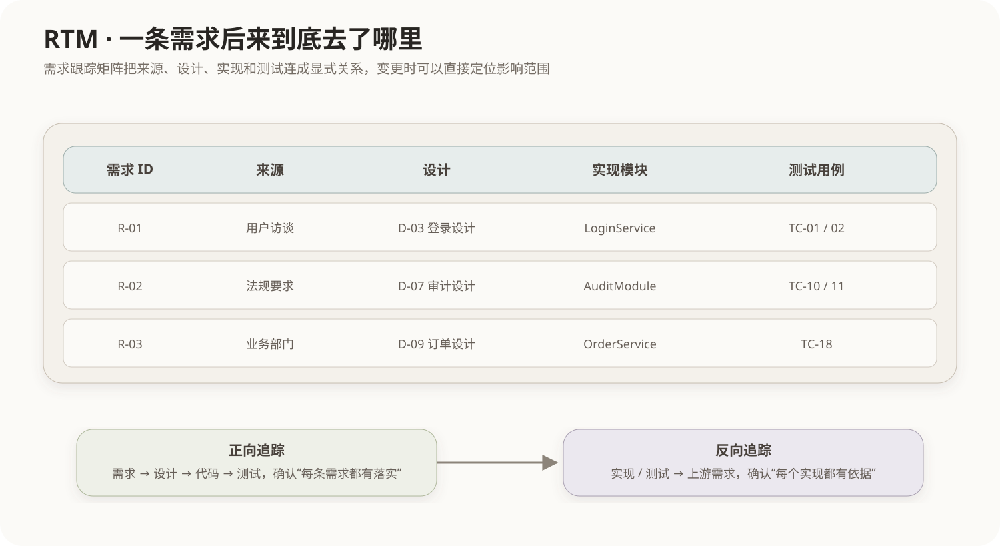

# 需求跟踪矩阵

## 1. 为什么需求写完以后还要“跟踪”

需求从提出到最终交付会跨越分析、设计、编码、测试和发布多个阶段。如果团队只保存一份SRS，却不知道每条需求后来落到了哪里，就会出现两个典型问题：

1. 需求已经批准，但没有任何设计、代码或测试真正实现它；
2. 系统里出现了一段功能，却找不到它来自哪条正式需求，形成范围蔓延。

因此需求管理不仅要保存“需求内容”，还要保存**需求与后续工程成果之间的对应关系**。

## 2. 什么是需求跟踪矩阵 RTM

需求跟踪矩阵（Requirements Traceability Matrix，RTM）把需求编号作为主线，把需求来源、设计、实现、测试和状态放到同一张关系表中。



一个简化RTM可以写成：

| 需求ID | 来源 | 设计 | 实现模块 | 测试用例 | 状态 |
|---|---|---|---|---|---|
| R-01 | 用户访谈 | D-03 | LoginService | TC-01/02 | 已验证 |
| R-02 | 法规 | D-07 | AuditModule | TC-10/11 | 开发中 |
| R-03 | 业务部门 | D-09 | OrderService | TC-18 | 待测试 |

矩阵本质不是某种固定Excel格式，而是一种**可查询的追踪关系模型**。实际项目可以存放在需求管理工具、ALM平台、数据库或代码仓库元数据中。

## 3. 正向追踪与反向追踪

### 正向追踪

从需求出发问：

```text
R-12
 ↓
由哪个设计实现？
 ↓
落在哪个模块？
 ↓
由哪些测试验证？
```

它用于确认每条需求都被完整落实。

### 反向追踪

从设计、代码或测试反过来问：

```text
某个模块M-08
 ↓
为什么存在？
 ↓
对应哪条正式需求？
```

它用于发现无需求依据的功能以及范围蔓延。

## 4. 需求变化时RTM为什么有价值

假设法规导致需求R-02变化，如果没有追踪关系，团队只能人工猜测哪些文件和模块受影响。

有RTM后可以沿链展开：

```text
R-02变化
→ D-07设计需要复审
→ AuditModule代码可能修改
→ TC-10/11需要更新
→ 发布说明和验收项同步变化
```

因此RTM是需求变更影响分析的重要基础。

## 5. RTM与需求基线的关系

需求基线回答：

> 当前正式生效的是哪一版需求？

RTM回答：

> 这一版需求分别被什么设计、代码和测试实现？

二者配合后，需求变更才能形成受控链路：

```text
提出变更
→ 分析RTM影响范围
→ 审批
→ 更新需求基线
→ 更新设计/代码/测试链接
→ 重新验证
```

## 6. RTM与“需求追踪链”不是两个概念

需求工程中常画：

```text
业务目标 → 需求 → 设计 → 代码 → 测试
```

这是追踪关系的链式视图；RTM则把这些关系组织成便于检查的矩阵/表格视图。它们解决的是同一个需求可追踪性问题，不要把二者当成互不相关的技术。

需求获取、SRS、基线和变更管理见[需求工程](09-需求工程.md)。

## 7. 常见考查方式

- “追踪某条需求最终由哪些设计、代码和测试实现” → RTM；
- “从代码反查需求来源” → 反向追踪；
- “需求变化时快速定位受影响测试” → 追踪关系/RTM；
- 数据字典主要描述数据定义，不替代RTM；
- 决策表用于表达条件—动作规则，不替代RTM。

## 核心关系

```text
需求不是终点
需求 → 设计 → 代码 → 测试 → 验收

RTM把这条链显式记录下来：
正向追踪保证“需求有落实”
反向追踪保证“实现有依据”
```
