# UML核心图

## 1. 为什么一个系统需要很多种图

软件系统同时存在很多种“真实”：它有用户眼里的业务目标，有分析人员眼里的领域对象，有开发人员眼里的类和构件，有运行时对象之间的消息，有对象自身的状态变化，也有最终部署到服务器、设备和运行环境上的物理形态。

如果试图用一张图同时表达这些内容，结果通常不是“信息更完整”，而是所有语义混在一起，读者不知道一条线到底表示继承、调用、数据流、部署关系还是消息。

UML（Unified Modeling Language，统一建模语言）的价值就在这里：**它不是一张图，而是一套具有明确语义的建模语言。不同图分别回答不同问题。**

例如同一个“订单系统”：

```text
用例图：客户希望系统提供哪些能力？
类图：订单、订单项、客户之间是什么静态关系？
对象图：此刻 order001、itemA 这些具体对象是什么状态？
顺序图：一次下单过程中谁先调用谁？
活动图：整个下单流程在哪里判断、并行和汇合？
状态机图：一个订单从待支付到已完成经历哪些状态？
构件图：前端、订单服务、库存服务怎样通过接口组成系统？
部署图：这些软件最后运行在哪些服务器、容器或设备上？
```

因此，理解 UML 最重要的不是先背图标，而是先问：**这张图准备描述系统的哪一种事实？**

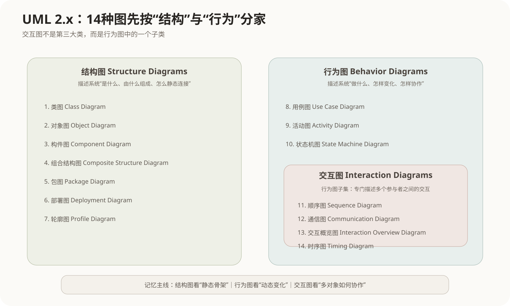

## 2. UML 2.x 的完整分类

按 UML 2.x 常用完整图族，可以整理为 **14 种图**。

### 2.1 结构图 Structure Diagrams

结构图描述系统相对稳定的静态组织：有哪些类型、实例、软件单元、内部部件、包、节点以及扩展定义。

```text
结构图
├── 类图 Class Diagram
├── 对象图 Object Diagram
├── 构件图 Component Diagram
├── 组合结构图 Composite Structure Diagram
├── 包图 Package Diagram
├── 部署图 Deployment Diagram
└── 轮廓图 Profile Diagram
```

### 2.2 行为图 Behavior Diagrams

行为图描述系统怎样执行、变化和响应事件。

```text
行为图
├── 用例图 Use Case Diagram
├── 活动图 Activity Diagram
├── 状态机图 State Machine Diagram
└── 交互图 Interaction Diagrams
    ├── 顺序图 Sequence Diagram
    ├── 通信图 Communication Diagram
    ├── 交互概览图 Interaction Overview Diagram
    └── 时序图 Timing Diagram
```

这里有一个很容易混淆的层级：**交互图不是与结构图、行为图并列的第三大类，而是行为图中的一个子类。**

---

# 第一部分：结构图

## 3. 类图 Class Diagram

### 3.1 定义

类图描述系统中的**类、接口、属性、操作，以及这些类型之间相对稳定的静态关系**。它是面向对象分析和设计中最核心的结构图。

如果把正在运行的软件比作一座城市，那么对象是某一时刻真正存在的人和车辆，类图更像城市的“类型蓝图”：规定有哪些类型的实体，它们具有什么属性、能执行什么操作，并以什么关系连接。

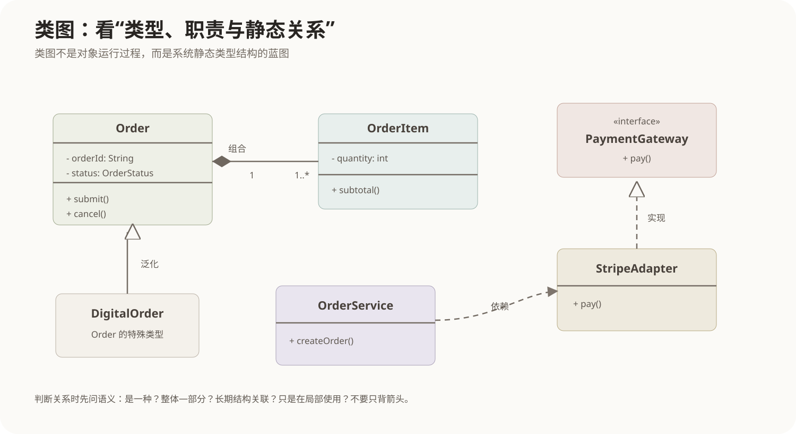

### 3.2 类本身怎样读

一个典型类可以分成三层：

```text
┌─────────────────────────┐
│ Order                   │  类名
├─────────────────────────┤
│ - orderId: String       │  属性
│ - status: OrderStatus   │
├─────────────────────────┤
│ + submit(): void        │  操作
│ + cancel(): void        │
└─────────────────────────┘
```

可见性常用：

```text
+ public
- private
# protected
~ package
```

属性可以进一步写成：

```text
可见性 属性名: 类型 = 默认值
```

操作可以写成：

```text
可见性 方法名(参数: 类型): 返回类型
```

### 3.3 类图六类高频关系

#### 泛化 Generalization

表示“**是一种**”关系，本质是继承。

```text
DigitalOrder 是 Order 的一种
Manager 是 Employee 的一种
```

图形通常是：**实线 + 空心三角，三角指向更一般的父类。**

不要把箭头方向记成“父类指向子类”。语义上应该想：

```text
子类 ───▷ 父类
```

因为三角所在一端表示更一般的分类器。

#### 实现 Realization

表示一个类或构件满足某个接口规定的契约。

```text
StripeAdapter 实现 PaymentGateway
```

通常使用：**虚线 + 空心三角，三角指向接口。**

泛化和实现的图形很像，区别主要在实线/虚线以及语义：

```text
泛化：子类继承父类
实现：实现类满足接口契约
```

#### 关联 Association

表示对象之间存在较稳定的结构联系。

```text
Customer 1 -------- 0..* Order
```

多重度常见写法：

```text
1       恰好一个
0..1    零个或一个
*       任意多个
0..*    零个或多个
1..*    至少一个
2..5    两个到五个
```

关联还可以有角色名、导航方向和关联类。

#### 聚合 Aggregation

聚合是一种较弱的“整体—部分”关系。

```text
Team ◇—— Player
```

空心菱形放在整体一端。关键不是空菱形本身，而是：**部分对象能够比较独立地存在，整体消失并不必然意味着部分也被销毁。**

#### 组合 Composition

组合是更强的“整体—部分”关系。

```text
Order ◆—— OrderItem
```

实心菱形放在整体一端。组合强调强所有权和生命周期约束：一个部分通常只属于一个组合整体，并与整体生命周期强绑定。

因此：

```text
聚合：弱整体—部分
组合：强整体—部分 + 强生命周期所有权
```

#### 依赖 Dependency

依赖表示“我为了完成某件事需要用到你”，但通常不形成长期保存的结构关系。

常见情况：

- 方法参数使用另一个类型；
- 局部变量创建另一个对象；
- 临时调用另一个服务；
- 静态工具方法引用。

依赖通常用虚线箭头表示。

### 3.4 怎么判断关联和依赖

不要机械地按“代码里出现过类名”判断。

例如：

```cpp
class OrderService {
private:
    PaymentGateway* gateway;
};
```

`PaymentGateway` 被长期保存为成员，通常是较稳定的结构关系，可以建模为关联。

而：

```cpp
void exportOrder(Order order, PdfWriter writer);
```

如果 `PdfWriter` 只在这一操作中临时使用，更接近依赖。

### 3.5 实际应用场景

类图特别适合：

- 领域建模；
- 数据与对象关系分析；
- 设计模块中的核心类型；
- 描述接口、继承体系和职责；
- 作为代码结构与数据库模型之间的中间设计语言。

### 3.6 常见考点

- 泛化与实现的区别；
- 聚合与组合的区别；
- 关联多重度；
- 依赖和关联的强弱；
- 抽象类、接口、类的表示；
- 类图属于结构图；
- 类图表达的是静态结构，不表达消息时间顺序。

### 3.7 易混淆点

```text
类图 vs 对象图：
类图画类型；对象图画具体实例。

类图 vs 构件图：
类图更偏代码/领域类型；构件图更偏大粒度软件单元和接口。

组合 vs 聚合：
不要只背实心/空心菱形，要看部分能否独立存在以及生命周期所有权。
```

---

## 4. 对象图 Object Diagram

### 4.1 定义

对象图描述**某一个具体时刻系统中实际存在的对象、对象属性值以及对象之间的链接**。

它可以理解为：

> **对象图 = 类图在某一个时刻的实例快照。**

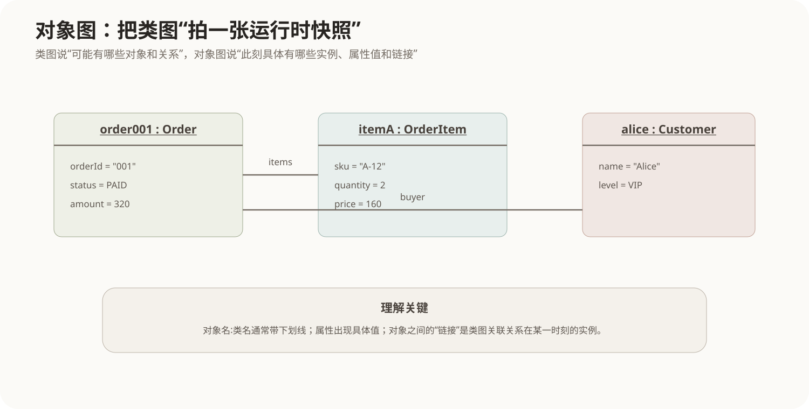

### 4.2 怎么理解

类图可能说：

```text
Customer 1 —— 0..* Order
Order 1 ◆—— 1..* OrderItem
```

对象图则真正画出：

```text
alice : Customer
order001 : Order
itemA : OrderItem
```

以及：

```text
order001.status = PAID
itemA.quantity = 2
```

类图表达的是“可以这样存在”，对象图表达的是“此刻确实这样存在”。

### 4.3 关键元素

对象一般写作：

```text
对象名 : 类名
```

传统 UML 表示中对象名称区域常带下划线。

对象之间的线称为 **link（链接）**，它可以理解为类图中的 Association 在实例层面的实际连接。

### 4.4 实际应用场景

对象图适合：

- 用一个具体实例验证类图是否合理；
- 解释复杂多重度；
- 记录某一测试场景的对象状态；
- 描述配置快照；
- 讲解设计模式某一时刻对象之间怎样连接。

### 4.5 常见考点与易混淆

对象图属于**结构图**，虽然它描述的是“某一时刻”，但它仍然不描述时间推进。

```text
对象图：一个时刻的静态快照
顺序图：一段时间内消息怎样推进
```

对象图中的实例和类图中的类也不能混为一谈：

```text
Order          类
order001:Order 对象实例
```

---

## 5. 构件图 Component Diagram

### 5.1 定义

构件图描述系统中的**可替换、可封装的软件构件，以及构件提供和需要的接口、构件之间的依赖关系**。

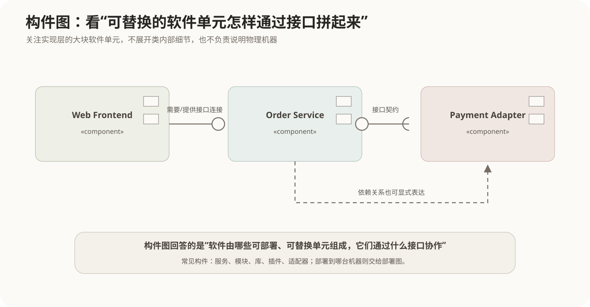

构件的粒度通常比类更大，例如：

- 一个订单服务；
- 一个认证模块；
- 一个插件；
- 一个动态链接库；
- 一个适配器；
- 一个具有明确接口的业务组件。

### 5.2 怎么理解

类图更像打开一个模块以后，看里面有哪些类；构件图则后退一步，看整个软件由哪些大块组成。

```text
类图：OrderService 类内部依赖哪些类型？
构件图：Order Service 这个软件构件需要 Payment 接口，并向外提供 Order API。
```

### 5.3 提供接口和需要接口

常见符号：

- 小圆球（lollipop）：**provided interface，提供接口**；
- 半圆插槽（socket）：**required interface，需要接口**。

如果一个构件需要接口，另一个构件提供这个接口，两者可以通过 assembly connector 连接。

### 5.4 实际应用场景

- 微服务边界说明；
- 插件系统；
- 大型系统模块拆分；
- 产品线构件复用；
- 描述第三方 SDK、适配器、业务服务之间的依赖。

### 5.5 常见考点与易混淆

```text
构件图 vs 类图：
构件粒度通常更大，重点是可替换的软件单元与接口。

构件图 vs 部署图：
构件图看软件组成；部署图看软件运行到什么节点。

构件图 vs 包图：
包主要是模型的分组和命名空间；构件具有实现、接口和替换语义。
```

---

## 6. 组合结构图 Composite Structure Diagram

### 6.1 定义

组合结构图描述**某一个分类器内部是由哪些 part 组成的，这些内部角色通过哪些 port 和 connector 协作**。

它最重要的视角是：

> **不是看整个系统有哪些类，而是钻进一个类或构件内部，看这个“大东西里面怎么拼”。**

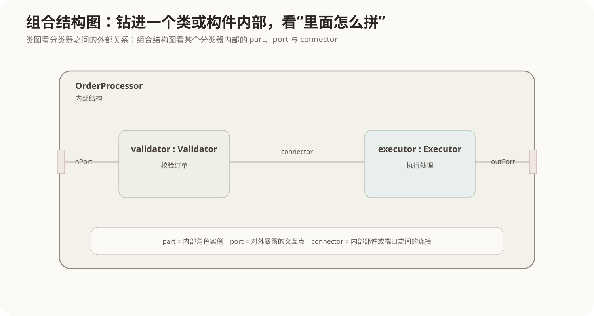

### 6.2 三个核心概念

#### Part

Part 是分类器内部承担某种角色的组成部分。

例如 `OrderProcessor` 内部可以有：

```text
validator : Validator
executor  : Executor
```

#### Port

Port 是分类器边界上的交互点，表示外界怎样与内部结构连接。

它可以规定对外提供或需要的接口。

#### Connector

Connector 把 part 或 port 连接起来，描述内部协作路径。

### 6.3 实际应用场景

- 一个复杂构件内部的协作结构；
- 嵌入式部件内部端口连接；
- 组件化系统；
- 需要区分“外部黑盒接口”和“内部白盒实现”的设计。

### 6.4 易混淆点

```text
类图：多个分类器之间的静态关系。
组合结构图：一个分类器内部的组成与连接。

构件图：多个构件怎样通过接口组织。
组合结构图：某个构件内部怎样进一步由 part、port、connector 组成。
```

软考中它的频率一般低于类图、顺序图、用例图，但遇到 `part / port / connector / internal structure` 等关键词时应能识别。

---

## 7. 包图 Package Diagram

### 7.1 定义

包图用来描述**模型元素怎样按命名空间或关注点分组，以及这些包之间的依赖关系**。

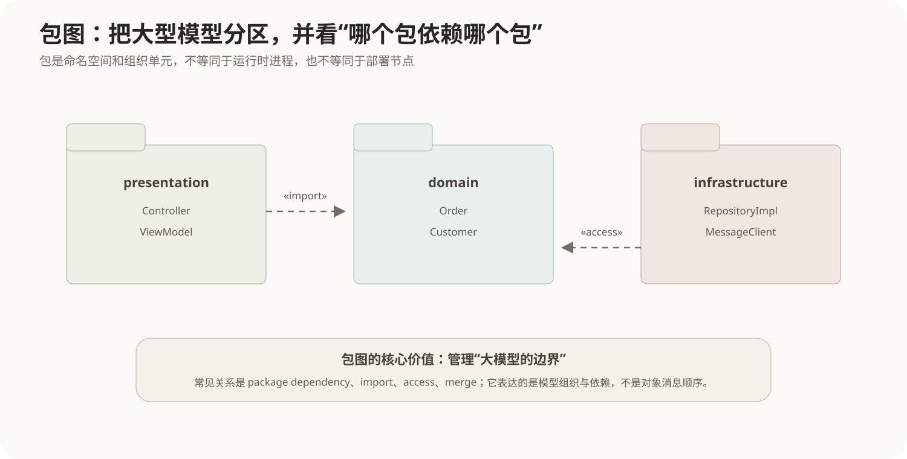

包可以包含：

- 类；
- 接口；
- 用例；
- 子包；
- 其他模型元素。

### 7.2 怎么理解

当类图只有十几个类时，可以一张图解决；当模型膨胀到几百个类时，需要先把整个模型分区。

例如：

```text
presentation
    ├── Controller
    └── ViewModel

domain
    ├── Order
    └── Customer

infrastructure
    ├── RepositoryImpl
    └── MessageClient
```

此时包图重点关心：

```text
presentation 是否依赖 domain？
infrastructure 是否访问 domain？
哪些元素从一个包导入到另一个包？
```

### 7.3 常见关系

- Package Dependency：包依赖；
- `«import»`：把另一包的公开成员导入当前命名空间；
- `«access»`：可以访问另一包成员，但不等于导入到当前命名空间；
- `«merge»`：包合并，用于扩展和组合包定义。

### 7.4 实际应用场景

- 大型模型分层；
- 模块边界分析；
- 领域包划分；
- 依赖方向审查；
- 防止底层包反向依赖上层包。

### 7.5 易混淆点

**包不是进程、服务、构件或物理服务器。**

它首先是模型组织和命名空间概念。因此不能看到 `domain`、`infrastructure` 就自动理解成部署单元。

---

## 8. 部署图 Deployment Diagram

### 8.1 定义

部署图描述系统运行时的**节点、节点中的执行环境、被部署的制品，以及节点之间的通信路径**。

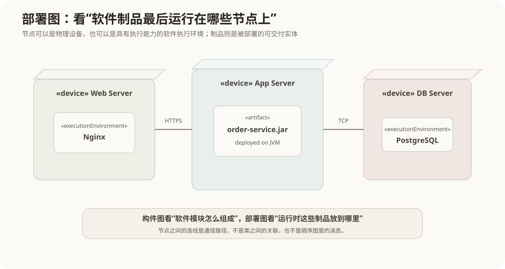

### 8.2 Node 节点

节点是具有计算资源或执行能力的运行载体。可以进一步区分：

#### Device

物理设备，例如：

- 服务器；
- 手机；
- 工控机；
- 嵌入式设备。

#### Execution Environment

运行在设备上的软件执行环境，例如：

- JVM；
- 应用服务器；
- 容器运行环境；
- 数据库运行环境。

### 8.3 Artifact 制品

Artifact 是实际可部署的物理信息实体，例如：

```text
order-service.jar
frontend.war
config.yaml
schema.sql
```

### 8.4 Communication Path

节点之间的线表示通信路径，例如 HTTPS、TCP、消息网络等。

### 8.5 实际应用场景

- 分布式系统物理拓扑；
- 云环境部署；
- 多层 Web 系统；
- 嵌入式设备和边缘节点；
- 容器、应用服务器和数据库之间的运行关系。

### 8.6 常见考点与易混淆

```text
构件图：软件有哪些构件？
部署图：这些软件制品部署到哪里？

类图：类型关系。
部署图：运行节点和通信路径。
```

一道题如果关键词是“服务器、物理节点、设备、执行环境、制品部署”，优先想到部署图。

---

## 9. 轮廓图 Profile Diagram

### 9.1 定义

轮廓图用于**扩展 UML 的建模词汇，使 UML 能够适配某个特定领域，同时保持 UML 元模型本身不被直接修改。**

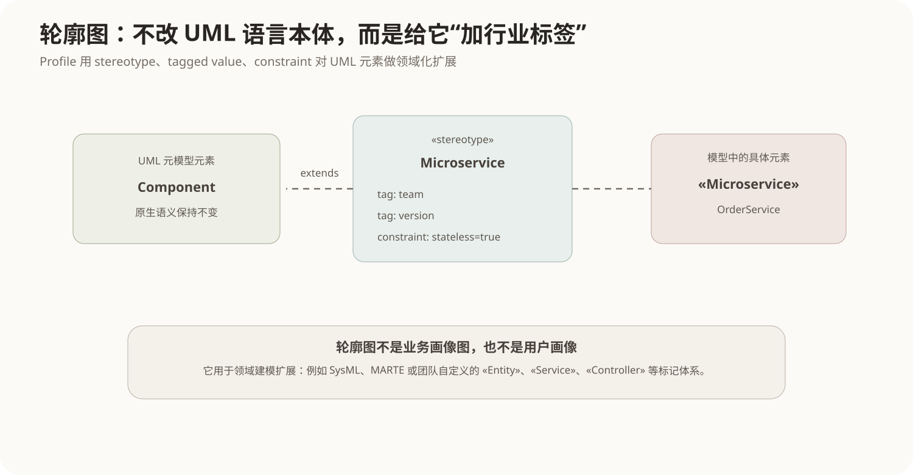

### 9.2 三个核心概念

#### Stereotype 构造型

构造型给已有 UML 元素增加新的领域语义。

例如：

```text
«Entity» Order
«Controller» OrderController
«Microservice» OrderService
```

这里并没有发明一种全新的 UML 元素，而是在原有 Class、Component 等元素基础上增加领域标签。

#### Tagged Value 标记值

构造型可以定义额外属性，例如：

```text
team = "order-team"
version = "v2"
```

#### Constraint 约束

可以规定额外规则，例如：

```text
stateless = true
latency &lt; 100ms
```

### 9.3 怎么理解

可以把 UML 看成一门通用语言，Profile 像给这门语言增加“专业词典”。

它不是修改 UML 语法核心，而是在允许的扩展点上增加领域语义。

### 9.4 实际应用场景

- SysML 等领域建模；
- 实时系统和性能建模；
- 企业内部统一的 `«Service»`、`«Repository»` 标记；
- 模型驱动开发中的领域约束。

### 9.5 易混淆点

这里的 Profile 是 UML 的**轮廓/扩展机制**，不是“用户画像”“性能分析报告”。

软考中如果出现 `stereotype、tagged value、constraint、扩展 UML 元模型`，应想到轮廓图和 Profile 机制。

---

# 第二部分：行为图

## 10. 用例图 Use Case Diagram

### 10.1 定义

用例图从系统外部描述：**谁与系统交互，他们为了什么目标使用系统，哪些目标属于当前系统边界。**

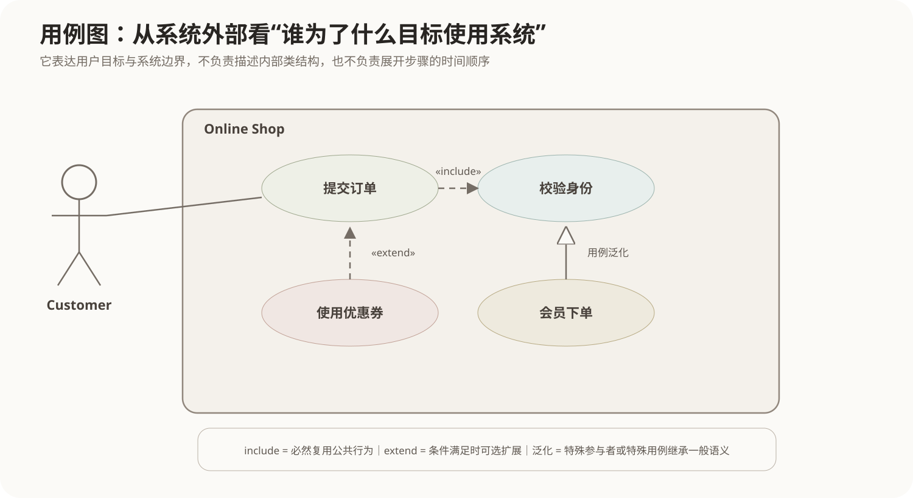

它最重要的不是画“小人”，而是建立：

```text
外部角色 → 用户目标 → 系统边界
```

### 10.2 Actor 参与者

Actor 表示与系统交互的**角色**，不一定是自然人。

例如：

- Customer；
- Administrator；
- Payment Platform；
- Timer；
- External Accounting System。

同一个人可以扮演多个 Actor；一个 Actor 也可以由很多实际人员扮演。

因此：

```text
Actor = 角色
不是 = 某个具体人
```

### 10.3 Use Case 用例

用例描述系统为了参与者目标提供的一组可观察行为，例如：

```text
提交订单
查询物流
取消订单
申请退款
```

用例应尽量是“用户目标”，而不是内部技术步骤。

`写数据库`、`调用 Redis` 通常不是面向用户目标的用例。

### 10.4 系统边界

系统边界框明确“哪些行为属于当前系统”。Actor 通常位于边界外部，用例位于边界内部。

### 10.5 include

`«include»` 表示一个基础用例在执行过程中**必然包含另一个用例的公共行为**。

```text
提交订单 --«include»--> 校验身份
```

常见目的：把多个用例都会执行的公共行为抽取出来。

箭头通常从基础用例指向被包含用例。

### 10.6 extend

`«extend»` 表示在特定条件下，可以向基础用例增加额外行为。

```text
使用优惠券 --«extend»--> 提交订单
```

基础用例不依赖扩展用例也应该可以独立成立。

箭头通常从扩展用例指向被扩展的基础用例。

### 10.7 泛化

Actor 和 Use Case 都可以具有泛化关系。

例如：

```text
VIPCustomer 是 Customer 的特殊参与者
会员下单 是 提交订单 的特殊用例
```

### 10.8 include 与 extend 怎么彻底区分

```text
include：公共行为，正常执行必然经过
extend：可选/条件性行为，基础用例本身完整
```

可以问一句：

> 去掉这个附加用例，基础用例是否仍然完整成立？

如果完全不能成立，更倾向 include；如果仍然能成立，只是少了某种条件行为，更倾向 extend。

### 10.9 实际应用场景

- 需求获取和需求分析；
- 确定系统边界；
- 识别主要功能；
- 与客户沟通系统目标；
- 为后续顺序图、测试场景提供入口。

### 10.10 常见考点与易混淆

- Actor 是外部角色；
- 用例描述系统对外可观察目标；
- include/extend 箭头方向；
- include 与 extend 的必然/可选语义；
- 用例图属于行为图；
- 用例图不描述具体执行顺序。

---

## 11. 活动图 Activity Diagram

### 11.1 定义

活动图描述**动作和活动如何按照控制流或对象流推进，以及流程中的分支、并行、汇合和职责划分。**

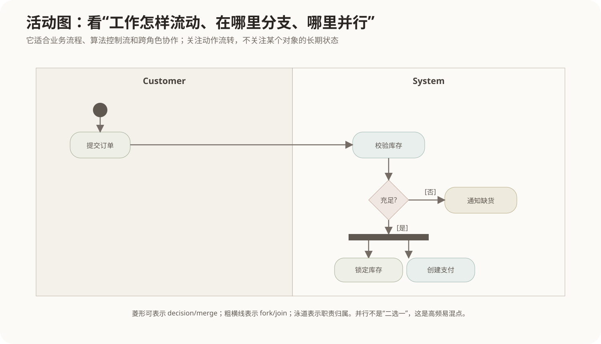

可以把它理解为 UML 对“流程”进行精确定义的一种图。

### 11.2 基本元素

#### Initial Node

实心圆，表示活动开始。

#### Action

圆角矩形，表示一个动作，例如：

```text
校验库存
生成订单
发送通知
```

#### Activity Final

外圆加实心圆，表示整个活动结束。

#### Flow Final

圆圈中带 X，表示某一条流结束，但不一定结束整个活动。

### 11.3 Decision 与 Merge

两者常用菱形表示，但作用不同。

#### Decision

一个输入，多条带守卫条件的输出：

```text
             [有库存] → 锁库存
校验库存 → ◇
             [无库存] → 通知缺货
```

它是**选择一条路径**。

#### Merge

多条备选路径重新汇合成一条，不要求所有路径同时到达。

因此：

```text
Decision：一分多，选一条
Merge：多合一，合并备选路径
```

### 11.4 Fork 与 Join

Fork 和 Join 常使用粗横线或粗竖线。

#### Fork

一条流拆成多条并发流。

#### Join

等待多条并发流满足同步条件后再继续。

这和 Decision/Merge 完全不同：

```text
Decision：二选一/多选一
Fork：多条可以并行执行

Merge：备选路径汇回
Join：等待并发分支同步
```

### 11.5 Swimlane 泳道

泳道按照角色、部门、系统或构件划分职责。

例如：

```text
Customer | Order System | Payment Platform
```

活动跨泳道流动时，可以直观看到职责从谁转交给谁。

### 11.6 Object Flow

活动图不仅能表示控制流，也可以表示对象或数据在动作之间流动，例如：

```text
订单数据 → 校验 → 已校验订单 → 支付
```

### 11.7 实际应用场景

- 业务流程；
- 工作流；
- 算法逻辑；
- 并行任务；
- 用例内部较复杂的流程；
- 跨部门或跨系统职责分析。

### 11.8 活动图和流程图

两者很像，但 UML 活动图提供更明确的建模语义，例如：

- Fork/Join 并发；
- 泳道；
- Object Flow；
- UML 节点语义；
- 与其他 UML 模型的关联。

### 11.9 常见考点与易混淆

最常见的混淆就是：

```text
菱形：Decision / Merge
粗线：Fork / Join
```

以及：

```text
活动图：关注流程中的动作怎么走
状态机图：关注一个对象状态怎么变
```

---

## 12. 状态机图 State Machine Diagram

### 12.1 定义

状态机图描述**一个对象在生命周期中可能处于哪些状态，以及在事件触发、守卫条件满足时如何从一个状态迁移到另一个状态。**

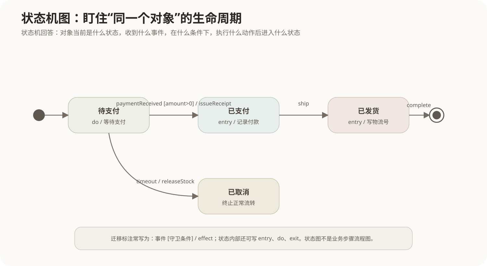

核心问题只有一个：

> **同一个对象，现在是什么状态；发生什么以后，它会变成什么状态？**

### 12.2 State 状态

状态表示对象在一段时间内满足某种条件、等待某个事件或执行某种持续行为。

例如订单：

```text
待支付
已支付
已发货
已完成
已取消
```

### 12.3 Transition 迁移

典型迁移标注形式：

```text
事件 [守卫条件] / effect
```

例如：

```text
paymentReceived [amount > 0] / issueReceipt
```

可以拆成：

- event：什么事情触发检查；
- guard：什么条件下迁移允许发生；
- effect：发生迁移时执行什么动作。

### 12.4 entry、do、exit

状态内部常见三类行为：

```text
entry / 进入状态时执行
 do   / 停留状态期间执行
exit  / 离开状态时执行
```

例如：

```text
已支付
entry / 记录付款时间
 do   / 等待仓库发货
exit  / 固化支付记录
```

### 12.5 初始状态和终止状态

- 实心圆：初始伪状态；
- 外圆 + 内实心圆：Final State。

### 12.6 复合状态与子状态

复杂状态还可以继续包含子状态，例如：

```text
处理中
├── 校验中
├── 扣库存中
└── 等待支付中
```

还可能出现历史伪状态，用于重新进入复合状态时恢复之前所在子状态。

### 12.7 实际应用场景

状态机图特别适合状态非常重要的对象：

- 订单；
- 工单；
- 审批单；
- 网络连接；
- 设备控制器；
- 游戏角色；
- 协议会话；
- 嵌入式控制状态。

### 12.8 状态图与活动图

这是高频混淆。

订单处理过程：

```text
接单 → 校验 → 支付 → 发货
```

如果重点在“这些工作步骤怎么流转”，画活动图。

如果重点在“订单这个对象什么时候是待支付、已支付、已发货”，画状态机图。

```text
活动图：动作中心
状态机图：对象状态中心
```

---

# 第三部分：交互图

## 13. 顺序图 Sequence Diagram

### 13.1 定义

顺序图描述**多个参与者或对象在某一个场景中怎样按照时间顺序发送消息、调用操作并返回结果。**

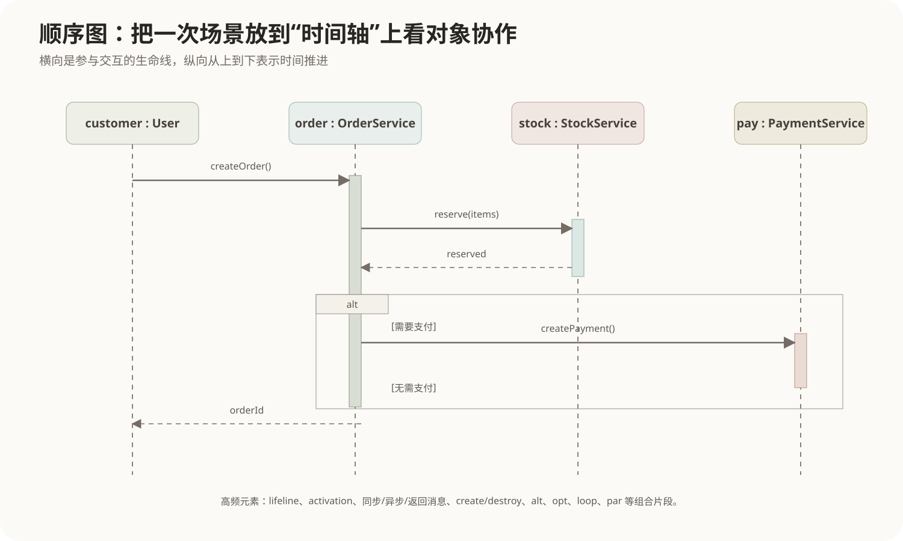

它是最常见的交互图。

### 13.2 Lifeline 生命线

生命线通常横向排列：

```text
user : User
order : OrderService
stock : StockService
pay : PaymentService
```

每条生命线向下延伸，表示参与者在交互过程中的存在。

### 13.3 时间方向

顺序图中最关键的阅读规则：

> **从上向下读。越靠上的消息越早发生。**

横向距离本身通常没有时间含义。

### 13.4 Activation 执行规格

生命线上的细长矩形通常表示该参与者正在执行某段行为。

它能帮助看出：

- 谁当前拥有控制；
- 嵌套调用关系；
- 某个操作执行期间又调用了谁。

### 13.5 消息类型

#### 同步消息 Synchronous Message

调用方通常等待被调用方完成后再继续。

典型函数调用就是同步消息。

#### 异步消息 Asynchronous Message

发送后调用方可以继续，不需要等待对方完成。

典型场景包括事件、消息队列等。

#### Return Message

返回消息常画成虚线箭头。很多简单顺序图可以省略显而易见的返回消息。

#### Create Message

表示在交互过程中创建新的对象，生命线从创建点开始。

#### Destroy Message

表示对象生命周期在此结束，常以生命线末端的 X 表示。

### 13.6 Combined Fragment 组合片段

这是顺序图非常重要的一组概念。

#### alt

多分支条件选择，类似 if/else。

```text
alt
[支付成功] → 确认订单
[支付失败] → 取消订单
```

#### opt

单个可选分支，类似只有 if 没有 else。

#### loop

循环执行。

#### par

多个片段可以并行执行。

还可能看到 `break`、`critical`、`ref` 等操作符。

### 13.7 实际应用场景

- 用例实现设计；
- 服务调用链；
- API 协作；
- 领域对象职责分配；
- 异步消息与事件流；
- 查找“上帝对象”或错误的调用方向。

### 13.8 顺序图和类图的关系

类图可能告诉你：

```text
OrderService 依赖 StockService
```

顺序图进一步告诉你：

```text
在创建订单这个场景中，OrderService 在什么时刻调用 reserve()，随后是否调用 PaymentService。
```

因此：

```text
类图：存在什么静态关系
顺序图：某个具体场景中关系怎样被使用
```

### 13.9 常见考点与易混淆

- 时间从上到下；
- 横向是参与者；
- 生命线、执行规格；
- 同步、异步、返回消息；
- `alt / opt / loop / par`；
- 顺序图属于交互图，而交互图属于行为图；
- 顺序图与通信图可以描述相似的交互信息，但强调点不同。

---

## 14. 通信图 Communication Diagram

### 14.1 定义

通信图描述多个对象之间的**连接结构以及沿这些连接发送的消息**。

它和顺序图都属于交互图，都可以描述“谁给谁发送什么消息”，但视觉重点不同。

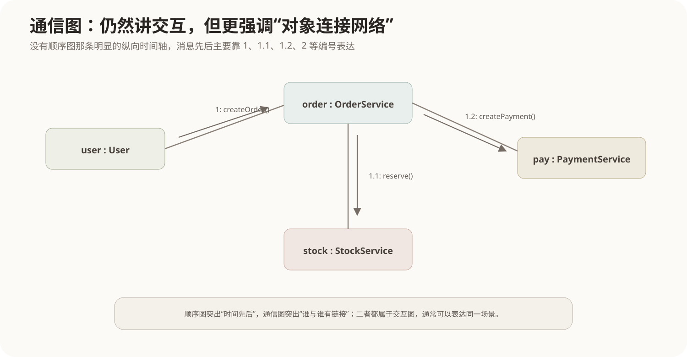

### 14.2 怎么表示顺序

因为通信图没有像顺序图那样明显的纵向时间轴，所以通常通过消息编号表达顺序：

```text
1: createOrder()
1.1: reserve()
1.2: createPayment()
2: notifyUser()
```

嵌套编号还能体现调用层次。

### 14.3 怎么理解

可以把两种图想成同一次会议的两种记录方式：

```text
顺序图：重点记谁先说、谁后说。
通信图：重点记谁和谁有联系，再在连线上标说话顺序。
```

### 14.4 实际应用场景

- 对象协作网络；
- 分析对象之间的结构耦合；
- 场景消息不多，但希望突出连接关系；
- 与顺序图互相转换理解。

### 14.5 常见考点和易混淆

```text
顺序图：时间顺序直观，消息位置决定先后。
通信图：结构关系直观，消息编号决定先后。
```

旧版 UML 中通信图常被称为 **Collaboration Diagram（协作图）**。看到教材里的“协作图”时，通常要联想到现在的 Communication Diagram。

---

## 15. 交互概览图 Interaction Overview Diagram

### 15.1 定义

交互概览图使用类似活动图的控制流，把多个完整的交互片段组织起来。

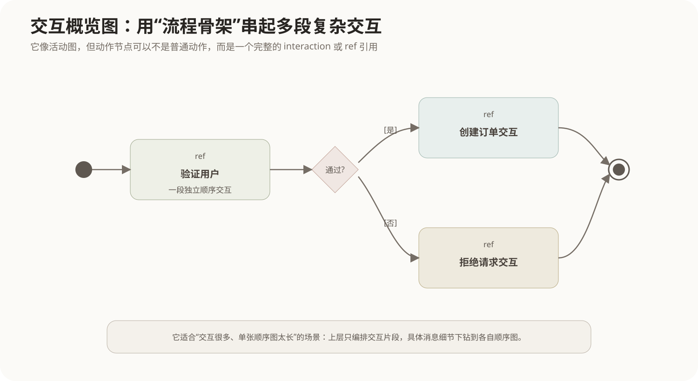

它解决的问题是：

> 如果一个业务过程由很多段复杂顺序交互组成，全部挤进一张顺序图会非常长，怎样先从更高层次描述这些交互片段之间的流程？

### 15.2 怎么理解

例如登录后创建订单：

```text
开始
 ↓
ref 验证用户
 ↓
是否通过？
 ├─是→ ref 创建订单交互
 └─否→ ref 拒绝请求交互
 ↓
结束
```

这里的 `ref 创建订单交互` 可以继续链接到一张独立顺序图。

因此它具有两层结构：

```text
上层：像活动图一样编排流程
下层：每个节点可以是一段完整交互
```

### 15.3 实际应用场景

- 大型业务场景；
- 多个顺序图之间的编排；
- 希望既保留控制流，又能下钻消息细节；
- 复杂系统的场景总览。

### 15.4 易混淆点

```text
活动图：节点通常是动作/活动。
交互概览图：节点可以引用完整的 Interaction。

顺序图：展开一段交互内部消息。
交互概览图：组织多段交互之间的高层流程。
```

考试频率通常不如顺序图高，但出现 `interaction occurrence、ref、用活动图控制流组织多个交互` 时应能够识别。

---

## 16. 时序图 Timing Diagram

### 16.1 定义

时序图描述**一个或多个生命线的状态或值怎样随着实际时间变化，以及这些变化之间有什么时间约束。**

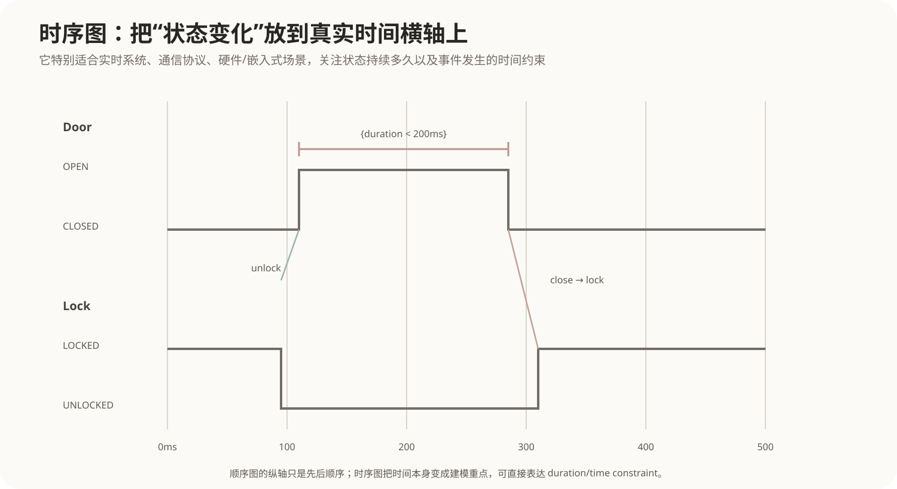

### 16.2 和顺序图最大的区别

顺序图也有时间概念，但它主要表达相对先后：

```text
消息A发生在消息B之前
```

时序图则把**时间本身**变成建模重点：

```text
100ms 时进入 OPEN
200ms 内必须关闭
关闭后 50ms 内必须完成 LOCKED
```

因此时序图经常拥有明确横向时间轴。

### 16.3 常见元素

- Lifeline；
- State/Condition；
- Value；
- Message；
- Duration Constraint；
- Time Constraint。

### 16.4 实际应用场景

- 嵌入式实时系统；
- 通信协议；
- 硬件控制；
- 设备状态；
- 音视频与信号处理；
- 对响应时间有严格约束的控制逻辑。

### 16.5 常见考点与易混淆

```text
顺序图：关注消息的相对顺序。
时序图：关注状态/值随真实时间变化及时间约束。

状态机图：关注事件驱动的状态迁移结构。
时序图：关注状态在时间轴上什么时候变化、持续多久。
```

---

# 第四部分：把最容易混淆的图一次分开

## 17. 类图、对象图、构件图、部署图

```text
类图
↓
有哪些类型，它们之间是什么静态关系

对象图
↓
此刻具体有哪些实例，它们属性值和链接是什么

构件图
↓
软件被组织成哪些可替换的大粒度构件，通过什么接口连接

部署图
↓
这些软件制品实际部署到哪些物理/执行节点
```

可以沿着一个非常自然的层次理解：

```text
类型设计 → 实例快照 → 软件组装 → 物理运行
 类图      对象图       构件图      部署图
```

## 18. 用例图、活动图、顺序图、状态机图

假设用户完成一次下单：

### 用例图

问：

```text
客户的目标是什么？
```

答案：提交订单。

### 活动图

问：

```text
提交订单这个业务过程有哪些动作、判断、并行？
```

### 顺序图

问：

```text
为了完成提交订单，User、OrderService、StockService、PaymentService 具体怎样发送消息？
```

### 状态机图

问：

```text
Order 这个对象自身从待支付到已支付、已发货、已完成怎样变化？
```

所以它们描述的是同一业务的不同切面，不是互相替代。

## 19. 活动图与状态机图

这是最容易凭直觉画错的一组。

```text
活动图中心：动作
“下一步做什么？”

状态机图中心：对象状态
“这个对象现在是什么状态？”
```

如果节点写的是：

```text
校验订单
扣减库存
创建支付
```

更像活动图。

如果节点写的是：

```text
待支付
已支付
已发货
已取消
```

更像状态机图。

## 20. 顺序图、通信图、交互概览图、时序图

四者都属于 Interaction Diagram，但关注点不同：

| 图 | 最核心问题 | 最明显的视觉特征 |
|---|---|---|
| 顺序图 | 消息按什么先后发生 | 生命线 + 纵向时间 |
| 通信图 | 哪些对象连接并互发消息 | 对象网络 + 消息编号 |
| 交互概览图 | 多段交互怎样被流程编排 | 活动图骨架 + ref交互 |
| 时序图 | 状态和值随真实时间怎样变化 | 横向时间轴 + 状态波形 |

## 21. Decision、Merge、Fork、Join

活动图中这四个要彻底分开：

```text
Decision
1条输入 → 多条条件输出
只选择满足条件的路径

Merge
多条备选输入 → 1条输出
不要求所有输入同时到达

Fork
1条输入 → 多条并行输出
并发开始

Join
多条并行输入 → 1条输出
同步等待
```

最简记忆：

```text
菱形解决“选择”
粗线解决“并发同步”
```

## 22. include、extend、泛化

用例图中：

```text
include
基础用例 → 被包含用例
公共行为，正常流程必然执行

extend
扩展用例 → 基础用例
条件性附加行为，基础用例本身完整

generalization
特殊 Actor/Use Case → 一般 Actor/Use Case
继承一般语义
```

## 23. 聚合与组合

不要把它记成纯符号题。

判断链：

```text
是不是整体—部分？
        ↓ 是
部分能否相对独立存在？
        ↓ 能
可能是聚合

整体是否强拥有部分生命周期？
部分是否通常只属于一个整体？
        ↓ 是
更接近组合
```

符号只是最后的表达：

```text
聚合：空心菱形
组合：实心菱形
菱形永远放在整体一端
```

---

# 第五部分：实际建模时怎么选图

## 24. 从一个系统一路选择

假设要设计一个线上订单系统，可以按问题自然选择模型：

### 第一步：先确定外部需求

```text
谁使用系统？
他们要完成什么目标？
系统边界在哪里？
```

→ 用例图。

### 第二步：建立领域静态结构

```text
Order、Customer、Product 是什么关系？
哪些是聚合、组合、泛化？
```

→ 类图。

如果需要用具体实例验证多重度：

→ 对象图。

### 第三步：分析业务流程

```text
下单有哪些步骤？
哪里判断？
支付和备货是否并行？
```

→ 活动图。

### 第四步：分析一次场景中的对象协作

```text
OrderService 什么时候调用 StockService？
什么时候调用 PaymentService？
```

→ 顺序图。

如果更希望突出对象连接网络：

→ 通信图。

如果有大量独立交互需要总览：

→ 交互概览图。

### 第五步：识别有明显生命周期的对象

```text
订单有哪些合法状态？
取消事件在哪些状态允许发生？
```

→ 状态机图。

如果关键问题变成“多少毫秒内必须切换状态”：

→ 时序图。

### 第六步：组织实现结构

```text
系统由哪些服务、插件、模块构成？
它们提供和依赖哪些接口？
```

→ 构件图。

如果要钻进某个构件内部看 port 和 part：

→ 组合结构图。

如果模型太大，需要先管理命名空间和依赖：

→ 包图。

### 第七步：决定运行部署

```text
服务放在哪些服务器、容器、设备？
```

→ 部署图。

如果需要给 UML 增加某个领域特有的建模标记：

→ 轮廓图。

---

# 第六部分：软考识别表

## 25. 看到什么关键词，优先想到什么图

| 题干关键词 | 优先想到 |
|---|---|
| Actor、系统边界、用户目标、include、extend | 用例图 |
| 类、属性、操作、继承、多重度、聚合、组合 | 类图 |
| 实例、对象名:类名、某一时刻、属性具体值 | 对象图 |
| 动作、控制流、泳道、分叉、汇合、并行 | 活动图 |
| 状态、事件、守卫条件、entry/do/exit、迁移 | 状态机图 |
| Lifeline、Activation、消息、alt、loop、par | 顺序图 |
| 对象网络、消息编号、协作图 | 通信图 |
| ref、多个交互片段的流程组织 | 交互概览图 |
| 时间约束、持续时间、状态波形、实时系统 | 时序图 |
| Component、provided/required interface、可替换软件单元 | 构件图 |
| part、port、connector、内部结构 | 组合结构图 |
| package、import、access、merge、命名空间 | 包图 |
| node、device、execution environment、artifact | 部署图 |
| stereotype、tagged value、constraint、扩展UML | 轮廓图 |

## 26. 最终知识地图

```text
UML
│
├─ 结构图：系统“是什么”
│  ├─ 类图：类型及关系
│  ├─ 对象图：实例快照
│  ├─ 构件图：软件构件与接口
│  ├─ 组合结构图：分类器内部 part / port / connector
│  ├─ 包图：模型分组与依赖
│  ├─ 部署图：运行节点与制品
│  └─ 轮廓图：UML领域扩展
│
└─ 行为图：系统“怎么动”
   ├─ 用例图：外部角色和目标
   ├─ 活动图：动作流程、选择、并行
   ├─ 状态机图：单个对象生命周期
   │
   └─ 交互图：多个参与者怎样协作
      ├─ 顺序图：时间顺序
      ├─ 通信图：连接网络 + 消息编号
      ├─ 交互概览图：交互片段的高层流程
      └─ 时序图：真实时间上的状态变化
```

真正掌握 UML 的标准不是能背出十四个名称，而是看到一个建模问题时，能先判断：

```text
我现在是在描述静态结构，还是动态行为？
如果是动态行为，是流程、单对象状态，还是多个对象交互？
如果是交互，我关心的是时间顺序、连接结构、交互编排，还是真实时间约束？
```

这个判断链一旦建立起来，绝大多数 UML 图就不再需要靠死记硬背区分。
