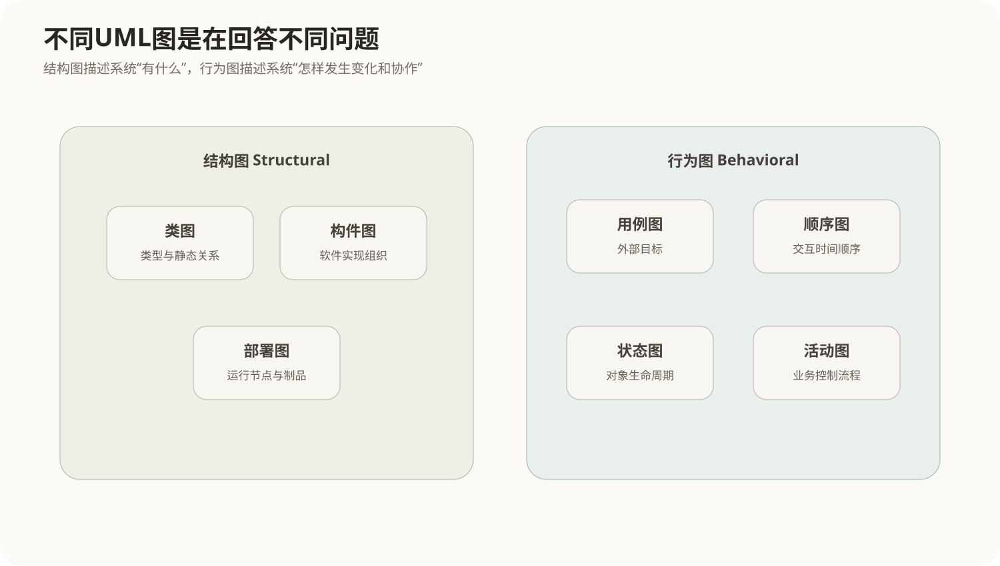
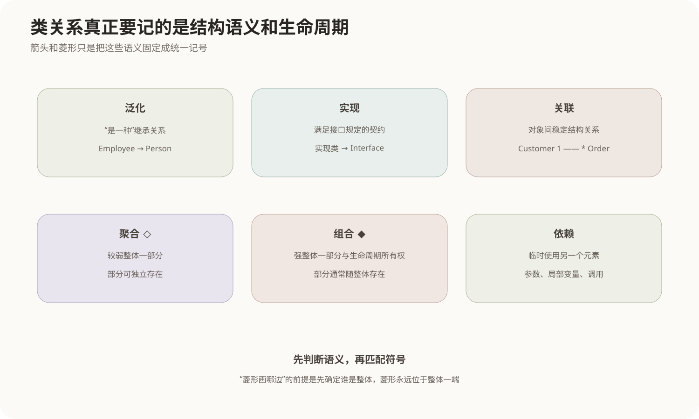
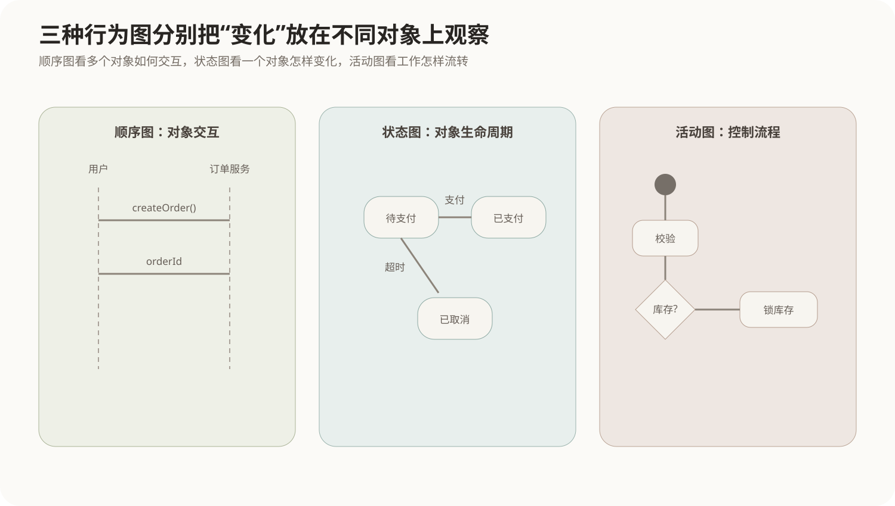

# UML核心图

## 1. UML为什么需要很多种图

一个软件系统不可能用一张图同时讲清楚所有问题。类和模块回答“系统由什么组成”，用例回答“外部角色希望系统做什么”，顺序图回答“对象按什么时间顺序交互”，状态图回答“一个对象如何随事件改变状态”，部署图又回答“软件最后运行在哪些物理节点上”。

UML（Unified Modeling Language，统一建模语言）提供的是一组统一的建模符号，使团队可以从不同视角描述同一个系统。



UML本身不是开发过程。它不规定项目必须先画哪张图、后写哪段代码；它提供的是表达结构和行为的语言，可以被不同软件过程使用。

## 2. 面向对象模型的基础：对象、类和职责

**对象**是运行时具有身份、状态和行为的实体；**类**描述一组相似对象共同的属性、操作和约束。

例如：

```text
类：Order
属性：orderId、amount、status
操作：submit()、cancel()

对象：order#20260826
状态：amount=320，status=PAID
```

面向对象的几个核心机制是：

- **封装**：把状态与操作状态的方法放在同一抽象边界内，外部通过接口使用；
- **继承/泛化**：子类继承父类共有特征，并增加或改变自身行为；
- **多态**：相同操作在不同具体类型上表现出不同实现；
- **消息/调用协作**：对象通过公开操作完成系统行为。

UML类图主要把这些静态关系表达出来。

## 3. 类图最重要的是关系语义，不是箭头外形



### 3.1 泛化 Generalization

泛化表示“是一种”的继承关系：

```text
Employee 是 Person 的一种
```

子类继承父类可继承的特征。UML使用实线加空心三角，三角指向更一般的父类。

### 3.2 实现 Realization

实现通常表示一个类或构件实现接口规定的契约：

```text
PaymentServiceImpl 实现 PaymentService
```

UML常用虚线加空心三角，三角指向接口或规格。

### 3.3 关联 Association

关联表示两个类的对象之间存在相对稳定的结构关系，例如：

```text
Customer 1 —— 0..* Order
```

多重度说明一个对象可以关联多少个对方对象。关联可以带角色名、导航方向和关联属性。

### 3.4 聚合 Aggregation

聚合是一种较弱的整体—部分关系，部分对象可以脱离整体独立存在。例如“球队—球员”在某些模型中可以表示聚合：球队解散后球员仍然存在。

UML以**空心菱形**标在整体一端。

### 3.5 组合 Composition

组合是更强的整体—部分关系，整体负责部分的生命周期，部分通常不能同时属于多个组合整体。例如订单由订单项组成，订单项在模型中常随所属订单生命周期存在。

UML以**实心菱形**标在整体一端。

聚合与组合的关键不是“一个空菱形、一个实菱形”本身，而是**生命周期和所有权强度**。

### 3.6 依赖 Dependency

依赖表示一个元素在实现或使用过程中临时依赖另一个元素，例如方法参数、局部变量、调用某个服务。它通常比关联更弱，不一定形成对象长期保存的结构关系。

## 4. 用例图从系统外部描述目标

用例图的主要元素是：

- **参与者 Actor**：与系统交互的外部角色或外部系统；
- **用例 Use Case**：系统为了参与者目标提供的一组可观察行为；
- **系统边界**：哪些用例属于当前系统。

参与者表示的是“角色”，不一定等于一个具体人。例如同一个人可以在不同场景下分别扮演“普通用户”和“管理员”。

### 4.1 include

`include`表示一个用例在执行时**必然复用**另一个用例的公共行为。

```text
提交订单 --include--> 校验用户身份
```

通常用于抽取多个用例都需要的公共步骤。

### 4.2 extend

`extend`表示在特定条件下向基础用例加入**可选或条件性行为**：

```text
使用优惠券 --extend--> 提交订单
```

基础用例即使没有扩展也应当能够独立成立。

因此：

```text
include：基础流程主动包含公共行为
extend：条件满足时额外扩展基础流程
```

## 5. 顺序图把“谁调用谁”放进时间轴

顺序图描述参与交互的对象以及消息随时间发生的顺序。对象通常横向排列，时间从上向下推进：



例如一次下单：

```text
用户 → 订单服务：createOrder()
订单服务 → 库存服务：reserve()
库存服务 → 订单服务：success
订单服务 → 支付服务：createPayment()
订单服务 → 用户：返回订单编号
```

顺序图特别适合分析一个用例内部多个对象怎样协作，也能暴露不合理的调用方向和职责集中问题。

顺序图不是静态结构图。类图可能只说明“订单服务依赖库存服务”，顺序图则进一步说明在某个场景中何时调用、调用几次、返回什么。

## 6. 状态图关注一个对象的生命周期

当一个对象会在有限状态之间随事件转换时，状态机图非常合适。例如订单：

```text
待支付 --支付成功--> 已支付
待支付 --超时--> 已取消
已支付 --发货--> 已发货
已发货 --确认收货--> 已完成
```

状态转换通常由：

```text
事件 [守卫条件] / 动作
```

触发。

状态图的中心问题是：**同一个对象现在处于什么状态，收到某个事件后会变成什么状态。**

它和活动图不同。活动图关心工作步骤和控制流；状态图关心一个实体的状态生命周期。

## 7. 活动图描述流程和并行控制

活动图适合表示业务过程、算法步骤和并行活动，典型元素包括：

- 动作节点；
- 控制流；
- 判断与合并；
- 分叉与汇合；
- 开始与结束节点；
- 泳道，用来表示不同角色或组织责任。

例如订单处理：

```text
接收订单
→ 校验
→ [库存充足?]
   ├─否→ 通知缺货
   └─是→ 锁库存
          ↓
       支付与备货可以按设计并行推进
```

活动图比普通流程图更明确地提供并发、对象流和泳道等建模语义。

## 8. 构件图和部署图分别处于软件与物理层

### 8.1 构件图

构件图描述可替换的软件构件以及依赖、接口关系，例如Web前端、订单服务、库存服务和日志构件。它关注的是软件实现组织和交付单元。

### 8.2 部署图

部署图描述运行时节点以及制品怎样部署到节点：

```text
客户端
   ↓
Web服务器
   ↓
应用服务器
   ↓
数据库服务器
```

节点可以是物理设备，也可以是具有执行能力的运行环境。部署图主要回答系统运行在哪里、节点之间怎样通信。

## 9. 一张图应该回答一个主要问题

可以用下面这组问题快速选择模型：

| 想回答的问题 | 主要图 |
|---|---|
| 外部用户希望系统提供什么目标 | 用例图 |
| 类、属性、继承和结构关系是什么 | 类图 |
| 一次场景中多个对象怎样按时间交互 | 顺序图 |
| 某个对象如何随事件改变状态 | 状态图 |
| 一个业务过程有哪些步骤、分支和并行 | 活动图 |
| 软件由哪些可部署/可替换构件组成 | 构件图 |
| 软件最终运行在哪些节点 | 部署图 |

一套系统往往同时需要多种图，它们不是竞争关系，而是从不同关注点描述同一个系统。

## 10. 核心关系

```text
UML = 建模语言，不等于开发方法

结构视角：
类图 → 类型及静态关系
构件图 → 软件实现构件
部署图 → 物理运行节点

行为视角：
用例图 → 外部目标
顺序图 → 对象交互时间顺序
状态图 → 单个对象状态变化
活动图 → 业务或算法控制流程

类关系强度与语义：
依赖 < 关联
聚合 / 组合属于整体—部分关系
组合比聚合具有更强生命周期所有权
泛化表达“是一种”
实现表达“满足接口契约”
```
