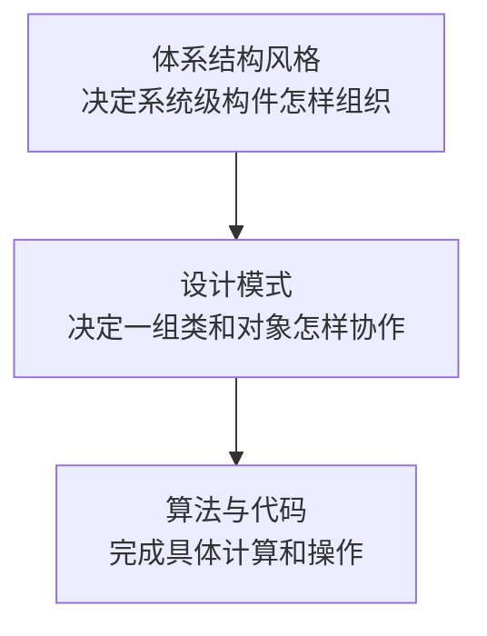
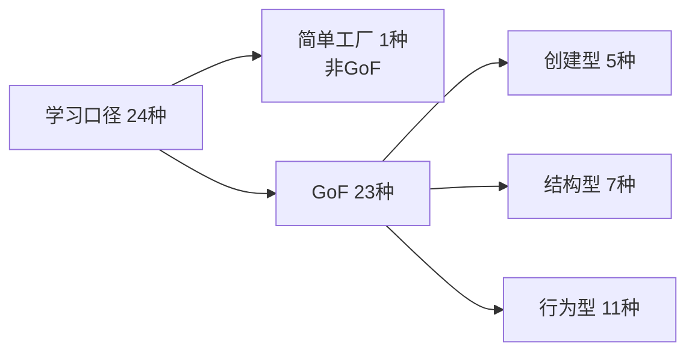
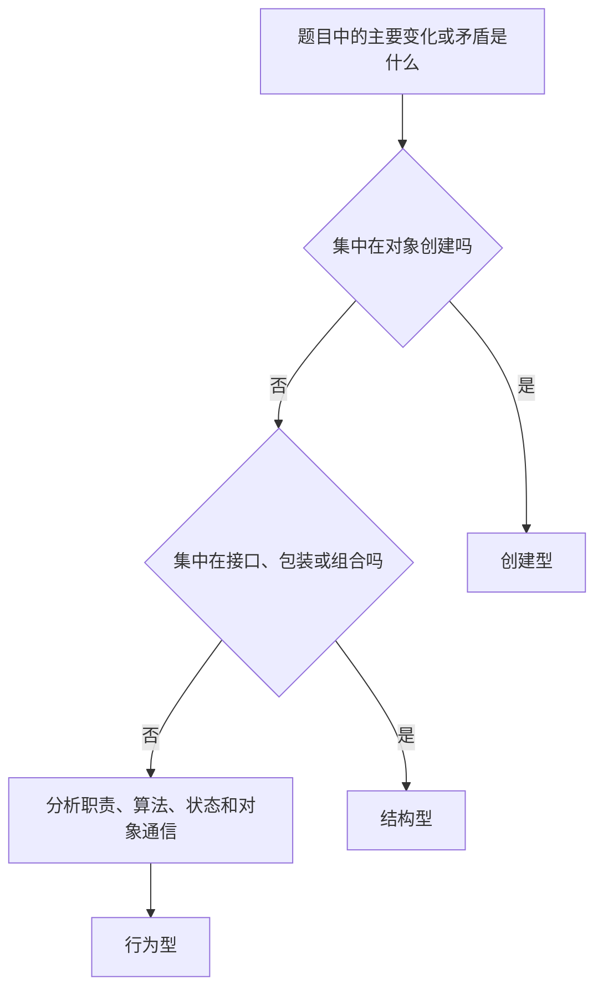

# 设计模式总览

## 1. 设计模式解决什么问题

设计模式是针对反复出现的软件设计问题，总结出的类与对象协作方案。它描述参与者的职责、关系和运行过程，不是可以原样复制的完整代码。

设计模式的名称只是索引。真正需要掌握的是：它处理哪个变化点、由哪些对象参加、一次调用怎样流动，以及这种结构带来什么代价。

## 2. 为什么本知识库按24种整理

GoF《Design Patterns》正式收录 **23种**模式：创建型5种、结构型7种、行为型11种。

简单工厂不属于GoF 23种，但国内教材、软考辅导和工程讨论经常把它放在工厂方法之前共同讲解。因此本章采用“**GoF 23种 + 简单工厂 = 学习口径24种**”，同时保留严格口径，避免混淆。

## 3. 三类模式的边界

| 类别 | 主要问题 | 本章数量 | 典型变化点 |
|---|---|---:|---|
| 创建型 | 对象由谁创建、创建哪一种、怎样完成复杂创建 | 6 | 产品类型、产品族、构造步骤、实例数量 |
| 结构型 | 已有类和对象怎样连接成更大的结构 | 7 | 接口、组合关系、包装层次、访问方式 |
| 行为型 | 对象之间怎样分工、通信、切换算法和状态 | 11 | 请求处理者、算法、状态、通知和遍历 |

对应章节：

- [创建型模式](02-创建型模式.md)
- [结构型模式](03-结构型模式.md)
- [行为型模式](04-行为型模式.md)

## 4. 阅读一张模式图

本章图中常见角色的含义如下：

| 角色名称 | 含义 |
|---|---|
| Client | 使用模式的调用者 |
| Context | 持有或协调可替换对象的上下文 |
| Product / Component | 调用者依赖的抽象接口 |
| ConcreteXxx | 某个具体实现 |
| Creator / Factory | 负责创建产品的对象 |
| Subject | 被代理或被观察的主体 |
| Handler | 可以处理请求的对象 |

箭头表示依赖、调用或持有关系；继承箭头表示实现接口或继承抽象类。图的重点是职责流动，不要求实际代码必须使用完全相同的类名。

## 5. 设计模式与设计原则

| 原则 | 核心要求 | 常见体现 |
|---|---|---|
| 开闭原则 | 扩展新行为时尽量不改稳定代码 | 策略、装饰器、工厂方法 |
| 单一职责 | 一个对象只承担一类主要责任 | 命令、中介者、建造者 |
| 依赖倒置 | 高层逻辑依赖抽象而不是具体类 | 工厂、桥接、策略 |
| 里氏替换 | 子类型能够替代抽象类型 | 模板方法、工厂方法 |
| 接口隔离 | 调用者不依赖无关能力 | 适配器、外观 |
| 组合优于继承 | 用对象组合获得运行时变化能力 | 策略、桥接、装饰器 |

原则指出设计方向，模式给出一种可复用的协作结构。不能因为使用了某个模式，就自动证明设计合理。

## 6. 识别模式的顺序

识别时依次判断：

1. 哪一部分将来最可能变化；
2. 模式把这个变化封装在哪个角色中；
3. 调用者是否只依赖稳定抽象；
4. 新增一种实现时需要修改哪些已有对象；
5. 题目描述的是设计意图，还是仅仅出现了相似类图。

## 7. 高频关系

| 容易混淆的模式 | 最关键区别 |
|---|---|
| 简单工厂 / 工厂方法 | 前者由一个工厂集中判断；后者由不同具体工厂决定产品 |
| 工厂方法 / 抽象工厂 | 前者主要创建一种产品层次；后者创建一族相互匹配的产品 |
| 抽象工厂 / 建造者 | 前者选择产品族；后者控制一个复杂对象的构造步骤 |
| 适配器 / 外观 | 前者转换接口；后者提供简化入口 |
| 装饰器 / 代理 | 前者叠加功能；后者控制访问 |
| 桥接 / 适配器 | 前者预先分离两个变化维度；后者事后兼容已有接口 |
| 策略 / 状态 | 前者替换算法；后者让行为随内部状态迁移 |
| 策略 / 模板方法 | 前者使用组合替换完整算法；后者使用继承改写部分步骤 |
| 观察者 / 中介者 | 前者传播状态变化；后者集中协调网状交互 |
| 命令 / 责任链 | 前者把请求对象化；后者沿候选处理者传递请求 |

## 8. 使用边界

模式会引入额外接口、类、间接调用和理解成本。只有确实存在相应变化、复用或解耦需求时才值得采用。一次性、稳定且简单的逻辑通常不需要为了名称完整而套用模式。

## 相关章节

- [软件体系结构风格](../09-系统架构设计基础/01-软件体系结构风格.md)
- [领域驱动设计DDD](../09-系统架构设计基础/03-领域驱动设计DDD.md)
- [模块内聚与耦合](../05-软件工程基础/05-模块内聚与耦合.md)

## 参考资料

- Erich Gamma、Richard Helm、Ralph Johnson、John Vlissides：《Design Patterns: Elements of Reusable Object-Oriented Software》

