# 创建型模式

创建型模式把“使用对象”与“决定具体创建什么、怎样创建”分开。本章按学习口径讲6种，其中简单工厂不属于GoF 23种。

## 1. 简单工厂（Simple Factory，非GoF）

### 机制

调用者把类型参数交给一个工厂，工厂在内部判断并返回相应产品。调用者不直接执行`new ConcreteProduct()`，但工厂知道所有具体产品。

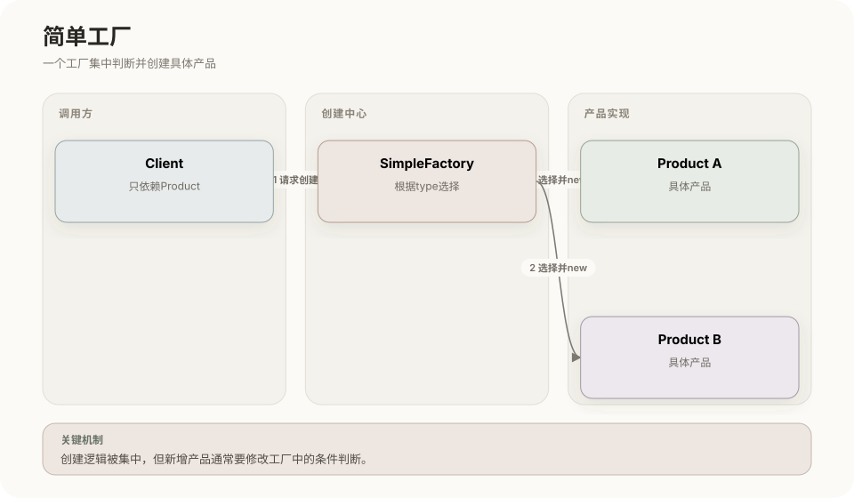

**UML 类图**

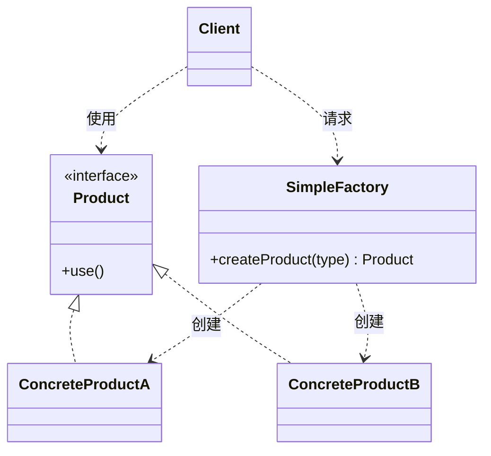

运行过程：

1. Client向SimpleFactory传入类型或配置；
2. 工厂使用`if/switch`选择具体类；
3. 工厂返回统一的Product接口；
4. Client通过Product使用对象。

新增产品通常需要修改工厂判断，因此它集中创建逻辑，但没有完全满足开闭原则。适合产品数量较少、创建规则简单且集中管理更清晰的场景。

## 2. 工厂方法（Factory Method）

### 机制

抽象创建者声明工厂方法，具体创建者重写该方法，决定实例化哪一种具体产品。产品选择从一个集中判断转移到创建者子类。

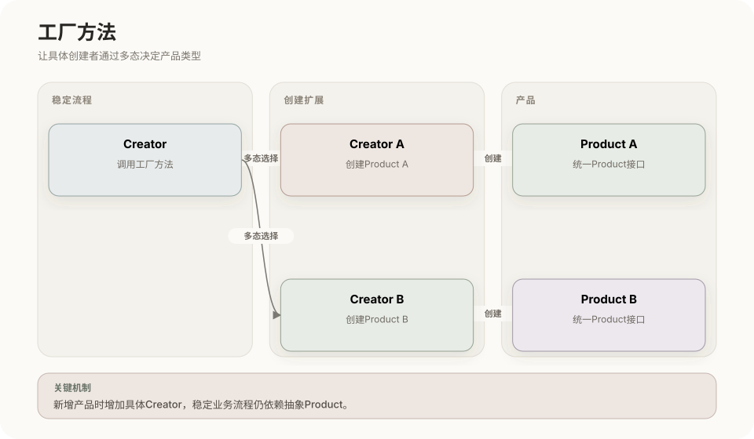

**UML 类图**

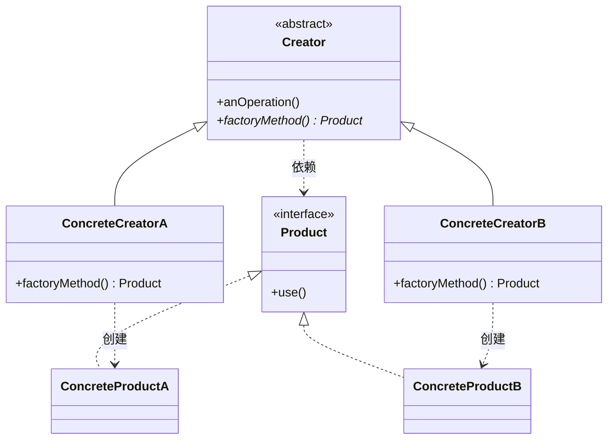

运行过程：Creator中的稳定业务流程调用`factoryMethod()`；CreatorA返回ProductA，CreatorB返回ProductB；业务流程只使用Product抽象。

增加ProductC时通常增加CreatorC，不必修改已有工厂分支。代价是每增加一种产品，往往也增加一个具体创建者类。

### 与简单工厂的区别

```text
简单工厂：一个工厂通过参数判断创建什么
工厂方法：不同具体工厂通过多态决定创建什么
```

## 3. 抽象工厂（Abstract Factory）

### 机制

抽象工厂声明创建多类产品的方法；每个具体工厂负责生产同一产品族中相互匹配的一整套对象。

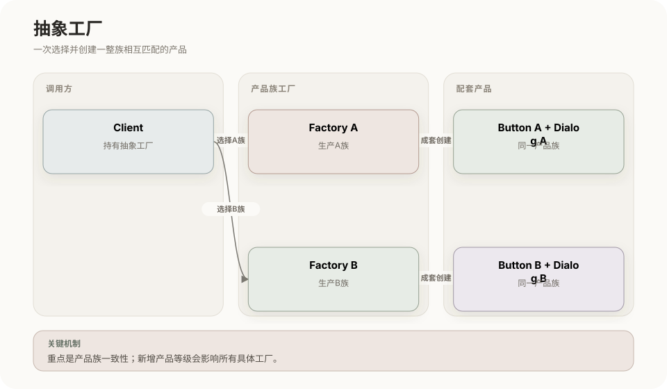

**UML 类图**

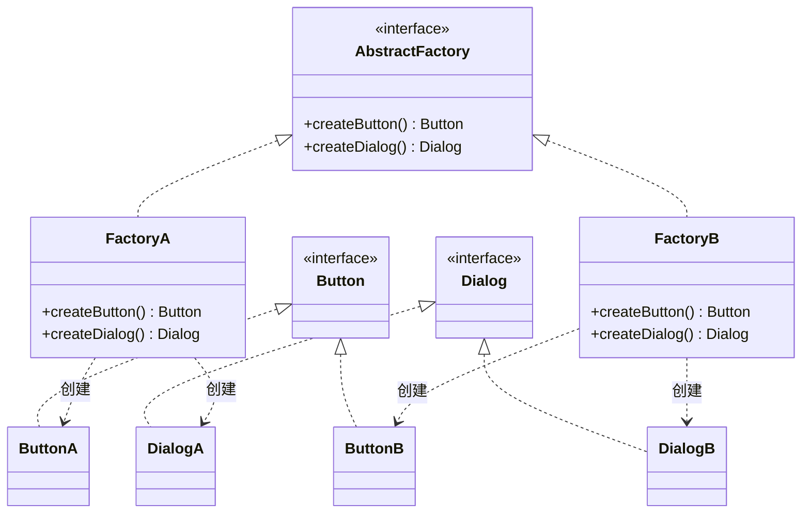

运行过程：Client只持有AbstractFactory；选择FactoryA后，创建出的ButtonA与DialogA天然属于同一产品族；切换FactoryB即可整体切换另一套产品。

它擅长保证产品族一致性，但增加一种新的产品等级，例如所有产品族都新增Menu，必须同时修改抽象工厂及全部具体工厂。

### 与工厂方法的区别

- 工厂方法通常围绕一个产品等级结构，通过子类决定具体产品；
- 抽象工厂同时提供多个创建方法，重点是一整套配套产品；
- 抽象工厂的每个创建方法内部可以使用工厂方法实现。

## 4. 建造者（Builder）

### 机制

把复杂对象的构造过程拆成多个步骤。Director规定步骤顺序，Builder定义步骤接口，ConcreteBuilder完成具体构造并保存中间结果。

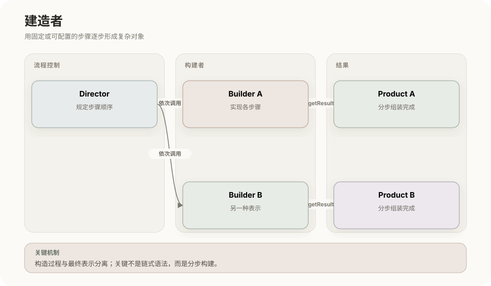

**UML 类图**

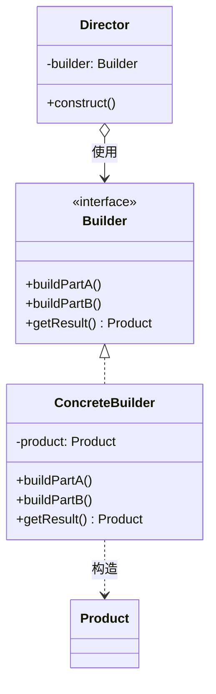

运行过程：

1. Client选择具体Builder；
2. Director依次调用构建步骤；
3. Builder在内部逐步形成Product；
4. Client通过`getResult()`取得最终对象。

Builder也可以不设置Director，由调用者直接链式调用步骤。关键不是链式语法，而是“复杂构造过程与最终表示分离”。

### 与抽象工厂的区别

- 抽象工厂一次返回一组不同种类的配套产品；
- 建造者经过多个步骤形成一个复杂产品；
- 抽象工厂关注选择哪一族，建造者关注按照什么过程组装。

## 5. 原型（Prototype）

### 机制

把一个已经配置好的对象作为原型，通过复制该对象创建新实例，避免调用者了解复杂构造过程。

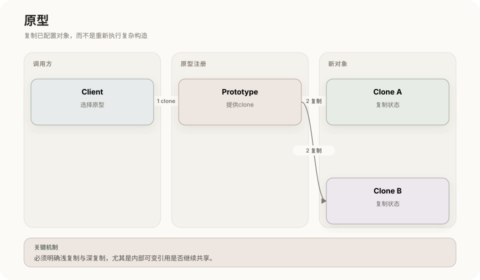

**UML 类图**

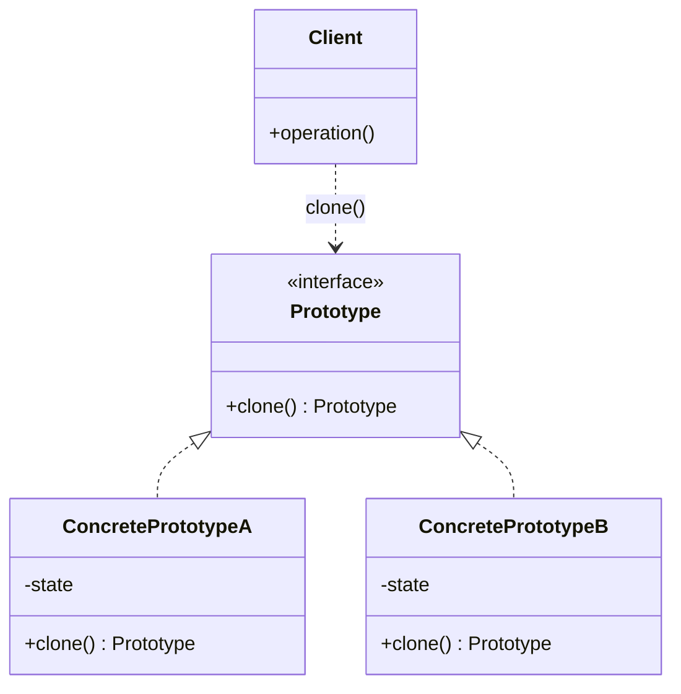

运行过程：系统先准备原型；Client取得目标原型并调用`clone()`；新对象复制原型状态，之后可以单独修改。

核心考点是浅复制与深复制：

- 浅复制只复制字段值，引用字段仍指向同一内部对象；
- 深复制还复制内部可变对象，新旧实例不会因共享引用而相互影响。

适合对象创建成本高、初始状态复杂，或者运行时才知道具体类型的场景。

## 6. 单例（Singleton）

### 机制

类隐藏公开构造方法，自行保存唯一实例，并提供统一访问点。目标是控制实例数量，不只是提供一个全局变量。

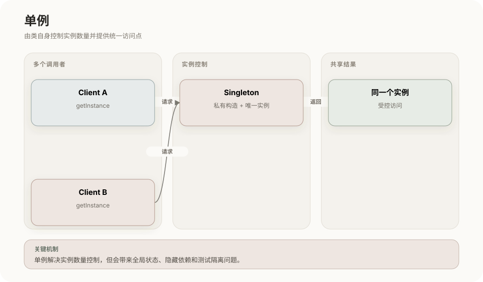

**UML 类图**

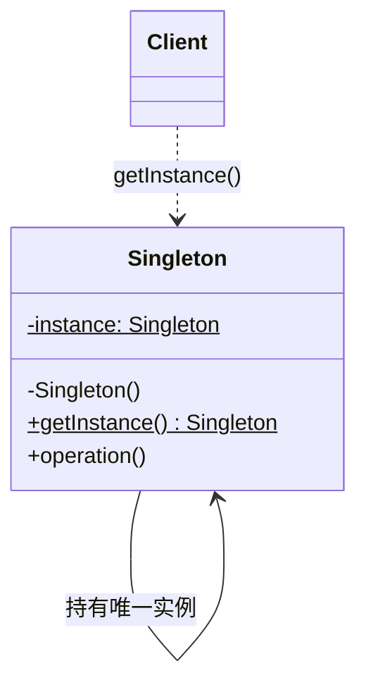

运行过程：Client调用`getInstance()`；若实例尚未建立则创建并保存；之后所有调用都返回同一实例。

常见实现与问题：

| 实现 | 特点 |
|---|---|
| 饿汉式 | 类加载时创建，简单且通常线程安全，但可能提前占用资源 |
| 懒汉式 | 首次使用时创建，需要正确处理并发 |
| 静态内部类 | 延迟加载，并利用类初始化保证线程安全 |
| 枚举单例 | Java中实现简洁，可抵抗常见反射和反序列化破坏 |

单例会引入全局状态、隐藏依赖并增加测试隔离难度。实际框架中的“单例作用域”还可能是每个容器一个实例，不等于整个进程绝对只有一个对象。

## 7. 创建型模式总对照

| 模式 | 创建决策放在哪里 | 最适合的变化 |
|---|---|---|
| 简单工厂 | 单个工厂的条件判断 | 少量产品的集中创建 |
| 工厂方法 | 具体创建者子类 | 单类产品不断扩展 |
| 抽象工厂 | 不同产品族工厂 | 整套配套产品切换 |
| 建造者 | Builder的分步操作 | 复杂对象的步骤和表示 |
| 原型 | 原型对象的复制操作 | 高成本或动态类型对象的复制 |
| 单例 | 类自身 | 实例数量必须受控 |

## 相关章节

- [设计模式总览](01-设计模式总览.md)
- [结构型模式](03-结构型模式.md)
- [行为型模式](04-行为型模式.md)

