# 结构型模式

结构型模式处理类和对象怎样连接成更大结构。它们不主要改变业务算法，而是改变接口形式、组合关系、包装层次、共享方式或访问路径。

## 1. 适配器（Adapter）

### 机制

调用者需要Target接口，但现有Adaptee提供的是另一套接口。Adapter实现Target，并把请求转换成对Adaptee的调用。

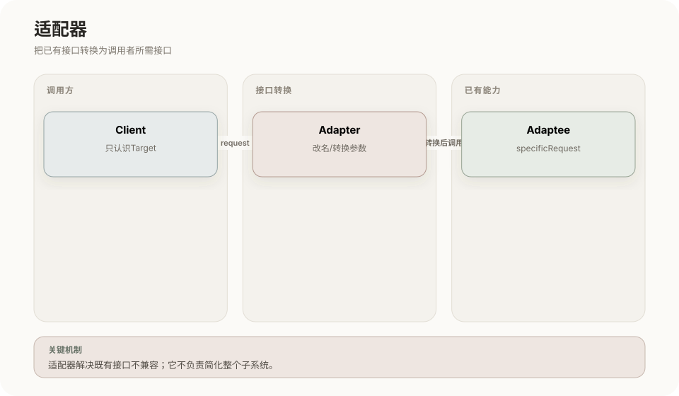

**UML 类图**（对象适配器）

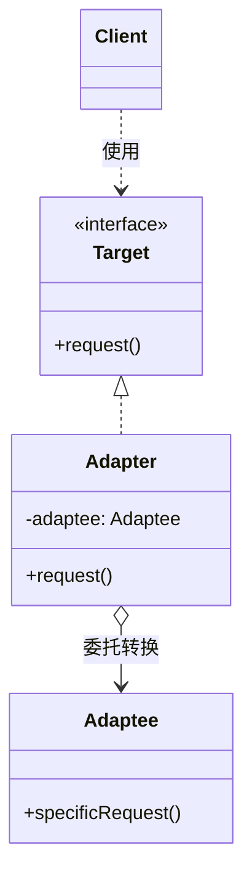

运行过程：Client按Target调用`request()`；Adapter转换参数、名称或数据格式；Adapter调用`specificRequest()`；再把结果转换成Target要求的形式。

对象适配器使用组合，运行时可更换Adaptee；类适配器使用多重继承，在Java等不支持类多继承的语言中受限。适配器重点是兼容已有接口。

## 2. 桥接（Bridge）

### 机制

当一个对象存在两个可以独立变化的维度时，把其中一个维度抽成Implementor，由Abstraction持有它，避免为所有组合建立子类。

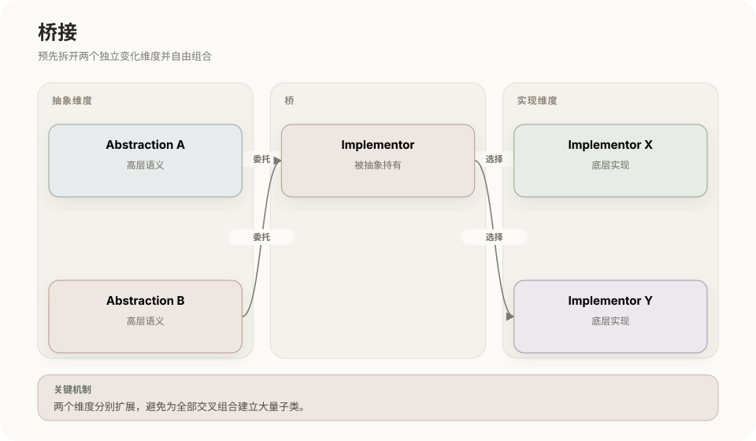

**UML 类图**

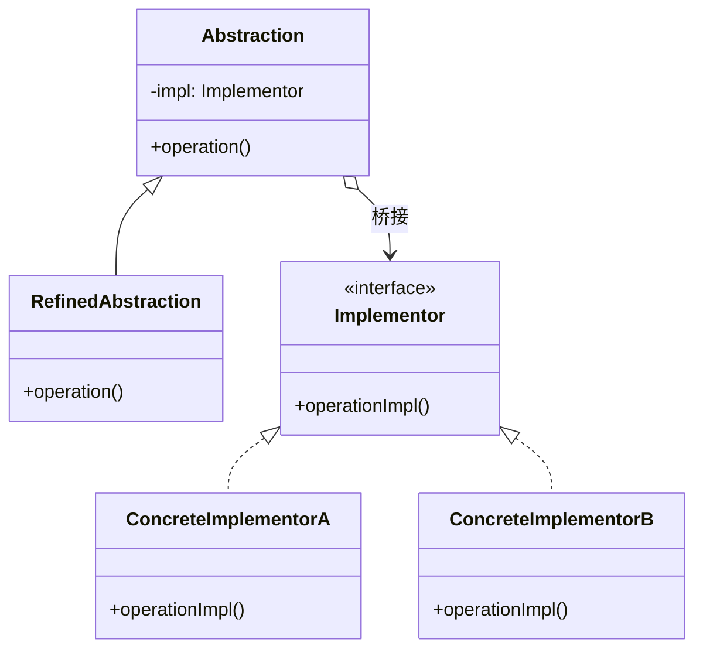

运行过程：Client选择一种Abstraction和一种Implementor并组合；Abstraction处理高层语义；具体工作委托给Implementor。两个维度可以分别扩展并任意组合。

例如“消息类型”与“发送渠道”各自变化时，不必建立“紧急邮件、紧急短信、普通邮件、普通短信”等交叉子类。

### 与适配器的区别

- 桥接通常在设计阶段主动分离两个变化维度；
- 适配器通常在已有接口不能兼容时进行转换；
- 桥接改变系统内部组织，适配器改变外部可见接口。

## 3. 组合（Composite）

### 机制

使用树形结构表示部分—整体关系，让叶子对象和容器对象实现同一个Component接口，调用者可以统一处理单个对象和对象组合。

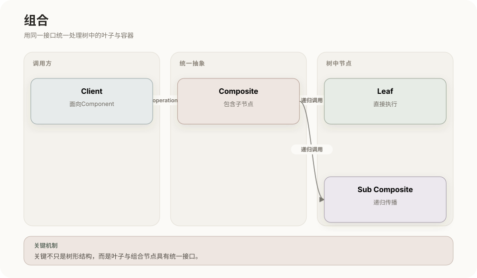

**UML 类图**

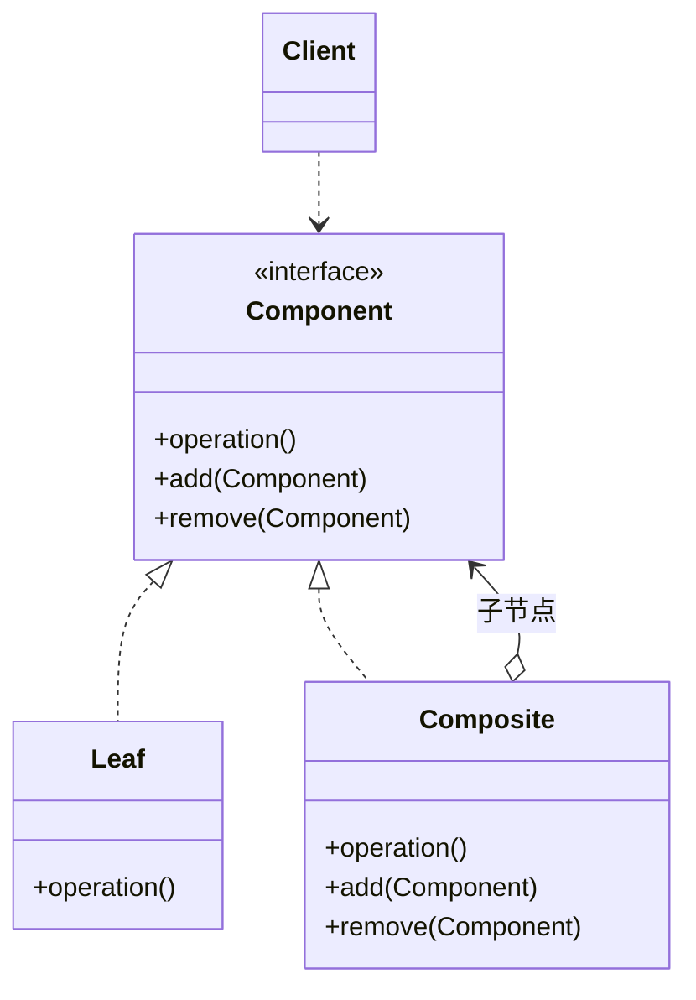

运行过程：Client对任意Component调用`operation()`；Leaf直接完成操作；Composite把操作递归传播给子节点，并汇总或组合结果。

文件与文件夹、组织机构、界面控件树都是典型结构。组合模式的关键不是“使用了树”，而是叶子与组合节点具有统一接口。

## 4. 装饰器（Decorator）

### 机制

Decorator与真实对象实现相同Component接口，同时持有另一个Component。多个装饰器可以逐层包装，在调用前后增加职责。

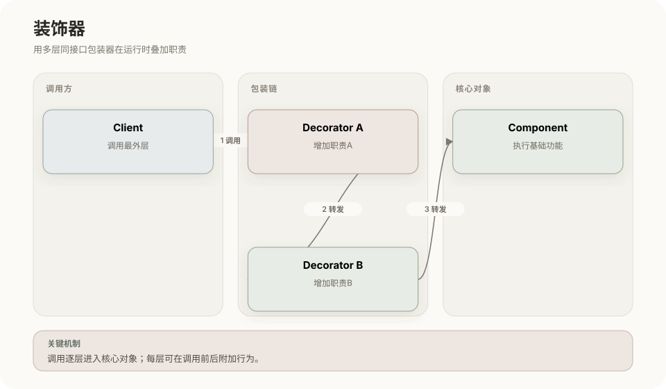

**UML 类图**

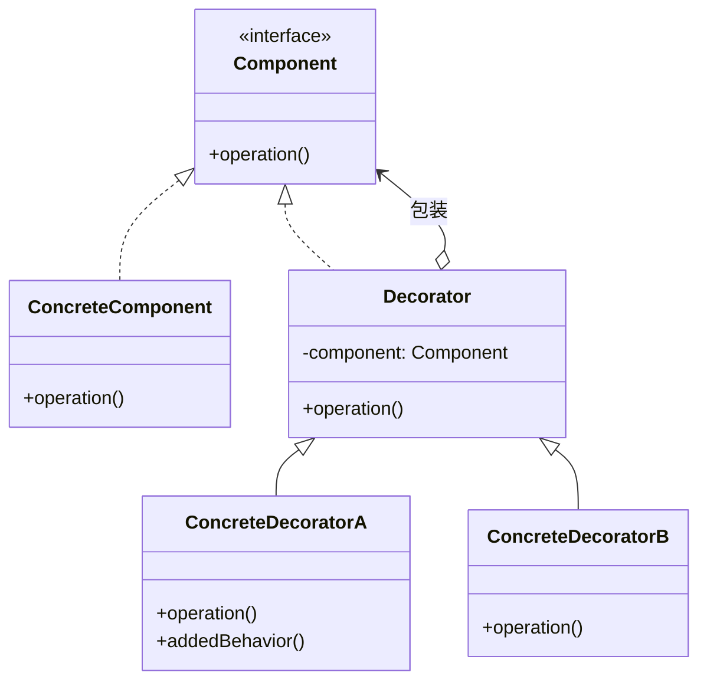

运行过程：Client调用最外层Decorator；装饰器执行附加逻辑并转发给内部Component；调用逐层进入真实对象，也可以逐层返回并追加处理。

它可以在运行时自由组合功能，避免为每一种功能组合建立子类。代价是产生多个细粒度包装对象，调试调用链更困难。

### 与代理的区别

- 装饰器的首要意图是增加或叠加功能；
- 代理的首要意图是控制对真实对象的访问；
- 两者结构可能相似，必须根据意图和对象由谁创建来判断。

## 5. 外观（Facade）

### 机制

Facade为复杂子系统提供一个较稳定、较简单的入口，在内部组织多个子系统对象完成完整流程。

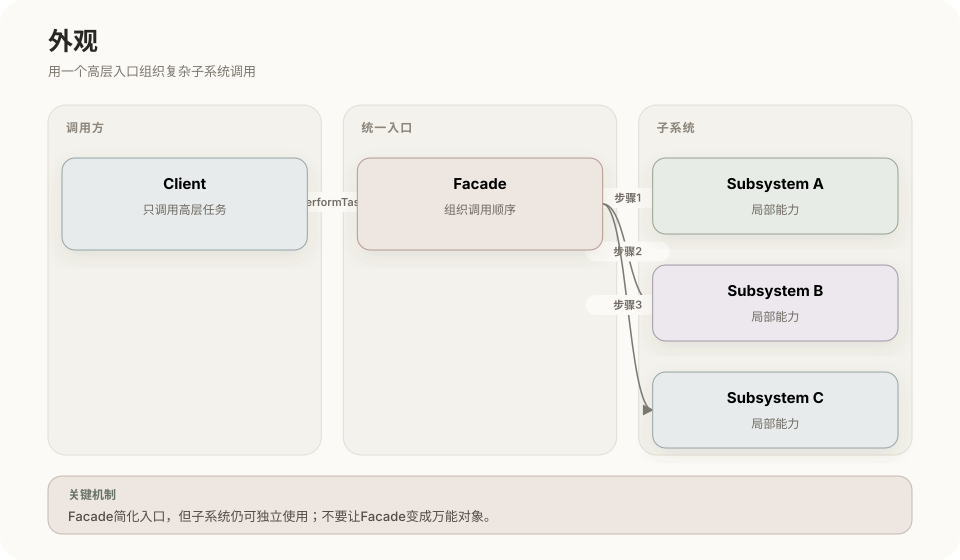

**UML 类图**

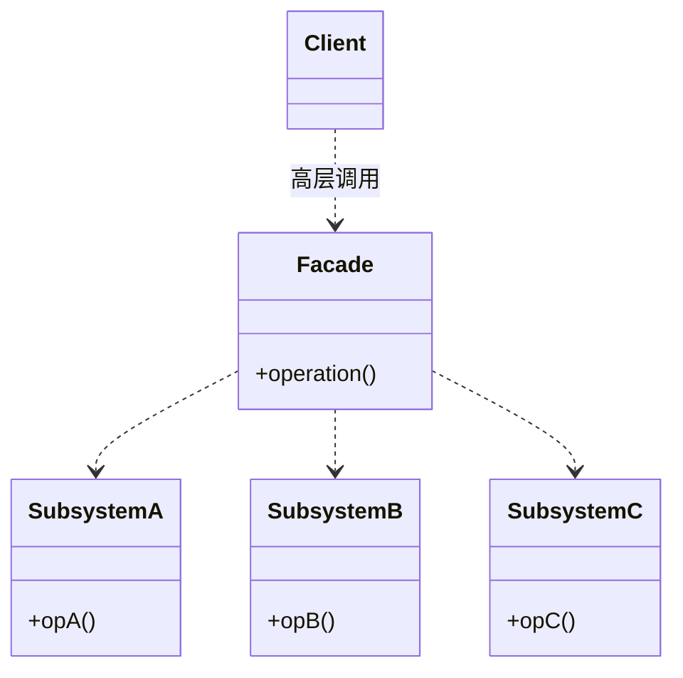

运行过程：Client调用Facade的高层操作；Facade按正确顺序调用多个子系统；子系统仍可独立使用，但普通调用者不必了解其协作细节。

Facade降低调用者与子系统之间的耦合，但它不应吸收所有业务逻辑成为巨大对象。

### 与适配器的区别

适配器让一个已有接口符合目标接口；外观把多个复杂接口组织成更易用的高层入口。前者重在兼容，后者重在简化。

## 6. 享元（Flyweight）

### 机制

把大量相似对象中的公共、不可变状态作为内部状态共享；随使用位置变化的外部状态由调用者在每次调用时传入。

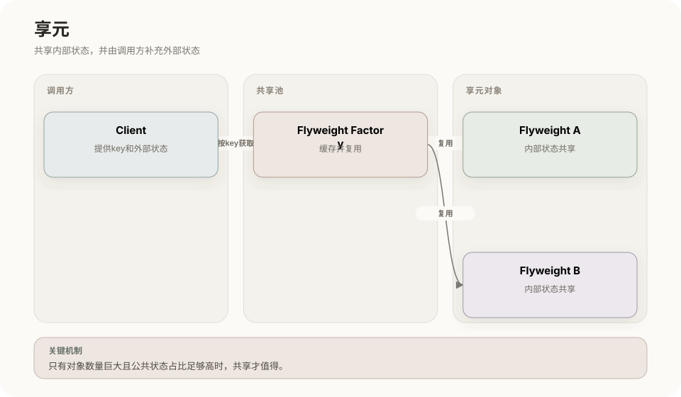

**UML 类图**

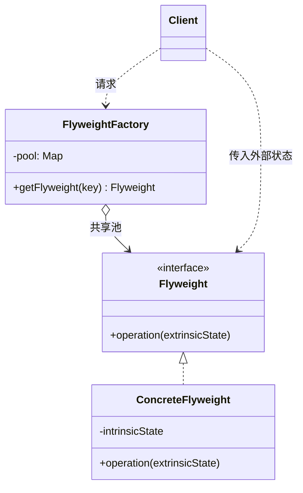

运行过程：Client用key向工厂请求享元；工厂优先返回池中已有对象；享元保存公共内部状态；Client调用时补充位置、上下文等外部状态。

文字编辑器可以共享字符字形数据，而每个字符的位置属于外部状态。适用前提是对象数量巨大且可提取出足够多的共享状态，否则拆分状态和维护池的成本可能更高。

## 7. 代理（Proxy）

### 机制

Proxy与RealSubject实现同一Subject接口。Client只接触Subject，Proxy在决定是否、何时以及怎样访问RealSubject后再转发请求。

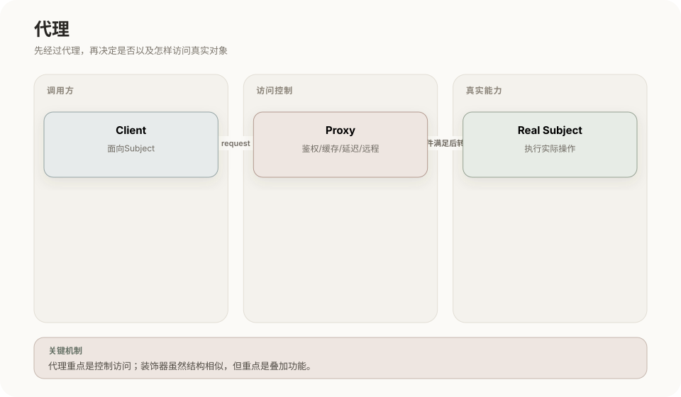

**UML 类图**

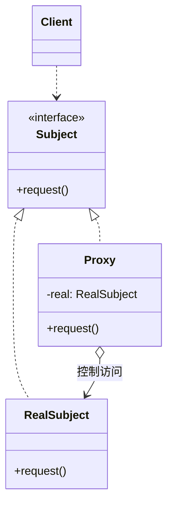

常见代理：

| 类型 | 控制内容 |
|---|---|
| 虚拟代理 | 延迟创建开销大的真实对象 |
| 保护代理 | 权限检查 |
| 远程代理 | 把本地调用转换为网络请求 |
| 缓存代理 | 命中缓存时不访问真实对象 |
| 智能引用 | 计数、日志、事务等附加控制 |

运行过程：Client调用Proxy；Proxy先做权限、缓存、延迟加载或远程编解码；需要时调用RealSubject；最后返回结果。

## 8. 结构型模式总对照

| 模式 | 它改变了什么 | 识别句 |
|---|---|---|
| 适配器 | 接口形式 | 让不兼容接口可以合作 |
| 桥接 | 两个变化维度的组合方式 | 抽象与实现各自扩展 |
| 组合 | 单个与整体的表示方式 | 统一处理树的叶子和容器 |
| 装饰器 | 对象承担的功能层次 | 逐层包装并动态增加职责 |
| 外观 | 子系统的对外入口 | 用一个高层接口组织复杂调用 |
| 享元 | 对象状态的存放方式 | 共享内部状态减少对象数量 |
| 代理 | 访问真实对象的路径 | 先经过代理再决定是否转发 |

## 相关章节

- [设计模式总览](01-设计模式总览.md)
- [创建型模式](02-创建型模式.md)
- [行为型模式](04-行为型模式.md)

